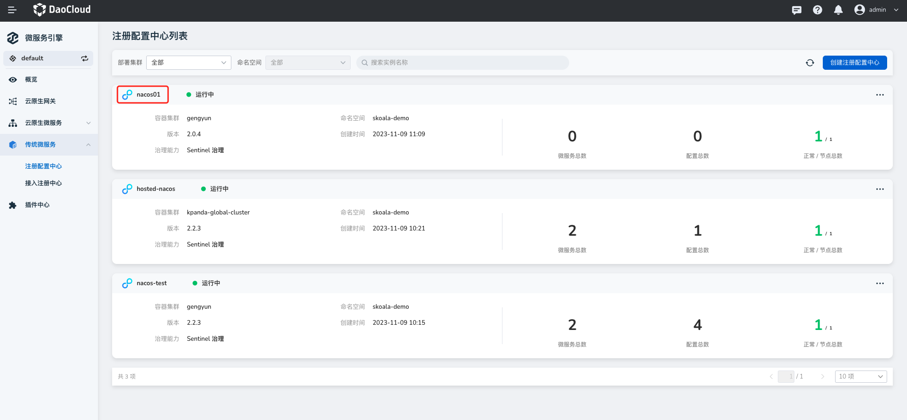
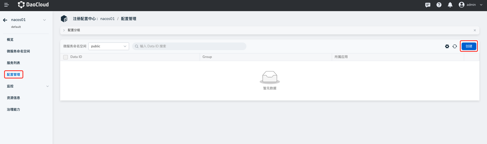
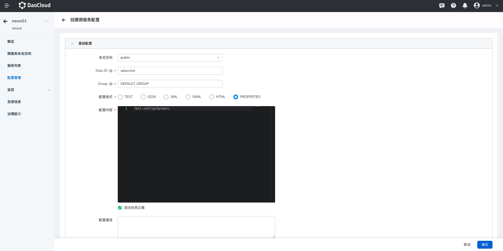
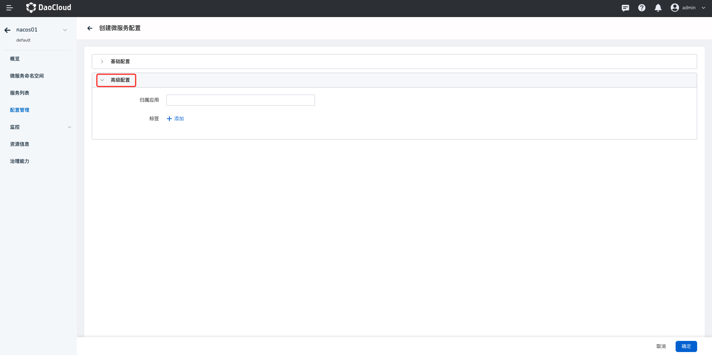
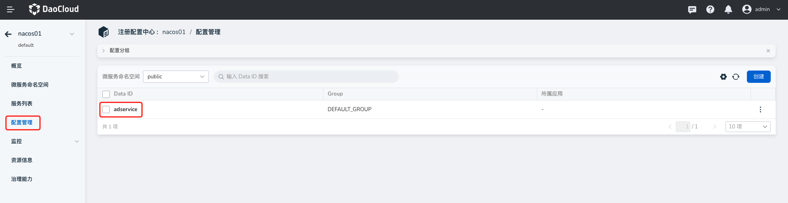
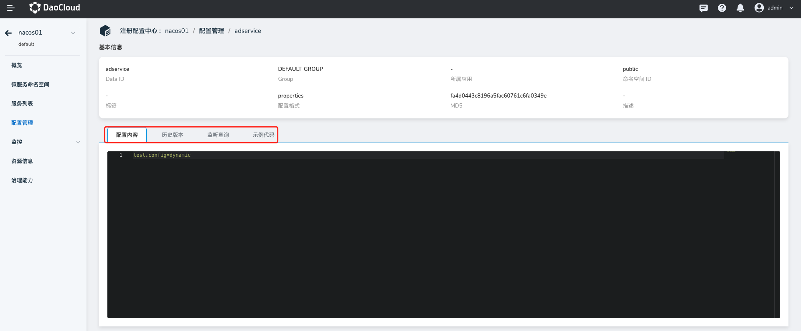
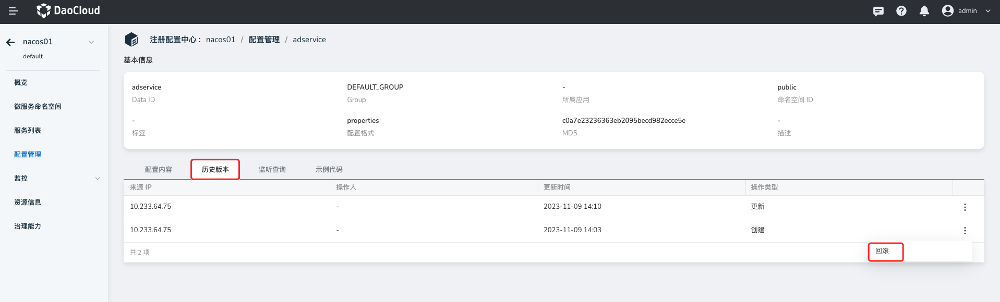
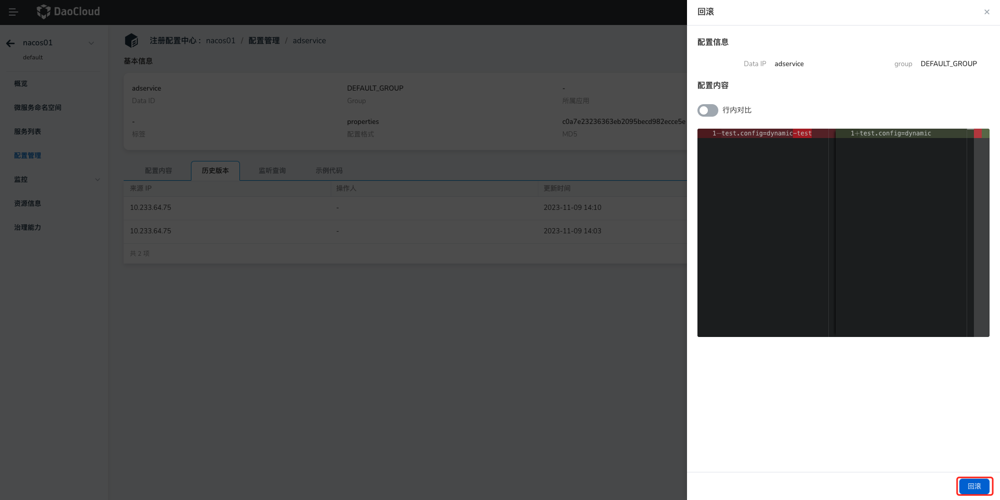
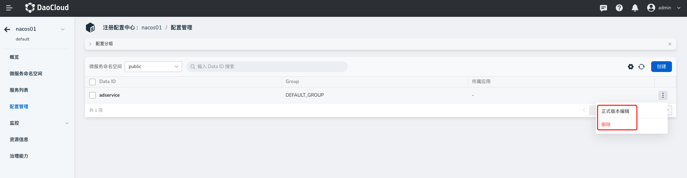

# 微服务配置列表

微服务引擎支持基于微服务命名空间对微服务进行分组管理，以便灵活地根据自己的需要按照环境或者应用、模块等分组管理微服务以及 Spring 的大量配置。配置列表主要提供了微服务配置的增删改查、查看历史版本、回滚、订阅者查询等核心管理能力。

## 新建配置

1. 进入`微服务引擎` -> `传统微服务` -> `注册配置中心`模块，点击目标注册中心的名称。

    

2. 在左侧导航栏点击`配置管理`，然后在右上角点击`创建`。

    

3. 填写各项配置信息

    

    - 命名空间：选择当前配置所属的微服务命名空间,默认为 `public`

        > 不同命名空间下的服务和配置严格隔离，不能互相引用。例如，A 命名空间下的服务不能引用 B 命名空间下的配置。

    - Data ID：相当于当前配置文件的名称。同一分组下的 Data ID 不能重复。

        完整格式为：`${prefix}-${spring.profiles.active}.${file-extension}`。

        - `prefix` 默认为 `spring.application.name` 的值，也可以通过配置项 `spring.cloud.nacos.config.prefix` 来配置。
        - `spring.profiles.active` 即为当前环境对应的 profile，详情可以参考 Spring Boot文档。 注意：当 `spring.profiles.active` 为空时，对应的连接符 `-` 也将不存在，Data ID 的拼接格式变成 `${prefix}.${file-extension}`。
        - `file-exetension` 为配置内容的数据格式，可以通过配置项 `spring.cloud.nacos.config.file-extension` 来配置。

    - Group：选择当前配置所属的分组，默认为 `DEFAULT_GROUP`。

        > 通常用命名空间隔离环境，用分组区分项目。

    - 配置格式: 设置当前配置文件的格式，

    - 配置内容：输入服务源代码中具有 `@Value` 注解的配置项。

        - 支持格式校验，如果配置内容存在格式错误，系统会自动提示错误。
        - 服务源代码中具有 `@RefreshScope` 注解的配置项支持动态更新。

    - 更多配置->归属应用（选填）：选择当前配置所属的应用。

        

4. 在页面右下角点击`确定`。

## 查看配置

1. 进入`微服务引擎` -> `传统微服务` -> `注册配置中心`模块，点击目标注册中心的名称。

    

2. 在左侧导航栏点击`配置管理`，点击目标配置的 Data ID。

    

3. 查看该配置的基本信息、配置内容、历史版本、监听者、示例代码等信息。

    - 新手可以借助示例代码快速使用客户端编程消费该配置，降低新手使用门槛。
    - 支持查询当前配置的监听者以及 MD5 校验值，便于了解正在使用此配置的微服务，以及配置变更是否成功推送到了客户端。

        

## 历史版本回滚

微服务配置列表会记录配置文件的历史版本，支持一键回滚到特定的历史版本，便于用户在改错配置时快速恢复，降低微服务系统中的配置可用性风险。回滚时支持版本差异对比，便于对比当前版本和目标回滚版本的差异，校验修改内容，降低改错带来的风险。

1. 进入`微服务引擎` -> `传统微服务` -> `注册配置中心`模块，点击目标注册中心的名称。

    

2. 在左侧导航栏点击`配置管理`，点击目标配置的 Data ID。

    

3. 点击`历史版本`页签，找到对应的记录，在记录右侧点击 `ⵗ` 并选择`回滚`。

    

4. 对比版本差异并确认，然后在右下角点击`回滚`。

    

## 更新/删除配置

1. 进入`微服务引擎` -> `传统微服务` -> `注册配置中心`模块，点击目标注册中心的名称。

    

2. 在左侧导航栏点击`配置管理`，在目标配置右侧点击 `ⵗ` 按钮根据需要选择更新或删除。

    
