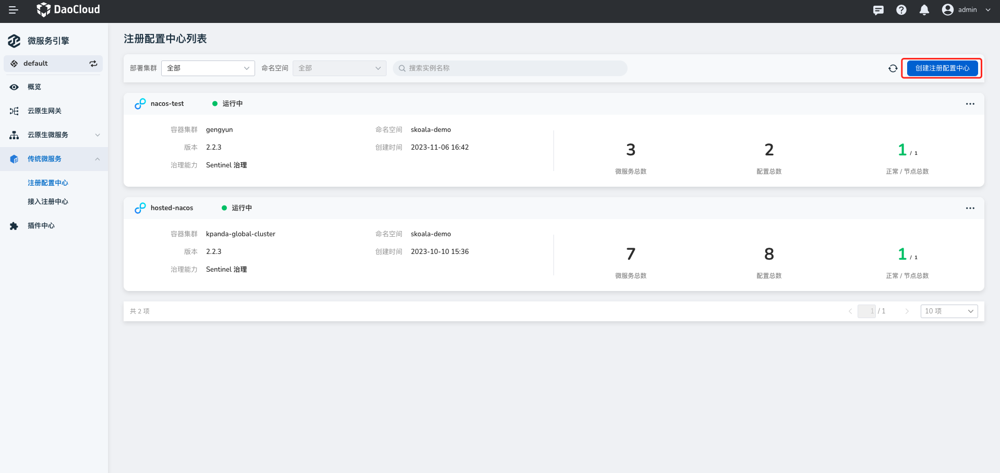
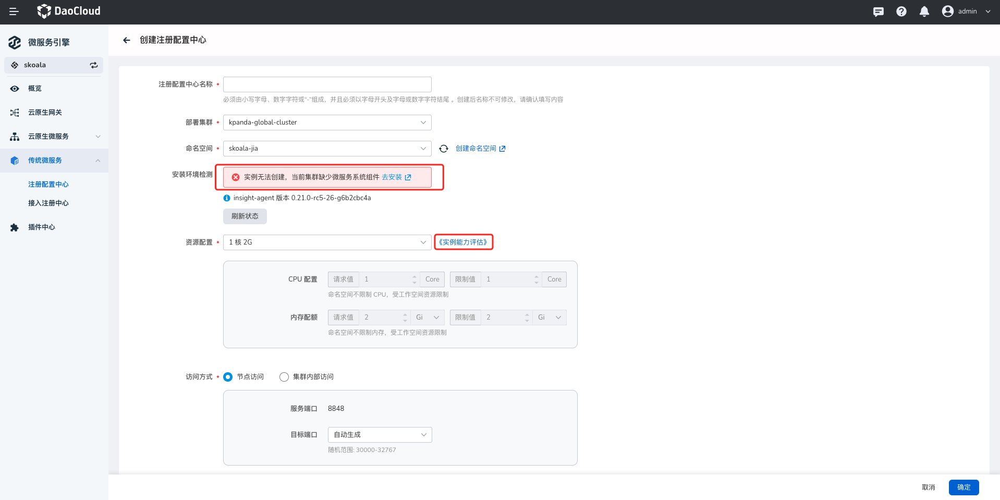
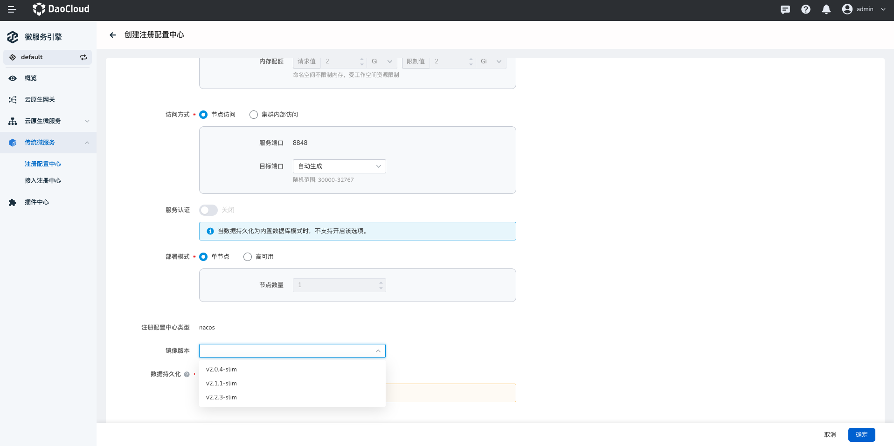
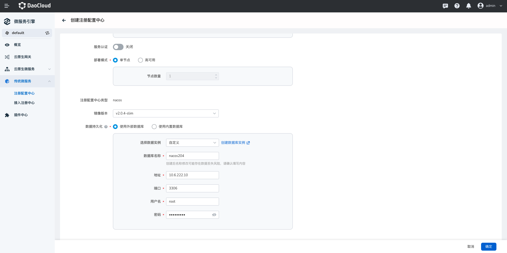
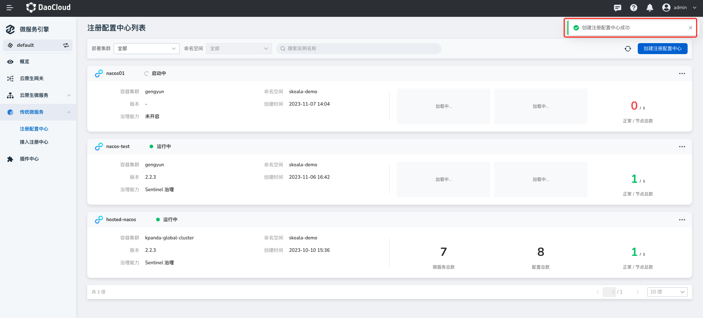
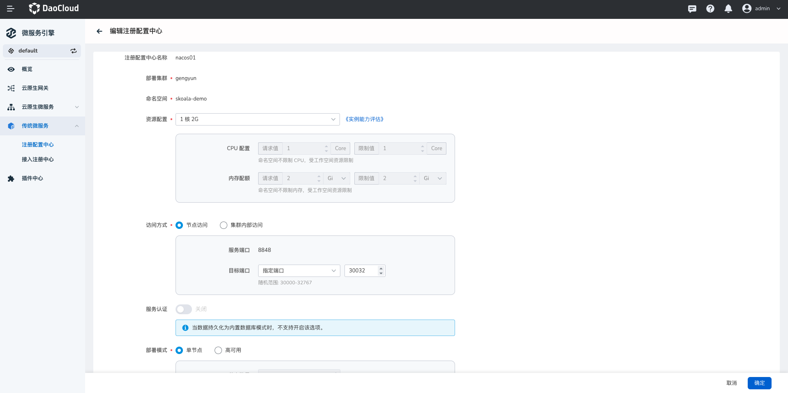
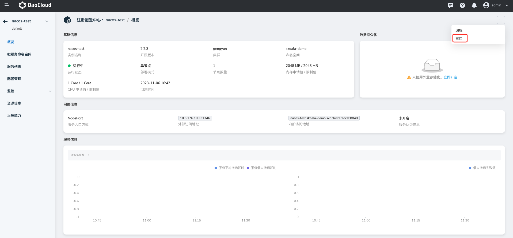
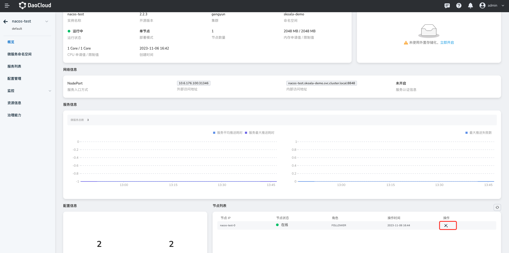
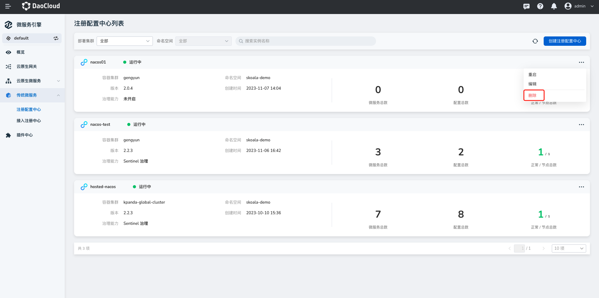
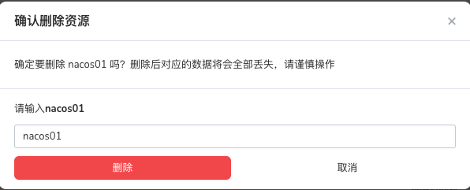

# 托管注册中心

微服务引擎支持托管 Nacos 注册中心，即在微服务治理中心从零创建一个 Nacos 类型的全新注册中心，并且可以通过微服务治理中心全面管理该注册中心。
相对于[接入型注册中心](../integrated/index.md)而言，托管型注册中心支持更多操作，包括查看注册中心实例的基础信息、
微服务命名空间管理、微服务列表、微服务配置列表、监控告警、日志查看、插件中心等。

## 创建托管注册中心

!!! note

    - 需要事先在目标集群的 **skoala-system** 命名空间中安装 skoala-init 组件，
      具体步骤可参考[管理 Helm 应用](../../../kpanda/user-guide/helm/helm-app.md)。
    - 如果所选集群中没有 **skoala-system** 命名空间，可参考[创建命名空间](../../../kpanda/user-guide/namespaces/createns.md)
      创建一个名为 **skoala-system** 的命名空间。

创建托管注册中心的步骤如下。

1. 在左侧导航栏点击`传统微服务`->`注册配置中心`，然后在页面右上角点击`创建注册配置中心`，进入托管注册中心实例的创建页面。

    

2. 填写配置信息。

    需要注意的是：

    - 注册中心名称：支持输入字母、数字和分隔符（-），注册中心创建之后不可更改名称。
    - 部署位置：系统会自动校验所选集群下的 **skoala-system** 命名空间中是否安装了 skoala-init 组件。

        - 如未安装，则无法创建注册中心。可以根据页面提示去安装该组件。
        - 注册中心创建之后不可更改部署位置。

    - 资源配置：可直接选择 `1核2G`、`2核4G` 等配置，也可以自定义配置资源限额。

        - `1核2G` 指 CPU 的请求值和限制值分别为 2 核，内存的请求值和限制值分别为 2 G，以此类推。

        - 点击`《实例能力评估》`可以查看在 2 Core 4 GiB、4 Core 8 GiB 和 8 Core 16 GiB 等主流规格下的吞吐量 (TPS)。

        

    - 访问方式：选择`节点访问`可通过 **服务端口+目标端口** 的方式从外部访问注册中心，选择`内部访问`则只能在所在的集群范围内通过服务端口访问注册中心。默认的服务端口为 8848。
    - 服务认证：开启服务认证时，注册至该注册中心的服务需要认证信息。默认用户名/密码为 nacos/nacos。当数据持久化为内置数据库模式时，不支持开启服务认证。
    - 部署模式：选择高可用模式时，节点数量不少于 3 个。生产环境下建议使用`高可用`模式。
    - 镜像版本：目前支持 v2.0.4-slim 、v2.1.1-slim 和 v2.2.3-slim 三种版本。

        

    - 数据持久化：建议使用外置存储化。

        - 不使用外置存储化：数据存储在 Nacos 所在的 Pod 的文件系统里。Pod 重启之后数据会遗失，因此建议使用外部存储。
        - 使用数据库：填写数据库的名称、地址、端口、用户名和密码

            

3. 在页面底部点击`确定`。

    如果操作正确，页面右上角会弹出创建成功的消息，`托管注册中心列表`页会展示新建的注册中心实例。

    

!!! info

    - 新建注册中心需要一段时间进行初始化，其间处于“启动中”状态。初始化完成后进入“运行中”状态。
    - 点击注册中心的名称可以查看所在集群/命名空间、运行状态、资源配额、服务端口、存储配置、节点列表等基础信息。

## 更新托管注册中心

1. 在`注册配置中心`列表页选择需要更新的注册中心，在右侧点击 `⋯` 并选择`编辑`。

    

2. 更新注册中心的配置，然后在页面底部点击`确定`。

    !!! warning

        - 修改存储池/数据库，变动存储位置后，之前的数据不会随之迁移！
        - 托管注册中心名称和部署位置不可编辑。

    

## 查看注册中心详情

在注册配置中心列表页找到需要查看详情的注册中心实例，点击实例名称进入基础信息页面。

在基础信息页面可以查看注册中心的`基础信息`、`服务治理信息`（需要开启服务治理功能）、`节点列表`、`数据持久化`信息等。
“运行状态”是注册中心实例信息的一部分，用于反映注册中心实例的状态。

**相关操作**：

- 重启注册中心实例：在页面右上角点击 `⋯` 并选择`重启`可以对整个托管注册中心实例进行重启。

    

- 查看节点元数据

    

## 删除注册中心

1. 在`托管注册中心列表`页选择需要删除的注册中心，在右侧点击 `⋯` 并选择`删除`。

    

2. 输入注册中心的名称，点击`移除`。

    

!!! note

    接入型的注册中心仅支持`移除`操作，而托管型的注册中心仅支持`删除`操作。二者的区别在于：

    - 移除：只是将注册中心从 DCE 5.0 的微服务引擎中移除，不会删除原有的注册中心和数据，后续还可以再次接入该注册中心。
    - 删除：删除注册中心及其中的所有数据，后续无法再次使用该注册中心，需要重新创建新的注册中心。
