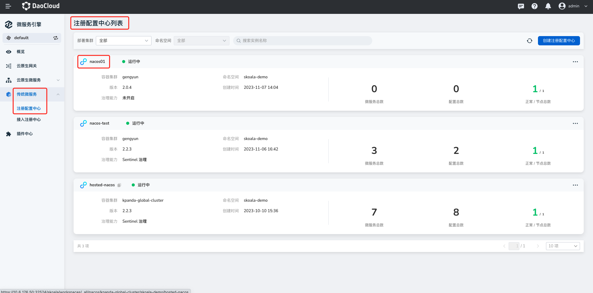
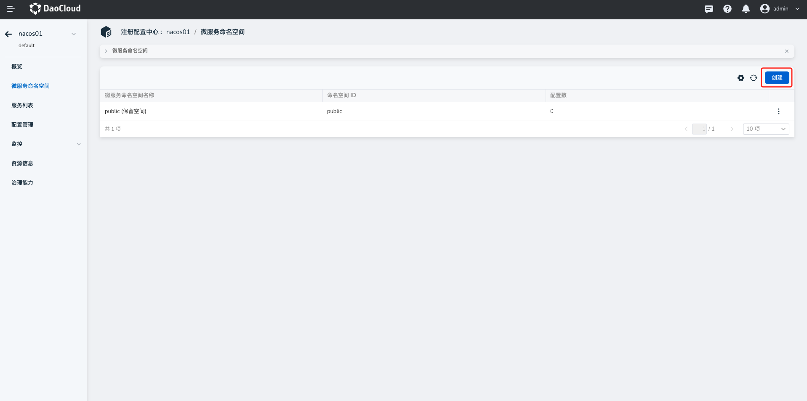
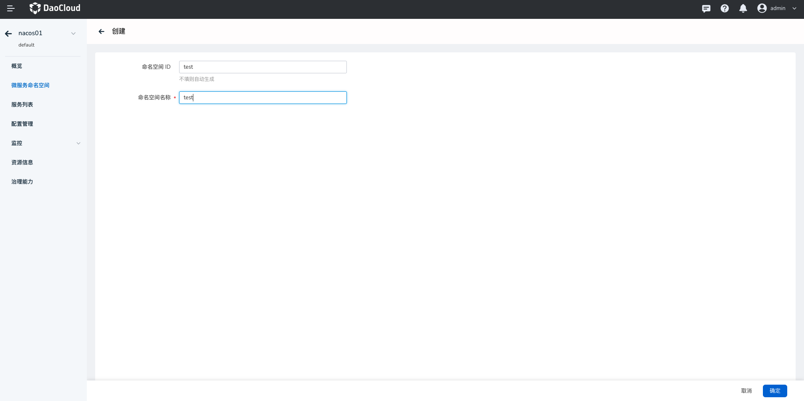
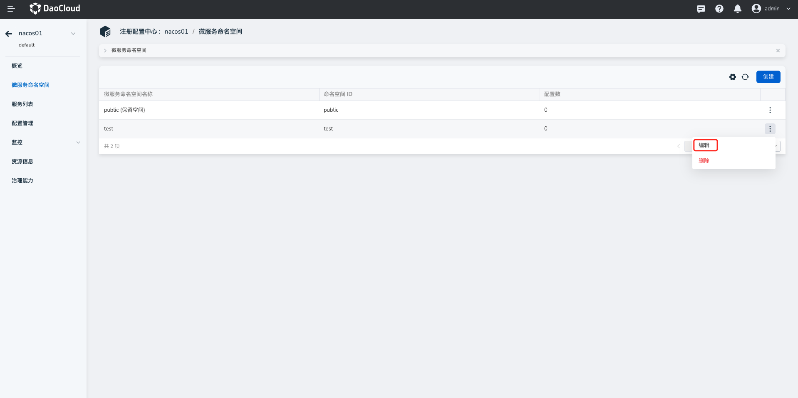
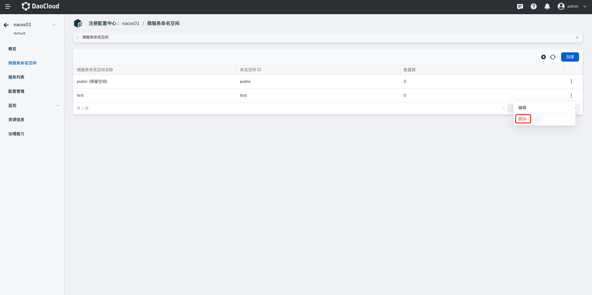

# 微服务命名空间

微服务命名空间可用于隔离生产、开发、测试等不同环境下的服务、配置等资源。微服务引擎模块中的命名空间指的是微服务命名空间，即 [Nacos](https://nacos.io/zh-cn/docs/what-is-nacos.html) 语境中的命名空间，并非 Kubernetes 场景下的命名空间。

!!! note

    - 创建托管型注册中心实例时，系统会自动创建一个名为 **public** 的默认命名空间。该命名空间不可编辑、不可删除，属于系统自带的保留命名空间。
    - 不同命名空间下的服务和配置严格隔离，不能互相引用。例如，A 命名空间下的服务不能引用 B 命名空间下的配置。

## 创建微服务命名空间

1. 进入`微服务引擎` -> `传统微服务` -> `注册配置中心`模块，点击目标注册中心的名称。

    

2. 在左侧导航栏点击`微服务命名空间`，然后在右上角点击`创建`。
  
    

3. 填写命名空间的 ID，名称，在页面右下角点击`确定`。

    如果不填写 ID, 系统会自动生成一个 ID。**命名空间 ID 在创建之后不可更改**。

    

## 更新微服务命名空间

1. 在对应命名空间的右侧操作栏下点击`编辑`，进入更新页面。

    

2. 修改命名空间的名称，点击`确定`。
  
    

## 删除微服务命名空间

在对应命名空间的右侧操作栏下点击`删除`，然后在弹框中点击`立即删除`。

!!! note
  
    删除命名空间之前，必须清理该命名空间下的所有资源，否则无法删除命名空间。

