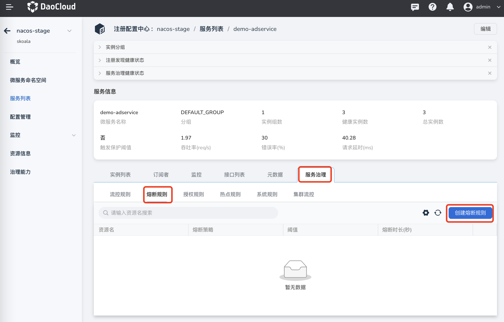
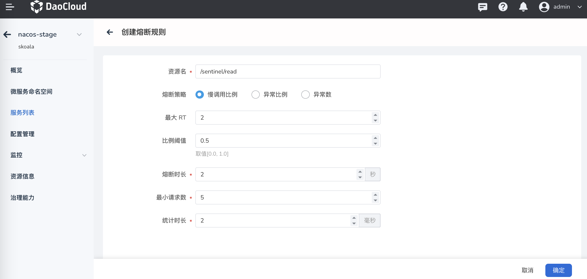

---
hide:
  -toc
---

# 创建熔断规则

熔断规则可以监控应用内部或者下游服务的响应时间或异常比例。当达到指定的阈值时降低下游依赖的优先级，并且在指定的时间范围内不会调用优先级低的不稳定资源，避免应用受到影响，从而保障应用高可用性。当指定的时长结束后，恢复该资源的调用。

创建熔断规则的方式如下：

1. 点击目标托管注册中心的名称，然后在左侧导航栏点击`微服务列表`，在最右侧点击更多按钮选择`治理`。

    > 注意需要治理的微服务在`是否可以治理`一栏应该显示为`是`，才能进行后续步骤。

    

2. 选择`熔断规则`，然后在右侧点击`创建熔断规则`。

    

3. 参考下列说明填写规则配置，并在右下角点击`确定`。

    ===="熔断策略——慢调用比例"

        在一个单位统计时长内，如果收到的请求数大于所设定的最小请求数 **且** 慢调用比例大于所设定的比例阈值，则在同一个熔断时长中，资源会在剩余的时间被熔断。一个熔断时长结束后，熔断器进入探测恢复状态：如果接下来的一个请求的响应时间小于所设定的慢调用最大响应时间，则结束熔断，否则该资源会被再次被熔断。

        - 资源名：需要控制哪个资源的流量就填写哪个资源的名称。
        - 最大 RT：请求的最大响应时间，**响应时间超过此值的请求被视为慢调用请求**。
        - 比例阈值：在一个统计时长内，慢调用请求在所有请求中占的比例。
        - 熔断时长：熔断持续的时间。资源进入熔断状态后，所有的请求都会快速失败。单位：秒。
        - 最小请求数：在一个统计时长内，触发熔断的最小请求数。若当前统计时长内的请求数小于此值，即使达到熔断条件也不会触发熔断。
        - 统计时长：统计的时间窗口长度，取值范围为 1 秒 —— 120 分钟。

            
    
        ===="熔断策略——异常比例"
            
            单位统计时长内请求数目大于设置的最小请求数目，并且异常的比例大于阈值，则接下来的熔断时长内请求会自动被熔断。经过熔断时长后熔断器会进入探测恢复状态，若接下来的一个请求成功完成（没有错误）则结束熔断，否则会再次被熔断。异常比率的阈值范围是 [0.0, 1.0]，代表 0% - 100%。
            
            - 资源名：需要控制哪个资源的流量就填写哪个资源的名称。
            - 最大 RT：最大的响应时间
            - 熔断时长：熔断触发后持续的时间。资源进入熔断状态后，在配置的熔断时长内，请求都会快速失败。单位：秒
            - 最小请求数：触发熔断的最小请求数目，若当前统计窗口内的请求数小于此值，即使达到熔断条件规则也不会触发。
            - 统计时长：统计的时间窗口长度，取值范围为1秒~120分钟。

                
      
        ===="熔断策略——异常数"
            
            当单位统计时长内的异常数目超过阈值之后会自动进行熔断。经过熔断时长后熔断器会进入探测恢复状态，若接下来的一个请求成功完成（没有错误）则结束熔断，否则会再次被熔断。
            
            - 资源名：需要控制哪个资源的流量就填写哪个资源的名称。
            - 熔断策略——异常数：是否将所设置的规则应用于服务所在的集群范围。
            - 最大 RT：最大的响应时间
            - 熔断时长：熔断触发后持续的时间。资源进入熔断状态后，在配置的熔断时长内，请求都会快速失败。单位：秒
            - 最小请求数：触发熔断的最小请求数目，若当前统计窗口内的请求数小于此值，即使达到熔断条件规则也不会触发。
            - 统计时长：统计的时间窗口长度，取值范围为1秒~120分钟。

                

4. 创建完成后可以在流控规则列表中查看新建的规则。在右侧点击更多按钮可以编辑更新规则或者删除该规则。

    
