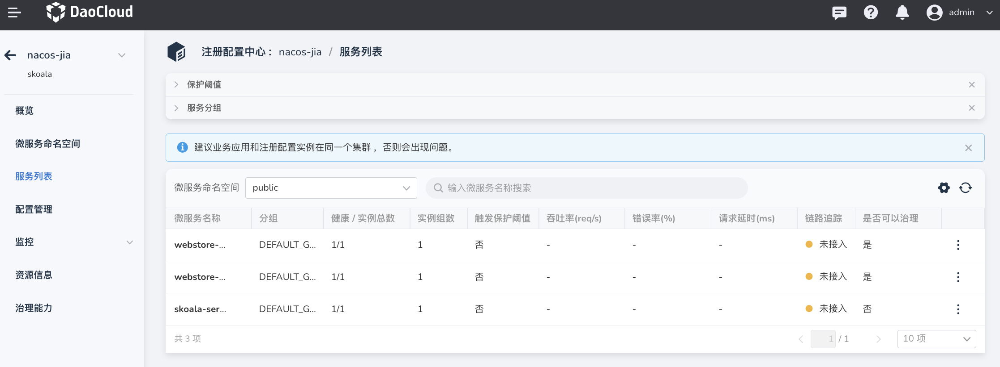

# 微服务列表

微服务列表页面列出了当前注册中心实例下的所有微服务，可以查看微服务的分组、健康状况、保护阈值、请求状况、链路追踪、治理状况等。在列表中点击微服务名称后，还可以进一步查看微服务实例列表、监控信息、接口列表、元数据等。

分组：指微服务的配置文件分组。将配置文件和和微服务实例互相分离，便于为不同的服务或组件应用相同的配置。

保护阈值：保护阈值是 0 到 1 之间的一个浮点数，表示集群中健康实例占比的最小值。如果实际健康实例的占比小于或等于该阈值时，就会触发阈值保护，即无论实例 (Instance) 是否健康，都会将这个实例 (Instance) 返回给客户端。阈值保护主要是为了防止故障实例过多时所有流量全部流入剩余实例，造成流量压力将剩余实例被压垮形成雪崩效应。

链路追踪：通过[应用工作台](../../../../amamba/intro/index.md)创建服务时，可以选择否接入 [OpenTelemetry](https://opentelemetry.io/docs/concepts/what-is-opentelemetry/) 链路追踪组件。如果服务是通过其他途经注册到注册中心的，则可以参考[使用 OTel SDK 为应用程序暴露指标](../../../../insight/quickstart/otel/meter.md)手动接入该组件。建议接入，以便获取完整的可观测信息。

是否可以治理：判断该微服务是否满足治理条件，例如是否开启了治理插件、是否正确配置插件信息、是否被网格纳管等要求。
