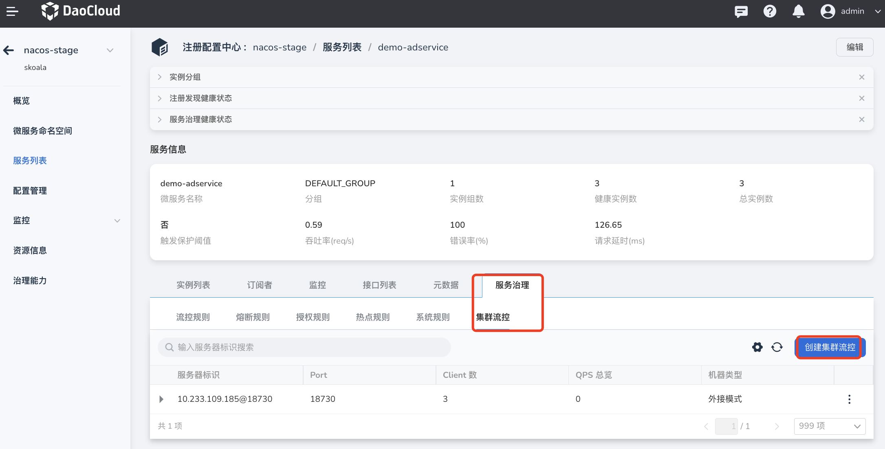
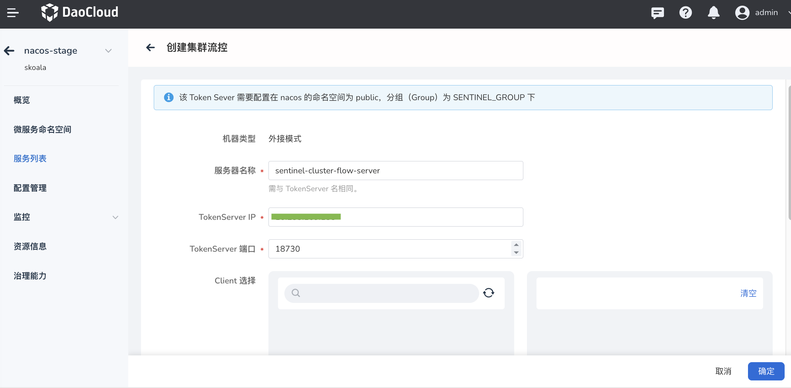
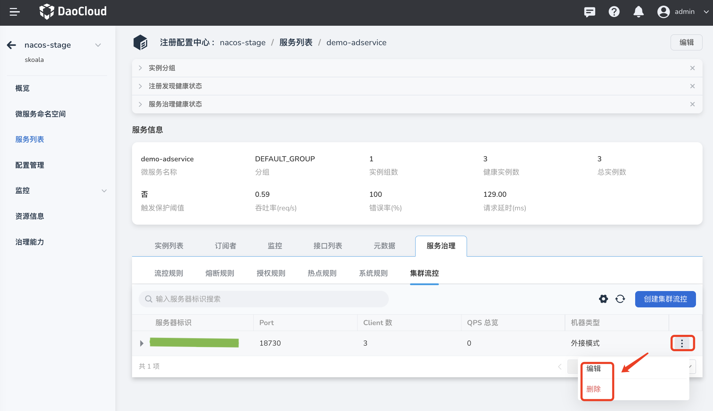

---
hide:
  -toc
---

# 创建集群流控规则

系统保护规则是从应用级别的入口流量进行控制，从单台机器的总体 Load、RT、入口 QPS 和线程数四个维度监控应用数据，让系统尽可能跑在最大吞吐量的同时保证系统整体的稳定性。

该Token Sever 需要配置在nacos的命名空间为public，分组（Group）为 SENTINEL_GROUP下

创建集群流控规则的方式如下：

1. 点击目标托管注册中心的名称，然后在左侧导航栏点击`微服务列表`，在最右侧点击更多按钮选择`治理`。

    > 注意需要治理的微服务在`是否可以治理`一栏应该显示为`是`，才能进行后续步骤。

    

2. 选择`集群流控`，然后在右侧点击`创建集群流控`。

    

3. 参考下列说明填写规则配置，并在右下角点击`确定`。

    - 服务器名称：服务器的名称
    - TokenServer IP：服务器的ip地址
    - TokenServer 端口：服务器的端口号
    - Client 选择：集群流控客户端，用于向所属 Token Server 通信请求 token。

        

4. 创建完成后可以在系统规则列表中查看新建的规则。在右侧点击更多按钮可以更新规则或者删除该规则。

    
