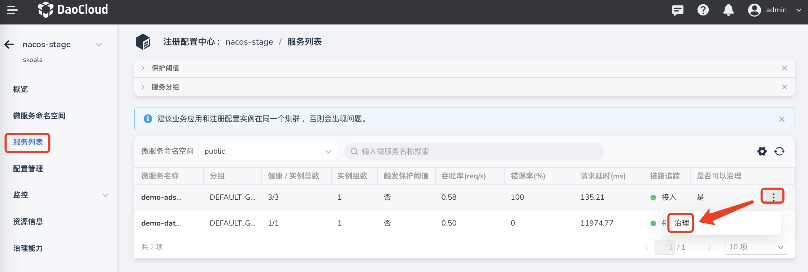
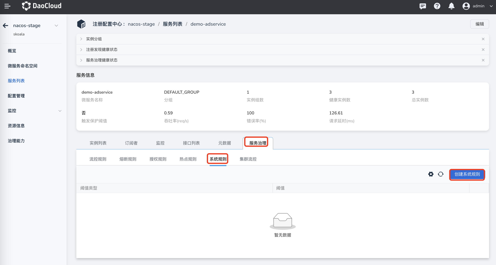
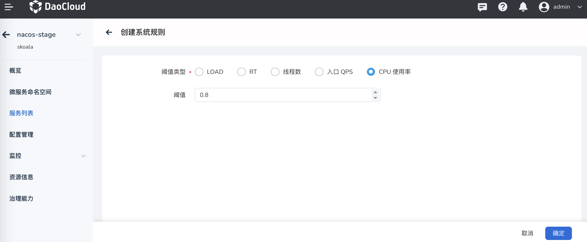
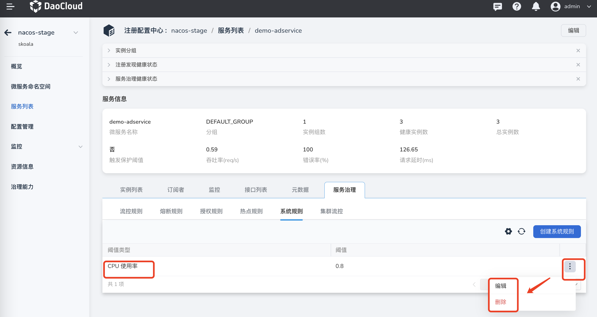

---
hide:
  -toc
---

# 创建系统规则

系统规则从整体维度对应用入口流量进行控制，结合应用的 Load、总体平均 RT、入口 QPS 和线程数等监控指标，
让系统的入口流量和系统的负载达到一个平衡，让系统尽可能跑在最大吞吐量的同时保证系统整体的稳定性。

系统规则是针对应用整体维度的，而不是资源维度的，并且仅对入口流量生效。

创建系统规则的方式如下：

1. 点击目标托管注册中心的名称，然后在左侧导航栏点击`微服务列表`，在最右侧点击更多按钮选择`治理`。

    > 注意需要治理的微服务在`是否可以治理`一栏应该显示为`是`，才能进行后续步骤。

    

2. 选择`系统规则`，然后在右侧点击`创建系统规则`。

    

3. 参考下列说明填写规则配置，并在右下角点击`确定`。

    - 资源名：需要控制哪个资源的流量就填写哪个资源的名称。
    - Load：当系统 load （1 分钟的平均负载） 超过阈值，且系统当前的并发线程数超过系统容量时触发系统保护。系统容量由系统的 `maxQps * minRt` 计算得出。设定参考值一般是 CPU cores * 2.5。
    - RT：当单台机器上所有入口流量的平均响应时间达到阈值（单位：毫秒），触发系统流控规则。
    - 线程数：当单台机器上所有入口流量的并发线程数达到阈值时，触发系统流控规则。
    - 入口 QPS：当单台机器上所有入口流量的 QPS 达到阈值时，触发系统流控规则。
    - CPU 使用率：当系统 CPU 使用率超过阈值时（取值范围 0.0-1.0），触发系统流控规则。

        

4. 创建完成后可以在系统规则列表中查看新建的规则。在右侧点击更多按钮可以更新规则或者删除该规则。

    

参阅视频教程：[Sentinel 系统规则](../../../../videos/skoala.md#sentinel_3)
