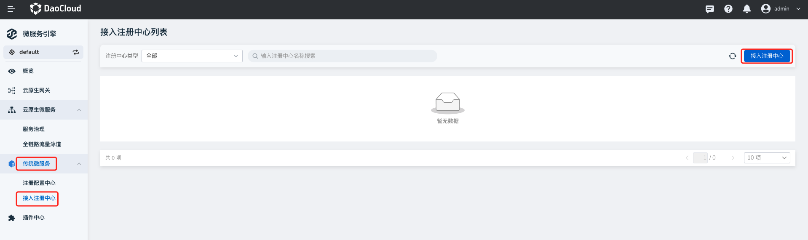
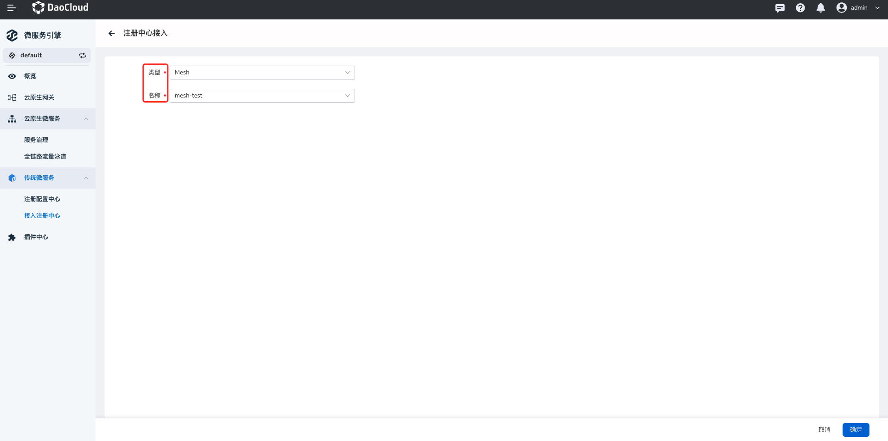
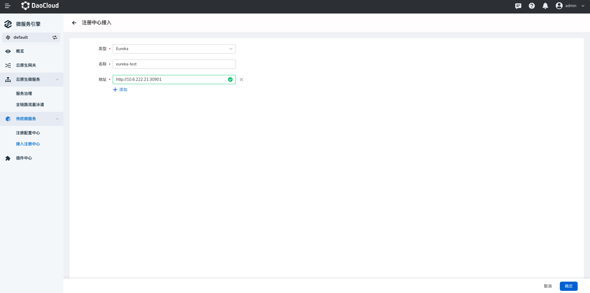
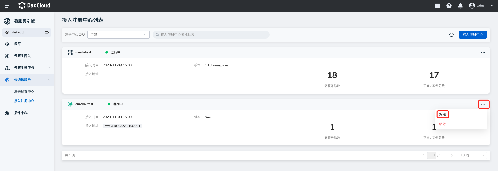
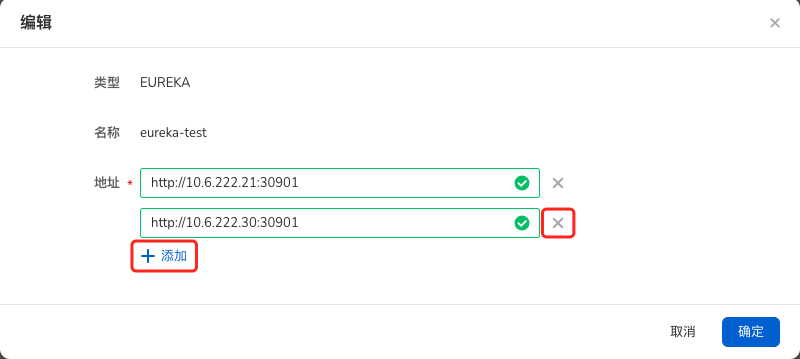
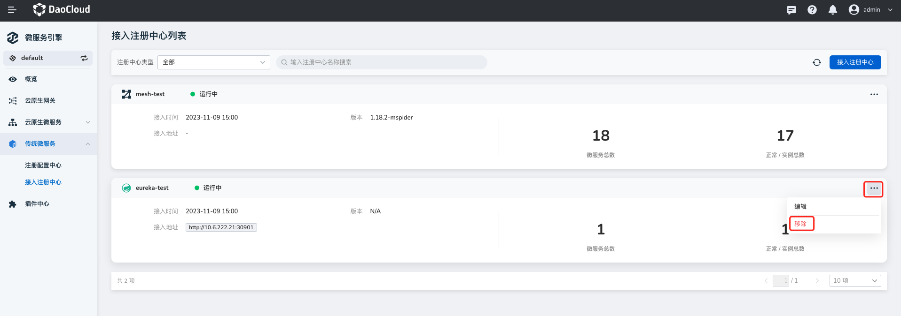
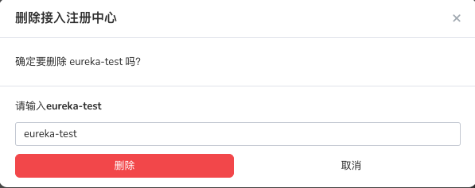

# 接入注册中心

注册中心支持接入 [Nacos 注册中心](../../reference/registry.md)、[Eureka 注册中心](../../reference/registry.md)、
[Zookeeper 注册中心](../../reference/registry.md)、Consul 注册中心、[Kubernetes 注册中心](../../reference/registry.md)、
[Mesh 注册中心](../../reference/registry.md)。

相对于托管型注册中心而言，接入型注册中心只支持一些基础操作，例如查看基本信息、监控信息等。
如需体验更高级更全面的管理操作，需要创建[托管注册中心](../hosted/index.md)。

## 接入注册中心

接入注册中心的步骤如下：

1. 在左侧导航栏点击`传统微服务`-->`接入注册中心`，然后在页面右上角点击`接入注册中心`。

    

2. 填写配置信息，然后在页面底部点击`确定`。

    接入不同类型的注册中心需要填写不同的配置信息。

    - Kubernetes/Mesh 注册中心：直接选择想要接入的集群或网格服务。

        - 如果找不到想要添加的 Kubernetes 集群，可以去容器管理模块[接入集群](../../../kpanda/user-guide/clusters/integrate-cluster.md)或[创建集群](../../../kpanda/user-guide/clusters/create-cluster.md)。

        - 如果找不到想要添加的网格服务，可以去网格服务模块[创建网格](../../../mspider/user-guide/service-mesh/README.md)。

            

    - Nacos/Zookeeper/Eureka/Consul 注册中心：填写注册中心的名称和地址，点击`确认`。

        

## 更新注册中心

微服务引擎目前仅支持更新 Nacos/Zookeeper/Eureka 注册中心的配置。

1. 在`接入注册中心列表`页选择需要更新的注册中心，在右侧点击 `⋯` 并选择`编辑`。

    

2. 修改、增加或删除注册中心的地址，然后在页面底部点击`确定`。

    

!!! note

    如需更新 Kubernetes/Mesh 注册中心：

    - 可以先[移除已经接入的注册中心](#_4)，然后再重新接入其他的注册中心。
    - 也可以去容器管理模块[更新对应的集群](../../../kpanda/user-guide/clusters/upgrade-cluster.md)，或者去服务网格模块[更新对应的网格服务](../../../mspider/user-guide/service-mesh/README.md)。

## 移除注册中心

1. 在`接入注册中心列表`页选择需要移除的注册中心，在右侧点击 `⋯` 并选择`移除`。

    

2. 输入注册中心的名称，点击`移除`。

    

!!! note

    接入型的注册中心仅支持`移除`操作，而托管型的注册中心仅支持`删除`操作。二者的区别在于：

    - 移除：只是将注册中心从 DCE 5.0 的微服务引擎中移除，不会删除原有的注册中心和数据，后续还可以再次接入该注册中心。
    - 删除：删除注册中心及其中的所有数据，后续无法再次使用该注册中心，需要重新创建新的注册中心。
