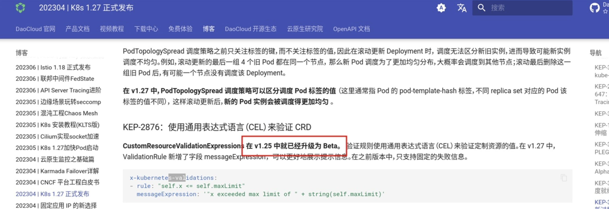

# skoala-init从v0.11.0升级到v0.12.0时报错:  unknown field "x-kubernets-validations" ....

## 问题描述
将skoala-init从v0.11.0升级到v0.12.0时报:  unknown field "x-kubernets-validations" in io.k8s.apiextensions-apiserver.... 错误(如下图所示)，导致无法升级。

     


## 排查过程
1. Q: 操作步骤是否正确?<br>
   A: 先kubectl apply CRD(s)，再helm upgrade,所以此操作步骤无误，排除操作问题.

2. Q: 版本是QA测试通过版本，且内部测试时升级功能正常?<br>
   A: 确认无误.

3. Q: 确认使用版本与测试时使用的k8s集群版本?<br>
   A: v1.21(使用版本) v1.26(测试版本).

4.  Q: 至此及根据相应的错误截图,初步推断是客户k8s集群版本与相应CRD(s)不匹配，同时skoala-init为微服务相关的所有的服务提供初始条件配置，即其包含有多个CRD，而根据skoala-init v0.12.0的ChangeLog可知,在此版本中Gateway-API的CRD(s)有过升级,所以得出:<br>
    A: 由Gateway-API相关升级引发.

## 参考文档:

 1. [Rollout, Upgrade and Rollback Planning](https://github.com/kubernetes/enhancements/blob/master/keps/sig-api-machinery/2876-crd-validation-expression-language/README.md#rollout-upgrade-and-rollback-planning)

    


 2. [KEP-2876：使用通用表达式语言（CEL）来验证 CRD](https://docs.daocloud.io/blogs/230412-k8s-1.27.html#kep-2876cel-crd)

    


 3. [CRD validation error for x-kubernetes-preserve-unknown-fields: true #88252](https://github.com/kubernetes/kubernetes/issues/88252#issuecomment-587250746)


## 解决方案
  根据实际情况，选择适合的解决方案。
#### 方案一 升级使用用的k8s 集群版本到至少v1.25<br>
#### 方案二 按参考文档3中所示: 添加
  ```shell
    –validate=false
  ``` 


