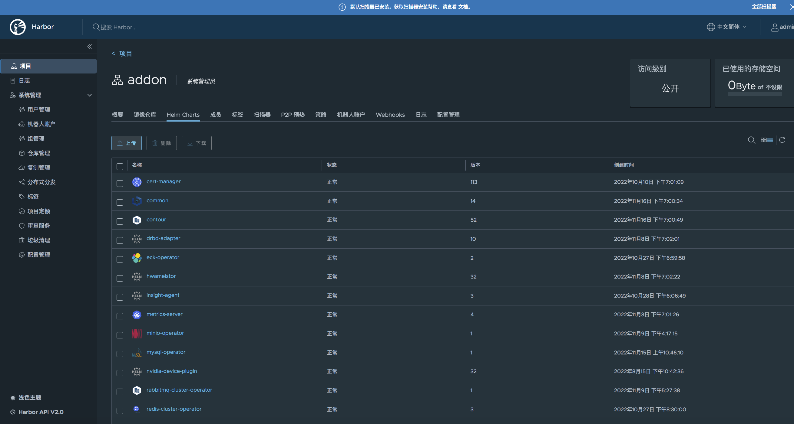
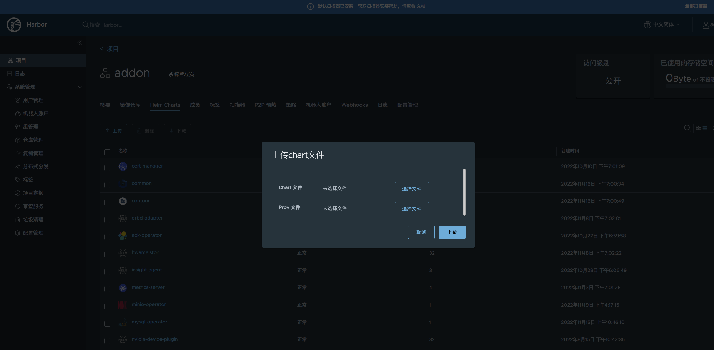
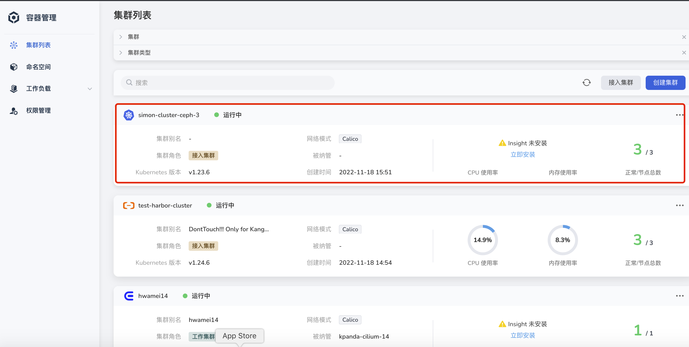
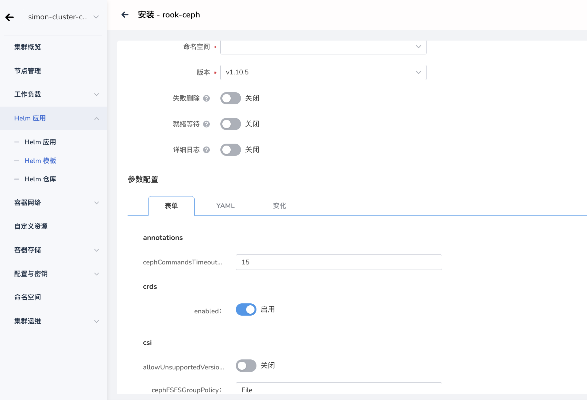
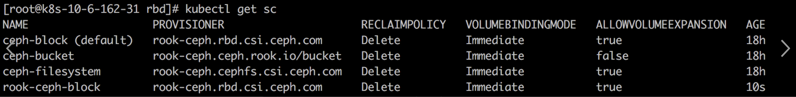

# 简介

本文将提供在 DCE 5.0 应用商店 Addon 的图形化界面安装、部署 Rook-ceph 云原生存储系统的操作步骤及说明。

## Rook-ceph helm chart 格式转换

### 添加 repo

```
[root@k8s-10-6-162-31 helm-test]# helm search repo rook
NAME CHART VERSION APP VERSION DESCRIPTION
rook-release/rook-ceph v1.10.5 v1.10.5 File, Block, and Object Storage Services for yo...
rook-release/rook-ceph-cluster v1.10.5 v1.10.5 Manages a single Ceph cluster namespace for Rook
stable/rookout 0.1.2 1.0 DEPRECATED - A Helm chart for Rookout agent on ...
```

### 拉取 rook-ceph helm chart 并解压

```
[root@k8s-10-6-162-31 helm-test]# helm pull rook-release/rook-ceph
[root@k8s-10-6-162-31 helm-test]# helm pull rook-release/rook-ceph-cluster
[root@k8s-10-6-162-31 helm-test]# ls
rook-ceph-cluster-v1.10.5.tgz rook-ceph-v1.10.5.tgz

[root@k8s-10-6-162-31 helm-test]# tar xvfz rook-ceph-v1.10.5.tgz

[root@k8s-10-6-162-31 helm-test]# ls
rook-ceph rook-ceph-cluster-v1.10.5.tgz rook-ceph-v1.10.5.tgz
```

### 将 rook-ceph 的 values.yaml 转成 json 格式

```
[root@k8s-10-6-162-31 ~]# helm plugin install https://github.com/karuppiah7890/helm-schema-gen.git
karuppiah7890/helm-schema-gen info checking GitHub for tag '0.0.4'
karuppiah7890/helm-schema-gen info found version: 0.0.4 for 0.0.4/Linux/x86_64
karuppiah7890/helm-schema-gen info installed ./bin/helm-schema-gen
Installed plugin: schema-gen

[root@k8s-10-6-162-31 helm-test]# cd rook-ceph
charts Chart.yaml README.md templates values.yaml
[root@k8s-10-6-162-31 rook-ceph]# helm schema-gen values.yaml > values.schema.json

[root@k8s-10-6-162-31 rook-ceph]# ls
charts Chart.yaml prometheus README.md values.schema.json templates values.yaml

[root@k8s-10-6-162-31 helm-test]# tar xvfz rook-ceph-cluster-v1.10.5.tgz

[root@k8s-10-6-162-31 rook-ceph-cluster]# ls
charts Chart.yaml prometheus README.md templates values.yaml
[root@k8s-10-6-162-31 rook-ceph-cluster]# helm schema-gen values.yaml > values.schema.json

[root@k8s-10-6-162-31 rook-ceph-cluster]# ls
charts Chart.yaml prometheus README.md values.schema.json templates values.yaml
```

### 将含有 json 文件的 chart 打包压缩

```
[root@k8s-10-6-162-31 helm-test]# tar zcvf rook-ceph-v1.10.5.tgz rook-ceph

[root@k8s-10-6-162-31 helm-test]# tar zcvf rook-ceph-cluster-v1.10.5.tgz rook-ceph-cluster

[root@k8s-10-6-162-31 helm-test]# ls
rook-ceph-cluster-v1.10.5.tgz rook-ceph-v1.10.5.tgz rook-ceph rook-ceph-cluster rook-ceph-cluster-v1.10.5.tgz rook-ceph-v1.10.5.tgz
```

## DaoCloud 镜像仓库操作

### 将含有 json 格式的 chart 包上传






## DCE 5.0 集群安装 Rook-ceph

### 将集群接入 DCE 5.0




### 安装 rook-ceph






## 应用部署验证

```
[root@k8s-10-6-162-31 kubernetes]# pwd
/root/rook/cluster/examples/kubernetes

[root@k8s-10-6-162-31 kubernetes]# kubectl apply -f mysql.yaml
service/wordpress-mysql created
persistentvolumeclaim/mysql-pv-claim created
deployment.apps/wordpress-mysql created
[root@k8s-10-6-162-31 kubernetes]# kubectl get svc -A
NAMESPACE NAME TYPE CLUSTER-IP EXTERNAL-IP PORT(S) AGE
default kubernetes ClusterIP 10.96.0.1 <none> 443/TCP 31d
default wordpress-mysql ClusterIP None <none> 3306/TCP 19s
kube-system kube-dns ClusterIP 10.96.0.10 <none> 53/UDP,53/TCP,9153/TCP 31d
rook-ceph rook-ceph-mgr ClusterIP 10.100.204.145 <none> 9283/TCP 18h
rook-ceph rook-ceph-mgr-dashboard ClusterIP 10.96.206.31 <none> 8443/TCP 18h
rook-ceph rook-ceph-mon-a ClusterIP 10.101.168.203 <none> 6789/TCP,3300/TCP 18h
rook-ceph rook-ceph-mon-b ClusterIP 10.102.39.21 <none> 6789/TCP,3300/TCP 18h
rook-ceph rook-ceph-mon-c ClusterIP 10.109.128.35 <none> 6789/TCP,3300/TCP 18h
rook-ceph rook-ceph-rgw-ceph-objectstore ClusterIP 10.108.107.0 <none> 80/TCP 18h

[root@k8s-10-6-162-31 kubernetes]# kubectl get po -owide
NAME READY STATUS RESTARTS AGE IP NODE NOMINATED NODE READINESS GATES
wordpress-mysql-79966d6c5b-5v2r4 1/1 Running 0 12m 10.244.19.148 k8s-10-6-162-31 <none> <none>

[root@k8s-10-6-162-31 kubernetes]# kubectl get pv -A
NAME CAPACITY ACCESS MODES RECLAIM POLICY STATUS CLAIM STORAGECLASS REASON AGE
pvc-9c7558cc-a152-4893-a88d-5054ab76e73e 20Gi RWO Delete Bound default/mysql-pv-claim ceph-block 36s

[root@k8s-10-6-162-31 kubernetes]# kubectl get po -owide
NAME READY STATUS RESTARTS AGE IP NODE NOMINATED NODE READINESS GATES
wordpress-mysql-79966d6c5b-5v2r4 1/1 Running 0 12m 10.244.19.148 k8s-10-6-162-31 <none> <none>
```

至此，Rook-ceph 在 DCE 5.0 Add-on 应用商店的部署安装验证测试完成！
