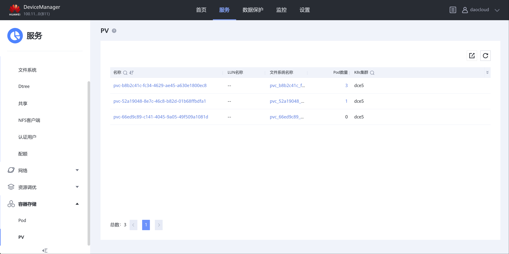

---
hide:
  - navigation
---

# 测试 K8s CSI 驱动 Dorado 存储

标准化测试各项 CSI 能力和存储的容器感知能力

## 测试结论

**DaoCloud d.run AI 算力调度平台（暨 DCE5 v3.0 云原生容器平台），能全面兼容
OceanStore Dorado v6 的"CNCF-CSI 标准"的各项容器卷功能，也能兼容"华为 CSM 标准"的各项容器卷感知功能。**

## 测试环境

| 组件                      | 版本                           |
| ------------------------- | ------------------------------ |
| 存储型号                  | 华为 OceanStore Dorado 5000 v6 |
| 存储版本                  | V700R001C00SPC200              |
| d.run                     | DCE5 v3.0.0                    |
| Kubernetes                | v1.31.6                        |
| CSI 驱动                  | eSDK_K8S_Plugin v4.8.0         |
| 存储监控容器              | Huawei CSM v2.3.0              |
| csi-attacher              | v4.4.0                         |
| csi-node-driver-registrar | v2.9.0                         |
| csi-provisioner           | v3.6.0                         |
| csi-resizer               | v1.9.0                         |
| csi-snapshotter           | v6.3.0                         |
| livenessprobe             | v2.12.0                        |
| snapshot-controller       | v6.3.0                         |

## 组网拓扑


## 驱动下载

### oceanctl

MACOS 版本需要从源代码直接编译
<https://github.com/Huawei/eSDK_K8S_Plugin/blob/master/Makefile>

### CSI 驱动

<https://github.com/Huawei/eSDK_K8S_Plugin>

### CSM

<https://github.com/Huawei/csm>

## 参考文档

### CSI Plugin 手册

<https://github.com/Huawei/eSDK_K8S_Plugin/tree/master/docs>

### Dorado CSI 最佳实践

<https://support.huawei.com/enterprise/zh/doc/EDOC1100306385>

### CDM 手册

<https://github.com/Huawei/csm/tree/main/docs>

## NFS CSI 的参照对象

### nfs-subdir-external-provisioner

<https://github.com/kubernetes-sigs/nfs-subdir-external-provisioner>

## 测试过程

1. 使用 mysql 集群挂载存储卷，写入初始数据库；
2. 执行克隆和快照；
3. 然后再用新的 mysql 实例挂载新的卷

## 操作过程

命令已经封装到 [Makefile](./Makefile) 里

```sh
# 安装 CSI
make csi

# 安装 csm
make csm

# 安装 backend
make backend

# 创建测试
make create

# 删除测试
make delete
```

## 测试结果

| 测试项     | 方式                                                   | 结果   | 备注                              |
| ---------- | ------------------------------------------------------ | ------ | --------------------------------- |
| 卷创建     | 动态创建 pvc => pv                                     | 通过   |                                   |
| 卷扩容     | 在线修改 pvc 容量大小                                  | 通过   |                                   |
| 卷挂载 1   | RWO 独占卷挂载                                         | 通过   |                                   |
| 读写 IO    | 写入数据库数据，然后读取                               | 通过   |                                   |
| 卷卸载     | 删除 MySQL 容器，然后 mount -l 检查 nfs 挂载是否被删除 | 通过   |                                   |
| 卷删除     | 删除 PVC，检查存储界面是否显示卷被删除                 | 通过   |                                   |
| 卷共享     | ReadWriteMany 模式多容器跨主机挂载卷                   | 通过   |                                   |
| 卷快照     | CSI VolumeSnapShot 联动存储快照                        | 通过   |                                   |
| 卷快照恢复 | 从快照恢复出来一个 PVC                                 | 通过   |                                   |
| 卷克隆     | 克隆复制 PVC                                           | 通过   |                                   |
| 租户控制   | 卷全放在某个特定租户里                                 | 通过   |                                   |
| 临时卷     | 创建 CSI Ephemoral 卷                                  | 通过   |                                   |
| PV 感知    | 存储侧显示 K8S 的 PV                                   | 通过   |                                   |
| POD 感知   | 存储侧显示 K8S 的 Pod                                  | 通过\* | 目前不能显示挂 ephemoral 卷的 POD |

## 测试截图

### 前端

#### kubectl


#### mount -l


### 后端

#### 文件系统


#### 克隆


#### 快照


#### PV 感知




#### POD 感知


## 常见问题

### 如何配置 daocloud 租户

1. 后端网页 UI 里创建 daocloud 租户；
2. 服=>多租户，daocloud 租户=>概要信息，关联 StoragePool001；
3. 服务=>网络=>逻辑端口，daocloud 租户下，配置独立的 IP, 并且打开管理 url 功能；
4. backends.yaml 配置租户的 url；

### 如何确保 PV 卷文件系统生成在 daocloud 租户下

backends.yaml 里需要从租户逻辑端口的 url 登录租户，具体请看 backends.yaml 和 backends_admin.yaml 的区别

### 如何配置 NFS 4.x

设置=>文件服务=>NFS 服务，daocloud 租户下，打开各个 4.x 服务

注意：CSI 会根据 mountOption 里的 NFS 版本过滤 StoragePool

### CSM 需要配置存储后端吗？

不需要，它读的 `storagebackendclaims.xuanwu.huawei.io` 信息

## CSM 日志

CSM 容器发送 PV/POD 信息到存储的 REST API

```sh
cat /var/log/huawei-csm/csm-storage-service/cmi-service
```

```
2025-08-19 14:30:51.301498 1[requestID:4226085859] [INFO]:  call request POST https://100.115.9.220:8088/deviceManager/rest/2102353SYPFSLC000003/container_pv, request: map[clusterName:dce5 pvName:pvc-b8b2c41c-fc34-4629-ae45-a630e1800ec8

2025-08-19 14:31:20.858171 1[requestID:4042092947] [INFO]:  call request POST https://100.115.9.220:8088/deviceManager/rest/2102353SYPFSLC000003/container_pod, request: map[nameSpace:default podName:mysql-0 resourceId:844 resourceType:40]
```

## 遗留问题

### 1. CSM 不支持临时卷

此问题已经提交到 Github：
[Need to support monitoring pods that mount ephemeral volumes #1](https://github.com/Huawei/csm/issues/1)

## 附录

### CLI 输出

#### 脚本

```console
make create
kubectl apply -f sc.yaml
storageclass.storage.k8s.io/dorado-nfs created
kubectl apply -f pvc.yaml
persistentvolumeclaim/data-mysql created
kubectl wait pvc/data-mysql \
                --for=jsonpath='{.status.phase}'='Bound' \
                --timeout=600s
persistentvolumeclaim/data-mysql condition met
kubectl apply -f mysql.yaml
statefulset.apps/mysql created
configmap/mysql unchanged
service/mysql created
service/mysql-read created
kubectl rollout status --watch --timeout=600s sts/mysql
Waiting for 3 pods to be ready...
Waiting for 2 pods to be ready...
Waiting for 2 pods to be ready...
Waiting for 1 pods to be ready...
Waiting for 1 pods to be ready...
partitioned roll out complete: 3 new pods have been updated...
kubectl apply -f pvc-expand.yaml
persistentvolumeclaim/data-mysql configured
kubectl wait pvc/data-mysql \
                --for=jsonpath='{.status.capacity.storage}'='2Gi' \
                --timeout=600s
persistentvolumeclaim/data-mysql condition met
kubectl apply -f pvc-clone.yaml
persistentvolumeclaim/data-mysql-clone created
kubectl wait pvc/data-mysql-clone \
                --for=jsonpath='{.status.phase}'='Bound' \
                --timeout=600s
persistentvolumeclaim/data-mysql-clone condition met
kubectl apply -f mysql-clone.yaml
statefulset.apps/mysql-clone created
service/mysql-clone created
service/mysql-clone-read created
kubectl rollout status --watch --timeout=600s sts/mysql-clone
Waiting for 1 pods to be ready...
partitioned roll out complete: 1 new pods have been updated...
kubectl apply -f snapshotclass.yaml
volumesnapshotclass.snapshot.storage.k8s.io/dorado-ssc created
kubectl apply -f snapshot.yaml
volumesnapshot.snapshot.storage.k8s.io/data-mysql-snapshot created
kubectl wait volumesnapshot/data-mysql-snapshot \
                --for=jsonpath='{.status.readyToUse}'=true \
                --timeout=600s
volumesnapshot.snapshot.storage.k8s.io/data-mysql-snapshot condition met
kubectl apply -f mysql-restore.yaml
statefulset.apps/mysql-restore created
service/mysql-restore created
service/mysql-restore-read created
kubectl rollout status --watch --timeout=600s sts/mysql-restore
Waiting for 1 pods to be ready...
partitioned roll out complete: 1 new pods have been updated...
```

#### 示例

```sh
kubectl get po,pvc,volumesnapshot
```

```
NAME                  READY   STATUS    RESTARTS        AGE
pod/mysql-0           2/2     Running   0               8m57s
pod/mysql-1           2/2     Running   1 (7m45s ago)   8m12s
pod/mysql-2           2/2     Running   1 (7m11s ago)   7m36s
pod/mysql-clone-0     1/1     Running   0               6m29s
pod/mysql-restore-0   1/1     Running   0               5m45s

NAME                                         STATUS   VOLUME                                     CAPACITY   ACCESS MODES   STORAGECLASS   VOLUMEATTRIBUTESCLASS   AGE
persistentvolumeclaim/data-mysql             Bound    pvc-b8b2c41c-fc34-4629-ae45-a630e1800ec8   2Gi        RWX            dorado-nfs     <unset>                 9m
persistentvolumeclaim/data-mysql-clone       Bound    pvc-52a19048-8e7c-46c8-b82d-01b68ffbdfa1   2Gi        RWX            dorado-nfs     <unset>                 6m59s
persistentvolumeclaim/mysql-restore-0-data   Bound    pvc-66ed9c89-c141-4045-9a05-49f509a1081d   2Gi        RWO            dorado-nfs     <unset>                 5m46s

NAME                                                         READYTOUSE   SOURCEPVC    SOURCESNAPSHOTCONTENT   RESTORESIZE   SNAPSHOTCLASS   SNAPSHOTCONTENT                                    CREATIONTIME   AGE
volumesnapshot.snapshot.storage.k8s.io/data-mysql-snapshot   true         data-mysql                           2Gi           dorado-ssc      snapcontent-857dddba-b266-42d1-a048-aaf6bcaf53f4   17m            5m49s
```

### CSI

```sh
kubectl -n huawei-csi get po
```

```
NAME                                     READY   STATUS    RESTARTS   AGE
huawei-csi-controller-6c8c87bc8d-sg7s8   9/9     Running   0          5d21h
huawei-csi-node-9gtsj                    3/3     Running   0          5d21h
```

### CSM

```sh
kubectl -n huawei-csm get po
```

```
NAME                                      READY   STATUS    RESTARTS   AGE
csm-prometheus-service-7c79866c7b-9nvpp   3/3     Running   0          6d10h
csm-storage-service-59876749df-58kpk      3/3     Running   0          6d10h
```

### CRDs

```sh
kubectl api-resources --api-group xuanwu.huawei.io
```

```
NAME                     SHORTNAMES   APIVERSION            NAMESPACED   KIND
resourcetopologies       rt           xuanwu.huawei.io/v1   false        ResourceTopology
storagebackendclaims     sbc          xuanwu.huawei.io/v1   true         StorageBackendClaim
storagebackendcontents   sbct         xuanwu.huawei.io/v1   false        StorageBackendContent
volumemodifyclaims       vmc          xuanwu.huawei.io/v1   false        VolumeModifyClaim
volumemodifycontents     vmct         xuanwu.huawei.io/v1   false        VolumeModifyContent
```

### mount -l

```sh
mount -l | grep /pvc-b8b2c41c-fc34-4629-ae45-a630e1800ec8/mount
```

```
100.115.9.220:/pvc_b8b2c41c_fc34_4629_ae45_a630e1800ec8 on /var/lib/kubelet/pods/83aca192-3c4d-4ed4-812d-aef164b1938c/volumes/kubernetes.io~csi/pvc-b8b2c41c-fc34-4629-ae45-a630e1800ec8/mount type nfs4 (rw,relatime,vers=4.2,rsize=262144,wsize=262144,namlen=255,hard,proto=tcp,timeo=600,retrans=2,sec=sys,clientaddr=100.115.8.120,local_lock=none,addr=100.115.9.220)
```
