---
hide:
  - navigation
---
# OceanStor A 系列存储与道客 d.run 算力调度平台兼容性测试报告

## 1 环境配置

### 1.1 验证组网图

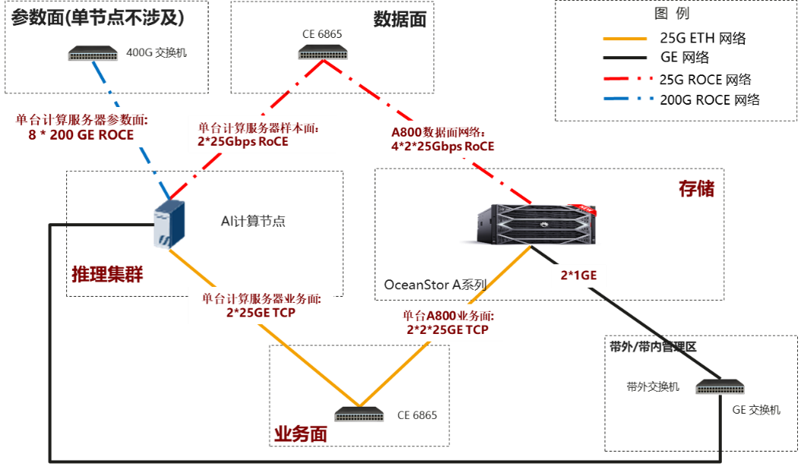

<div style="text-align:center;">图 1-1 功能验证组网图</div>

### 1.2 硬件与软件配置

#### 1.2.1 存储系统配置

本测试需要一套华为 OceanStor A800 存储系统，配置参考如下：

表 1-1 OceanStor A800 配置表

| 名称 | 描述 | 型号 | 单台高度 | 数量 |
| --- | ------- | -------- | -------- | -------- |
| AI 存储 | OceanStor A800 <br />控制框：2 控 <br />每控 CPU：4*Kunpeng920-7260X <br />每控内存：1TB <br />硬盘：1.746TB NVMe PALM 盘 20 块 <br />网络：4 * 2 端口 25GE RoCE 网卡；2 * 4 端口 25GE ETH 网卡 | OceanStor A800 | 8U | 1 |

#### 1.2.2 配套测试硬件

表 1-2 配套硬件配置

| 名称 | 描述 | 型号 | 单台高度 | 数量 |
| --- | --- | -----| ------ | ---- |
| 推理服务器 | <br />CPU :2 * HUAWEI Kunpeng 920 <br />NPU：8 * Ascend 910B（64G 显存） <br />网卡 1: 4 * 2 端口 200GE ROCE 网卡（参数面，可选） <br />网卡 2: 1 * 2 端口 25GE ROCE 网卡（数据面） <br />网卡 3：1 * 4 端口 25GE ETH 网卡（业务面） <br />系统盘 ：2 * 480GB SATA SSD | Atlas 800T A2 | 4U | 1 台 |
| 业务面交换机 | 用于连接业务及存储面网络 | CE6865 | 1U | 1 台 |
| 参数面交换机（单节点不涉及） | 用于计算服务器参数面网络，使用 400GE 一分二线缆连接计算服务器 | XH9210 | 1U | 1 台 |

#### 1.2.3 测试软件和工具

表 1-3 测试软件及工具表

| 软件类型 | 描述 |
| ------ | ---- |
| 计算服务器操作系统 | OpenEuler 22.03 LTS（5.10.0-60.18.0.50.oe2203） |
| DataTurbo | 文件加速引擎 |
| NFS 客户端 | NFS 文件系统挂载 |
| NPU 驱动 | 版本 24.1.rc3 |
| Docker | 容器控制软件，版本 20.10.9 |
| Python | AI 常用编程语言，版本 3.10 |
| CANN | 针对 AI 场景推出的异构计算架构，版本 8.0.RC3 |
| 推理模型 | Qwen3-32B |

## 2 验证结果

### 2.1 基本信息

表 2-1 基本信息

| 字段 | 描述 |
| --- | -------------- |
| 厂商 | 华为技术有限公司 |
| 产品 | 华为 OceanStor A 系列存储系统 |
| 地点 | |
| 人员 | |
| 日期 | |
| 其余信息 | |

### 2.2 验证目的

本次旨在测试道客 d.run 算力调度平台和华为 A 系列存储对接兼容性，验证在 d.run 算力调度平台上 A 系列存储 UCM 的推理加速能力，关注 TTFT、提高吞吐量和并发的效果提升。

### 2.3 验证总结

道客 d.run 算力调度平台 与华为A系列存储相互兼容，支持 AI 场景 Unified Cache Manager 推理加速能力。在 LLM 模型推理输入长序列和多并发的场景下，Unified Cache 方案提供了基于华为 OceanStor A 系列存储系统的 Prefix Cache、GSA 等功能特性，通过改变 KV Cache 的重用方式，切片化处理输入序列，以及在长序列稀疏化处理，实现了有效缩短 TTFT、提高吞吐量和并发的性能提升效果。

在 Qwen3-32B 模型，序列长度 32K + 1K 的场景下，TTFT 最大提升 47%，E2E 吞吐最大提升 75%，在超过并发数为 15 场景，关闭 UCM E2E 吞吐能力最大为 102 tok/s，增加并发后吞吐能力存在波动。

| 输入长度 | 输出长度 | 并发数 | | TTFT ms | | | E2E吞吐 tok/s | |
| ------ | ------- | ----- | ------- | ------------ | ----- | -- | -- | -- |
| | | | 开启 UCM | 关闭 UCM | 提升比例 | 开启 UCM | 关闭 UCM | 提升比例 |
| 32000 | 1000 | 10 | 26,174.26 | 29755.01 | 12.03% | 103.59 | 92.85 | 11.57% |
| 32000 | 1000 | 15 | 38,726.93 | 42776.58 | 9.47% | 125.81 | 102.16 | 23.15% |
| 32000 | 1000 | 20 | 52,450.65 | 70537.73 | 25.64% | 142.62 | 82.25 | 73.40% |
| 32000 | 1000 | 25 | 59,713.67 | 100254.08 | 40.44% | 151.25 | 88.32 | 71.25% |
| 32000 | 1000 | 30 | 65,833.11 | 124975.91 | 47.32% | 162.47 | 92.71 | 75.25% |

在 Qwen3-32B 模型，序列长度 32K + 1K 的场景下，关闭 UCM，超过最大并发数 17，请求开始排队；开启 UCM，超过最大并发数 32，请求开始排队，在以上情况下，开启 UCM 对比关闭 UCM 场景，并发能力提升 88.24%。

| (4*910B)/Qwen3 | | 开启 UCM | 关闭 UCM | 并发提升 |
| -------------- | ------- | ------- | ------- | -- |
| 输入长度 | 输出长度 | 最大并发数 | 最大并发数 | 88.24% |
| 32000 | 1000 | 32 | 17 | |

## 3 验证用例

### 3.1 资源管理测试

#### 3.1.1 存储后端资源管理

- **测试目的**

    验证上海道客 DaoCloud 平台通过华为 CSI 插件对华为存储后端资源进行管理。

- **测试组网**

    华为容器存储解决方案验证组网图

- **预置条件**

    1. Kubernetes 集群运行正常。
    2. 华为存储系统已创建存储池并运行正常。
    3. 华为 CSI 插件已安装完成并正常运行。

- **测试步骤**

    1. 参考华为 CSI 软件包里 examples/backend 目录下的 backend.yaml 模板文件，根据实际环境信息新建存储后端配置文件。
       
        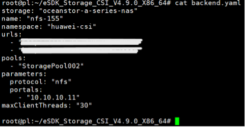

    2. 使用配置文件创建存储后端，按照提示输入存储后端的用户名和密码，查看存储后端是否创建成功。
       
        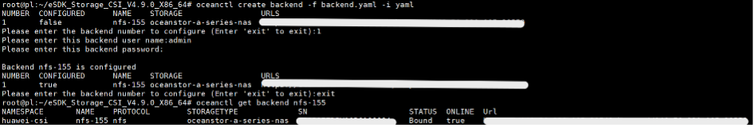

    3. 删除已创建的存储后端，查看存储后端是否删除成功。
       
        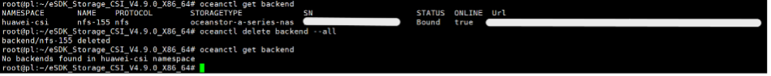

- **预期结果**
   
    1. 步骤 2 中，在 Kubernetes 上查看存储后端创建成功。
    2. 步骤 3 中，在 Kubernetes 上查看存储后端删除成功。

- **实测结果**
   
    1. 修改配置文件  
       
        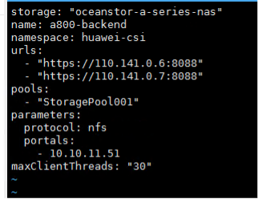

    2. 创建存储后端成功  
       
        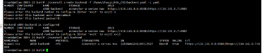

    3. 删除存储后端成功  
       
        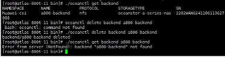

- **测试结论**
    
    通过

- **备注**

    （无）

#### 3.1.2 存储类资源管理

- **测试目的**

    验证 Kubernetes 可通过华为 CSI 插件对存储类资源进行管理。

- **测试组网**

    华为容器存储解决方案验证组网图

- **预置条件**

    1. Kubernetes 集群运行正常。
    2. 华为存储系统已创建存储池并运行正常。
    3. 华为 CSI 插件已安装完成并正常运行。
    4. 在 Kubernetes 中已配置存储后端。

- **测试步骤**
   
    1. 参考华为 CSI 软件包里 examples 目录下的 sc-lun.yaml 模板文件，根据实际环境信息新建存储类配置文件。
       
        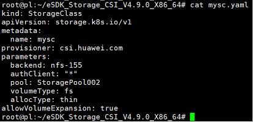

    2. 使用配置文件创建存储类，查看存储类是否创建成功。
      
        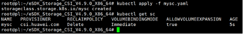

    3. 删除已创建的存储类。
       
        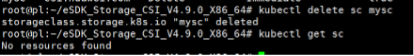

    4. 查看存储类是否删除成功。
       
        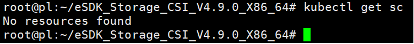

- **预期结果**

    1. 步骤 2 中，在 Kubernetes 上查看存储类创建成功。
    2. 步骤 4 中，在 Kubernetes 上查看存储类删除成功。

- **实测结果**
   
    1. 修改配置文件  
       
        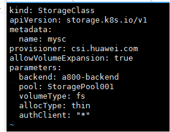

    2. 创建存储类成功  
       
        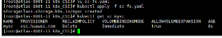

    3. 删除存储类成功  
      
        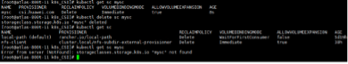

- **测试结论**

    通过

- **备注**

    （无）

#### 3.1.3 PVC 资源管理

- **测试目的**

    验证 Kubernetes 可通过华为 CSI 插件对 PVC 资源进行管理。

- **测试组网**

    华为容器存储解决方案验证组网图

- **预置条件**

    1. Kubernetes 集群运行正常。
    2. 华为 CSI 插件已安装完成并正常运行。
    3. 存储类已创建完成。

- **测试步骤**
    
    1. 参考华为 CSI 软件包里 examples 目录下的 pvc.yaml 模板文件，根据实际环境信息新建 PVC 配置文件。
     
        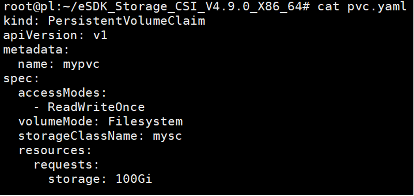

    2. 使用配置文件创建 PVC，查看 PVC 是否创建成功。
      
        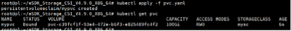

    3. 登录存储设备查看对应文件系统是否自动创建。
       
        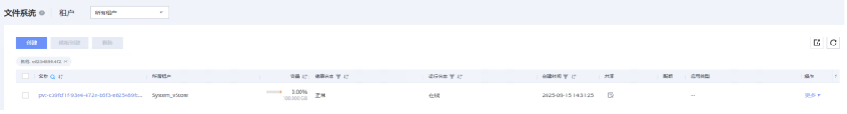

        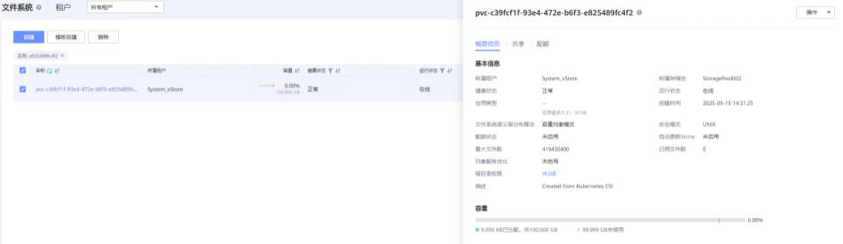

    4. 删除已创建的 PVC，查看 PVC 是否删除成功。
       
        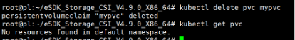

    5. 登录存储设备查看对应文件系统是否被自动删除。
      
        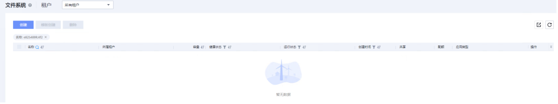

- **预期结果**
    
    1. 步骤 2 中，在 Kubernetes 上查看 PVC 创建成功，可看到对应的文件系统名称。
    2. 步骤 3 中，存储上查看对应文件系统已自动创建成功，容量与 PVC 一致。
    3. 步骤 4 中，在 Kubernetes 上查看 PVC 删除成功。
    4. 步骤 5 中，存储上查看对应文件系统已被自动删除。

- **实测结果**
    
    1. 修改配置文件  
       
        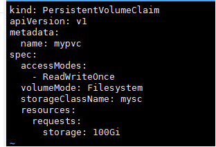

    2. 创建 PVC 成功  
       
        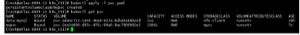

    3. 存储中文件系统创建成功  
       
        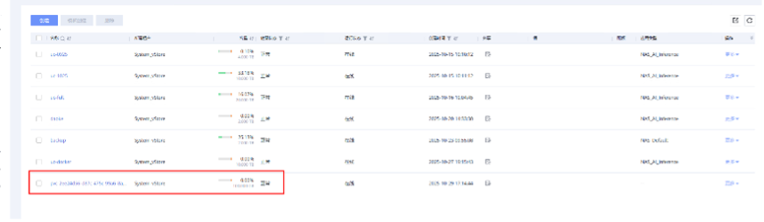

    4. 删除 PVC 成功  
       
        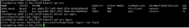

    5. 存储中文件系统删除成功  
       
        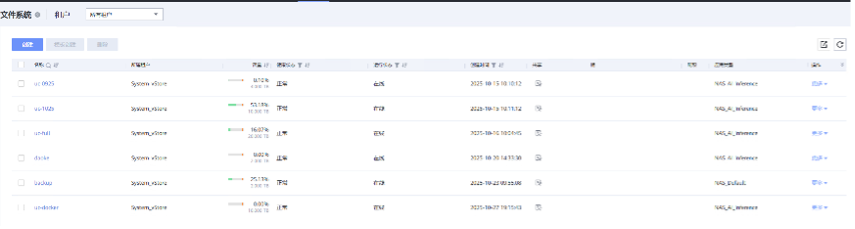

- **测试结论**
    
    通过

- **备注**
    
    （无）

#### 3.1.4 Pod 资源管理

- **测试目的**
    
    验证 Kubernetes 可通过华为 CSI 插件对 Pod 资源进行管理。

- **测试组网**
    
    华为容器存储解决方案验证组网图

- **预置条件**
    
    1. Kubernetes 集群运行正常。
    2. 华为 CSI 插件已安装完成并正常运行。
    3. Pod 需要挂载的 PVC 已创建成功。

- **测试步骤**
   
    1. 参考华为 CSI 软件包里 examples 目录下的 pod.yaml 模板文件，根据实际环境信息新建 Pod 配置文件。
       
        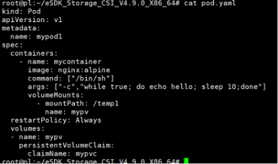

    2. 使用配置文件创建 Pod，查看 Pod 是否创建成功。
       
        

        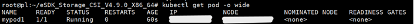

    3. 在 Pod 所在的 Kubernetes 节点上查看文件系统是否挂载成功。
    4. 进入 Pod 的容器中查看 PVC 是否挂载到指定的路径。
       
        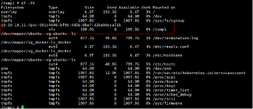

    5. 删除已创建的 Pod，查看 Pod 是否删除成功。
       
        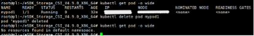

- **预期结果**
   
    1. 步骤 2 中，在 Kubernetes 上查看 Pod 创建成功。
    2. 步骤 3 中，文件系统挂载成功，可查看到文件系统的挂载信息。
    3. 步骤 4 中，容器中可查看到 PVC 成功挂载到指定路径。
    4. 步骤 5 中，在 Kubernetes 上查看 Pod 删除成功。

- **实测结果**
    
    1. 修改配置文件  
       
        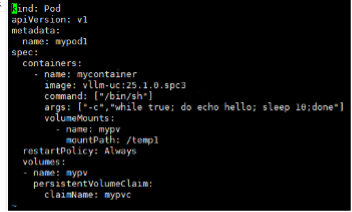

    2. 创建 Pod 成功  
       
        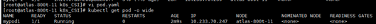

    3. 文件系统挂载成功  
      
        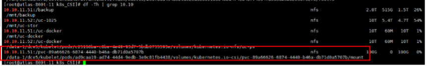

    4. 容器中 PVC 已挂载到指定路径  
      
        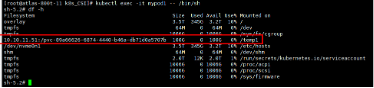

    5. 删除 Pod 成功  
       
        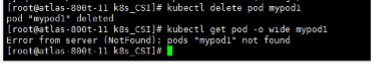

- **测试结论**

    通过

- **备注**

    （无）

### 3.2 推理场景测试

#### 3.2.1 基础功能对接测试

##### 3.2.1.1 昇腾生态对接测试

- **测试目的**

    验证 Unified Cache 方案对接昇腾生态的能力

- **测试组网**

    功能验证组网图

- **预置条件**

    1. 存储设备已安装部署完成且已通过 NFS over RDMA 协议对接昇腾计算服务器  
    2. 模型文件已下载到计算服务器指定位置  
    3. Unified Cache 环境已搭建完成，且服务已拉起

- **测试步骤**

    1. 在客户端向 Unified Cache 服务的 /v1/chat/completions 接口发送 POST 请求，请求体模板如下，model 参数需修改为实际模型路径：  
       
        ```bash
        curl --location 'http://127.0.0.1:8071/v1/chat/completions' \
        --header 'Content-Type: application/json' \
        --data '{
            "messages": [
                { "role": "user", "content": "你好" }
            ],
            "model": "DeepSeek-V3-128K",
            "max_tokens": 512,
            "stream": false,
            "temperature": 0.1,
            "top_p": 1.0,
            "best_of": 1,
            "n": 1
        }'
        ```

    2. 发送请求，等待服务返回请求结果

- **预期结果**
    
    步骤 2 中，请求返回结果成功，Unified Cache 服务运行过程正常无报错

- **实测结果**
    
    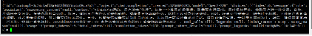

- **测试结论**
   
    通过

- **备注**
    
    （无）

#### 3.2.2 推理性能测试

##### 3.2.2.2 长序列稀疏化场景测试

- **测试目的**
   
    验证 Unified Cache 方案在长序列稀疏化场景下的推理性能

- **测试组网**
   
    功能验证组网图

- **预置条件**
    
    1. 存储设备已安装部署完成且已通过 NFS over RDMA 协议对接计算服务器  
    2. 模型文件已下载到指定位置  
    3. Unified Cache 环境已搭建完成，主、从服务器服务已拉起  
    4. 计算服务器上已安装完成 UC-Eval 测试工具软件

- **测试步骤**
    
    1. 修改 pvc 挂载配置  
      
        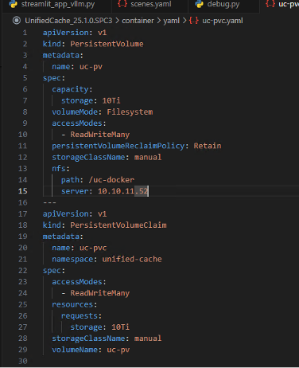

    2. 保证 Unified Cache 服务的 Chunk Prefill 功能和 GSA（稀疏化）功能为开启状态  
      
        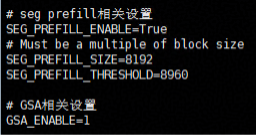

    3. 启用 UC-eval 测试软件
    4. 参考 README.md 文件，导入环境变量  
      
        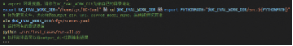

    5. 修改测试脚本配置中的并发数为 8-64，输入 Token 数为 32K，输出 Token 数限定在 1K  
       
        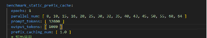

    6. 修改测试用例设置为只运行当前用例  
       
        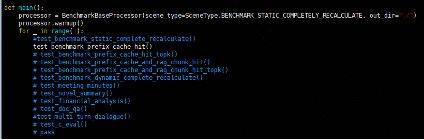

    7. 运行 UC-Eval 测试软件，记录测试结果的 E2E 时延(ms)，TBT 时延(ms)，等效吞吐量 TPS(Token/s) 等
    8. 关闭 Unified Cache 服务，将服务配置中的 GSA、Chunk Prefill 等功能关闭后，重新拉起服务，测试裸推场景性能  
      
        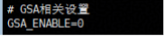

        重复步骤 2-6，并将其与开启 UCM 时得到的测试结果进行对比

- **预期结果**
    
    在输入长序列推理的场景下，开启 GSA 功能后，能够实现 TBT 时延的明显降低和吞吐率成倍增长

- **实测结果**
   
    1. 根据测试场景修改输入文档长度及并发数  
    2. 开启 UCM 情况下，使用 UC-Eval 测试结果如下：  
      
        [benchmark_static_latency.md](attachments/image48__benchmark_static_latency.md)
        [benchmark_static_latency.csv](attachments/image48__benchmark_static_latency.csv)

        记录到最大并发数为 32，对应增量吞吐 292.7 tok/s  

        

    3. 裸推场景测试结果如下：  
       
        [benchmark_static_latency_no_ucm.md](attachments/image48__benchmark_static_latency_no_ucm.md)
        [benchmark_static_latency_no_ucm.csv](attachments/image48__benchmark_static_latency_no_ucm.csv)

        记录到最大并发数为 17，对应增量吞吐 173.2 tok/s  

        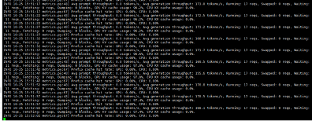

- **测试结论**

    通过

- **备注**
    
    长序列稀疏化通过选择输入序列关键位置的 token，限制模型关注部分元素，减少注意力计算范围，降低计算复杂度，实现明显延迟降低与吞吐提升。

##### 3.2.2.3 多轮对话场景测试

- **测试目的**
    
    验证 Unified Cache 方案的多轮对话推理性能及效果

- **测试组网**
    
    功能验证组网图

- **预置条件**
    
    1. 已通过 NFS over RDMA 对接计算服务器  
    2. Unified Cache 服务已拉起  
    3. 计算服务器上已安装完成多轮对话模拟性能测试工具，并上传模拟对话记录（推荐轮次 ≤ 45，总 Token ≤ 32K）

- **测试步骤**

    1. 启动测试环境  
       
        ```bash
        cd /home/UC-Eval-dev-zyc
        source uc-eval/bin/activate
        ```

    2. 参考 README.md 文件，导入环境变量，修改 model_url 与 model 参数  
      
        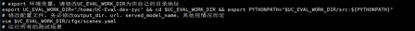

    3. 预埋对话内容  
      
        ```shell
        cd UC-Eval-datasets/qa/multi_turn_dialogues
        ```

        修改 multiturndialog.json  

        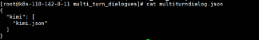

        指向 UC-Eval-datasets/qa/multi_turn_dialogues/kimi/kimi.json  

        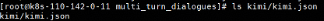

    4. 修改代码，使只执行多轮对话脚本  
       
        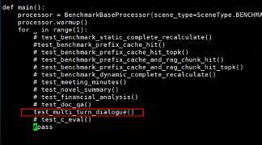

    5. 按需修改 test_multi_turn_dialogue 内容 

        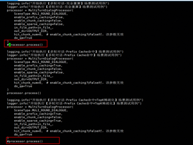

    6. 根据脚本返回统计 TTFT/E2E/TBT 时延
    7. 开启 Unified Cache 的 PrefixCache 与 RAGChunk 功能  
       
        设置对话轮次为 45，按对话记录执行测试

    8. 再统计 TTFT/E2E/TBT，并与步骤 1 对比
    9. 绘制性能曲线对比图

- **预期结果（示例）**

    开启 Prefix Cache 功能后，随对话轮次增加，TTFT 明显降低。

- **实测结果**

    [multi_turn_dialogue_latency.md](attachments/image55__multi_turn_dialogue_latency.md)
    [multi_turn_dialogue_latency.csv](attachments/image55__multi_turn_dialogue_latency.csv)
    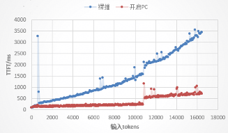

- **测试结论**

    通过

- **备注**

    Prefix Cache 可以重用对话历史前缀，显著降低首 Token 时延（TTFT）。

## 附录

### 部分测试指标释义及计算方法

#### TTFT 时延

TTFT 时延（ms），Time To First Token，即首 token 时延，指用户发起请求到模型返回第一个 Token 所需的时间。该指标直接影响用户对模型响应速度的感知。

#### TBT 时延

TBT 时延（ms），Token Between Token，即平均增量时延，指在大语言模型推理过程中，每生成一个 Token 之间的平均时间。该指标反映了模型在生成过程中输出词元的流畅度。

#### E2E 时延

E2E 时延（ms），End-to-End Delay，即端到端时延，指从用户发起请求到 AI 模型返回最终结果的总时间。该指标反映了模型在生成过程中输出词元的流畅度。

E2E 时延可以被大致估计为 TTFT+TBT*(生成 Token 数-1)+数据传输时间的总和

#### 等效吞吐量 TPS

TPS（Token/s），Transactions Per Second，即每秒处理事务数，指在模型推理过程中，每秒钟生成的 Token 数量。该指标衡量了模型的生成速度。可以通过模型生成的总 Token 数除以模型从输入到生成完成的总时间来计算。
