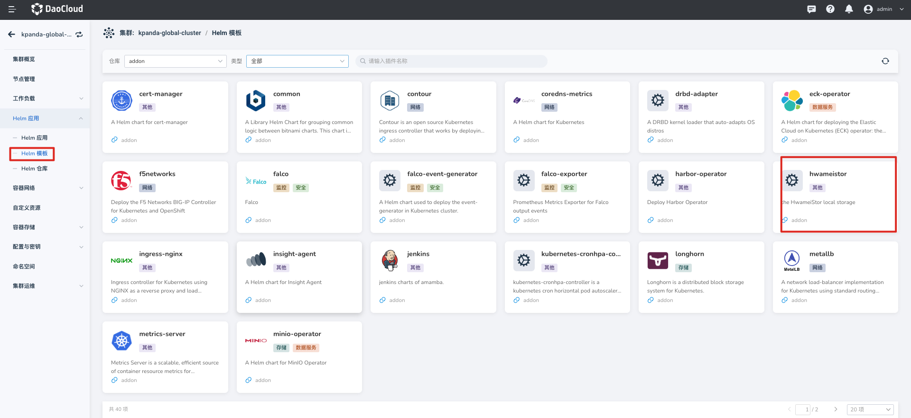
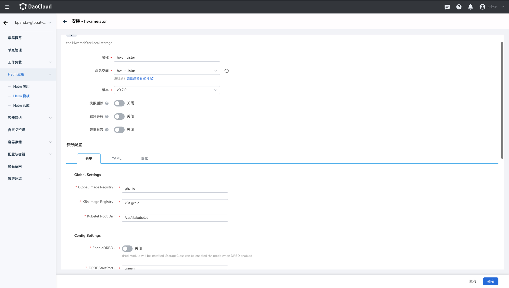
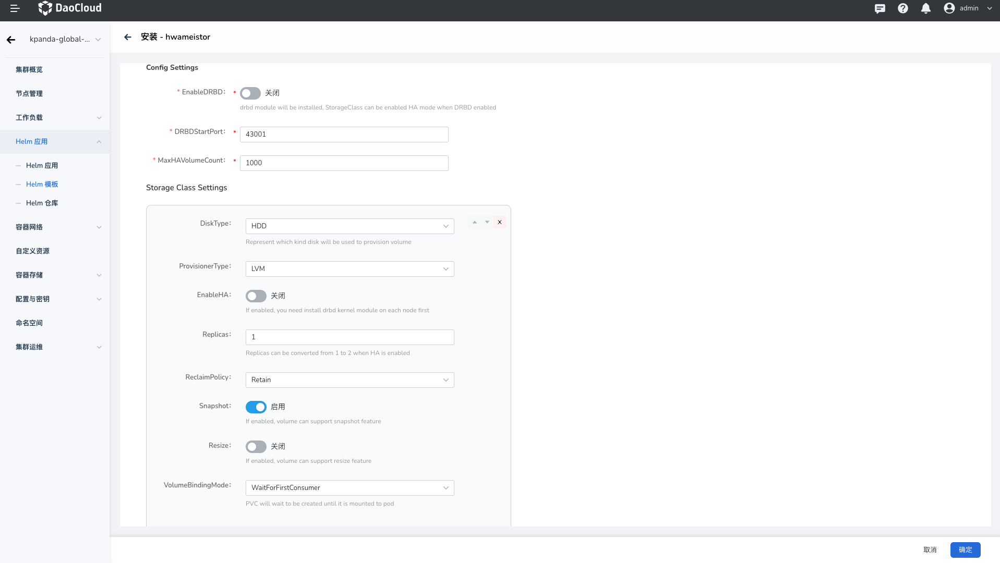
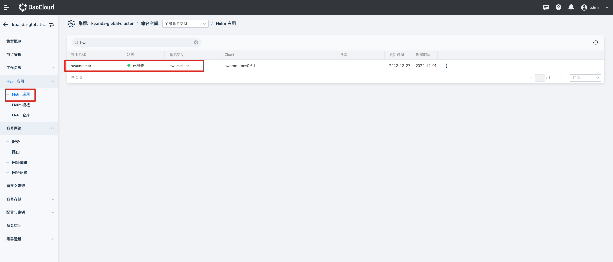

# 通过界面安装

本文介绍如何通过平台界面安装 Hwameistor。

## 前提条件

- 待使用节点上已准备空闲 HDD、SSD 磁盘
- 已完成[准备工作](prereq.md)中事项

## 安装步骤

请确认您的集群已成功接入`容器管理`平台，然后执行以下步骤安装 Hwameistor。

1. 在左侧导航栏点击 `容器管理` —> `集群列表`，然后找到准备安装 Hwameistor 的集群名称。

2. 在左侧导航栏中选择 `Helm 应用` -> `Helm 模板`，找到并点击 `Hwameistor`。

    

3. 在`版本选择`中选择希望安装的版本，点击`安装`。

4. 在安装界面，填写所需的安装参数。

    

    

    - `Global Setting` —> `global image Registry`：
    
        设置所有镜像的仓库地址，默认已经填写了可用的在线仓库。
        如果是私有化环境，可修改为私有仓库地址。
        
    - `Global Setting` —> `K8s image Registry`：
    
        设置 K8S 镜像仓库地址，默认已经填写可用在线仓库。
        如果私有化环境，可修改为私有仓库地址。
        
    - `Global Setting` —> `Kubelet Root Dir`：
    
        默认的 `kubelet` 目录为 `/var/lib/kubelet`。
        如果您的 Kubernetes 发行版使用不同的 `kubelet` 目录，必须设置参数 `kubeletRootDir`。
        
    - `Config Settings` —> `EnableDRBD`：
    
        默认为关闭，开启后，创建的数据卷可创建 2 个副本，使用高可用模式。
        
    - `Config Settings` —> `DRDBStartPort`：
    
        默认以 43001 开始，当开启 `DRDB` 时，每创建一个高可用数据卷，需要占用主副本数据卷所在节点的一组端口。
        
    - **Storage Class 配置**

        Hwameistor 部署后，会自动创建 Storage Class。

        - `AllowVolumeExpansion`：默认为关闭状态，开启后，基于 Storage Class 创建的数据卷可以扩容。
        - `DiskType`：创建的存储池（Storage Class）的磁盘类型，支持类型有：HDD、SSD。默认为 HDD。
        - `Enable HA`：默认关闭 `HA`, 即创建的数据卷为`非高可用`，当开启后，使用该 `Storage Class` 创建的数据卷可以设置为`高可用数据卷`。
        - `Replicas`：非 `HA` 模式下，`Replicas` 数量为 `1`；当开启 `HA` 模式后，`Replicas` 数量可以为 `1` 或者 `2`，并且数量为 `1` 时，可以转换为 `2`。
        - `ReclaimPolicy`: 数据卷删除时，数据的保留策略，默认为 `delete`。
        
            1. `Delete`：当删除数据卷时，数据一并删除。
            2. `Retain`：当删除数据卷时，保留数据。

5. 参数输入完成后，点击`确定`完成创建，完成创建后可点击 `Helm 应用`查看 `Hwameistor` 安装状态。

    
