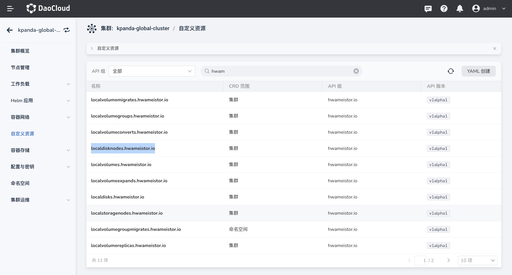
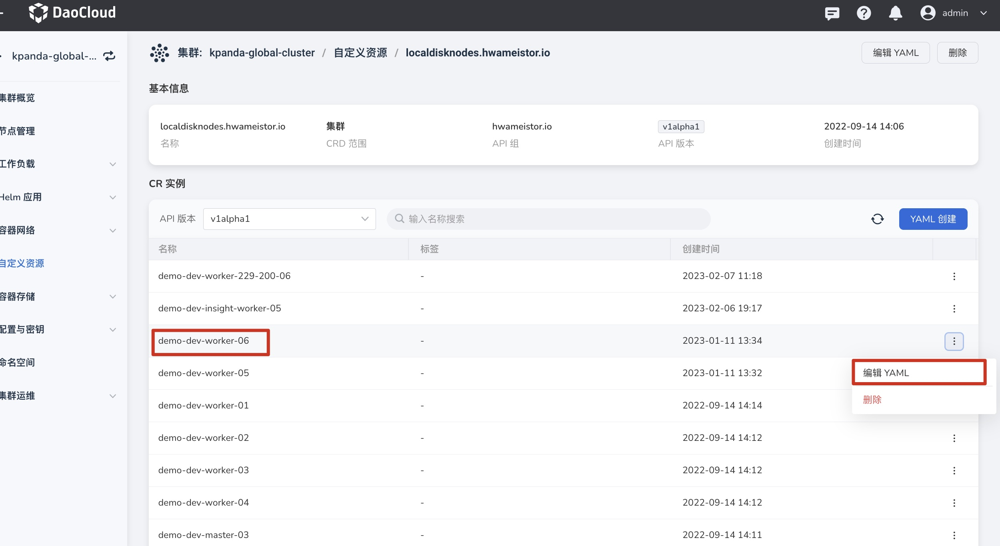

# 存储网卡配置

HwameiStor 支持使用单独的网卡进行数据卷同步，可以避免使用通信网卡带来流量阻塞问题。

!!! note

    - 【🔥提前配置】：存储网卡的配置属于存储系统的前置性配置，建议在 HwameiStor 系统安装前 **提前配置**。
    - 【运行中配置】：如果 HwameiStor 已经部署，后面进行上述配置修改，那么**对之前已经创建出来的数据卷不会生效**，也就是还会使用之前的网卡进行数据卷同步。
    -  如需要修改多个节点存储网卡，请逐个配置，目前无法批量配置

## 前提条件

已经提前完成存储网卡规划，请参考[网卡规划](../../../network/plans/ethplan.md)。

## 配置步骤

配置方式分为 2 种：

1. 通过 LocalStorage CR 配置
2. 通过节点注释标记

### 修改 LocalStorage CR 配置

1. 在左侧导航栏点击 `容器管理` —> `集群列表`，找到`待修改网卡配置的集群`，进入集群详情 。

2. 在左侧导航栏中选择 `自定义资源`，找到 `localstoragenodes.hwameistor.io`，点击进入详情。

    

3. 找到`待修改节点`并点击`编辑 YAML`，修改 `spec` 中的 `storage-ipv4=172.30.40.12` 参数，
   指定 IP 地址为已规划网卡 IP [网卡规划](../../../network/plans/ethplan.md)。
   
    
   
    

4. 完成后点击`保存`，并选择下一个节点进行修改。

### 通过节点注释标记

1. 查看 local-storage 的 ENV: **NODE_ANNOTATION_KEY_STORAGE_IPV4** 的值，默认是
    **[localstorage.hwameistor.io/storage-ipv4](http://localstorage.hwameistor.io/storage-ipv4)**

2. 将节点上的 **存储网卡地址通过注释的方式标记**

    ```sh
    kubectl annotate node <your_storage_node> localstorage.hwameistor.io``/storage-ipv4``=172.30.46.12
    ```

3. **重启** 节点上的 local-storage 服务

4. **验证** 配置是否生效

    ```sh
    kubectl get lsn <your_storage_node> -o yaml |``grep` `-i storageIP
    ```

5. 修改成功后，进行下一个节点修改。
