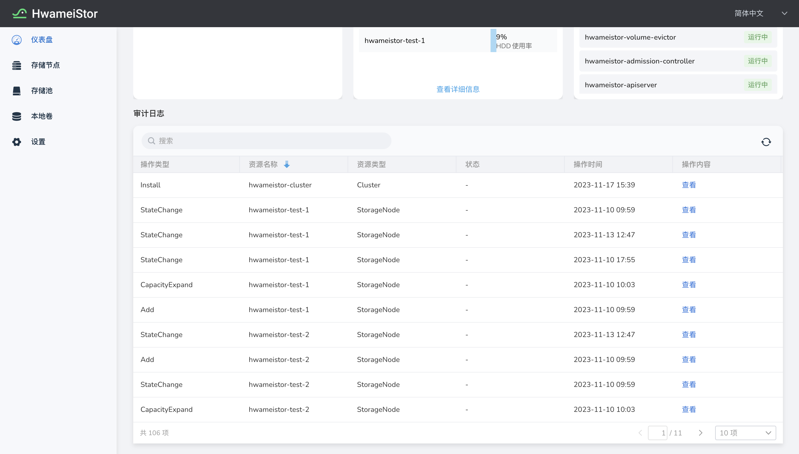
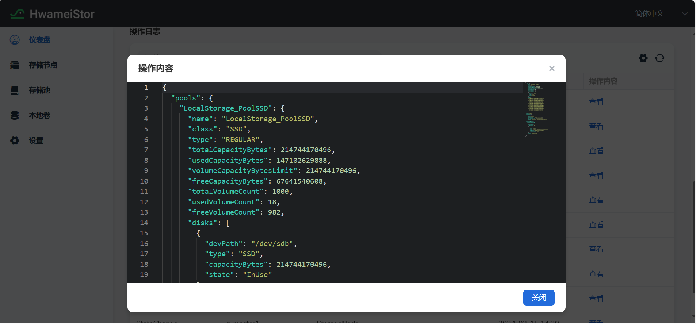

# 审计日志

为了记录 HwameiStor 集群系统的使用和操作历史信息，HwameiStor 提供了系统审计日志。该审计日志具有 HwameiStor 系统语义，易于用户查阅、解析。 审计日志针对 HwameiStor 系统中的每类资源，记录其使用操作信息。该资源包括：Cluster、Node、StoragePool、Volume 等等。

## 查看审计日志

1. 在 `容器管理` 进入`对应集群` → `点击左侧容器存储` → `Hwameistor` 进入 `Hwameistor` 界面，在 `仪表盘` 界面底部可以看到审计模块：

2. 展示了操作类型、资源名称、资源类型、状态、操作时间、操作内容字段。

    

    其中资源类型支持：

    - Cluster

    - StorageNode

    - Disk

    - DiskNode

    - Pool

    - Volume

    - DiskVolume

    操作内容：可以查看到更多的操作细节信息，如下图展示了 `StorageNode` 资源的一条审计的操作内容。

      
