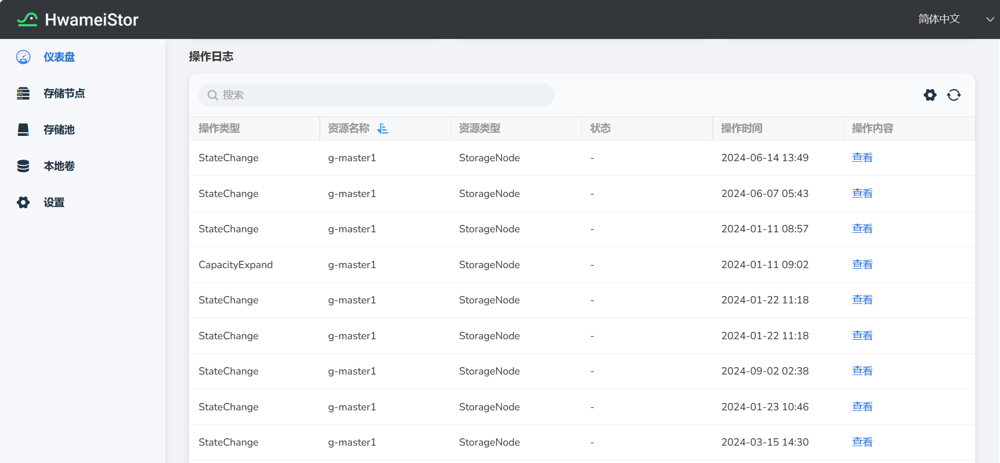

---
hide:
  - toc
---

# 查看操作日志

为了记录 HwameiStor 集群系统的使用和操作历史信息，HwameiStor 提供了系统操作日志。该操作日志具有 HwameiStor 系统语义，易于用户查阅、解析。
操作日志针对 HwameiStor 系统中的每类资源，记录其使用操作信息。该资源包括：Cluster、Node、StoragePool、Volume 等等。

查看操作日志的具体步骤如下：

1. 在左侧导航栏，点击 **容器管理** -> **集群列表** ，点击集群名称进入对应集群；点击 **容器存储** -> **HwameiStor** 进入 **HwameiStor** 界面，在 **仪表盘** 页面底部，可以看到 **操作日志** 列表。

2. 展示了操作类型、资源名称、资源类型、状态、操作时间、操作内容字段。

    

    其中资源类型支持：

    - Cluster
    - StorageNode
    - Disk
    - DiskNode
    - Pool
    - Volume
    - DiskVolume

    点击 **查看** 可以查看操作细节，如下图展示了 `StorageNode` 资源的一条审计的操作内容。

    
