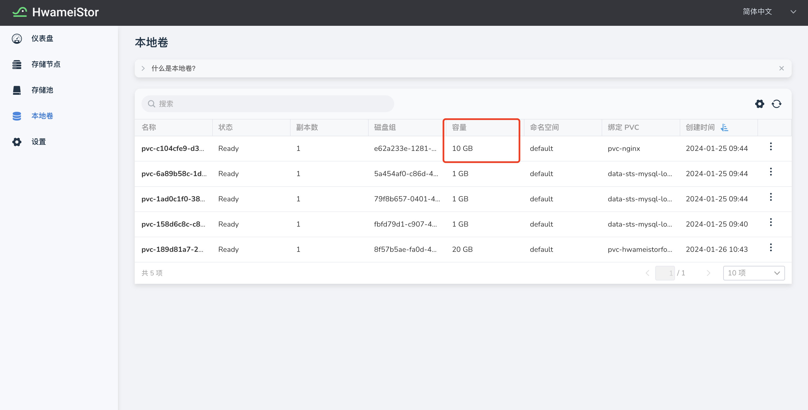

# 数据卷的扩容

HwameiStor 支持 `CSI 卷扩容` 。这个功能实现了通过修改 `PVC` 的大小在线扩容卷。其中目前支持手动、自动两种方式的扩容。

## 手动扩容数据卷

1. 进入对应集群，选择 **存储** -> **Hwameistor**

2. 点击 **本地卷** ，在本地卷列表界面，选择一条本地卷进行`扩容`操作

    

3. 在 **扩容** 对话框中填写扩容后的大小，本例从 `1G` 扩容至 `10G`，点击 **确定**

    

4. 刷新当前列表，观察到当前本地卷的容量已经从 `1G` 变成了 `10G`

    

## 自动扩容数据卷

组件 hwameistor-pvc-autoresizer 提供了 PVC 自动扩容的能力。
扩容行为是通过 `ResizePolicy` 这个 CRD 来控制的。

### ResizePolicy

下面是一个示例 CR：

```yaml
apiVersion: hwameistor.io/v1alpha1
kind: ResizePolicy
metadata:
  name: resizepolicy1
spec:
  warningThreshold: 60
  resizeThreshold: 80
  nodePoolUsageLimit: 90
```

`warningThreshold`、`resizeThreshold`、`resizeThreshold` 三个 int 类型的字段都表示一个百分比。

- `warningThreshold` 目前暂时还没有关联任何告警动作，它是作为一个目标比例，即扩容完成后卷的使用率会在这个比例以下。
- `resizeThreshold` 指示了一个使用率，当卷的使用率达到这个比例时，扩容动作就会被触发。
- `nodePoolUsageLimit` 表示节点存储池使用率的上限，如果某个池的使用率达到了这个比例，
  那么落在这个池的卷将不会自动扩容。

### 匹配规则

这是一个带有 label-selector 的示例 CR。

```yaml
apiVersion: hwameistor.io/v1alpha1
kind: ResizePolicy
metadata:
  name: example-policy
spec:
  warningThreshold: 60
  resizeThreshold: 80
  nodePoolUsageLimit: 90
  storageClassSelector:
    matchLabels:
      pvc-resize: auto
  namespaceSelector:
    matchLabels:
      pvc-resize: auto
  pvcSelector:
    matchLabels:
      pvc-resize: auto
```

`ResizePolicy` 有三个 label-selector：

- `pvcSelector` 表示被这个 selector 选中的 PVC 会依照选中它的 policy 自动扩容。
- `namespaceSelector` 表示被这个 selector 选中的 namespace 下的 PVC 会依照这个 policy 自动扩容。
- `storageClassSelector` 表示从被这个 selector 选中的 storageclass 创建出来的 PVC 会依照这个 policy 自动扩容。

这三个 selector 之间是“且”的关系，如果你在一个 `ResizePolicy` 里指明了多个 selector，
那么要符合全部的 selector 的 PVC 才会匹配这个 policy。如果 `ResizePolicy` 中没有指明任何 selector，
它就是一个集群 `ResizePolicy`，也就像是整个集群中所有 PVC 的默认 policy。

## FAQ

### 如何观察扩容过程

增加的容量越多，扩容所需时间越长。可以在 `PVC` 的事件日志中观察整个扩容的过程.

```shell
kubectl describe pvc data-sts-mysql-local-0
```

```none
Events:
  Type     Reason                      Age                From                                Message
  ----     ------                      ----               ----                                -------
  Warning  ExternalExpanding           34s                volume_expand                       Ignoring the PVC: didn't find a plugin capable of expanding the volume; waiting for an external controller to process this PVC.
  Warning  VolumeResizeFailed          33s                external-resizer lvm.hwameistor.io  resize volume "pvc-b9fc8651-97b8-414c-8bcf-c8d2708c4ee8" by resizer "lvm.hwameistor.io" failed: rpc error: code = Unknown desc = volume expansion not completed yet
  Normal   Resizing                    32s (x2 over 33s)  external-resizer lvm.hwameistor.io  External resizer is resizing volume pvc-b9fc8651-97b8-414c-8bcf-c8d2708c4ee8
  Normal   FileSystemResizeRequired    32s                external-resizer lvm.hwameistor.io  Require file system resize of volume on node
  Normal   FileSystemResizeSuccessful  11s                kubelet                             MountVolume.NodeExpandVolume succeeded for volume "pvc-b9fc8651-97b8-414c-8bcf-c8d2708c4ee8" k8s-worker-3
```

### 如何观察扩容完成后的 `PVC/PV`

```shell
kubectl get pvc data-sts-mysql-local-0
```

```none
NAME                     STATUS   VOLUME                                     CAPACITY   ACCESS MODES   STORAGECLASS                 AGE
data-sts-mysql-local-0   Bound    pvc-b9fc8651-97b8-414c-8bcf-c8d2708c4ee8   2Gi        RWO            hwameistor-storage-lvm-hdd   96m
```

```shell
kubectl get pv pvc-b9fc8651-97b8-414c-8bcf-c8d2708c4ee8
```

```none
NAME                                       CAPACITY   ACCESS MODES   RECLAIM POLICY   STATUS   CLAIM                            STORAGECLASS                 REASON   AGE
pvc-b9fc8651-97b8-414c-8bcf-c8d2708c4ee8   2Gi        RWO            Delete           Bound    default/data-sts-mysql-local-0   hwameistor-storage-lvm-hdd            96m
```
