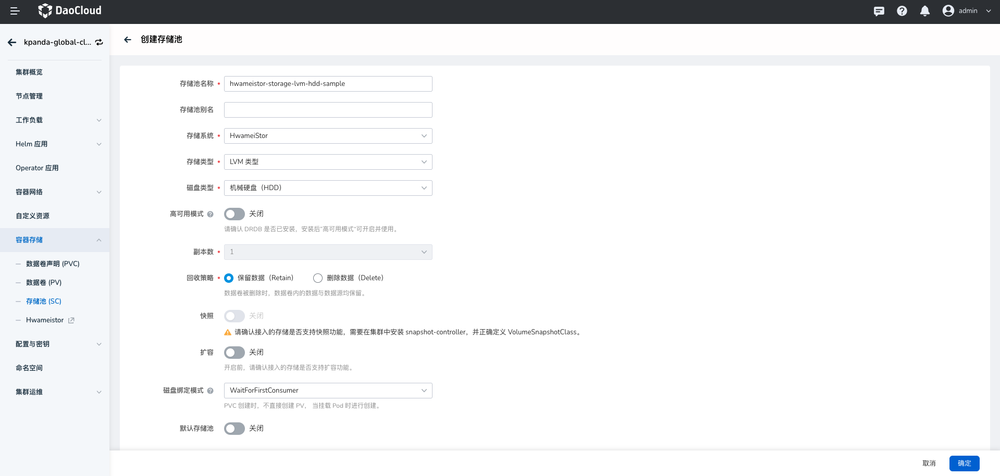
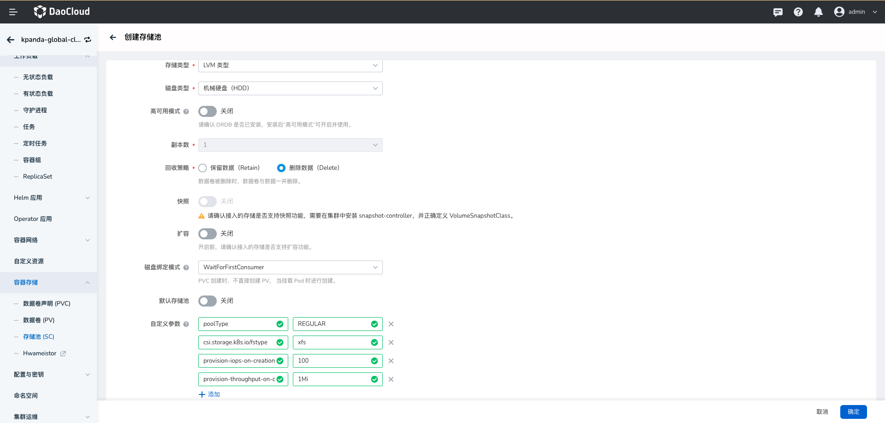
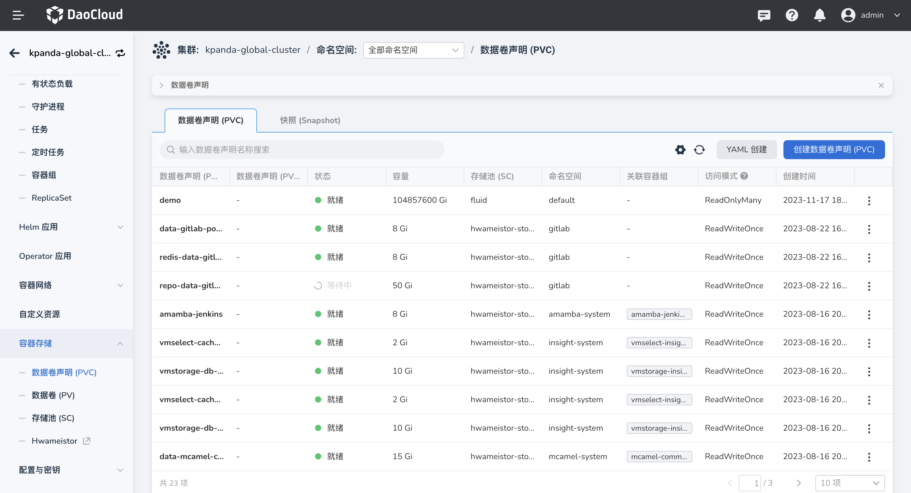
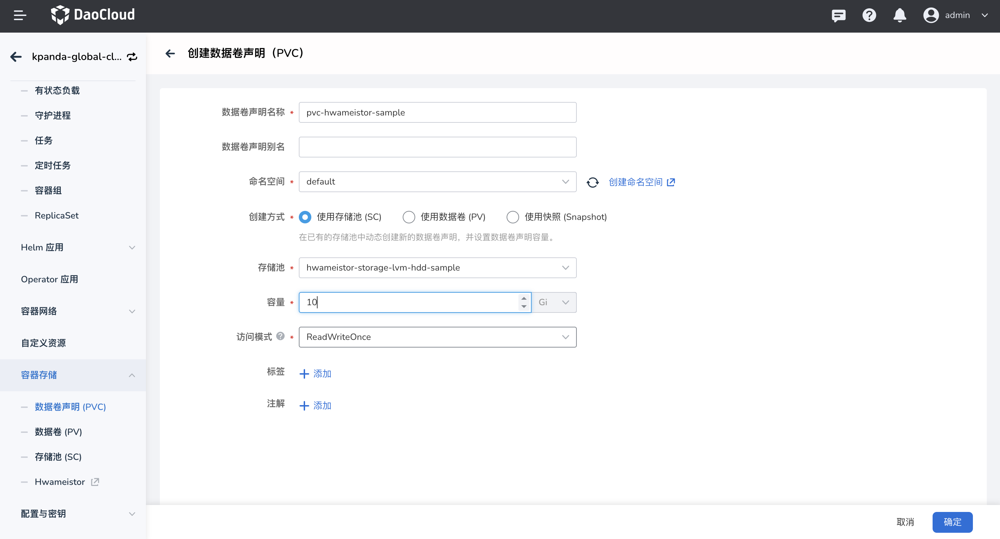
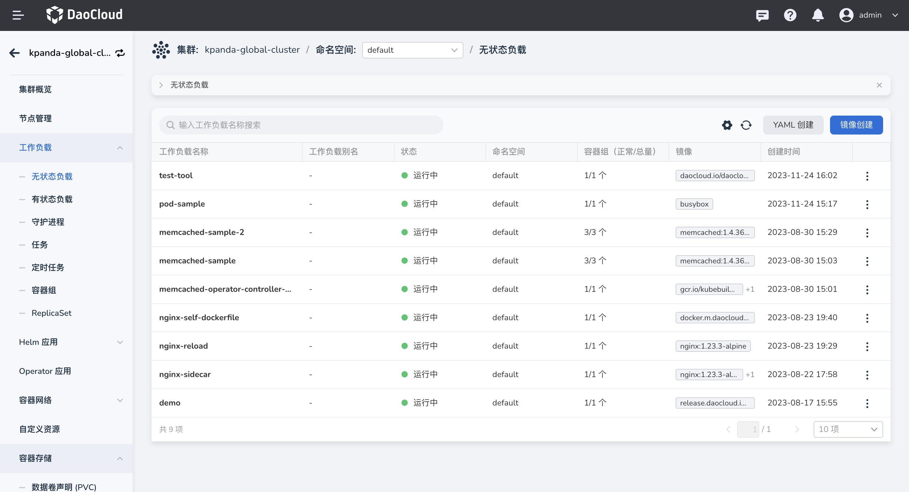
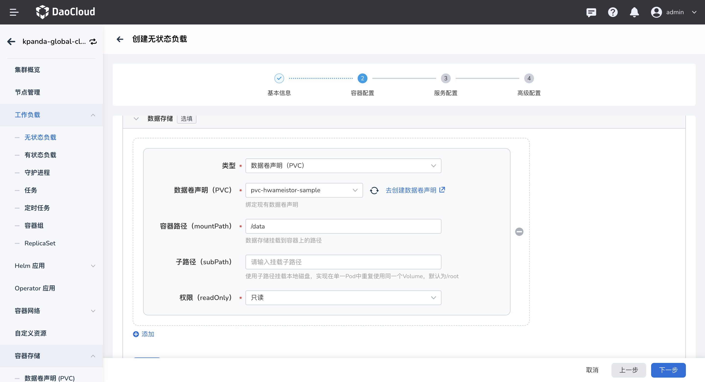
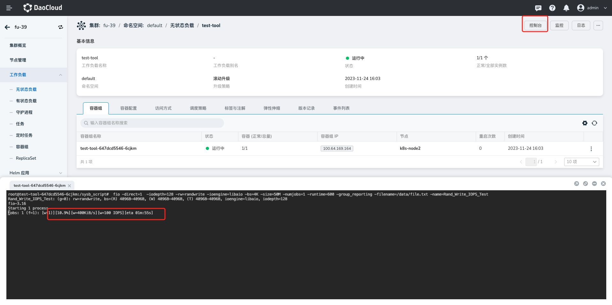

# 数据卷 IO 限速

在 HwameiStor 中，它允许用户指定 Kuberentes 集群上卷的最大 IOPS 和吞吐量。

请按照以下步骤创建具有最大 IOPS 和吞吐量的卷并创建工作负载来使用它。

## 前提条件

- 集群已经[安装 HwameiStor](../install/deploy-ui.md)

- cgroup v2 要求：

  - 操作系统发行版启用 cgroup v2

  - Linux 内核为 5.8 或更高版本

  更多信息, 请参见 [Kubernetes 官网](https://kubernetes.io/zh-cn/docs/concepts/architecture/cgroups/)。

## 操作步骤

### 使用 IOPS 和吞吐量参数创建新的 StorageClass

1. 进入`容器管理`模块，在集群列表中找到已安装 HwameiStor 的集群，点击该集群的名称。

2. 在左侧导航栏中选择 `容器存储` -> `存储池 (SC)` ，并点击左上角按钮`创建存储池(SC)`。

    

3. 进入创建存储池界面，特别注意填写以下参数，其他参数可参考[表单创建](../../../kpanda/user-guide/storage/sc.md)。

    - 名称：本示例输入`hwameistor-storage-lvm-hdd-sample` 。

    - 存储系统：选择 `HwameiStor`。

    - 存储类型：支持使用 `LVM 类型`、`裸辞盘类型`，本示例选择 `LVM 类型`。

    - 磁盘类型：支持 `HDD`、`SSD`，本示例选择 `HDD`。

    - 自定义参数：需要填写以下四个参数，

        - `poolType: REGULAR` ：指定存储池类型，暂时仅支持 `REGULAR`。

        - `csi.storage.k8s.io/fstype: xfs` ：指定所需的文件系统类型，不定义默认为 `ext4`。

        - `provision-iops-on-creation: "100"` ：指定创建时卷的最大 IOPS。

        - `provision-throughput-on-creation: 1Mi` ：指定创建时卷的最大吞吐量。
  
    
    

4. 点击`确定`，创建成功后返回 SC 列表界面。

### 使用 StorageClass 创建 PVC

1. 在左侧导航栏中选择 `容器存储` -> `数据卷声明 (PVC)` ，并点击左上角按钮`创建数据卷声明 (PVC)`。

    

2. 进入创建数据卷声明界面，填写以下参数。

    - 名称：本示例输入`pvc-hwameistor-sample` 。

    - 存储池：选择上述创建的 SC，名称为 `hwameistor-storage-lvm-hdd-sample`。

    - 容量：本示例输入`10`。

    - 访问模式：默认选中`ReadWriteMany`。

    

3. 点击`确定`，创建成功后返回 SC 列表界面。完成后，您可以创建 Deployment 来使用 PVC。

### 创建带有 PVC 的 Deployment

1. 在左侧导航栏中选择 `工作负载` -> `无状态负载` ，并点击左上角按钮`镜像创建`。

    

2. 需要注意可以填写以下参数：

    - image：本示例输入 `daocloud.io/daocloud/testtools:latest`。

    - 数据存储：

      - 类型：选择 `数据卷声明(PVC)`。

      - 数据卷声明（PVC）：选择 `pvc-hwameistor-sample`。

      - 容器路径（mountPath）：输入 `/data`。

    其余参数无特别要求。

    

3. 创建 Deployment 后，在详情界面点击 `控制台`，执行以下命令测试卷的 IOPS 和吞吐量：

    ```bash
    fio -direct=1  -iodepth=128 -rw=randwrite -ioengine=libaio -bs=4K -size=50M -numjobs=1 -runtime=600 -group_reporting -filename=/data/file.txt -name=Rand_Write_IOPS_Test
    ```

    预期会输出如下：

    

!!! note

    由于 cgroupv1 限制，最大 IOPS 和吞吐量的设置可能对非直接 IO 不生效。

## 如何更改数据卷的最大 IOPS 和吞吐量

最大 IOPS 和吞吐量在 StorageClass 的参数上指定，您不能直接更改它，因为它现在是不可变的。

与其他存储厂商不同的是，HwameiStor 是一个基于 Kubernetes 的存储解决方案，它定义了一组操作原语
基于 Kubernetes CRD。 这意味着您可以修改相关的 CRD 来更改卷的实际最大 IOPS 和吞吐量。

以下步骤显示如何更改数据卷的最大 IOPS 和吞吐量。

### 查找给定 PVC 对应的 LocalVolume CR

```console
$ kubectl get pvc pvc-sample

NAME             STATUS    VOLUME                                     CAPACITY   ACCESS MODES   STORAGECLASS                        AGE
demo             Bound     pvc-c354a56a-5cf4-4ff6-9472-4e24c7371e10   10Gi       RWO            hwameistor-storage-lvm-hdd          5d23h
pvc-sample       Bound     pvc-cac82087-6f6c-493a-afcd-09480de712ed   10Gi       RWO            hwameistor-storage-lvm-hdd-sample   5d23h

$ kubectl get localvolume

NAME                                       POOL                   REPLICAS   CAPACITY      USED       STATE   RESOURCE   PUBLISHED   FSTYPE   AGE
pvc-c354a56a-5cf4-4ff6-9472-4e24c7371e10   LocalStorage_PoolHDD   1          10737418240   33783808   Ready   -1         master      xfs      5d23h
pvc-cac82087-6f6c-493a-afcd-09480de712ed   LocalStorage_PoolHDD   1          10737418240   33783808   Ready   -1         master      xfs      5d23h
```

根据打印输出，PVC 的 LocalVolume CR 为 `pvc-cac82087-6f6c-493a-afcd-09480de712ed`。

### 修改 LocalVolume CR

```bash
kubectl edit localvolume pvc-cac82087-6f6c-493a-afcd-09480de712ed
```

在编辑器中，找到 `spec.volumeQoS` 部分并修改 `iops` 和 `throughput` 字段。 顺便说一下，空值意味着没有限制。

最后，保存更改并退出编辑器。设置将在几秒钟后生效。

**注意**：将来，一旦 Kubernetes 支持[它](https://github.com/kubernetes/enhancements/tree/master/keps/sig-storage/3751-volume-attributes-class#motivation)，我们将允许用户直接修改卷的最大 IOPS 和吞吐量。

## 如何检查数据卷的实际 IOPS 和吞吐量

HwameiStor 使用 [cgroupv1](https://www.kernel.org/doc/Documentation/cgroup-v1/blkio-controller.txt)
来限制数据卷的 IOPS 和吞吐量，因此您可以使用以下命令来检查数据卷的实际 IOPS 和吞吐量。

```
$ lsblk
NAME            MAJ:MIN RM   SIZE RO TYPE MOUNTPOINT
sda               8:0    0   160G  0 disk
├─sda1            8:1    0     1G  0 part /boot
└─sda2            8:2    0   159G  0 part
  ├─centos-root 253:0    0   300G  0 lvm  /
  ├─centos-swap 253:1    0   7.9G  0 lvm
  └─centos-home 253:2    0 101.1G  0 lvm  /home
sdb               8:16   0   100G  0 disk
├─LocalStorage_PoolHDD-pvc--cac82087--6f6c--493a--afcd--09480de712ed
                253:3    0    10G  0 lvm  /var/lib/kubelet/pods/3d6bc980-68ae-4a65-a1c8-8b410b7d240f/v
└─LocalStorage_PoolHDD-pvc--c354a56a--5cf4--4ff6--9472--4e24c7371e10
                253:4    0    10G  0 lvm  /var/lib/kubelet/pods/521fd7b4-3bef-415b-8720-09225f93f231/v
sdc               8:32   0   300G  0 disk
└─sdc1            8:33   0   300G  0 part
  └─centos-root 253:0    0   300G  0 lvm  /
sr0              11:0    1   973M  0 rom

$ cat /sys/fs/cgroup/blkio/blkio.throttle.read_iops_device
253:3 100

$ cat /sys/fs/cgroup/blkio/blkio.throttle.write_iops_device
253:3 100

$ cat /sys/fs/cgroup/blkio/blkio.throttle.read_bps_device
253:3 1048576

$ cat /sys/fs/cgroup/blkio/blkio.throttle.write_bps_device
253:3 1048576
```
