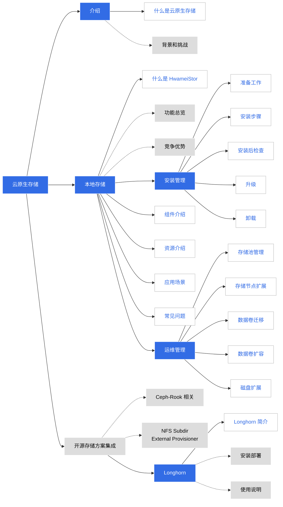

---
hide:
  - toc
---
# 云原生存储

云原生代表了容器化、碎片化的趋势，存储是持久化数据的媒介。

DCE 5.0 全面支持云原生存储，兼容并蓄各类容器化存储解决方案。
目前除了 DaoCloud 完全自研并开源的 [HwameiStor 本地存储](./hwameistor/intro/what.md)之外，还可以从应用商店，按需安装众多开源存储解决方案：

- Ceph Rook
- NFS Subdir External Provisioner
- Longhorn

存储文档施工一览：

!!! tip

    上图中的蓝色文字可点击跳转，灰底表示正在制作中。