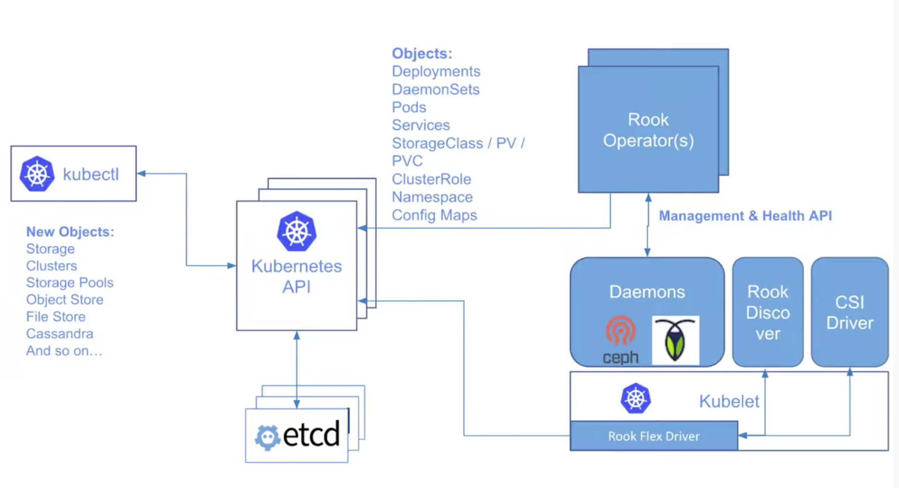
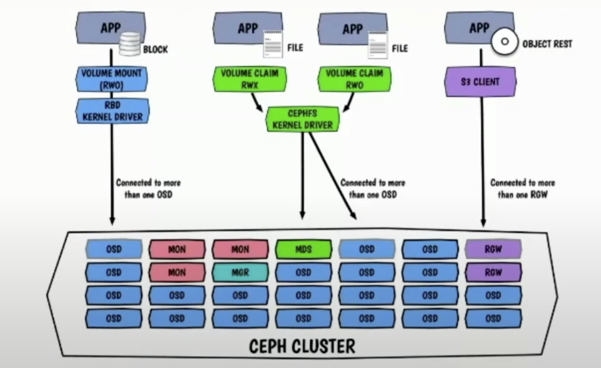
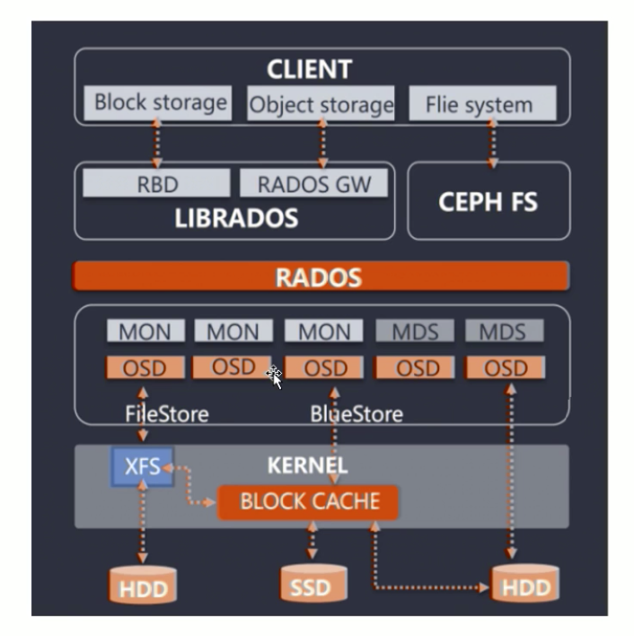
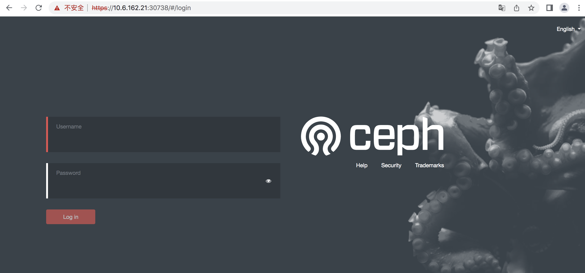
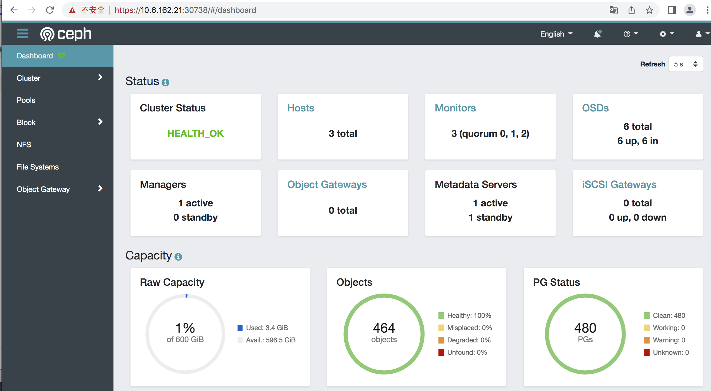
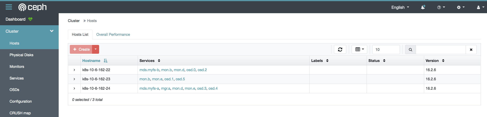
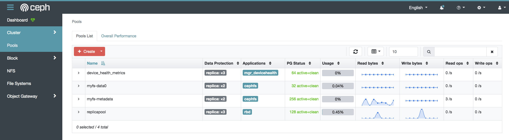
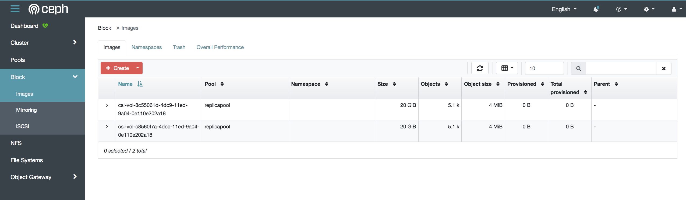
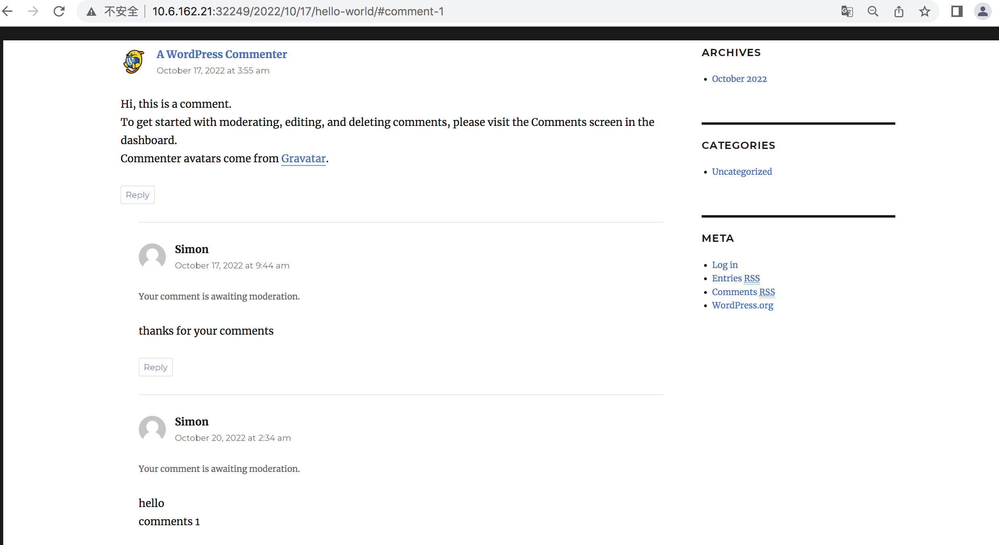

# Rook-ceph 云原生存储解决方案

## 方案简介

Rook 是一个开源云原生存储编排器，为各种存储解决方案（存储提供商）提供平台、框架和支持并与云原生环境原生集成。

Rook支持多个存储提供商。它将分布式存储软件转变为自我管理、自我扩展和自我修复的存储服务。它通过自动执行存储提供商的部署、引导、配置、预配、扩展、升级、迁移、灾难恢复、监视和资源管理来实现此目的。当与 Kubernetes 一起使用时，rook 使用 Kubernetes 调度和编排平台提供的功能，为调度、生命周期管理、资源管理、安全性、监控和用户体验提供无缝体验。



Rook管理


CSI 存储资源调配


Ceph 数据路径



Ceph 是一种分布式、可扩展的开源存储解决方案，适用于块、对象和共享文件系统存储。Ceph 在过去几年中已经发展成为开源分布式存储解决方案的标准，在大中型企业中进行了多年的生产部署。



Ceph 存储池， 归置组 （PG）， 对象， OSD


Ceph RBD 如何工作？


## 解决方案验证

### 测试环境

本次测试使用四个虚拟机节点来部署一个 Kubernetes 集群：1 个主节点 + 3 个工作节点，kubelet 版本为 1.23.6。

```
[root@k8s-10-6-162-21 ~]# kubectl get no
NAME                            STATUS           ROLES                              AGE         VERSION
k8s-10-6-162-21                 Ready            control-plane,master               19d         v1.23.6
k8s-10-6-162-22                 Ready            <none>                             19d         v1.23.6
k8s-10-6-162-23                 Ready            <none>                             19d         v1.23.6
k8s-10-6-162-24                 Ready            <none>                             13d         v1.23.6
```

### Rook / Ceph 部署

#### Github源码克隆：

```
[root@k8s-10-6-162-21 ~]# git clone https://github.com/rook/rook.git

[root@k8s-10-6-162-21 ~]# ls
anaconda-ks.cfg calico.yaml rook rook-ceph-image rook-ceph-image.zip

[root@k8s-10-6-162-21 rook]# git branch
master
* remotes/origin/release-1.7

[root@k8s-10-6-162-21 ceph]# cd /root/rook/cluster/examples/kubernetes/ceph

[root@k8s-10-6-162-21 ceph]# ls
ceph-client.yaml create-external-cluster-resources.py flex object-openshift.yaml rgw-external.yaml
cluster-external-management.yaml create-external-cluster-resources.sh flex-migrator.yaml object-test.yaml scc.yaml
cluster-external.yaml csi images.txt object-user.yaml storageclass-bucket-delete.yaml
cluster-on-local-pvc.yaml dashboard-external-https.yaml import-external-cluster.sh object.yaml storageclass-bucket-retain.yaml
cluster-on-pvc.yaml dashboard-external-http.yaml monitoring operator-openshift.yaml test-data
cluster-stretched-aws.yaml dashboard-ingress-https.yaml nfs-test.yaml operator.yaml toolbox-job.yaml
cluster-stretched.yaml dashboard-loadbalancer.yaml nfs.yaml osd-purge.yaml toolbox.yaml
cluster-test.yaml direct-mount.yaml object-bucket-claim-delete.yaml pool-ec.yaml volume-replication-class.yaml
cluster.yaml filesystembak.yaml object-bucket-claim-retain.yaml pool-mirrored.yaml volume-replication.yaml
common-external.yaml filesystem-ec.yaml object-ec.yaml pool-test.yaml
common-second-cluster.yaml filesystem-mirror.yaml object-external.yaml pool.yaml
common.yaml filesystem-test.yaml object-multisite-pull-realm.yaml pre-k8s-1.16
crds.yaml filesystem.yaml object-multisite.yaml rbdmirror.yaml
```

#### 部署 operator, crds, and parameters:

```
[root@k8s-10-6-162-21 ceph]# kubectl create -f crds.yaml -f common.yaml -f operator.yaml

[root@k8s-10-6-162-21 ceph]# kubectl get crd | grep ceph
cephblockpools.ceph.rook.io                           2022-10-14T02:22:34Z
cephclients.ceph.rook.io                              2022-10-14T02:22:34Z
cephclusters.ceph.rook.io                             2022-10-14T02:22:35Z
cephfilesystemmirrors.ceph.rook.io                    2022-10-14T02:22:35Z
cephfilesystems.ceph.rook.io                          2022-10-14T02:22:35Z
cephnfses.ceph.rook.io                                2022-10-14T02:22:35Z
cephobjectrealms.ceph.rook.io                         2022-10-14T02:22:35Z
cephobjectstores.ceph.rook.io                         2022-10-14T02:22:35Z
cephobjectstoreusers.ceph.rook.io                     2022-10-14T02:22:35Z
cephobjectzonegroups.ceph.rook.io                     2022-10-14T02:22:35Z
cephobjectzones.ceph.rook.io                          2022-10-14T02:22:35Z
cephrbdmirrors.ceph.rook.io                           2022-10-14T02:22:35Z
objectbucketclaims.objectbucket.io                    2022-10-14T02:22:35Z
objectbuckets.objectbucket.io                         2022-10-14T02:22:35Z
volumes.rook.io                                       2022-10-14T02:22:35Z
```

#### 部署 cluster and toolbax:

```
[root@k8s-10-6-162-21 ceph]# kubectl create -f cluster.yaml

[root@k8s-10-6-162-21 ceph]# kubectl create -f toolbox.yaml

[root@k8s-10-6-162-21 ceph]# kubectl get po -n rook-ceph -owide
NAME                                                                                                                                READY       STATUS               RESTARTS                       AGE IP                 NODE                         NOMINATED NODE      READINESS       GATES
csi-cephfsplugin-bmbtc                                                                                              3/3              Running               6 (4d1h ago)                   7d7h                    10.6.162.24              k8s-10-6-162-24          <none>               <none>
csi-cephfsplugin-provisioner-5c8b6d6f4-hvfg6                6/6              Running               678 (38m ago)               7d7h                   10.244.56.106         k8s-10-6-162-23          <none>               <none>
csi-cephfsplugin-provisioner-5c8b6d6f4-w6snr                6/6              Running               545 (38m ago)               4d1h                    10.244.169.249      k8s-10-6-162-22          <none>               <none>
csi-cephfsplugin-r87qt                                      3/3              Running               6 (4d1h ago)                   7d7h                    10.6.162.23              k8s-10-6-162-23          <none>               <none>
csi-cephfsplugin-xqrmr                                      3/3              Running               6 (4d1h ago)                   7d7h                    10.6.162.22              k8s-10-6-162-22          <none>               <none>
csi-rbdplugin-mcpm6                                         3/3              Running               6 (4d1h ago)                   7d7h                    10.6.162.22              k8s-10-6-162-22          <none>               <none>
csi-rbdplugin-pj4cc                                         3/3              Running               6 (4d2h ago)                  7d7h                     10.6.162.23             k8s-10-6-162-23           <none>               <none>
csi-rbdplugin-provisioner-8564cfd44-mnjr8                   6/6              Running               665 (38m ago)              4d8h                     10.244.56.102       k8s-10-6-162-23            <none>              <none>
csi-rbdplugin-provisioner-8564cfd44-tgzc8                   6/6              Running              545 (37m ago)               4d1h                      10.244.169.248    k8s-10-6-162-22            <none>              <none>
csi-rbdplugin-tnpbc                                         3/3              Running              6 (4d1h ago)                    7d7h                      10.6.162.24            k8s-10-6-162-24            <none>              <none>
rook-ceph-crashcollector-k8s-10-6-162-22-5c4444c7bb-pd6tf   1/1              Running              0                                          27h                        10.244.169.208    k8s-10-6-162-22            <none>              <none>
rook-ceph-crashcollector-k8s-10-6-162-23-775d89c75-kgnzq    1/1              Running              2 (4d2h ago)                   7d7h                      10.244.56.105       k8s-10-6-162-23            <none>              <none>
rook-ceph-crashcollector-k8s-10-6-162-24-6cc87876c6-tk6q2   1/1              Running              0                                          27h                       10.244.49.18          k8s-10-6-162-24            <none>              <none>
rook-ceph-mds-myfs-a-94f74bd56-k2gt7                        1/1              Running              0                                          27h                        10.244.49.22         k8s-10-6-162-24            <none>             <none>
rook-ceph-mds-myfs-b-5679797bbd-jr8gt                       1/1              Running               69 (38m ago)                  27h                        10.244.169.209    k8s-10-6-162-22            <none>             <none>
rook-ceph-mgr-a-5b69d56b4d-6z87x                            1/1              Running               0                                         2d7h                      10.244.49.9           k8s-10-6-162-24            <none>              <none>
rook-ceph-mon-a-7589d48f7d-lgps2                            1/1              Running               25 (3h44m ago)             21h                        10.244.56.122       k8s-10-6-162-23            <none>              <none>
rook-ceph-mon-b-6577cdc487-fk564                            1/1              Running                161 (3h14m ago)            7d7h                     10.244.169.244    k8s-10-6-162-22             <none>              <none>
rook-ceph-mon-d-66bdbd9dc-pn6wc                             1/1              Running               83 (38m ago)                  4d                           10.244.49.61         k8s-10-6-162-24            <none>              <none>
rook-ceph-operator-866c96498c-mm2xd                         1/1              Running                4 (4d1h ago)                   7d7h                       10.244.169.242    k8s-10-6-162-22            <none>              <none>
rook-ceph-osd-0-6d774dcf99-6qggj                            1/1              Running               167 (38m ago)                7d3h                       10.244.169.245    k8s-10-6-162-22            <none>             <none>
rook-ceph-osd-1-7f7c599677-qx4sh                            1/1              Running               26 (4d2h ago)                 7d3h                       10.244.56.101       k8s-10-6-162-23            <none>            <none>
rook-ceph-osd-2-7564c58d96-bknjf                            1/1              Running               125 (35m ago)                7d3h                        10.244.169.243   k8s-10-6-162-22            <none>             <none>
rook-ceph-osd-3-5599b7bdcb-wmdkx                            1/1              Running               0                                         4d1h                         10.244.49.51       k8s-10-6-162-24            <none>              <none>
rook-ceph-osd-4-7c6d79cdff-4fzdc                            1/1              Running                0                                         4d1h                         10.244.49.55      k8s-10-6-162-24            <none>              <none>
rook-ceph-osd-5-ffb7b5ff7-phssl                             1/1              Running               26 (4d2h ago)                 7d3h                        10.244.56.103    k8s-10-6-162-23             <none>             <none>
rook-ceph-osd-prepare-k8s-10-6-162-22-kjwzt                 0/1              Completed          0                                          5h34m                    10.244.169.222 k8s-10-6-162-22              <none>             <none>
rook-ceph-osd-prepare-k8s-10-6-162-23-fngbr                 0/1              Completed          0                                          5h34m                   10.244.56.67       k8s-10-6-162-23            <none>              <none>
rook-ceph-osd-prepare-k8s-10-6-162-24-p7c28                 0/1              Completed          0                                          5h34m                   10.244.49.27       k8s-10-6-162-24            <none>              <none>
rook-ceph-tools-55f548895f-8pdhm                            1/1              Running               0       4d1h                        10.244.56.107      k8s-10-6-162-23           <none>              <none>
```


#### 部署 dashboard:

```
[root@k8s-10-6-162-21 ~]# kubectl apply -f dashboard-external-https.yaml

[root@k8s-10-6-162-21 ~]# kubectl get svc -n rook-ceph
NAME                                           TYPE CLUSTER-IP EXTERNAL-IP PORT(S) AGE
csi-cephfsplugin-metrics                       ClusterIP 10.111.92.191 <none> 8080/TCP,8081/TCP 8d
csi-rbdplugin-metrics                          ClusterIP 10.106.136.163 <none> 8080/TCP,8081/TCP 8d
rook-ceph-mgr                                  ClusterIP 10.97.170.29 <none> 9283/TCP 8d
rook-ceph-mgr-dashboard                        ClusterIP 10.103.18.81 <none> 8443/TCP 8d
rook-ceph-mgr-dashboard-external-https         NodePort 10.111.121.36 <none> 8443:30738/TCP 8d
rook-ceph-mon-a                                ClusterIP 10.107.216.105 <none> 6789/TCP,3300/TCP 8d
rook-ceph-mon-b                                ClusterIP 10.100.168.72 <none> 6789/TCP,3300/TCP 8d
rook-ceph-mon-d                                ClusterIP 10.101.56.41 <none> 6789/TCP,3300/TCP 5d16h
```







#### 用于 Ceph 存储管理的 Rook 工具操作

```
[root@k8s-10-6-162-21 ceph]# kubectl exec -it rook-ceph-tools-55f548895f-fzbq2 -n rook-ceph -- bash

[root@rook-ceph-tools-55f548895f-8pdhm /]# ceph -s
cluster:
id: d65486e5-a8c3-4ca5-8ff6-9daddfc0f6c4
health: HEALTH_OK

services:
mon: 3 daemons, quorum a,b,d (age 71m)
mgr: a(active, since 30h)
mds: 1/1 daemons up, 1 hot standby
osd: 6 osds: 6 up (since 68m), 6 in (since 7d)

data:
volumes: 1/1 healthy
pools: 4 pools, 480 pgs
objects: 464 objects, 1009 MiB
usage: 3.8 GiB used, 596 GiB / 600 GiB avail
pgs: 480 active+clean

io:
client: 1.5 KiB/s rd, 2 op/s rd, 0 op/s wr


[root@rook-ceph-tools-55f548895f-8pdhm /]# ceph mgr services
{
"dashboard": "https://10.244.49.9:8443/",
"prometheus": "http://10.244.49.9:9283/"
}


[root@rook-ceph-tools-55f548895f-8pdhm /]# ceph df
--- RAW STORAGE ---
CLASS SIZE AVAIL USED RAW USED %RAW USED
hdd 600 GiB 596 GiB 3.8 GiB 3.8 GiB 0.63
TOTAL 600 GiB 596 GiB 3.8 GiB 3.8 GiB 0.63

--- POOLS ---
POOL ID PGS STORED OBJECTS USED %USED MAX AVAIL
device_health_metrics 1 64 0 B 0 0 B 0 189 GiB
replicapool 4 128 880 MiB 290 2.6 GiB 0.45 189 GiB
myfs-metadata 7 256 1.5 MiB 25 3.0 MiB 0 283 GiB
myfs-data0 8 32 115 MiB 149 231 MiB 0.04 283 GiB


[root@rook-ceph-tools-55f548895f-8pdhm /]# ceph osd status
ID HOST USED AVAIL WR OPS WR DATA RD OPS RD DATA STATE
0 k8s-10-6-162-22 524M 99.4G 0 0 0 89 exists,up
1 k8s-10-6-162-23 677M 99.3G 0 0 0 0 exists,up
2 k8s-10-6-162-22 501M 99.5G 0 0 0 0 exists,up
3 k8s-10-6-162-24 694M 99.3G 0 0 1 15 exists,up
4 k8s-10-6-162-24 744M 99.2G 0 0 0 0 exists,up
5 k8s-10-6-162-23 747M 99.2G 0 0 0 0 exists,up
```


#### Ceph 存储配置

创建 RBD 池 & pg：

```
[root@rook-ceph-tools-55f548895f-8pdhm /]# ceph osd pool create replicapool 128

[root@k8s-10-6-162-21 kubernetes]# ceph osd pool application enable replicapool rbd

Creating storage class:

[root@k8s-10-6-162-21 rbd]# pwd
/root/rook/deploy/examples/csi/rbd
[root@k8s-10-6-162-21 rbd]# kubectl apply -f storageclass.yaml

[root@k8s-10-6-162-21 ~]# kubectl get sc
NAME                       PROVISIONER RECLAIMPOLICY VOLUMEBINDINGMODE ALLOWVOLUMEEXPANSION AGE
rook-ceph-block            rook-ceph.rbd.csi.ceph.com Delete Immediate true 5d20h
rook-cephfs                rook-ceph.cephfs.csi.ceph.com Delete Immediate true 2d17h
```

### 应用程序部署验证

#### 在RBD上部署Mysql / WordPress：

```
[root@k8s-10-6-162-21 examples]# cd kubernetes/
ceph mysql2-cephfs.yaml mysql.yaml README.md wordpress.yaml
[root@k8s-10-6-162-21 kubernetes]# pwd
/root/rook/cluster/examples/kubernetes
[root@k8s-10-6-162-21 kubernetes]# kubectl apply -f mysql.yaml 
[root@k8s-10-6-162-21 kubernetes]# kubectl apply -f wordpress.yaml 
```

#### 在 Cephfs 上部署 Mysql：

```
[root@k8s-10-6-162-21 kubernetes]# kubectl apply -f mysql2-cephfs.yaml 

[root@k8s-10-6-162-21 kubernetes]# kubectl get po
NAME                                                                   READY STATUS RESTARTS AGE
nginx-85b98978db-gbjtb                             1/1 Running 0 6d18h
nginx-85b98978db-rbprt                             1/1 Running 0 6d18h
nginx-85b98978db-w5m24                             1/1 Running 0 6d18h
wordpress-b98c66fff-2bh8n                          1/1 Running 5 (6d17h ago) 6d17h
wordpress-mysql-79966d6c5b-wqv9b                   1/1 Running 0 6d17h
wordpress-mysql2-6857bbcf7d-2rl9w                  1/1 Running 0 3d19h


[root@k8s-10-6-162-21 kubernetes]# kubectl get svc
NAME TYPE CLUSTER-IP EXTERNAL-IP PORT(S) AGE
kubernetes                           ClusterIP 10.96.0.1 <none> 443/TCP 22d
nginx                                NodePort 10.107.222.243 <none> 80:31090/TCP 21d
wordpress                            LoadBalancer 10.109.11.61 <pending> 80:32249/TCP 6d23h
wordpress-mysql                      ClusterIP None <none> 3306/TCP 6d23h
wordpress-mysql2                     ClusterIP None <none> 3306/TCP 3d19h


[root@rook-ceph-tools-55f548895f-8pdhm /]# ceph osd pool ls
device_health_metrics
replicapool
myfs-metadata
myfs-data0
```






```
[root@k8s-10-6-162-21 kubernetes]# kubectl get pv,pvc
NAME                                                                                                                                  CAPACITY        ACCESS MODES RECLAIM POLICY STATUS CLAIM STORAGECLASS REASON AGE
persistentvolume/pvc-19515505-cd8f-41d1-ae91-bb42c3eb64f3              20Gi                    RWO Delete Bound default/mysql-pv-claim2 rook-cephfs 3d20h
persistentvolume/pvc-7647bc80-febc-4299-a62a-8446d2c364c6          20Gi                    RWO Delete Bound default/wp-pv-claim rook-ceph-block 6d23h
persistentvolume/pvc-b07feec8-adc8-4e22-abd6-177b5db4fdb1              20Gi                    RWO Delete Bound default/mysql-pv-claim rook-ceph-block 7d

NAME                                                                           STATUS VOLUME CAPACITY ACCESS MODES STORAGECLASS AGE
persistentvolumeclaim/mysql-pv-claim             Bound pvc-b07feec8-adc8-4e22-abd6-177b5db4fdb1 20Gi RWO rook-ceph-block 7d
persistentvolumeclaim/mysql-pv-claim2          Bound pvc-19515505-cd8f-41d1-ae91-bb42c3eb64f3 20Gi RWO rook-cephfs 3d20h
persistentvolumeclaim/wp-pv-claim                   Bound pvc-7647bc80-febc-4299-a62a-8446d2c364c6 20Gi RWO rook-ceph-block 6d23h
```

My blog on wordpress/mysql:


Comments on my blog:


Data Persistence Validation

Delete and restart mysql / wordpress pods:

```
[root@k8s-10-6-162-21 kubernetes]# kubectl delete po wordpress-mysql-79966d6c5b-wc6fs
```




