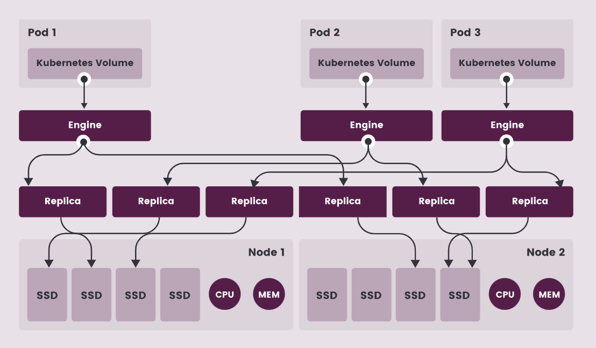

# Longhorn 存储方案

DCE 5.0 支持众多第三方存储方案，我们针对 Longhorn 进行了详细的测试，并最终将其作为 Addon 集成了应用商店中。
以下是对 Longhorn 的简单调研和测评报告。

Longhorn 是一个轻量级的云原生 Kubernetes 分布式存储平台，可以在任意基础设施上运行。
Longhorn 与 DCE 可以结合使用部署高可用性持久化块存储。

1. 设计与架构

    - 控制平面：Longhorn Manager 以DaemonSet 部署
    - 数据平面：Longhorn Engine 是 storage controller 可以有多个 replicas

    

1. Longhorn 存储卷

    - 支持存储卷的 Thin provisioning
    - 存储卷维护模式 maintenance mode 用于snapshot reverting operation操作
    - 每一个存储卷的 replica 包含多个快照 snapshots.
    - 默认的存储卷的 replica 数量可以在 settings 设置. 当存储卷被挂载以后 replica 数量可以通过UI改变。
    - Longhorn 是一个 crash-consistent 块存储方案，在创建快照 snapshot 之前会自动先同步 sync 命令

    

1. 数据备份及外部二级存储

    - 用于备份的 NFS/S3 兼容的外部二级存储是独立于 Kubernetes 集群以外的。即使在 Kubernetes 集群不可用的情况下数据依然可用
    - Longhorn 也会将存储卷同步到灾备集群（DR）的二级存储用于灾难数据恢复
    - 备份是多个快照数据的扁平化的集合。
    - 支持连续重复快照及备份。
    - 支持 CSI 存储卷的 Clone

    

1. 高可用 High Availability

    - 支持 Replica 自动平衡设置
    - 支持 data locality setting：使用存储卷的 pod 运行的节点上至少有一个 replica 副本
    - 支持显示节点存储空间使用。
    - 支持 Kubernetes Cluster Autoscaler (Experimental)
    - 支持存储卷意外卸载后的的自动恢复
    - 支持集群节点失效后的存储卷的自动恢复

1. 监控 Monitoring

    - 支持 Prometheus and Grafana 监控 Longhorn
    - Longhorn metrics 可以被整合进 DCE 监控系统
    - 支持 Kubelete Metrics 监控
    - 支持 Longhorn 告警策略

1. 高级功能

    - 支持 Backing Image
    - 支持 Orphaned Replica Directories
    - 支持 DCE 集群恢复：集群所有存储卷的恢复
    - 支持多写操作 ReadWriteMany (RWX) workloads （NFSv4）
    - 支持 Longhorn Volume 作为 iSCSI Target
