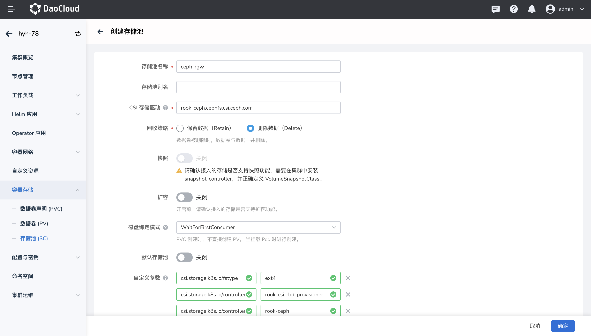

# 创建 Ceph 文件存储(CephFS) 存储类

## 前提条件

参考文档[通过应用商店部署 Rook-ceph](rook-ceph.md)通过应用商店安装 rook-ceph、rook-ceph-cluster。

## 操作步骤

1. 在集群列表中点击目标集群的名称，然后在左侧导航栏点击`容器存储`->`存储池(SC)`->`创建存储池(SC)`。

2. 填写基本信息，参数说明如下：

    - 存储池名称、CSI 驱动、回收策略、磁盘绑定模式在创建后不可修改。
    - CSI 存储驱动：输入 `rook-ceph.cephfs.csi.ceph.com`。
    - 自定义参数定义如下内容：

    | clusterID | rook-ceph | 运行 rook-ceph 集群的命名空间 |
    | --- | --- | --- |
    | csi.storage.k8s.io/fstype | ext4 | 指定卷的文件系统类型。 如果未指定，csi-provisioner 将默认设置为“ext4”，官方文档不推荐使用”xfs” |
    | csi.storage.k8s.io/controller-expand-secret-name | rook-csi-rbd-provisioner | 创建卷时CSI provisioner使用的Kubernetes Secret的名称 |
    | csi.storage.k8s.io/controller-expand-secret-namespace | rook-ceph | 上述Secret所在的命名空间 |
    | csi.storage.k8s.io/node-stage-secret-name | rook-csi-cephfs-node | 执行卷扩展操作时CSI控制器使用的Secret的名称 |
    | csi.storage.k8s.io/node-stage-secret-namespace | rook-ceph | 执行卷扩展操作时Secret所在的命名空间 |
    | csi.storage.k8s.io/provisioner-secret-name | rook-csi-cephfs-provisioner | 节点上卷挂载操作时CSI节点插件使用的Secret的名称 |
    | csi.storage.k8s.io/provisioner-secret-namespace | rook-ceph | 节点上卷挂载操作时Secret所在的命名空间 |
    | fsName | ceph-filesystem | 定义卷的 CephFS 文件系统名称 |
    | pool | ceph-filesystem-data0 | 定义卷的 Ceph 池名称 |

    

    

3. 填写完点击 `确定` 即可创建成功
