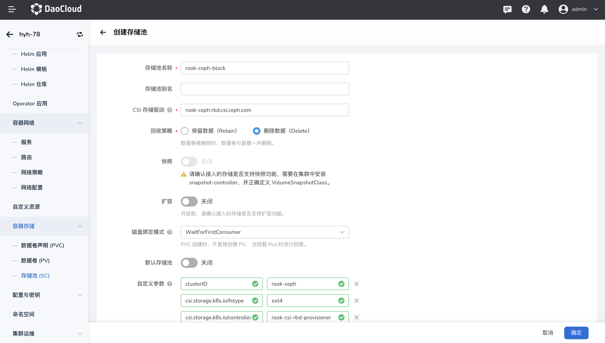
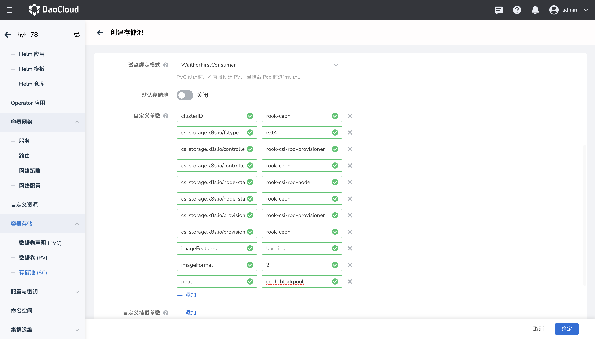

# 创建 Ceph 块存储(RBD) 存储类

## 前提条件

参考文档[通过应用商店部署 Rook-ceph](rook-ceph.md)通过应用商店安装 rook-ceph、rook-ceph-cluster。

## 操作步骤

1. 在集群列表中点击目标集群的名称，然后在左侧导航栏点击`容器存储`->`存储池(SC)`->`创建存储池(SC)`。

2. 填写基本信息，参数说明如下：

    - 存储池名称、CSI 驱动、回收策略、磁盘绑定模式在创建后不可修改。
    - CSI 存储驱动：输入 `rook-ceph.rbd.csi.ceph.com`。
    - 自定义参数定义如下内容：

    | 参数 | 值 | 说明 |
    | --- | --- | --- |
    | clusterID | rook-ceph | 运行 rook-ceph 集群的命名空间。 |
    | csi.storage.k8s.io/fstype | ext4 | 指定卷的文件系统类型。 如果未指定，csi-provisioner 将默认设置为“ext4”，官方文档不推荐使用”xfs”。 |
    | csi.storage.k8s.io/controller-expand-secret-name | rook-csi-rbd-provisioner | 指定了执行卷扩展操作时 CSI 控制器使用的 Secret 的名称 |
    | csi.storage.k8s.io/controller-expand-secret-namespace | rook-ceph | 指定了执行卷扩展操作时 Secret 所在的命名空间 |
    | csi.storage.k8s.io/node-stage-secret-name | rook-csi-rbd-node | 指定了节点上卷挂载操作时 CSI 节点插件使用的 Secret 的名称 |
    | csi.storage.k8s.io/node-stage-secret-namespace | rook-ceph | 指定了节点上卷挂载操作时 Secret所在的命名空间 |
    | csi.storage.k8s.io/provisioner-secret-name | rook-csi-rbd-provisioner | 指定了创建卷时 CSI provisioner使用的Kubernetes Secret 的名称 |
    | csi.storage.k8s.io/provisioner-secret-namespace | rook-ceph | 指定了上述 Secret 所在的命名空间 |
    | imageFeatures | layering | 指定创建的块设备（block device）支持的特性。layering 是其中一种特性，它允许块设备支持快照功能。适用于 imageFormat 为 "2” 的情况。 |
    | imageFormat | 2 | Ceph块存储的映像（image）格式，默认为 2，且是推荐的格式，它支持许多高级特性，如快照、克隆和动态调整大小等。 |
    | pool | ceph-blockpool | 定义 Ceph 集群存储池的名称，将被用于存储数据。 |

    

    

3. 填写完点击 `确定` 即可创建成功。
