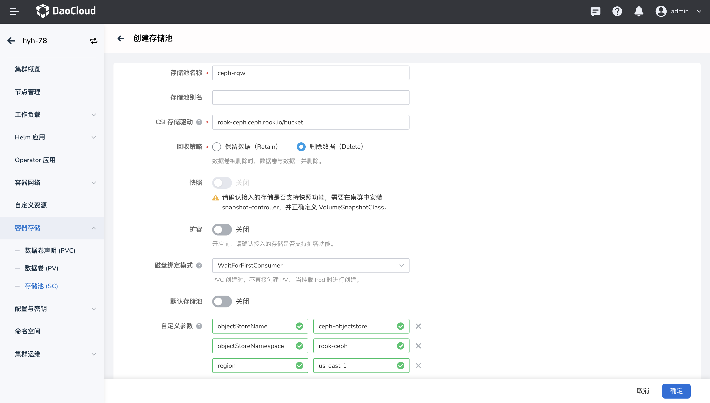

# 创建 Ceph 对象存储(RGW) 存储类

## 前提条件

参考文档[通过应用商店部署 Rook-ceph](rook-ceph.md)通过应用商店安装 rook-ceph、rook-ceph-cluster。

## 操作步骤

1. 在集群列表中点击目标集群的名称，然后在左侧导航栏点击`容器存储`->`存储池(SC)`->`创建存储池(SC)`。

2. 填写基本信息，参数说明如下：

    - 存储池名称、CSI 驱动、回收策略、磁盘绑定模式在创建后不可修改。
    - CSI 存储驱动：输入 `rook-ceph.ceph.rook.io/bucket`。
    - 自定义参数定义如下内容：

    | 参数 | 值 | 说明 |
    | --- | --- | --- |
    | objectStoreName | ceph-objectstore | 指定对象存储的名称 |
    | objectStoreNamespace | rook-ceph | 指定对象存储实例所在的Kubernetes命名空间 |
    | region | us-east-1 | 通常用于指定对象存储实例的地理区域 |

    

3. 填写完点击 `确定` 即可创建成功。
