---
hide:
  - navigation
---

# 企业卓越架构

[下载 PDF](./excellent.pdf)

相比于传统 IDC 环境，云计算的基础设施和服务在不断快速迭代和演进，对用户而言，在上云、用云、管云过程中持续维持良好的云上架构变得极具挑战。
对云上应用来说，稳定、安全、性能、成本是架构设计中最通用领域的抽象，也是组织层面最需要关注的几个维度。

道客基于多年服务各行各业客户的经验总结，将 IT 架构设计最佳实践总结为一系列的方法论和设计原则，
形成道客卓越架构框架（DaoCloud Well-Architected Framework），以帮助用户构建良好直至卓越的云上架构。

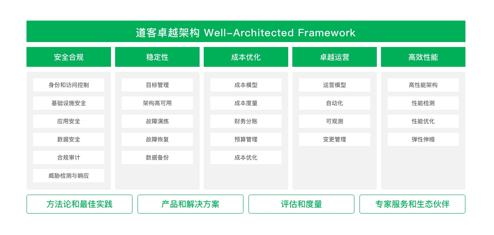

道客卓越架构包含以下五个最佳实践支柱：

- 安全合规：识别企业内部、外部的安全要求和监管诉求，在云平台中针对网络安全、身份安全、主机安全、数据安全等全方位地进行规划和实施，同时持续对威胁进行检测和快速响应。
- 稳定性：无论在何种环境都无法避免单个组件故障的发生。稳定性的目标就是要尽量降低单个组件故障对业务带来的整体影响。
  该支柱侧重于如何让业务系统利用现代云平台的基础设施达到高可用，做到面向失败设计，具备一定容灾性的能力。
  同时把控应用系统的变更流程、部署架构、配置规范等，制定企业应用治理规范，设定应用层面的治理标准。
- 成本优化：通过技术手段了解云资源的成本分布，帮助企业平衡业务目标与云成本，通过充分高效使用云服务来构建业务应用，
  尽可能提升云平台和业务需求之间的契合度，通过持续优化来避免资源浪费，减少不必要的云上开支并提升运营效率。
- 卓越运营：侧重于应用研发态、运行态相关工具与系统的构建和使用，同时也需要考虑组织内如何对应用、工作负载、资源、事件等进行响应，
  定义日常操作流程，指引企业构建自己的运营模型。
- 高效性能：根据性能监控指标自动触发弹性伸缩能力，通过云平台的资源储备应对流量高峰，建立完备的可观测性体系协助定位性能瓶颈。
  通过性能测试手段建立性能基线，验证架构设计目标并持续优化。

基于这五大支柱，卓越架构提供相应的设计原则和最佳实践，以及可落地的方案。
同时，卓越架构还提供了免费的架构评估工具和度量模型，来评估当前架构设计与期望值的差距，并提供相应的改进指引和方案。
在设计和实施过程中，道客提供了专家服务和认证的合作伙伴，协助架构的演进。

道客卓越架构框架面向的是首席技术官（CTO）、架构师、运维、安全、研发等角色。
通过了解卓越架构中定义的最佳实践和解决方案，组织中的这些职能角色能够不断的将应用架构和卓越架构中的最佳实践进行比较，
并不断进行架构的迭代和改进，从而降低风险、控制成本、提升效率，为业务的高速发展提供坚实的基础。

## 安全合规

安全管理的目的是风险管理，企业选择将业务迁移到云上，并不意味着安全风险的降低，也并不表示企业的安全要由云供应商来承担。

云安全的责任模型是共担的责任模型，基于云的客户应用，云供应商要保障云平台自身安全并提供相应的安全能力和产品给平台的客户。
客户则负责基于云供应商提供的服务或原子化能力构建保障应用系统或业务的安全体系。

随着企业上云的节奏越来越快，以及网络攻击的成本越来越低，安全的建设已经跟不上业务的发展。
所以更应该在上云之初就规划安全体系的建设和设计，不要等到业务已经运行起来后再考虑安全建设。

### 安全责任模型

基于道客的客户应用，其安全责任由双方共同承担：道客要保障云平台自身安全并提供安全产品和能力给云上客户，客户负责基于道客服务构建的应用系统的安全。

安全责任模型示意如下图所示：

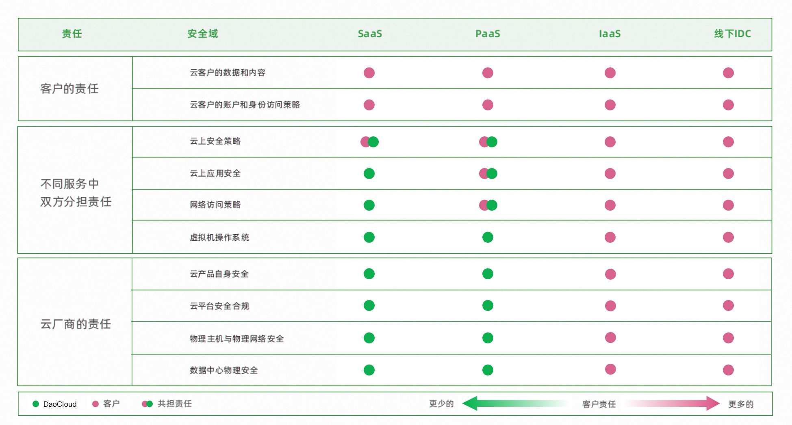

道客负责云原生分布式操作系统安全，以及运行在 DCE 分布式云操作系统之上的云产品层的安全。
同时，道客负责平台侧的身份管理和访问控制、监控和运营，从而为客户提供高可用和高安全的云服务平台。

客户负责以安全的方式配置和使用各种云上产品，并基于这些云产品的安全能力以安全可控的方式构建自己的云上应用和业务，保障云上安全。
道客根据多年技术积累，为客户提供云原生的安全服务，保护客户的云上业务和应用系统。

### 云平台数据安全和隐私保障体系

数据安全是为了推动数据可以高效流动而打造的一套信任机制。不碰用户数据是道客的红线，也是最低要求。
道客数据安全体系的核心是赋予数据权利和义务，让其所有者、共享者、监管者可以基于这些信任，释放数据的价值，这是道客数据安全的理念。

道客围绕安全、合规、隐私三大命题，道客为用户提供原生的、高度自动化、高透明度的保护能力，致力构建值得信任的安全计算环境，
促进数据在被保护的状态下流动起来、使用起来。信任的基础是明确其中的权利和义务。在分类分级的前提下，
对数据的所有权、归属权、使用规范、删除权等做了细粒度约定，并通过法律法规、资质认证等多种手段保障权利和义务的履行。

### 规划和设计

安全是需要设计和规划的，应在构建基于云或本地数据中心的同时，建设安全系统和相关控制措施，建立配套安全管理流程和机制，建立安全意识管理体系等。
并将技术控制措施、管理流程、人员组织配套的融入云基础设施的构建、业务开发，应用上线和日常运营当中。

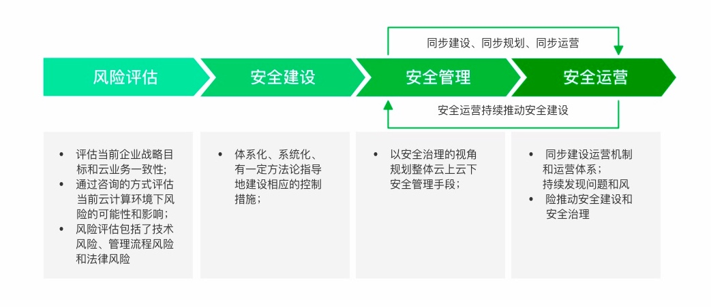

整体建议如下：

- 评估当前企业战略目标和云业务一致性；
- 通过咨询和风险评估工具的方式评估当前云计算环境下风险的类别，发生的可能性和影响；
- 应评估架构风险，管理风险以及合规风险；
- 参考方法论建设安全体系，包括参考框架，技术控制措施和运营机制；
- 建立安全运营体系持续识别风险，推动安全框架的更新迭代和技术控制措施的优化。

### 安全设计原则

安全设计需要遵循以下几个原则：

#### 最小化原则

安全最小化原则是最基本的原则之一，对外提供的服务越少，安全风险越小。
当企业基于云的 SaaS、PaaS、IaaS 构建业务系统时，需时刻遵循安全最小化原则，包括：

- 网络最小化原则：尽可能少的开放公网访问入口，尽可能小范围的控制端口开放，尽可能的使用 VLAN 或子网对网络进行最小分段，并进行网段的隔离和监控；
- 身份最小化原则：尽可能的减少系统管理员，以角色和权限绑定的思路赋予用户身份；
- 权限最小化原则：原则上尽可能的以白名单模式开放权限，即仅允许特定的最小权限。但这往往在实际落地过程中难以落实，但这是安全设计的重要原则之一。
- 访问控制用户权限最小化原则：通常建议使用访问控制用户进行身份管理，并进行访问控制用户权限的细粒度分配；
- AccessKey 权限最小化原则：在一些最佳实践中，建议在访问控制用户或可被监控和权限可控的账号下申请 AccessKey 用于自动化调用。

#### 审计可追溯原则

尽可能确保所有来自用户端的访问请求留有审计记录，以便于在发生网络攻击事件时，能够通过云资源操作日志、云资源访问日志以及变更日志还原攻击事件，
追溯攻击过程，以便于企业判断和定位攻击事件的等级、影响和损失。

#### 数据安全保护原则

基于安全责任共担模型，数据安全的体系建设同样划分为租户和云平台，租户侧建立数据安全保护体系建议参考如下原则进行设计：

- 数据的分类分级原则：企业应结合实际应用和业务特性，有意识的建立数据分类分级制度和体系，分类分级是个长期且动态的工作，也是开展分级保护的第一步
- 数据的访问控制和权限最小化原则：企业应结合实际业务流程，梳理数据访问的用户身份、目的、权限、途径，并通过相关技术控制手段对权限、访问途径进行管理
- 静态数据保护原则：要对静态存储的数据进行访问认证、数据加密
- 动态数据保护原则：要对数据流动的通道、流动中的数据进行传输加密和数据加密
- 数据审计原则：原则上要对数据的访问、操作和移动进行全面的审计
- 数据共享原则：识别数据共享途径和方式，如通过 API 等途径在线获取和共享数据，通过离线共享数据，这些共享访问需要进行识别和建立相关的保护措施
- 数据合规性原则：应重视数据合规，拆解满足合规要求所需要的技术控制措施和管理措施，并纳入到企业数据安全体系建设的规划中。

#### 合规性原则

道客在全国各地区基于客户的基础设施构建云原生操作系统，随后客户在其上构建业务系统和对外提供服务，双方应充分考虑当地的法律法规要求。
在安全架构设计过程中，应充分分析和理解法规要求，并标记能够满足法规要求的相关技术控制措施，和管理控制措施。
以便在安全能力建设时，清楚地认识和明确云厂商能够提供什么样的产品及服务来为企业满足合规要求。

### 安全风险识别和检测

安全风险识别和检测包含以下 4 个维度，通过梳理企业客户上云面临的整体风险，才能有针对性的对安全架构进行建议、检测和建设。

- 基础架构的风险识别和检测：云上基础架构包含了网络架构和身份体系，要评估和识别当前网络的架构设计方法，是否符合安全最小化原则和纵深防御原则；
- 云平台配置风险识别和检测：企业使用云产品创建的配置文件是否符合安全原则，需要进行识别和自动化检测，
  可基于云安全最佳实践和行业合规要求建立符合企业自身的“云安全基线”也被称之为“baseline”，通过标准识别和检测上云风险；
- 资产脆弱性的风险识别和检测：平台的资产可分为工作负载、基础网元、应用，
  面对资产的脆弱性（包含资产基线和资产漏洞）应该进行事前的风险识别和检测，并进行维护；
- 合规风险的识别：合规包含了外部合规和内部合规。外部合规指的是面向监管的合规，内部合规指的是面向内部审计、管理的合规。

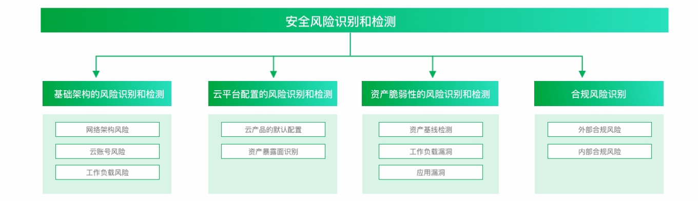

#### 识别基础架构的安全风险

基础架构风险包含了网络架构风险、账号体系风险和工作负载架构风险。

##### 基础架构风险分析

基础架构包括网络、账号体系和工作负载。

###### 网络架构风险

和在 IDC 面临的风险一样，在云上需要设计网络架构，以便减小网络暴露面和因为网络架构设计不合理导致的网络攻击。
网络架构的风险是指由于网络分段、资产暴露、区域设计不合理导致的网络被任意用户访问、内部接口或地址可以被互联网访问，
攻击者可以轻松从互联网获取企业资产和应用的信息带来的风险。

在云端常见的网络架构风险如下：

| 类别 | 影响因素 | 风险级别 | 可能导致的风险 |
| ---- | ------ | ------- | ---------- |
| 高危端口开放 | 常见的高危端口如 22、3389、445 等开放在互联网边界的应用上，或通过映射等方式能够被公网访问 | 高 | 常见的高危端口会被黑客利用发起恶意登录、暴力破解，以及漏洞利用，高危端口在未经端口转换或防护的前提下直接暴露在公网，会导致企业内部资产面临攻击的风险。|
| 网络分区和隔离 | 在前期企业上云过程中，未按照分区分域原则划分基础网络架构，导致业务堆积在一个 VLAN 子网内或一个租户内 | 中 | 当业务未按照网络分区分域原则进行划分时，就意味着应用系统的前端、中间件、数据库等服务都集中在一个 VLAN 子网内，往往前端是能够被互联网访问到的，若存在端口开放和应用漏洞，可以被攻击者利用后打入内网，如没有进行隔离，则攻击者就可以直接访问子网内所有资源，窃取数据，破坏系统，加密勒索，造成严重损失。且当系统过于庞杂时，若未按照分区分域原则进行资源隔离和划分，系统的可扩展性以及灵活性都会受到一定程度的影响，从而影响系统稳定性。|
| 未经防护的公网资源 | 在使用云资源部署云原生平台时，将公网 IP 直接绑定在 DCE 等资源上，绕过安全防护和安全监控对外直接提供公网访问 | 高 | DCE 等资源直接绑定公网 IP 后会绕过一些安全设置，产生的安全防护和监控的盲点。|

###### 账号体系风险

账号体系风险的定义是由于身份滥用、授权过度、AccessKey 泄露导致的被不合法用户合法使用云资源、数据泄露、系统稳定性等的风险。

常见的权限安全风险分析如下：

| 类别 | 影响因素 | 风险级别 | 可能导致的风险 |
| ---- | ------ | ------- | ----------- |
| 访问控制用户配置风险 | 访问控制用户未按照安全要求配置多因素认证 | 高 | 访问控制用户未开启多因素认证可能导致账号盗用，异地登录、暴力破解等问题，从而导致资源被利用和数据泄露等风险。|
| 访问控制用户过度授权 | 中 | 访问控制用户授权过度可能导致越权的风险，从而导致资源滥用和数据泄露。| |
| 不活跃的访问控制用户 | 中 | 不活跃的访问控制用户可能导致暴力破解和管理风险。| |
| 不活跃的 AccessKey | 中 | 不活跃的 AccessKey 可能导致异常调用和管理风险。| |
| 凭证泄露 | 管理账号凭证信息泄露 | 高 | 企业使用云资源开发时，AccessKey 是最重要的访问凭证，可通过 AccessKey 获取企业资源的使用权，获取数据以及管控权限等。AccessKey 通常被写入代码中或工具中，若 AccessKey 泄露会导致数据泄露、资产破坏等风险。|

###### 工作负载架构风险

工作负载是指在云平台提供业务支撑的服务，工作负载架构风险是指工作负载为了提供业务支持所选择的部署方式、
网络连接方式、访问控制等操作面临的风险，具体如云平台工作负载直接绑定公网 IP 提供互联网服务，但该操作有可能被攻击者利用。

常见的工作负载架构风险如下：

| 类别 | 影响因素 | 风险级别 | 可能导致的风险 |
| ---- | ------- | ------ | ----------- |
| 未经保护的工作负载 | 工作负载未经 NAT、LB 等保护，直接向公网提供服务 | 高 | 工作负载直接绑定对外 IP 后会绕过一些安全设置，产生的安全防护和监控的盲点。若 DCE 上存在高危漏洞或端口暴露，则无法及时发现网络攻击和网络嗅探。 |
| 加入的网络策略授权过大 | 网络策略授权过大，未能有效保护工作负载。或加入网络策略的工作负载过多，策略设置宽松。| 中 | 网络策略因为加入的工作负载过多，因需求不同以及网络策略要求不一致，导致授权过大，存在管控宽松的风险。|
| 统一的登录认证和审计 | 未经堡垒机直连工作负载 | 高 | 未能有效提供工作负载的集中认证和访问控制，凭据泄露或暴力破解发生时，无法有效控制对工作负载的安全访问。|
| 未集中进行工作负载的操作审计 | 高 | 当出现安全事件时，无法有效进行攻击事件的回溯和定位。| |

##### 基础架构安全实施最佳实践

网络、账号和工作负载是企业客户在使用云时最先接触到的云资源，云提供了便利性的同时，企业仍要高度重视安全性，避免为了提供更便利的服务牺牲安全性。
建议在业务上云初期，对网络规划、用户组织权限体系设计进行充分的考量和咨询，并进行有效的检测和评估。

道客提供了企业上云最佳实践咨询。对企业来说，将业务迁移到道客时，希望能够保障业务在云上安全合规，同时兼顾灵活的业务组织拓展。
根据大量的客户实践总结发现，在上云前做好合理的规划可以避免对管理方式的反复重构，加速业务大规模上云。
因此建议客户在上云之前先从顶层规划一个完善的企业上云框架。

###### 网络架构设计最佳实践

道客基于大量的网络架构设计，结合不同行业业务特点和网络需求，提供网络架构设计的最佳实践。
如企业级网络分区分域设计、云上同城/异地容灾网络设计、VLAN 子网划分设计东西向流量隔离和管控设计、
云上云下混合云组网设计等最佳实践方案。详细说明参考网络安全保护中相关内容。

###### 账号体系设计最佳实践

道客基于实际应用场景，帮助企业设计基于组织结构的资源管理及规划，用户体系设计和组织隔离方案。

**资源规划**

集团型企业对业务隔离的要求比较严格，不同业务必须按照安全要求或行业监管要求，部署在不同的隔离租户内，根据道客最佳实践，
推荐企业使用多组织层级权限架构来管理云上资源。多组织层级权限架构帮助企业实现强隔离、降风险，应对企业多层级组织体系，
便于结构化管理，让企业的业务更便于拆分和融合。

**账号设计**

账号规划及职能说明如下：

- **管理账号** ：用于多用户账号管理，在该账号中启用工作空间（Workspace）并构建账号树， 具备统一设置用户权限、管控策略等规则并下发到各成员账号等管理职能。
-	**组织管理账号** ：根据不同组织层级创建对应工作空间树，并管理工作空间成员，以及关联工作空间资源。
-	**审计账号** ：聚合所有成员账号的日志，便于统一收集、统一管理
-	**运维账号** ：部署运维相关工具，如统一监控平台、企业云管理平台、平台资产管理平台等
-	**业务账号** ：业务功能账号，用于部署业务应用，如生产账号、开发测试账号

**组织结构及业务隔离**

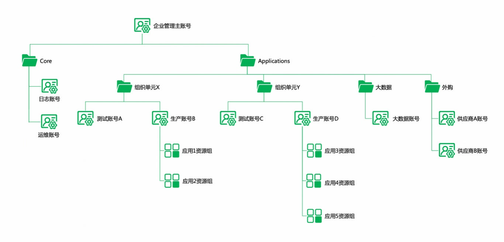

说明及建议：

- 在企业管理用户中基于工作空间（Workspace）构建组织架构树，将其用户账号作为成员账号纳入工作空间进行多用户统一管理。
  并绑定相应的云平台资源（集群、Namespace、云原生网关等）资源从而实现资源隔离。
- 基础管控类账号放置到 Core 文件夹下，业务账号放置到 Application 文件夹下。
- 业务账号按业务组织单元进行划分，体现企业组织架构及管理方式，常见的组织单元划分如分公司、部门、产品等，对不同业务单元进行隔离。
- 每个组织单元下可划分测试账号及生产账号，对生产环境及测试环境进行隔离。
- 账号下可使用不同资源组对应用资源进行隔离。

**工作负载架构设计最佳实践**

工作负载的架构设计应从工作负载保护，工作负载网络设计、工作负载的访问控制三个层面设计。详细设计最佳实践参考工作负载保护一节。

#### 识别并检测云平台及产品默认配置风险

##### 默认配置风险分析

云平台及云产品在不同企业客户的实际使用场景中，会根据业务需求产生不同的配置文件和使用场景。
云产品提供的默认配置在不同的应用场景下未必是安全的，所以企业应该识别云产品默认配置存在的安全风险，
和该云服务在使用中的安全最佳实践，然后再根据企业实际应用场景判断相关风险的影响程度，可接受程度。

云平台及产品的默认配置风险分析需要从以下几个维度考量。

| 风险评估维度 | 说明 | 示例 |
| --------- | ---- | ----- |
| 身份认证 | 检查云平台及云服务的身份认证方式、密码复杂度、身份角色等 | 访问控制密码策略可用于确保密码的复杂性。建议密码长度至少 14-32 位。|
| 授权管理 | 检查云平台及服务是否存在授权过度等授权相关问题 | 检查角色的权限策略中是否包含访问控制相关的高危 API，并结合近一个月内的调用行为筛选出未经使用的 API。|
| 访问控制 | 检查云平台及云产品的访问方式，控制措施和控制细粒度是否符合安全要求 | MySQL 开启公网访问权限可能存在被攻击者入侵的风险，建议关闭公网访问地址。|
| 网络安全 | 检查云平台网络设置的安全性是否符合规范及合规要求 | 工作负载通过对外 IP 提供访问，存在公网暴露被攻击风险。|
| 数据安全 | 检查云产品资源实例在处理数据时，是否有进行数据访问控制和加密 | 对象存储开启服务端加密 |
| 日志审计 | 检查云产品及云平台是否开启日志审计功能 | 用户在访问对象存储服务的过程中，会产生大量的访问日志。您可以使用 DCE 5.0 全局管理的审计日志功能对这些日志文件进行分析。|
| 容灾备份 | 检查云平台的数据备份策略是否得到有效配置和执行 | 在控制台定期备份文件，能够在数据丢失或受损时及时恢复文件。|

###### 默认配置风险检测最佳实践

**梳理企业常用云产品和使用方式**

企业应统计账号下开通的云产品资源，并做好分类。同时调研其使用方式，从安全层面关注的使用方式的影响主要是该云服务是公网访问还是私网访问，
是共享资源还是独享资源，以及该云服务应用和存储的数据类别及重要程度等。以便在后续的安全风险评估中，根据云产品实际应用场景来确定给出的风险建议。

建议企业按照以下分类方式对云资源进行分类：

| 资源类别 | 示例 | 使用方式 | 是否涉及重要数据 |
| ------- | --- | ------- | ------------- |
| 网络 | LB、容器网络 | 私网访问和公网访问 | 否 |
| 数据库及存储 | HwameiStor | 私网访问和公网访问 | 是 |
| 计算 | DCE | 私网访问 | 是 |
| 安全 | 漏洞扫描 | 公网访问 | 否 |

**选择安全评估标准**

针对云平台和云服务的安全评估标准分为两个层面，第一个层面是基准，第二个层面是策略。策略是达成一系列基准的检测方法，
每个云平台的安全评估策略略有不同，但可以遵循同一个基准执行相关的检测策略。这也是大多数企业多云客户的选择方式。

推荐企业参考的基准模板如下：

- ISO 27001
- 道客安全最佳实践

通常情况下，企业需要结合推荐的基准模板结合自身业务进行梳理和融合，如金融行业可在基准模板上再叠加等级保护等基准，
融合成为适合企业在云平台的统一标准安全评估基准。

**使用工具自动化检测扫描配置风险**

在确定企业的安全评估基准后，需要通过一系列的策略来检测企业是否使用或开启相关的安全控制措施，以满足安全基准要求。并根据检测结果给出云平台整体的安全评估风险和建议。

- 使用安全模块的云平台配置检查功能对当前管理账号下的默认配置及安全控制项进行检测。
- 通过查看云平台配置检查列表中的检测策略，
  包含了道客身份权限管理检测策略、云产品配置最佳实践、合规检测策略等。

**设定云资源安全评分**

推荐企业采用定量的安全评分系统对云资源的整体安全风险进行可量化的评估，
安全评分可以间接的反映结合安全评估基准，企业的安全控制措施的完备性。同时在多账号的客户架构中，安全评分也可用于更好地管理业务团队安全的使用云资源。

企业使用安全模块的云平台配置检查功能完成自动化扫描后，会根据企业订阅的资产通过率进行打分，企业可根据评分情况及通过率查看每个策略详情。
详细细节参考安全模块的安全评分功能。

**跟踪风险和定期评估**

企业应定期对云服务环境进行风险评估，因为云资源的生命周期相比传统 IDC 要短，每次资源变更都有可能产生新的安全风险，需要企业结合上述最佳实践方式，
设定定期评估的方案计划，以及通过安全评分来跟踪云服务的安全风险水平。

##### 检测资产脆弱性和应用风险

###### 风险分析

资产脆弱性包含了资产自身的配置风险、弱口令、资产存在的漏洞。攻击者会利用这些漏洞、弱口令形成威胁，对企业资源发起攻击形成安全风险。
在安全风险评估中，资产本身的脆弱性也是需要企业重视的一环。

企业拥有的资产泛指数据中心，和基于数据中心构建的应用、容器环境等。

###### 风险检测最佳实践

**资产信息收集和管理**

建立资产信息收集和管理的工具和流程，资产信息是在遇到网络攻击时，帮助企业安全管理员快速分析、定位、溯源的基础信息。又称资产指纹。

集中的收集和管理资产信息有助于帮助企业快速的摸清当前资产现状，通过全局视角监控和分析安全风险。

在云上可以通过安全模块的资产指纹调查实现全局资产指纹管理。

**服务器的安全基线检测**

服务器安全基线检查是基于相关标准，如 CIS Benchmark（针对操作系统的基准）、等保合规（二级、三级）基准、道客服务器安全最佳实践
（基线检测内容）对企业拥有的服务器进行安全基线检测。

安全基线检测有助于发现服务器存在的弱口令、未授权访问、操作系统的安全配置、容器的 Kubernetes Master 和 Node
节点配置风险检查、是否符合等级保护管理要求，对标权威测评机构安全基线环境的评测标准和要求。
以及用户可以根据企业自定义安全检测项进行检测评估。推荐使用安全模块的基线检查功能。

**服务器漏洞发现**

为了企业资产安全，建议企业定期进行服务器的漏洞扫描、评估和修复，漏洞也是攻击者最常使用的攻击手段之一，也是最有效的手段之一。

建议企业无论服务器规模大或者小，都应定期对服务器进行漏洞的评估，包括操作系统漏洞、Web 漏洞、应用组件漏洞等。
并设定周期性扫描和评估任务，同时和应用团队、运维团队设定相关的漏洞修复应急方案，以便于在发生大规模漏洞利用攻击时，能够第一时间响应。

- 可通过安全模块的漏洞管理功能，对云上所有服务器进行定期、周期性的漏洞扫描。
- 可通过查看漏洞扫描结果来进一步评估该漏洞在企业环境中的影响和等级，
  可参考漏洞的 CVE 编号及详情、道客漏洞等级说明、以及漏洞标签（道客会根据历史发现和修复的漏洞，对漏洞打标签，如“存在 EXP”、“命令执行”、“远程访问”等）。
- 查看漏洞评分，可根据评分和严重级别评估漏洞的真实风险。
- 查看存在真实风险的漏洞列表。
  安全模块真实风险漏洞模型依据时间因子、实际环境因子和资产重要性因子对漏洞进行评估，
  结合实际攻防场景下漏洞是否可被利用（PoC、EXP）及其危害严重性，帮助您自动过滤出存在真实安全风险的漏洞。
  开启该功能可以帮助您提高资产中可被黑客利用的风险漏洞的补救效率以及补救措施的有效性。关闭该功能则会显示所有漏洞。
- 含 CVE、CNNCD 以及漏洞列表。

**验证服务器漏洞和自动化修复**

可通过安全模块的漏洞修复和验证功能对识别的漏洞进行修复和验证。

- 执行修复前，请查看支持修复的漏洞类型。
- 执行一键修复漏洞，
  系统漏洞可支持一键修复，并推荐用户创建修复前快照，用于系统回滚。
- 执行手动修复，可在漏洞详情中查看漏洞信息，查看修复建议和操作，并手动执行修复。
- 查看漏洞修复失败原因。
- 可查看道客服务器软件漏洞修复建议。
- 创建自动化修复漏洞任务，可使用安全模块任务中心功能，创建漏洞自动化修复的响应剧本。

**定期执行应用漏洞评估**

可通过安全模块的漏洞管理功能，扫描系统中的应用漏洞，可查看支持扫描的应用漏洞。

##### 风险识别和检测最佳实践

###### 全面风险评估和识别服务

道客为企业客户提供云上全面的风险评估和识别检测服务，具体包括如下内容：

- **资产识别和分析：** 对信息系统业务及其关键资产进行识别，需要详细识别核心资产的安全属性，分析关键资产在遭受泄密、中断、损害等破坏时对系统所承载的业务系统所产生的影响。
- **威胁识别和分析：** 通过威胁调查、取样等手段识别被评估信息系统面临的威胁源，及其威胁所采用的威胁方法，并重点分析威胁的能力和动机。
- **脆弱性识别和分析：** 识别云原生系统的部署架构，配置及安全防护等方面的脆弱性。对信息系统的设计方案、安全解决方案等进行静态分析，
  识别体系结构中存在的脆弱性。采用安全扫描，配置审核等方式识别评估范围内的平台资产的脆弱性。
  分析信息系统及其关键资产所存在的各方面脆弱性即基础环境脆弱性、体系结构脆弱性、技术脆弱性、安全管理脆弱性，并根据脆弱性被利用的难易程度和被利用成功后产生的影响进行分析。
- **安全措施识别和分析：** 通过问卷调查、人工检查等方式识别被评估信息系统的有效对抗风险的防护措施对安全措施所采取后的有效性进行分析，分析其安全措施对防范威胁、降低脆弱性的有效性。
- **综合风险分析：** 分析信息系统及其关键资产将面临哪一方面的威胁及其所采用的威胁方法，利用了系统的何种脆弱性，对哪一类资产，产生了什么样的影响，并描述采取何种对策来防范威胁，减少脆弱性，同时将风险量化。

###### 风险评估原则

- **关键业务原则** ：被评估组织的关键业务是信息安全风险评估工作的核心，涉及这些业务的相关网络与系统是评估工作的重点。
- **可控性原则：**
    - **服务可控性** ：评估方应先与用户进行评估沟通会议，介绍整个评估服务的工作流程，明确用户需要提供的工作内容，保障整个安全评估服务工作的顺利进行；
    - **人员与信息可控性** ：所有评估的工作人员均应签署保密协议，以保证项目信息的安全；应严格管理好工作过程中产生的中间数据和最后的结果数据，未经授权不得泄露给任何单位和个人；
    - **过程可控性** ：应按照项目管理要求，成立项目实施团队，项目组长负责制，达到项目过程的可控；
    - **工具可控性** ：安全评估人员所使用的评估工具应该事先通告用户，并在项目实施前获得用户许可，包括产品本身、测试策略等。
- **最小影响原则** ：对于类似在线的业务系统的风险评估，应基于最小影响原则，即首要保障业务系统运行的稳定，而对业务系统进行攻击性测试时，需沟通用户并做测试内容的应急备份，同时选择不在业务的高峰时间进行。
- **保密性原则** ：在风险评估实施前，评估人员应当与被评估系统的项目负责人签署书面形式的保密协议。

###### 风险评估参考标准

常见的风险评估参考标准有：

- GB/T 20274-2006《信息系统安全保障评估框架》
- GB/T 20984-2007《信息安全风险评估规范》
- GB/T 18336-2001《信息技术安全性评估准则》
- GB/T 22239-2008《信息系统安全等级保护基本要求》
- 道客 - 企业上云安全指引

###### 风险评估过程

主要分为线上评估实施、数据分析整理、风险评估报告撰写三个阶段：

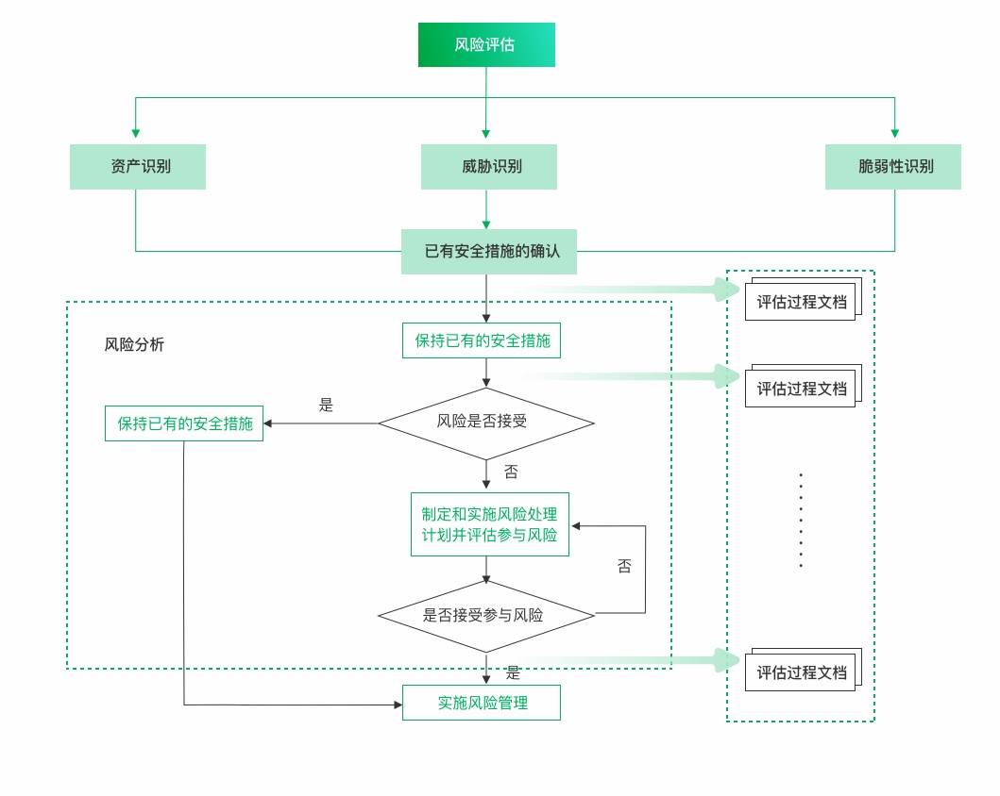

- 线上评估：本阶段主要完成线上评估工作的实施，即通过资产调查、安全基线扫描、漏洞扫描、渗透测试、人员访谈等方式，
  了解业务系统的安全现状，为风险分析提供资料。现状评估阶段主要的工作任务包括人员访谈、安全基线扫描、漏洞扫描等。
- 数据分析：本阶段主要对评估阶段采集的数据进行分析、整理，为风险评估报告的撰写提供依据。
- 报告撰写：本阶段主要完成风险评估报告的撰写、修订。根据数据分析的结果撰写评估报告，
  并针对业务系统存在的安全风险、安全隐患提供修复建议。与负责人进行沟通，对评估报告进行修订。

### 安全防护

#### 身份和访问控制

在整体的云上安全架构设计中，用户的账户安全是贯穿始终的一个重要维度。其中，身份和访问控制是云计算环境下非常重要的安全措施，
良好的身份和权限的设计，能够确保只有授权的身份才能够在指定的条件下访问对应的云资源。它涉及到识别用户和身份（身份验证），
确定该身份可以访问哪些资源（授权），以及审计相应身份的访问和操作记录（监控和审计）。

##### 身份管理

身份是指在云平台中执行操作的实体。云上主要有两种身份类型：人员身份和程序身份。

人员身份通常代表组织中的个人，比如企业中的安全管理员、运维管理员、应用开发者。
通常通过道客云操作系统的控制台、CLI、特定场景下的客户端等方式对平台的资源进行操作。

程序身份则代表应用程序或服务，往往是通过道客云操作系统的 OpenAPI 来访问平台的资源和数据。

在道客云操作系统上，针对两种类型的身份管理，基于安全的最小化原则，核心有两大原则：缩小暴露时长和缩小暴露面积。

缩小暴露时长指尽可能使用临时身份或凭据替代固定身份或凭据，即使使用固定身份或凭据，也建议定期轮转。

缩小暴露面积指尽可能安全保管密钥或凭据，避免在不同身份类型之间混用凭据或身份。

基于这两大核心原则，针对不同类型的身份管理，在道客云操作系统上有以下最佳实践可以参考。

###### 人员身份

在道客云操作系统上，注册完一个账号后，即可通过用户名和密码的方式登录到控制台，登录成功后，即获得了 Admin 身份。
该身份具有该账号下所有的权限，一旦账号密码泄漏，风险极高。另外，如果多人共用该身份，每个人都保有该账号的用户名和密码，
会增加泄漏的可能。同时，多人共享的情况下，在平台的操作日志中无法区分出是组织中哪个人使用了该身份进行了操作，
也无法进行进一步溯源。因此，除了极个别场景，应该尽可能的使用 DCE 5.0 访问控制身份进行云上资源的访问。

**实现人员身份的统一认证**

通过集中化的身份提供商（Identity Provider，简称 IdP）来进行人员身份的统一认证，能够简化人员身份的管理，确保组织内在平台内、平台外的人员身份的一致性。
当人员结构变更、人员入、离职时，能够在一个地方完成人员身份的配置。对于云平台的使用者来说，也无需为其颁发额外的用户名和密码（如访问控制用户名和密码），
只需要保管好其在组织内的 IdP 中的身份和凭据即可。对于一些组织而言，通过一些网络上的访问控制措施，使其 IdP 仅能够在企业内网访问，
给人员身份的认证过程增加了额外一个限制条件，进一步保障了企业人员身份的安全。

道客云操作系统支持单点登录（Single Sign On，简称 SSO）。在道客云操作系统上，我们建议通过 SSO 的方式跟组织内的 IdP 进行集成，实现人员身份的统一认证。
对于有复杂账号体系的组织， 还可以通过 SSO 进行集中化配置，进一步实现账号下的人员身份统一管理，提升管理效率。

**建立更安全的登录机制**

对于人员身份的登录方式，往往是通过用户名和密码的方式进行。一旦用户名和密码泄漏，攻击者极有可能通过该身份登录道客云操作系统，
造成一些不可挽回的损失。因此，对于人员身份来说，保护好用户名和密码显得尤为重要。可以从以下几种方式提升登录方式的安全性：

1. 提升密码强度。如增加密码位数、混合使用数字、大小写字母、特殊字符等。针对道客云操作系统访问控制用户，
   管理员可以设置密码强度规则，
   强制访问控制用户使用更复杂的密码，降低密码泄漏和被破解的风险。
2. 避免密码混用。在不同的服务、站点，或不同的用户共用一个密码，增加了密码的暴露面积，会增加密码泄漏的可能性。
   如果其中一个服务或用户的密码泄漏，那攻击者就可以通过尝试登录的方式，找到共用密码的其他服务。因此，确保不同服务、不同用户使用不同的密码，能够降低密码泄漏的风险。
3. 定期轮转密码。密码存在的时间越长，泄漏风险越高。通过定期重设密码，降低单个密码存在的时长，能够进一步降低密码泄漏风险。
   针对道客云操作系统访问控制用户，管理员可以在密码强度规则中设置密码有效期，
   来实现密码定期轮转。
4. 使用多因素验证。多因素认证 MFA（Multi Factor Authentication）是一种简单有效的安全实践，在用户名和密码之外再增加一层安全保护，
   用于登录道客云操作系统或进行敏感操作时的二次身份验证，以此保护您的账号更安全。
   建议为平台的人员身份都启用二次验证。对于使用云下 IdP 进行统一身份认证的组织，也建议在 IdP 侧提供二次验证的选项。

**通过角色扮演代替固定身份**

基于缩小暴露面积的原则，使用临时身份替代固定身份，能极大降低身份泄漏风险，同时对于人员身份来说，
也能够抽象人员权限模型，如按人员职能进行角色划分，有利于规范化人员权限设置，提升管理效率。

建议通过单点登录（Single Sign-on，简称 SSO），基于角色扮演的方式，实现人员身份的管理。

###### 程序身份

**不使用管理账号 AccessKey**

管理账号 AccessKey 等同于账号的 Admin 权限，也就是该账号内的完全管理权限，而且无法进行条件限制（例如：访问来源 IP 地址、访问时间等），
也无法缩小权限，一旦泄漏风险极大。对于程序访问的场景，请使用访问控制用户的 AccessKey 来进行 API 的调用。

**避免共用 AccessKey**

多个程序身份共用 AccessKey，或程序身份、人员身份共用 AccessKey 的情况下，AccessKey 所关联的权限需要包含所有身份的使用场景，导致权限扩大。
另外，共用场景下，一处泄漏会导致所有应用都受到影响，风险扩大，同时增加了泄漏后的止血难度。对于同一个应用的不同环境，如生产环境、测试环境，
往往需要访问不同的资源，同时，测试环境代码往往不够稳定和健壮，更容易有泄漏风险，如果共用同一个 AccessKey，
测试环境 AccessKey 泄漏后也极容易造成对生产环境的影响，导致业务安全风险。

因此，针对不同应用、大型应用的不同模块、同一个应用（或模块）的不同环境（如生产环境、测试环境等），
都建议创建不同的 AccessKey 供程序身份使用，每个 AccessKey 只有该场景下所需要的权限，避免共用 AccessKey 的情况。

**定期轮转 AccessKey**

同人员身份的用户名密码一样，AccessKey 创建和使用时间越长，泄漏的风险越高。每隔一段时间，通过创建新的 AccessKey，
替换掉应用在使用的 AccessKey，并将旧 AccessKey 进行禁用和删除，实现 AccessKey 的定期轮转。另外，
也可以通过密钥管理服务的凭据管家功能，实现自动化的定期 AccessKey 轮转。

除了 AccessKey，其余类型的程序访问凭据，都应该进行定期轮转，降低凭据泄漏风险。

**使用临时凭据代替固定凭据**

通过给访问控制用户创建 AccessKey 供程序调用，都属于固定凭据类型。一旦创建出来，在删除之前，就是由固定的
AccessKey ID 和 AccessKey Secret 组成了该凭据。使用固定凭据会造成很多风险，比如应用研发人员将固定 AccessKey 写入了代码中，
并将其上传到了 Github 等公开仓库，造成了 AccessKey 泄漏，最终导致业务受损。在道客云操作系统上，我们建议尽可能通过角色扮演的方式获取临时凭据
Token，代替固定 AccessKey 的使用。每个 Token 生成后，在超过角色最大会话时间（小时级）后，自动失效，从而降低了因固定凭据泄漏导致的风险。

针对不同类型的云上应用部署方式，道客云操作系统提供了相应的功能，集成了 Token 凭据的使用：

1. 针对在实例上部署的应用，通过配置实例访问控制角色，
   将访问控制角色跟实例进行绑定，应用程序中即可通过实例元数据服务获取临时授权 Token。
2. 针对在 DCE 上部署的应用，实现访问控制角色和指定 ServiceAccount 进行绑定，在 Pod 维度即可扮演对应角色实现 Token 的获取。

无论哪种部署方式，在应用代码中根据部署类型设置相应的身份验证（Credentials）配置，
都可以便捷的直接获取 Token，无需关心具体的凭据缓存以及过期更新逻辑。

##### 权限管理

平台的权限管理是为了控制某个身份在什么条件下对哪些资源能够执行哪些操作。道客云操作系统上的授权方式分为以下几种：

1. 基于身份的授权：主要是指针对访问控制用户、用户组或角色进行授权。
2. 基于资源的授权：部分模块支持为某个特定资源绑定权限，支持向其他账号的访问控制用户授予访问权限。
3. 管控策略（Control Policy）：管控策略是一种针对启用了工作空间（Workspace）的多层级组织，
   基于资源结构（文件夹或成员）的访问控制策略，可以统一管理工作空间（Workspace）各层级内资源访问的权限边界，建立企业整体访问控制原则或局部专用原则。

无论基于何种授权方式，合理的权限设置能够阻止未经授权的访问，保护平台资产和数据的安全。
因此，平台的权限管理的核心原则就是权限最小化，只给身份授予必要的权限，确保权限最小够用。

基于该原则，针对不同身份类型的授权，在道客云操作系统上有以下最佳实践可以参考。

###### 人员身份的权限管理

**基于人员职能进行授权**

对于组织来说，不同职责的人需要访问云上不同类型的资源。
运维管理员往往需要访问基础设施模块，但应用开发者往往只需要具备应用相关权限。
对于同一职责成员，如应用管理员、应用开发者等，所需要访问和管理的资源范围往往是一致的。
因此，建议针对人员职能划分，进行权限的抽象，简化授权过程，降低管理成本。

在对职能权限进行抽象后，可以通过将人员身份加入到指定职能用户组的方式进行组织，提升授权效率。

**按资源范围授权**

虽然权限管理的核心原则是最小化授权，但如果为组织中的每个人员身份都定制化权限，对于大型组织来说，
会大大降低管理效率。因此，按照人员所管理的业务应用对应的资源范围进行授权，能够简化授权逻辑，
提高权限策略复用率，进而在权限最小化和管理效率中取得平衡。

在云平台上，建议通过道客云操作系统账号或资源组两种方式，区分不同业务应用的资源。
如果企业存在多个组织部门需要使用云资源，则可以使用工作空间（Workspace）构建企业组织结构，
对账号和资源进行集中、有序地管理，不同的业务应用按工作空间维度进行区分，授权时应用范围选择整个部门用户组。
如果企业使用一个工作空间管理所有云资源，各个项目组可以使用资源组作为资源隔离和权限管理的容器，在授权时应用范围选择指定资源组。

因此，在用云过程中通过合理的资源规划，按照资源范围进行授权，能够提升整体的权限管理效率。

###### 程序身份的权限管理

**精细化授权**

除一些特定业务场景外，应用程序所需要访问的道客资源，对应进行的操作是可以预期的，
尽可能的通过自定义权限策略来定义该程序身份所需要的最小权限。比如一个用户社区需要展示用户头像，
支持头像上传，那么该程序仅需要 GetObject 和 PutObject 权限即可。
相反，如果直接使用系统策略，给该程序授予 FullAccess 权限，那么一旦该程序身份泄漏，
攻击者就有该管理账号下所有权限，风险极高。

###### 通用的最佳实践

**定期审查权限**

在授权完成后，还需要定期对权限的授予进行审计确保每个身份的权限持续满足最小够用原则。需要重点关注的场景：

1. 特权身份：比如拥有所有产品权限的管理员，拥有访问控制等管理与治理相关产品所有权限的身份，都属于重点审计对象。确保这些身份拥有这些特权是合理的。
2. 闲置权限：除了特权身份外，对于其他产品权限，也可以结合平台的操作审计日志，判断该身份的权限是否有闲置情况。

**设置权限边界**

对于云平台有多个道客云管理账号的组织，可以基于工作空间（Workspace）管控策略，限制成员账号内的访问控制身份权限范围，
禁用一些高危操作降低身份泄漏风险。如禁止成员删除中间件服务、禁止成员删除日志记录等。

在绑定管控策略前，建议先进行局部小范围测试，确保策略的有效性与预期一致，然后再绑定到全部目标节点（文件夹、成员）。

#### 基础设施安全

##### 网络安全保护

云上业务系统的用户可能位于网络中的任何位置，比如通过互联网服务终端客户，或者两个都在 VLAN 子网内的业务系统之间相互调用。
因此每个网络层次上都需要有完善的安全体系，来确保各类业务的安全访问。推荐采用微服务的理念，
将各个组件、子系统、微服务认为是离散的、互不信任的，并采用安全措施进行认证、防护和监测。

网络规划设计的核心环节之一就是定义各个资源所在的网络边界，并在各个网络边界之间设计访问控制机制。这个环节可以通过三个步骤来进行：

1. 设计网络分层
2. 在各个层级实施网络访问控制
3. 观测、分析、监控网络安全事件

###### 设计网络分层

网络分层需要根据各个系统组件的安全等级要求进行归类，并划分成多个网络层级来确保让非法访问的影响范围最小化。
比如在 VLAN 子网中的数据库集群不应有互联网访问能力。
组件之间流量流向也应该符合分层原则，且仅应该流向相同或者相邻安全等级的组件上。

网络分层模型可以参考下图：

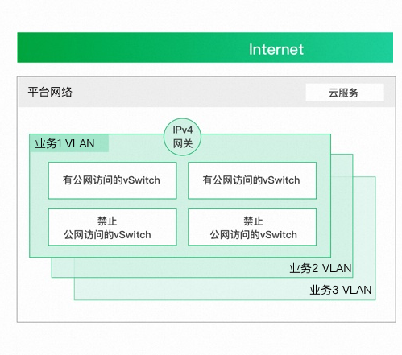

下面列举出一些常见的糟糕设计：

- 将所有资源都创建在一个 VLAN 中，不同业务之间没有隔离会导致安全暴露的影响范围扩大
- 允许直接访问敏感数据，比如公网访问数据库、大数据的查询服务直接暴露在公网上等等。
- 不同网络位置（VLAN 之间、IDC 到 VLAN 等）的内部应用之间通过公网互通。
- 安全组放开过大的范围。

需要注意的是，网络分层是实施完善网络安全架构的基础，没有遵守此最佳实践会导致较高的安全风险。

**在各个层级实施网络访问控制**

通过网络分层模型参考图可以看到，常见的跨层流量流向包括且不限于：

- 互联网到 VLAN 内资源流量互访（出向和入向）
- 同一 VLAN 子网内的访问
- 不同 VLAN 间的流量互访
- 外部 IDC 到 VLAN 内资源的流量互访
- 通过 VLAN 或外部 IDC 访问云服务

对于互联网到 VLAN 内资源流量互访，各个层级有如下可以使用的安全手段，这些手段的防护范围是从更大范围到更小范围：

1. 高防和防火墙
2. 网络 ACL
3. 安全组/IP 白名单

对于 VLAN 内的流量互访，常见的流量控制工具包括：

1. 网络 ACL
2. 安全组/IP 白名单：保护具体实例

此外，根据零信任原则，外部 IDC 等网络均属于位于的网络边界，在跨边界访问时，可以进行网络流量的隔离和防护。
当流量通过网络边界进入 VLAN 后，VLAN 内的所有安全能力，包括路由表、网络 ACL、安全组等还可以实现进一步细粒度的访问控制。

**观测、监控、分析网络安全事件**

持续的观测、监控、分析网络安全事件有助于持续的加固安全策略，应对新的安全威胁。

在业务网络层面高防、防火墙能够记录并防护攻击，以及四层和七层的攻击。

在基础网络层面，可以详细记录 VLAN 访问公网（南北向流量）、VLAN 之间/混合云组网（东西向流量）的方位行为和异常流量。

在 VLAN 内部，可以通过可观测组件来记录详细的五元组日志，通过分析观测日志，
发现不符合安全分层互访策略的流量，通过网络 ACL 或者安全组来进行安全策略的加固。
如果对于数据包的内容有进一步的监控审计要求，可以通过流量镜像功能将流量复制一份，再导入流量分析组件进行更进一步的监控和分析。

##### 工作负载安全保护

平台的工作负载是一套支撑 IT 业务系统运行的相关功能或一些原子能力，诸如服务器、VM、容器、网络、数据库等。
通常情况下企业在平台使用最多的工作负载环境就是 VM 和容器。

针对 VM 和容器的防护要做到以下几点：

- 有效的识别工作负载，梳理清楚在平台的资产指纹；
- 有效识别工作负载的漏洞以及脆弱性，并对其进行管理；
- 建立运行时防护的机制，有效保护您的工作负载安全；
- 制定定期的安全巡检计划，以便确保您的工作负载的安全有效性及合规性。

###### 识别和梳理资产基本安全信息

在执行安全防护措施前，首先要了解企业在平台有哪些资产，以及资产的基本信息和安全信息。
识别和梳理资产指纹有助于快速帮助企业在平台获取最新的资产和工作负载详情。

通常情况下，建议企业关注的资产指纹包括如下内容：

| 序号 | 资产指纹 | 用途 | 和安全相关的操作 |
| --- | ------- | --- | -------------- |
| 1 | 账户 | 用于统计服务器内创建和管理的特权账户和普通用户 | 可通过账户信息来分析和比对在安全事件发生前后是否有新增的普通用户和特权用户，能够在安全事件溯源过程中判断和定位攻击。|
| 2 | 端口 | 用于统计服务器开放的端口和网络协议，同时端口关联了对应的进程 | 可用于做端口的暴露分析和收敛，以及分析端口对应的网络协议，可以在事前统一管理对外暴露的策略，并用于监控 |
| 3 | 进程 | 用于统计服务器创建的进行 | 可以通过该属性查看进程的路径、启动时间、启动参数，用于分析和判断由于一些入侵后门植入的恶意进程 |
| 4 | 中间件 | 用于统计服务器部署的应用中间件 | 在一些高危中间件漏洞发布或漏洞告警通知后，可以统计企业当前部署中间件的数量、分布，从而快速判断一些漏洞的影响面，以及漏洞修复的优先级。|
| 5 | 计划任务 | 用于统计计划任务的执行命令、执行账户等 | 在一些攻击事件中，发现攻击者通过创建计划任务来保持黑客工具的可持续性 |
| 6 | 启动项 | 用于统计启动项路径和对应的服务器 | 可以通过启动项的分析来溯源和定位攻击事件 |

企业需要具备一定的手段和方法自动化的采集、存储、统计和分析资产基础信息，这样有助于在安全事件响应过程中判断事件的重要等级、攻击过程以及响应方式。

**最佳实践**

识别和梳理资产的基本信息和安全信息主要分为以下几个步骤：

1. 选择资产指纹的采集方式和采集频率，通常建议采用自动化的采集方式对服务器的基本信息和指纹进行采集，推荐采用 Agent 采集而非网络扫描。
2. 对采集到的资产指纹进行分类，按照上述表格中的 7 大模块进行分类记录和存储。
3. 当出现安全事件或应急响应时，检查资产指纹更新的情况，分析是否有可疑账户、进程、计划任务、或开放的高危端口等。

道客为用户提供了可视化监控工具，帮助企业快速的识别和梳理企业资产的基本信息和安全信息，并以可视化的形式展现出来。
并存储日志，可以配置相关的监控分析的告警，或用于事件的上下文。

###### 资产漏洞管理

漏洞是当前网络攻击利用最频繁的脆弱性之一，漏洞的管理包括了识别漏洞、评估漏洞、明确优先级、修复漏洞、和持续的扫描。
在平台实施漏洞管理能够有效的减少服务器的脆弱性，降低服务器暴露的风险，从而提高整体的安全性。

企业需要制定一套完备的漏洞管理计划，这其中包括了漏洞检测的周期、漏洞评估的标准、漏洞修复流程和职责、漏洞应急预案等。

我们给出以下漏洞管理的参考建议：

| 漏洞管理项 | 参考建议 |
| ------- | -------- |
| 漏洞检测计划 | 建议定义云上漏洞检测的范围，通常建议包括操作系统、应用组件、容器镜像以及代码。建议根据业务系统重要等级和企业内部要求对操作系统漏洞、应用漏洞进行定期扫描。建议在容器镜像部署前进行漏洞扫描，需要对有风险的高危镜像修复后再进行部署和发布。建议使用静态代码扫描检查应用程序源码的常见问题。可以定期对重要业务系统聘请外部专家和技术人员对核心系统进行外部渗透测试。|
| 漏洞评估标准 | 漏洞自身的评分可以参考 CVE 的说明；除此之外漏洞在当前系统环境下的影响评估可以结合漏洞公开的时间、是否可以被利用成功、以及资产的重要程度综合进行评分。道客提供了一套具备在真实环境下评估漏洞风险的评估模型，可以作为企业漏洞评估的参考依据。|
| 漏洞修复流程 | 漏洞的修复要结合漏洞修复的影响和业务升级的窗口期决定。|
| 漏洞修复相关职责 | 通常情况下安全团队负责监控和判断漏洞的风险、影响和严重等级，并通知业务团队进行漏洞的修复。|
| 漏洞应急预案 | 在遇到一些高风险漏洞，或 0day 漏洞时，应该具备一些漏洞应急预案，在没有给出漏洞修复建议和指导前需要快速响应 |

同时企业要充分理解云安全责任共担模型，在这个模型下道客负责保护云平台的安全，以及维护云平台的漏洞，企业需要对自建的工作负载的漏洞负责。

**最佳实践**

对于 DCE 这种容器化的部署方式，都需要关注镜像的安全，尤其是规模化的部署场景。规模化部署在企业内部海量成员账号的现实情况下存在以下痛点：
企业各业务在各自成员账号下任意构建镜像，无法统一安全基线造成业务风险，并且多地域、多账号环境下镜像统一分发困难。
道客建议企业在单独的共享账号内进行镜像构建，统一管控，限制应用账号能够使用的镜像 ID，
避免应用账号使用不合规的镜像，同时基于工作空间（Workspace）和自动化能力，批量、快速将镜像分发给所有应用账号，提升效率。镜像安全方面，
道客建议企业使用安全模块定期对构建的镜像进行安全扫描，一站式管理应用运行环境安全。

针对运行中的工作负载，安全模块提供针对工作负载的安全漏洞管理能力。

1. 通过道客安全模块漏洞管理功能，自动识别平台的服务器和资产，需要通过配置漏洞扫描的任务设置，使其能够自动化的识别和检测漏洞。
2. 可查看安全模块对于漏洞的风险等级提示，安全模块根据漏洞风险等级、可被利用程度、漏洞暴露时间等维度提供了综合的漏洞评分和优先级。
3. 针对操作系统漏洞，可使用安全模块进行快速一键修复，修复前可查看修复注意事项，并可对操作系统创建快照，以便回滚。
4. 针对应用系统漏洞，可通过安全模块查看修复建议，漏洞详情，影响范围等信息。安全模块无法提供一键修复功能。
5. 针对容器镜像漏洞，可通过安全模块检查容器镜像自身存在的漏洞、脆弱性等信息。
6. 针对应急漏洞，可通过安全模块快速自查，应急漏洞是由道客安全团队更新的高危漏洞和 0day 漏洞情报，
   安全模块可检测企业内服务器是否存在这类高风险漏洞，同时可以联动虚拟补丁功能进行快速防御，起到事前预防、事中应急的能力。
7. 可通过制定漏洞修复计划任务，针对特定类型、等级、服务器群组进行自动化漏洞修复功能。

###### 合规性安全管理

合规性安全管理提供三种安全扫描管理方式：

1. 基于 CIS Benchmark 对集群节点进行安全扫描
2. 权限扫描：检查 平台中容器引擎中的安全问题和合规性问题，记录并验证对 Kubernetes API 的授权访问、对象更改、事件和其它活动
3. 漏洞扫描：扫描 Kubernetes 集群中可能存在漏洞和风险，例如未经授权的访问、敏感信息泄露、弱身份验证、容器逃逸等

**最佳实践**

安全模块是道客在平台原生的工作负载防护组件。
通过安全模块可实时为工作负载提供运行时防护，包括服务器、容器以及云产品等。

开启合规性扫描： 定期对平台节点进行安全扫描，及时发现不合规问题

- 开启权限扫描：制定权限扫描策略，定期对平台中的安全和合规性进行周期性扫描，记录并验证对 Kubernetes API 的授权访问、对象更改、事件和其它活动。
- 开启漏洞扫描：制定漏洞扫描策略，及时发现可能存在的漏洞和风险，如未经授权的访问、敏感信息泄露、弱身份验证、容器逃逸等。并根据给出建议进行修复。

###### 定期安全巡检

安全是一个动态的、持续对抗的过程，企业应定期对工作负载的安全状态进行巡检，制定巡检策略和监控策略。

1. 巡检计划：制定巡检计划，根据业务系统重要性和风险暴露的情况，定制巡检周期和相关责任方。
2. 巡检内容：应制定巡检内容，如定期检查运行时防护的 Agent 的在线状态，以确保运行时防护的覆盖。
   巡检内容建议包含如工作负载的安全状态、脆弱性状态、脆弱性修复状态、安全事件的处理状态等。
3. 自动化：通过自动化手段实现工作负载的定期安全巡检，并设定相关的安全监控指标，以便您的安全专家能够在海量的安全告警中获取有价值的信息。

#### 数据安全

数据安全是企业的生命线，建设数据安全，应当从数据分类分级开始，通过分类分级来定义企业数据并按照数据重要程度划分安全控制措施。

##### 数据分类和识别

数据分类分级是一项基础工作，也是提供数据分级保护的基础措施之一，是企业长期的一项技术、管理措施。
企业通过制定数据分类分级策略、模板、管理规范能够有助于帮助企业梳理清楚企业数据资产，在面向合规监管、内部数据安全控制时能够提供更完善的解决方案。

同时中国内地相关法律提及数据分类分级制度，通过建立数据分类分级保护制度, 对数据实行分类分级保护。
各地区、各部门应当按照数据分类分级保护制度, 确定本地区、本部门以及相关行业、领域的重要数据具体目录, 对列入目录的数据进行重点保护。

涉及数据分类分级的相关法律法规：

-《数据安全法》
-《个人信息保护法》
-《网络安全法》

各行业分类分级标准指引：

- 金融机构行业《JR/T 0197-2020 金融数据安全分类分级指南》
- 证券期货行业《JR/T 0158-2018 证券期货业数据分类分级指引》
- 电信及运营商行业《YD/T 3813-2020 基础电信企业数据分类分级方法》
- 金融行业个人信息数据《JR/T 0171-2020 个人金融信息保护技术规范》

###### 定义数据分类的方法

企业定义数据分类一般可参考如下方法：

- 按所属行业已有分类分级框架定义
- 按照行业分类分级标准或结合自身业务进行微调后执行，包括金融、证券、运营商行业
- 按照数据工作空间（Workspace）或分类框架，用户自定义的数据分类框架（例如客户、公司、业务）
- 分级标准需结合自身业务数据和法律法规要求，借助专业数据咨询专家的帮助来建立
- 通过数据咨询专家调研来梳理企业分类分级框架
- 分类框架可在专业数据咨询专家帮助下需基于国家、行业、地区的关于分类分级的法律法规，充分调研组织架构和业务数据等
- 协调公司业务，法务，IT 等部门，制定分类框架和分级标准

###### 云平台内的数据识别

根据法规的要求，数据分为个人数据和重要类数据，通常情况下个人数据又分为敏感类数据和非敏感类数据。

1. 个人敏感类数据的识别特征可参考《GB/T35273-2020 个人信息安全管理体系认证》中对数据的定义和描述。
2. 个人非敏感类数据的识别特征同样参考《GB/T35273-2020 个人信息安全管理体系认证》中对数据的定义和描述。
3. 重要数据通常情况下是企业根据自身经营数据、业务数据和员工数据进行定义的。

云平台中，企业会将数据存储在 MySQL、本地存储以及大数据平台中，数据识别的难点在于数据分散，且格式各不相同，数据特征也有所不同。
其次就是数据识别的规范和标准的不统一。

通常建议企业对云平台的数据识别进行如下步骤的处理：

1. 梳理企业数据存储的方式和路径，尽可能的统一存储或收敛数据存储的路径；
2. 建议优先从个人信息和个人敏感信息的分类进行识别，因为它们已经拥有标准的定义，并且数据安全相关的法规和个人信息密切相关。
3. 其次是需要花一定的时间定义哪些是企业的重要数据，并为其制定数据识别的模板；
4. 寻找自动化识别的方式，如建立自动化分类分级模板、扫描工具和报告等。

###### 为数据制定分级保护措施

制定数据分类分级的保护措施，有助于企业合理的建设数据安全的防护能力，数据安全的防护能力是体系化的，
是需要不断完善不断演进的。制定分级保护框架能够灵活的根据企业数据保护的管理要求去调整相关的安全控制措施。

对信息类型来说，往往分为以下三种：

- 客户信息（C）：如客户姓名、手机号、爱好、地址等；
- 业务信息（S）：如新品设计信息、物料信息、供应链信息、形象包装、价格策略、SKU 规划、站内外推广信息等；
- 公司信息（B）：如订单、HR、营收、应收帐款等。

针对信息保护等级，可以分为以下四种：

| L1 | L2 | L3 | L4 |
| -- | -- | -- | -- |
| 公开 | 内部 | 保密 | 机密 |
| Public | Internal | Confidential | Secret |

通过结合以上信息类型和保护等级，对企业内部数据进行分级的建议如下：

| 信息类型 | 分级 | | | |
| --- | --- | --- | --- | --- |
| 公开信息（L1） | 内部信息（L2） | 保密信息（L3） | 机密信息（L4） | |
| 客户信息（C） | 客户可公开信息（C1） | 客户可共享信息（C2） | 客户隐私信息（C3） | 客户机密信息（C4） |
| 业务信息（S） | 业务可公开信息（S1） | 业务内部信息（S2） | 业务保密信息（S3） | 业务机密信息（S4） |
| 公司信息（B） | 公司可公开信息（B1） | 公司内部信息（B2） | 公司保密信息（B3） | 公司机密信息（B4） |

对应数据分级的保护措施可参考如下内容：

<table>
  <tr>
    <th>数据安全级别</th>
    <th>L1</th>
    <th>L2</th>
    <th>L3</th>
    <th>L4</th>
  </tr>
  <tr>
    <td>说明</td>
    <td>公开</td>
    <td>内部</td>
    <td>保密</td>
    <td>机密</td>
  </tr>
  <tr>
    <td>分级控制措施</td>
    <td>
      <ul>
        <li>基础访问控制</li>
        <li>明文展示</li>
      </ul>
    </td>
    <td>
      <ul>
        <li>访问通道加密</li>
        <li>访问控制</li>
        <li>数据下载权限</li>
        <li>数据下载分发</li>
        <li>数据加密</li>
      </ul>
    </td>
    <td>
      <ul>
        <li>访问通道加密</li>
        <li>数据存储加密</li>
        <li>严格的访问控制审批流</li>
        <li>数据下载权限控制</li>
        <li>数据外发审计监控</li>
        <li>终端防护和授信</li>
        <li>安全检测</li>
      </ul>
    </td>
    <td>
      <ul>
        <li>特权访问通道加密</li>
        <li>数据存储加密</li>
        <li>权限特批</li>
        <li>VDI 查阅</li>
        <li>禁止下载</li>
        <li>终端防护和授信</li>
      </ul>
    </td>
  </tr>
</table>

数据安全的安全防护是体系化的，是结合业务和客户属性动态变化的，制定分级保护的框架同时也要兼顾业务影响。
所以数据安全的能力建设往往不是一蹴而就的，需要结合实际业务情况进行设计、规划和长期建设。

##### 数据生命周期的安全控制措施

数据安全的控制措施可以根据数据的生命周期进行建设，这里提到的安全控制措施和分级保护是相辅相成的，
分级保护提供了一个从数据重要性维度的框架，而数据安全控制措施是从生命周期的维度，建议企业要做的控制措施有哪些，这两者是相互交叉、融合的关系。

道客按照数据生命周期给出一些通用性建议。具体可参考下图：

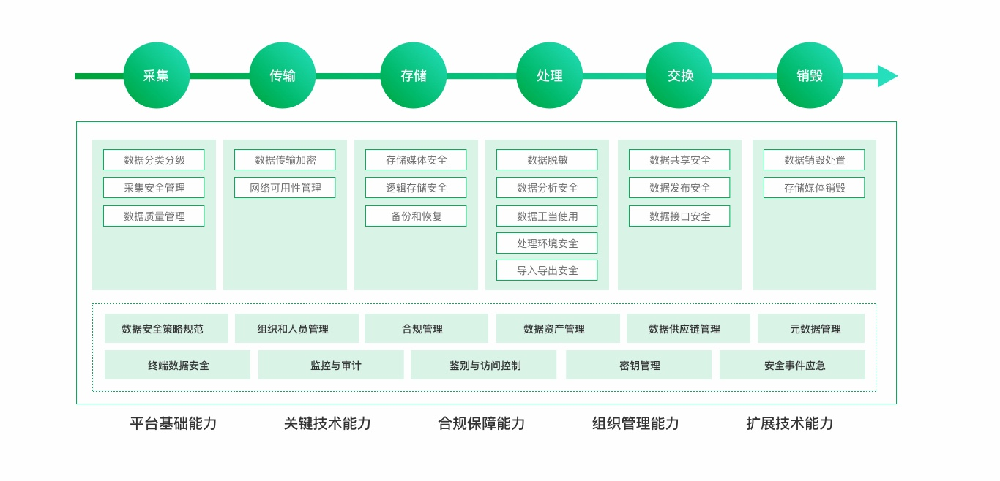

数据安全保护措施分为技术措施和管理措施。

- 技术控制措施：数据分类分级识别、数据传输加密、密钥管理、存储安全、数据脱敏、监控和审计、鉴别和访问控制、数据资产管理、以及终端数据安全。
- 管理措施及组织能力：数据安全策略规范、组织和人员管理、数据供应链管理、安全事件应急响应、导入导出安全、数据发布安全、以及数据正当使用。
- 云平台基础能力：网络可用性、存储媒介安全、备份和恢复、数据处理环境安全、数据销毁处置、存储媒介销毁。
- 其他可供参考的技术措施：数据安全分析、数据共享安全、数据接口安全以及元数据管理。

###### 密钥管理

数据库账号口令、服务器账号口令、SSH Key、访问密钥等凭据的泄露，是当今数据安全面临的主要威胁之一。
密钥的保护是数据安全保护措施中最基础的一项，为使用密钥、通用密钥提供保护措施能够保护数据不被泄露，保障企业数据安全。

不安全使用密钥的场景包括：

- 将密钥明文写在代码中；
- 直接使用 AccessKey/SecretKey 调用；
- AccessKey/SecretKey 没有区分应用或使用环境；
- AccessKey/SecretKey 没有定期轮转。

在平台，针对密钥管理，有以下最佳实践：

- 配置密钥和凭据的托管
- 使用凭据轮转提高密钥安全等级
- 为密钥访问设定访问控制策略
- 为密钥的使用开启安全审计

###### 数据静态加密

数据静态存储在云上时，需要执行数据静态存储加密。
需要这些存储具备存储加密的能力，确保用户存储在这些云服务中的数据是安全的。

###### 数据传输加密

**网络传输加密**

网络传输加密是指业务应用通过 HTTPS 协议传输数据，对 HTTP 网络传输协议进行安全认证，建议企业对外提供的关键业务进行网络传输加密。

###### 数据脱敏

敏感数据在使用的过程中，应根据实际使用场景进行一定程度的脱敏，数据脱敏也是满足数据相关安全法规的一项安全控制措施，
在执行数据脱敏的过程中，应注意数据脱敏的程度。从脱敏程度看分为了可逆和不可逆，企业需要结合实际脱敏场景来进行选择。

常见的可逆脱敏算法和方式如下：

1. 替换脱敏：部分可逆算法，适用于证件号等构成规则固定的字段脱敏。使用替换码表进行映射替换（可逆 Tokenization），
   或使用随机区间进行随机替换（不可逆），实现字段整体或者部分内容的脱敏。
2. 加密脱敏：可逆算法，适用于对需要回源的字段进行加密的场景。支持常见的对称加密算法。
3. 数据解密：可逆算法，适用于对需要回源的字段进行解密的场景。支持常见的对称加密算法。

常见的不可逆脱敏算法和方式如下：

1. 哈希脱敏：不可逆算法，适用于密码或需要通过对比进行敏感数据确认的场景。支持常见的哈希算法，并支持偏移量（加盐值）配置。
2. 遮盖脱敏：不可逆算法，适用于前端展示或敏感数据分享的场景。通过使用特殊字符（`*` 或者 `#`），对部分文字进行遮盖实现敏感数据的脱敏。
3. 洗牌脱敏：不可逆算法，适用于结构化数据列级别的数据脱敏场景。在源数据表抽取数据并确认数值范围后，
   对该字段（在范围内）进行列级别的打散重排和随机选择，实现混淆脱敏。

什么情况下需要进行数据脱敏：

1. 生产库向测试库转移生产数据并用于分析、验证、和测试时；
2. 在面向个人敏感数据对外使用时，如向第三方提供数据，向企业下游供应商提供数据；
3. 在可视化图表展示的时候，涉及一些敏感数据展示时需要进行脱敏处理；
4. 在面向合规监管处理一些个人敏感数据或企业重要数据时要进行数据脱敏。

**最佳实践**

数据脱敏是一项控制措施，但在什么场景和什么环节应用数据脱敏需要结合企业实际情况而定，我们列举了一些企业常见的数据脱敏实践供参考：

| 序号 | 场景 | 脱敏环节 | 数据脱敏方式 |
| ---- | --- | ------- | -------- |
| 1 | 面向前端、图标展示的场景中 | 在敏感数据输出在图标、大屏、前端 Web 页面环节时脱敏 | Web 代码中对敏感数据进行替换、遮盖等处理方式，敏感数据仍会在数据传输中体现，只是在展示时被替换。|
| 2 | 从生产库转移到测试库 | 在数据从生产 DB 转移到测试 DB 时脱敏 | 采用脱敏任务的方式进行脱敏，具体可参考道客数据安全模块的静态脱敏功能：创建脱敏任务创建脱敏模板和算法选择生产 DB 的敏感数据表选择测试 DB 的非敏感库表执行脱敏任务 |
| 3 | 数据产生并写入数据库前进行实时脱敏 | 在数据生产时进行实时脱敏，再写入数据库时已经是脱敏后的数据 | 采用动态脱敏的方式 |

###### 数据安全监控和审计

数据的安全监控和审计是指面向数据操作平面的监控和审计，如对于数据库、数据存储的访问行为监控，操作行为监控及审计。

数据安全监控和审计有利于事前发现风险和事后审计，面向云的数据安全监控和审计需要考虑的维度如下：

| 安全监控的维度 | 监控特征 | 特征描述 |
| ----------- | ------- | ------- |
| 流转异常 | 异常地理位置下载敏感数据 | 来自异常地理位置的数据下载可能是由于账号访问权限被外部攻击者获取，并导致数据泄露 |
| 异常终端下载敏感数据 | 来自异常终端的数据下载可能是由于账号访问权限被外部攻击者获取，或者员工使用非工作终端进行数据下载 | |
| 异常时间下载敏感数据 | 来自异常时间的数据下载可能是由于账号访问权限被外部攻击者获取，或者员工在非正常工作时间内进行数据下载 | |
| 初次下载敏感数据 | 账号首次下载敏感数据可能是由于账号被错误分配敏感数据下载权限，导致敏感数据泄露 | |
| 下载非常用敏感表 | 账号下载非常用敏感表可能是由于账号被错误分配敏感数据下载权限，导致敏感数据泄露 | |
| 文件下载量异常 | 账号文件下载量异常可能是由于账号访问权限被外部攻击者获取，或者员工恶意备份数据 | |
| 下载非常用 Bucket 内敏感文档 | 账号下载非常用敏感 Bucket 可能是由于账号被错误分配敏感数据下载权限，导致敏感数据泄露 | |
| 数据下载量异常 | 账号数据下载量异常可能是由于账号访问权限被外部攻击者获取，或者员工恶意备份数据 | |
| 下载非常用敏感库（IP 维度） | IP 访问非历史常用库可能是由于账号访问权限被外部攻击者获取，并导致数据泄露 | |
| 下载敏感数据的 IP 数量过多 | 使用过多的 IP 进行数据下载可能是由于账号访问权限被外部攻击者获取，并导致数据泄露 | |
| 异常频率下载敏感数据 | 使用过快的频率进行数据下载可能是由于账号访问权限被外部攻击者获取，并导致数据泄露 | |
| 异常下载敏感数据 | 来自异常数据下载可能是由于账号访问权限被外部攻击者获取，并导致数据泄露 | |
| 执行 SQL 语句异常 | 异常的 SQL 执行可能是由于账号访问权限被外部攻击者获取，或者员工在执行新业务 | |
| 行为异常 | 登录时间异常 | 来自异常时间的鉴权记录可能是由于账号访问权限被外部攻击者获取，或者员工在非工作时间访问数据 |
| 登录使用终端异常 | 来自异常终端鉴权记录可能是由于账号访问权限被外部攻击者获取，或者员工使用非办公终端访问数据 | |
| 登录地址异常 | 来自异常地理位置的鉴权记录可能是由于账号访问权限被外部攻击者获取，可能导致数据泄露 | |
| 多次尝试访问不存在的文件 | 出现多次尝试访问不存在的文件可能是存在外部攻击尝试 | |
| 多次尝试访问没有权限的文件 | 出现多次尝试访问没有权限的文件可能是存在外部攻击尝试 | |
| 登录密码连续错误 | 多次尝试错误的账号密码登录可能是由于攻击者在使用弱口令探测登录密码 | |
| 来自恶意源（威胁情报数据）的敏感数据下载 | 来自恶意源的下载可能是攻击者正在尝试攻击或者已经攻击成功 | |
| 配置异常 | 配置失当敏感项目未设置保护 | 包含敏感数据的项目未设置 Protection 标识，则该项目无法实现数据流出保护 |
| 配置失当敏感项目未设置标签安全 | 包含敏感数据的项目未设置 Label Security 标识，则无法控制用户对敏感数据的访问 | |
| 配置失当-敏感被设置为公开 | 包含敏感数据被设置为公开，则外部人员都可以通过接口访问到敏感数据 | |
| MySQL 白名单 IP 被设置为公开访问 | MySQL 实例 IP 白名单存在 0.0.0.0/0，则任何外部人员都可以连接到该实例，从而暴力破解登录密码 | |

数据操作审计需要企业针对数据存储的方式开启审计服务，数据审计有助于在事后分析安全风险，进行风险的溯源。
审计日志需要符合相关法规的安全要求，如等级保护中审计日志需要留存 180 天。

###### 数据安全访问控制

为企业数据的访问执行严格的访问控制，是比较有效的事前、事中的安全控制措施，安全访问控制建议遵循如下原则：

1. 最小化访问权限原则：尽可能细化到表、库级别的访问授权；
2. 暴露面最小原则：尽可能对存储数据或敏感信息的数据库设置私有访问，并集中到堡垒机或统一认证后进行访问，缩小数据暴露面；
3. 多因素认证：在访问云平台和关键数据时，需要进行多因素认证；
4. 敏感数据访问：对于敏感数据的访问需要有记录，或执行敏感数据访问申请等审批流程，但这往往会使数据的访问和使用增加额外的沟通和流程成本。

##### 应用安全

应用程序及相关数据作为承载云上业务的主体，一方面蕴含了重大业务价值，另一方面应用上云后云上攻击的成本和实施门槛大大降低，
更易受到恶意访问，因此保证应用程序及相关数据的机密性、完整性和可用性对于云上业务平稳、安全地运行十分重要。

###### 应用级别分类

云上业务应用的数量是十分巨大的，每个应用具备的业务价值和重要性是不同的，企业内部应梳理业务架构，评估业务链路中各应用的重要程度进行应用分类，
以此为参考进行安全防护的成本分配投入，企业可以更有针对性地制定安全策略和措施，将资源和注意力集中在最关键的应用上，
以最大程度地保护业务运作的安全性和可持续性。下面列举了一个参考示例：

1. 核心业务应用： 这些应用是企业业务的核心，直接关系到业务的正常运转和收益。例如，金融机构的核心银行系统、电子商务平台的交易系统等。
   对这类应用的安全性要求非常高，任何安全漏洞或中断都可能导致企业巨大的经济损失和声誉损害。
2. 敏感信息应用： 这些应用处理包含敏感数据的业务流程。例如，医院的病人信息管理系统、律所的案件管理系统等。
   对这类应用的安全性要求也很高，泄露或篡改敏感信息可能会导致法律风险、隐私侵犯和声誉受损。
3. 支撑业务应用： 这些应用在组织的日常运营中提供辅助功能，如人力资源管理系统、内部协作平台等。
   对这类应用的安全性要求较高，安全漏洞可能导致员工信息泄露、机密文件泄露或内部混乱。
4. 其他业务应用： 这些应用是组织运营中的其他业务系统，对运营的重要性相对较低。例如，企业的客户关系管理系统、会议管理系统等。
   对这类应用的安全性要求适度，需要保障数据的完整性和可用性，但对机密性和攻击风险的关注程度相对较低。

###### 定期进行渗透测试

对于云上业务来说，渗透测试是保障应用安全的一个重要方面。渗透测试是一种模拟真实攻击的黑盒安全测试，通过模拟攻击者的行为，
帮助企业发现应用存在的安全隐患，从而有效地减少未知的安全风险，提高应用的安全性。同时，渗透测试不应该只是一次性的，
而应该是定期进行的。随着企业应用的不断更新迭代，使用的新技术、新组件会带来新的安全风险；另一方面，攻击者的恶意访问手段总是不断进化。
以上两个现实情况导致了应用安全持续遭到挑战，即使应用在某一时期内通过了渗透测试，也不能确保永远处在一个安全的状态。

及时发现应用系统中存在的安全问题，包括业务应用逻辑漏洞、权限问题等安全工具无法有效检测的漏洞，
并给出修复方案，帮助企业修复这些漏洞。渗透测试的服务流程如下：

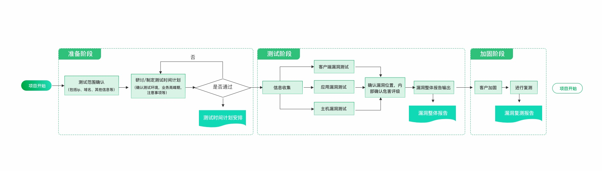

###### 定期的漏洞检测和评估

漏洞是指在硬件、软件、协议的具体实现或系统安全策略上存在的缺陷，从而可以使攻击者能够在未授权的情况下访问或破坏系统或者应用。
漏洞检测和评估旨在发现应用中存在的安全漏洞，并评估其对应用安全性的影响，帮助企业及时修复漏洞，提高应用的安全性。
漏洞检测分为自动化工具和人工发现两种，自动化工具只能检测常见的已知的漏洞，存在误报和漏报，也无法深入考量在企业业务场景下的修复建议。

###### 应用安全保护

应用安全的第一道防线是保护，从企业和道客两个角度，双方都需要做好应用安全保护的工作。从企业角度来说，
企业需要在应用开发之初就遵循一定的安全开发策略，尽量缩小攻击面。如，应用通信使用安全通信协议代替明文协议、
对重要敏感数据使用加密算法存储、应用返回统一定制化错误页面、核心代码封装防篡改、前后端分离防止暴露后台地址等。

**网站应用安全**

对网站业务流量进行恶意特征识别和防护过滤，只保留正常安全的流量回源到源站应用，
从而避免网站应用被恶意入侵导致安全问题，保护业务应用安全和数据安全。

安全模块关注多云场景下的主机、容器、虚拟机等工作负载的安全防护，提供平台资产管理、配置核查、主动防御、安全加固、云产品配置评估和安全可视化等核心能力，
同时结合云上海量日志、分析模型和超强算力，构建了云上强大的安全态势感知的综合能力平台，
可有效发现和阻止病毒传播、黑客攻击、勒索加密、漏洞利用、AK 泄露、挖矿等风险事件，帮助企业全方位提高安全应急响应能力。

**移动应用安全**

随着移动应用的普及和越来越多的用户的敏感数据在其中的存储，保护移动应用的安全性变得尤为重要。
安全漏洞和攻击威胁可能导致用户数据泄露、个人隐私暴露、金融损失以及身份盗窃等风险。
举例说明，道客安全认证服务，提供轻量级的多重认证接入服务，帮助企业实现账户密码防护和无密码认证，提高用户认证体验和安全性。

###### 开发安全培训

应用开发阶段建议围绕开发人员进行开发安全培训，安全培训也是 SDL 流程的起点，通过安全培训可以有效的在开发阶段避免一些常规问题，
再配合后期的业务安全测试、渗透测试，能够有效缩短开发周期，保障开发上线安全。

开发安全培训通常有标准的培训内容和课程，对于企业而言开发安全培训应该遵循以下几点：

1. 明确开发安全红线，了解哪些该做，哪些不该做，通过红线来明确开发安全的边界；
2. 制定开发安全培训的流程，通过建立认证机制，确保开发工程师有主观能动性进行培训课程的学习和理解；
3. 高危漏洞等定期进行案例的培训和分享；
4. 制定开发安全规范、代码规范等合规检查。

针对开发安全的培训内容，建议重点关注以下内容：

| 序号 | 开发关注点 | 安全风险 |
| ---- | -------- | ------- |
| 1 | 命令注入/执行 | 服务器被入侵 |
| 2 | 代码注入/执行 | 机密数据被窃取、服务器被入侵 |
| 3 | SSRF（服务端请求伪造攻击） | 内网敏感信息泄露服务器被入侵内网探测 |
| 4 | 反序列化漏洞 | 服务器被入侵 |
| 5 | SQL 注入 | 敏感数据大批量泄露拖库 |
| 6 | 任意 URL 重定向 | 钓鱼诈骗敏感信息泄露 |
| 7 | XSS（跨站脚本攻击） | 登录仿冒敏感信息泄露敏感操作执行 |
| 8 | CSRF（客户端请求伪造攻击） | 敏感操作执行 |
| 9 | 登录接口爆破 | 服务器入侵 |

### 监控和分析

监控云上资源，系统的安全状况，找出业务系统可能存在的漏洞，对可疑活动的告警作出反应，
或是针对企业日常活动中的安全事件进行追溯，是构建业务安全机密性、完整性、可用性重要的一环。

#### 监测控制

通过运用平台的多种监测控制手段，以此来感知不同级别的威胁，进行分析判断，采取相应的措施，并可针对自身的业务量身定制监控和检测控制。
针对监测控制，有以下最佳实践：

- 网络管理：创建隔离分层的网络，有助于对相似的网络组件进行逻辑分组，还缩小了未经授权的网络访问的潜在影响范围。
  针对应用对外访问网络，可以通过访问控制策略，对 VLAN 的访问权限进行控制。
- 权限管理：权限管理对于业务来说是非常重要的，不同的角色有不同的权限，对每个用户分配最小够用权限，
  能极大的防止各种越权操作，从而有效减少由于操作不当带来的故障和安全问题。
- 配置审计：当使用大规模资源时，需要监管资源配置的合规性，通过使用配置审计服务，可监控管理账号下的资源变更，追踪配置变更历史，并实时地完成合规性审计。
- 操作审计：日常通过操作审计，可记录管理账号下用户登录及资源访问操作，以此实现安全分析、入侵检测、资源变更追踪以及合规性审计。
  也可将账号下的行为事件下载或保存到日志服务或对象存储，然后进行行为分析、安全分析、资源变更行为追踪和行为合规性审计等操作。

#### 日志报警

日志提供了服务和应用程序的第一手信息，保留安全事件的日志，为审计，调查安全事件，系统安全的维护等提供了强有力的保障，
确保了部署在云上资源的可用性、业务的正常运行和健康度。因此对日志的合理管理是保证业务安全的首要条件。

日志的管理包括日志的收集，安全存储，分析和告警的生成，针对日志管理，有以下准则：

- 日志收集：需从平台的各种资源，服务，应用程序中收集日志，其次收集应尽可能是非侵入的；
- 安全存储：保留期限应是灵活可配置的，需根据安全要求、合规要求、不同云产品特点，设置合理的日志保存时间，
  其次日志数据的存储应是安全防篡改的，严格控制各类身份对于该日志的权限，尤其是写、删类型的权限；
- 日志查询：在满足运营，业务和安全要求的基础上，选择合理并可供实施的日志查询机制；
- 日志分析：需对异构源的日志规范化并形成通用格式，是日志分析所必需的，其次应全面的分析以了解当前系统的安全事件；
- 告警生成：告警应是实时，准确，可触达的（应该有尽可能多的通知机制），其次每种类型的告警都要有可运行的应急补救措施。

### 安全响应

应急响应通常是安全事件发生后，或正在发生过程中，采用的一系列延缓攻击或阻断攻击的流程、手段和方法。应急响应也包含前、中、后三个节点。

通常情况下我们将应急响应的阶段划分如下：

1. 应急响应前：应制定应急响应事件的分类分级、预案、响应剧本等，这也是应急响应比较难的一部分。
2. 应急响应中：通过对相应事件的监控，实时发现安全事件，并第一时间启动应急预案，进行风险的快速阻断或延缓。
3. 应急响应后：企业应对安全事件进行复盘，并优化更新应急响应流程、预案、剧本等。

#### 应急响应的分类分级

平台的应急响应应该根据不同类别的安全事件进行定义和定级，并通过事前做好的预案和响应剧本进行快速的响应。

根据过往的安全经验和平台的安全威胁，应急响应的事件根据攻击类型可大致分为以下几类：

| 应急事件类别 | 示例 | 示例描述 | 建议等级 | 参考等级说明 |
| ---------- | --- | ------- | ------ | --------- |
| 应用安全类事件 | Web 入侵 | 如服务器遭受 SQL 注入攻击 | 高 | 应用类安全事件可通过防火墙等安全设施进行识别或拦截，防火墙告警中会包含该事件的严重等级，等级建议根据攻击事件的类别而定 |
| 系统安全类事件 | 勒索病毒 | 系统遭受勒索病毒攻击，核心数据被加密 | 高 | 系统事件往往会来自安全模块，安全模块同样会对入侵事件进行定级，建议参考安全模块的定级说明 |
| 故障稳定性类事件 | 云稳定性事件 | 网络或应用宕机 | 高 | 稳定性事件通常情况下是高风险事件 |
| 其他事件 | 数据泄露 | 外部情报监控或舆情显示内部核心机密外泄 | 高 | 数据泄露需要根据泄露的数据内容、真实性、实际业务风险、舆情风险而定 |
| 漏洞类事件 | log4j 漏洞 | 重大影响漏洞 | 高 | 漏洞建议根据漏洞的影响来判定事件的等级，如安全模块会发布应急漏洞，此类漏洞一旦发现，建议按照高优先级进行处理 |

#### 应急响应预案

应急响应预案包含应急响应的流程和处理办法，通常情况下应急响应的流程至少应包含如下阶段：

1. 监控和发现应急事件
2. 确认漏洞、事件的真实性
3. 确认漏洞、事件的影响面、责任人和相关业务
4. 确认响应方案，延缓攻击或止血方案等
5. 事件分析、溯源、信息记录
6. 事件复盘

#### 自动化应急响应执行

自动化应急响应剧本的设计和执行能够帮助企业安全运营和管理人员在应急事件发生的第一时间快速行动起来，
通常情况下根据应急事件的分类可以设定一些自动化的剧本触发条件和剧本策略。并与事件告警模块进行配合。

## 稳定性

系统稳定性是指系统在运行过程中面对各种非预期事件影响下能够持续提供可靠服务的能力，是系统建设的重中之重。
但随着各公司业务范围的扩展和软件系统架构持续迭代升级，系统的复杂度随之增加，面对更多的非预期事件风险，
如各类软硬件故障、错误的变更、突发流量，甚至到光纤挖断、自然灾害等引起的整个机房不可用情况，如何保障系统稳定性具有很大挑战。

一个稳定的分布式系统需要能够快速适应变化，及时发现和解决问题，并且能够保持系统的一致性和可靠性。
稳定性通常包含系统可用性、可靠性、可观测性、可运维性、可扩展性、可维护性等。
使用云计算平台服务可以更好的构建系统稳定性，例如云计算平台可以根据系统的实际需求，动态分配和释放计算资源，
使得系统更容易扩展，降低系统负载压力，从而提高系统的可扩展性。再者云计算平台会提供冗余存储和备份能力，
避免系统因为硬件故障或其他原因导致的停机或数据丢失。这种备份机制可以提高系统的可靠性。

道客云平台提供高可用的基础设施，并提供应用稳定性相关工具体系。
用户可以基于道客提供的产品及本框架中定义的最佳实践入手，来建设云上应用的稳定性。

### 设计原则

在分布式系统中，需要考虑的稳定性问题比较复杂，贯穿软件系统设计态、研发态、运维态、运行态，覆盖从 IaaS、PaaS 到上层 SaaS 系统，
所有这些都可能会影响系统的稳定性。为了确保系统能够持续稳定地工作，建议遵循以下设计原则。

#### 面向失败的架构设计原则

众所周知，系统异常事件是不可避免的，如网络延迟、硬件故障、软件错误、突峰流量等，建议在系统设计阶段就要从这些异常事件引起的系统执行“失败”出发，
提供冗余、隔离、降级、弹性等能力，旨在确保系统的高可用性和高可靠性，以应对不可避免的故障和意外发生。

#### 面向精细的运维管控原则

由于业务的扩展和系统服务进一步拆分，分布式系统的复杂度剧增。再加上产品迭代加快，版本繁多，同时某些业务对实时性有较高要求，
运维的不确定性和复杂性大幅增加。建议通过精细化的管理和可观测手段，如版本控制、灰度发布、监控告警、自动巡检等手段，旨在提高运维效率、确定性和稳定性。

#### 面向风险的应急快恢原则

在一些场景下，即使设计了各种技术手段去提高系统的冗余、保持业务的高可用，但还是避免不了生产系统故障的发生，
所以需要面对故障建立一个高效的故障应急流程机制和稳定的技术平台，实现故障风险实时发现、应急团队有效协同、处理过程准确记录、故障快速止损和恢复以及后续故障复盘，
旨在提高故障应急效率，减小故障影响，降低类似故障的再次发生，提升系统整体高可用性。

### 设计方案

基于稳定性支柱设计原则，整体稳定性设计方案可参考如下：

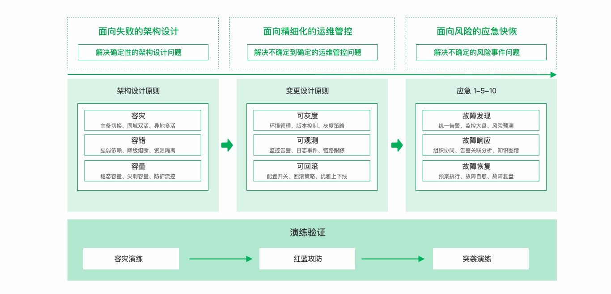

#### 架构设计原则

软件系统从所有的功能都在一个应用程序内运行的单体应用架构，到不同的功能模块分别部署在不同的服务器上的传统分布式应用架构，
再到服务细分通过轻量级的通信机制进行互相调用的微服务架构，到现在将云计算、容器化、微服务架构等技术结合起来的云原生架构。
在软件系统架构演进中不变的是系统的基本属性，包含存储、计算和网络，变的是存储、计算和网络的实现方式和规模，
往大规模、高性能、高可靠、易扩展等方向迭代演进，所以对架构稳定性提出了更高的要求。

系统可预见的稳定性风险包含软硬件故障和不可预期的流量，小到线程级风险，大到地域级灾难，从此出发可通过容灾、容错、容量三方面建立系统架构稳定性。

##### 容灾

容灾就是在灾难发生时，在保证生产系统的数据尽量少丢失的情况下，保持生存系统的业务不间断地运行。异地多活、同城双活都属于容灾的范畴。
借助多区域（Region）能力，应用可以用较小成本来完成容灾架构部署。

容灾需要具备较为完善的数据保护与灾难恢复功能，保证生产中心不能正常工作时数据的完整性及业务的连续性，
并在最短时间内由灾备中心接替，恢复业务系统的正常运行，将损失降到最小。

##### 容错

容错是指在分布式系统中，系统出现故障时，通过设计和实现可靠的机制和策略，使系统能够自动检测、排除或者纠正错误，
保证系统能够正常运行，从而提高系统的可靠性和稳定性。

##### 容量

容量是在一定时间内，系统能够处理的最大工作量或数据量，或指系统所能够承载的最大负载。
系统容量与系统的硬件、软件、架构以及网络带宽等因素密切相关。
在云上，还需要关注单个道客账号下的云服务配额，避免因触及云服务配额限制导致的业务故障。

#### 变更设计原则

在企业的运维管理与运行过程中，就会有变更产生。变更是指添加、修改或删除任何可能对服务产生直接或间接影响的内容。
当变更失败时可能会带来严重后果：业务中断、客户舆情等等一系列问题。为了降低变更带来的业务风险，需要遵循变更设计原则： **可灰度、可监控、可回滚。**

##### 可灰度

可灰度，需要建立起完整的灰度发布机制，完善的灰度机制有助于变更失败时降低业务影响，提升用户体验。

灰度发布机制包含但不限于以下几点：灰度方式、灰度批次、间隔时间、灰度观测等。灰度发布需注意：

1. 灰度间隔时间：合理设定灰度间隔时间，不宜过长。过长的灰度间隔时间可能导致下游应用出现数据不一致等问题。
2. 灰度发布方式：合理选择灰度发布方式，可按用户、按区域、按渠道等方式进行灰度，避免出现灰度过程中用户体验不一致的问题。
3. 灰度发布批次：建议先小范围的进行灰度验证，再逐步扩大灰度范围。
4. 灰度观测指标：明确灰度期间的可观测指标，用于判断发布结果，避免造成连锁反应。

##### 可回滚

大部分变更要做好应急恢复手段，最常用的技术手段就是回滚。

理论上回滚永远是最合适最有效的方法，当问题发生时，保证业务连续运行永远是第一要义。实际中可能存在其他解决方案，但后果无法预料，所以选择回滚是最好方式。

在发布时建议多版本小更新，避免因变更版本跨度较大，带来的系统依赖关系问题导致无法回滚。

##### 可观测

在变更过程中，会影响到现有环境以及上下游业务，通过对业务、链路、资源等做到可观测，就能够第一时间发现问题。
在观测过程中，关注业务指标（如下单成功率）和资源指标（CPU、内存、负载等）。
当指标较多时，优先关注高优先级的业务指标，业务指标能够最直观反映当前系统状况，当业务指标发生变化时，往往资源指标也会有相应的变化。

变更前需准备好对应的检查清单。在变更期间，要做到持续观察监控数据，确定是否有负面影响或问题。
在变更结束后，对变更前后的业务指标进行对比，没有问题后才结束变更。

#### 应急响应机制

应急响应机制的关键点在于事件发生后，有标准的操作流程和动作。道客在过去近十年的安全生产过程中，沉淀了一套故障应急响应机制，
简称应急响应 1-5-10。是指在 1 分钟内发现故障，5 分钟内组织相关人员进行初步排查，10 分钟内开展故障恢复和处理工作。
企业在设计应急响应机制时，可以参考该方式明确响应期间的标准动作和流程，确保在事件发生时，相关干系人都能够明确自身职责和所需要采取的措施。

##### 故障发现

故障一旦发生，越早发现故障，能够越早进行响应。建议通过以下途径实现故障的快速发现：

- 统一告警：在发现故障后，需要将相关信息及时告知相关人员，包括系统管理员、运维人员等。
  可以通过短信、邮件、企业微信等方式进行告警，确保所有相关人员第一时间得知故障情况，以便快速组织应急响应。
- 监控大屏：监控大屏是指将所有系统的运行情况以图形化的方式展示在屏幕上，以便实时监控系统健康状况。
  在发生故障时，监控大屏可以快速反应故障情况，并提供相关数据，为故障排查及处理提供依据。
- 风险预测：风险预测是指在发生故障前，通过数据分析、机器学习等方式，预测系统的风险情况，提前进行预防和处理。
  在故障应急响应中，风险预测可以作为重要参考，帮助快速识别问题的根本原因，提高故障处理效率和精度。

##### 故障响应

在发现故障后，需要快速定位问题，通常有以下做法：

- 组织协调：故障发生后，需要迅速组织相关人员进行应急响应。组织协调包括设置指挥中心、确定应急响应流程、分配任务等。
  这些工作的目的是提高应急响应的效率和准确性，让每个人都清楚自己的任务和责任，避免出现混乱和误操作。
- 告警关联分析：在故障发生时，系统会自动产生告警信息。为了更好地定位故障原因，需要对各种告警信息进行关联分析。
  这样可以快速确定故障的范围和影响，并且能够帮助排查故障的根本原因。告警关联分析可以使用各种工具和算法，如事件关联分析、机器学习等。
- 知识图谱：知识图谱是指通过将各种数据和知识进行关联和组织，建立一种知识库或知识图谱，以便在故障发生时快速定位和解决问题。
  在应急响应中，知识图谱可以指导故障排查和处理工作，提高效率和准确性。知识图谱可以使用各种工具和技术，如自然语言处理、图数据库等。

##### 故障恢复

定位故障原因后，按照应急预案快速恢复业务，并在事后进行复盘总结。

- 预案执行：在故障响应的过程中，需要按照事先制定的应急预案进行执行。
  应急预案包括了应急响应流程、各个岗位的职责、处理流程等。预案执行能够保证故障恢复和处理的规范化和标准化。
- 故障自愈：故障自愈是指系统自动检测到故障并采取自动恢复措施。
  故障自愈技术可以帮助故障恢复和处理更加快速和准确。例如，利用容器技术，系统可以自动迁移容器来解决故障。
- 故障复盘：故障复盘是指对故障进行分析和总结，以便更好地避免故障的再次发生。在故障复盘过程中，
  需要对故障的起因、影响、处理过程等进行详细的记录和分析，并制定相关的措施。
  故障复盘也是一种学习和提高的过程，能够不断完善系统和提高团队的应急响应能力。

#### 演练常态化

故障演练提供了一种端到端的测试理念与工具框架，本质是通过主动引入故障来充分验证软件质量的脆弱性。
从提前发现系统风险、提升测试质量、完善风险预案、加强监控告警、提升故障应急效率等方面做到故障发生前有效预防，
故障发生时及时应对，故障恢复后回归验证。基于故障本身打造分布式系统韧性，持续提升软件质量，增强团队对软件生产运行的信心。
故障演练可分为方案验证的容灾演练、稳定性验收的红蓝攻防，以及故障应急验证的突袭演练。

##### 容灾演练

容灾演练是通过模拟实例、机房或地域级故障，判断系统服务的逃逸能力，验证系统的容灾能力以及面对灾难时的应对能力。
容灾演练可以帮助企业更好的验证 RPO、RTO 指标，及时发现和解决相关问题，提高系统的可用性和可靠性。

##### 红蓝攻防

红蓝攻防是在想定情况诱导下进行的作战指挥和行动演练，是部队在完成理论学习和基础训练之后实施的，
近似实战的综合性训练，是军事训练的高级阶段。演习通常分为红军，蓝军，多以红军守，蓝军进攻为主。

红蓝攻防不仅能够用于安全演练，在稳定性演练中同样适用。在稳定性攻防中，蓝军从第三方角度发掘各类脆弱点，
并向业务所依赖的各种软硬件注入故障，不断验证业务系统的可靠性。而红军则需要按照预先定义的故障响应和应急流程进行处置。
在演练结束后，建议针对故障中的发现、响应、恢复三个阶段的时长和操作内容进行复盘，并梳理改进点进行优化，提升业务系统的稳定性。

##### 突袭演练

突袭演练是一种手段以及目标对红军不透明的组织形式。通过突袭演练可以全面检验技术团队在面对突发故障时的应急和恢复能力，
提升人员的安全意识。在突袭演练中，红蓝双方是纯对抗的关系，因此对红蓝双方提出了更高的要求，蓝军不仅需要了解目标系统的薄弱点，
更需要了解目标系统的业务，红军不仅仅需要修复故障，还需要快速的发现故障和有效的应急协同。
相比较计划演练，突袭演练涉及到的人员、场景、流程也会更加复杂，同时不但确保演练计划的私密性，还需要充分评估在红军未及时处理故障时的影响面控制。

### 高可用架构设计

#### 容灾

容灾，就是在灾难发生时，在保证生产系统的数据尽量少丢失的情况下，保持生存系统的业务不间断地运行。异地多活、同城双活都属于容灾的范畴。

容灾需要具备较为完善的数据保护与灾难恢复功能，保证生产中心在不能正常工作时数据的完整性及业务的连续性，
并在最短时间内由灾备中心接替，恢复业务系统的正常运行，将损失降到最小。

##### 网络架构容灾

网络是数字世界的基础设施，没有网络的联通，所有信息都无法交互，因此网络架构的设计在应用系统中至关重要，
特别是针对网络架构的高可用及容灾能力的设计，是业务在异常发生时，实现快速恢复、降低业务损失的关键。

###### 网络规划设计

为满足网络安全、可扩展及高可用的需求，网络规划设计应满足以下原则：

- 预留 IP 地址空间用于网络扩容
- 在单个 Region 中，预留 IP 地址空间用于新建 VLAN；
- 在单个交换机中，需要关注交换机的剩余可用 IP 地址数目。
- 规划不同 Region、可用区及业务系统的 IP 地址空间
- 在单个 Region 中，根据业务需求规划不同的 VLAN，各 VLAN 使用独立的 IP 地址空间；
- 部分服务可能短时间占用较多 IP 地址，可考虑针对性规划交换机避免 IP 地址资源不足。

###### 网络互联方案设计

大型企业一般都会有多个部门，每个部门又由多个团队组成，例如开发、测试、运维等。不同部门和团队使用云产品时，
一般会使用多个 VLAN 把业务隔离，不同的 VLAN 承载不同部门或团队的业务。
但不同团队和部门间在特定场景下也需要互相访问双方的服务，这时就需要实现不同 VLAN 间的互通。

###### 互联网出口设计

在设计云上互联网出口建设方案时，应满足以下原则：

- 避免不必要的公网暴露
- DCE 使用公网 IP 时，通过安全组限制端口暴露面；
- 用网络出入口服务（如负载均衡 LB、EgressGateway）为 DCE 云服务提供公网访问入口以及流量统一出口，而非直接在 DCE 上使用公网 IP。
- 合理使用出口网关实现云上公网访问
- 合理使用共享带宽提升公网访问能力
- 建议不同流量模型的业务使用不同的共享带宽实例，降低业务成本；
- 建议有资源隔离需求的业务配置单独的共享带宽实例。

###### 混合云互通高可用设计

随着企业逐步将新增业务、对外业务系统部署至云上，一些原有自建 IDC 机房的企业就需要打通云上平台和 IDC 以组成混合云。
同时部分企业为了进一步提升业务高可用，也会使用多家云厂商的资源，以实现单家云厂商故障时，业务的快速逃逸，因此不同云厂商之间的往来互通也是混合云组网的必要条件。

实现混合云组网建设应满足以下原则：

1. 链路冗余性：在混合云组网中需要至少两条线路进行冗余或者主备负载，当一条链路异常的时候可以切换到另外一条线路。实现链路冗余大体可以分为以下几类：
    - 双专线冗余：通过两条专线与 IDC/其它云互通，其中一条链路中断可以快速切换到另外一条线路，需要注意在进行专线接入的时候尽可能选择两个不同的专线接入点提升高可用。
      如果为了满足业务对延迟等需求，必须选择相同接入点，也必须保证两条专线在两个不同的接入设备上，这样即使有一台设备故障导致其中一条线路异常时，也可以保证另外一条线路正常运转。
    - 专线/VPN 主备：在物理专线、IPSec-VPN 连接均正常运行的情况下，VLAN 实例可以通过物理专线和 IPSec-VPN 连接同时学习到本地 IDC 的网段，
      本地 IDC 也可以通过物理专线和 IPSec-VPN 连接同时学习到 VLAN 实例的路由。系统默认通过物理专线学习到的路由的优先级高于通过 IPSec-VPN 连接学习到的路由，
      因此 VLAN 实例和本地 IDC 之间的流量默认通过物理专线传输。当物理专线异常时，系统会自动撤销通过物理专线学习到的路由，通过 IPSec-VPN 连接学习到的路由会自动生效，
      VLAN 实例和本地 IDC 之间的流量会通过 IPSec-VPN 连接进行传输；当物理专线恢复后，VLAN 实例和本地 IDC 之间的流量会重新通过物理专线进行传输，
      IPSec-VPN 连接会重新成为备用链路。此方案相比双专线冗余方案可节约成本，因 IPSec-VPN 成本较专线更低。但 IPSec-VPN 可承载流量上限一般不超过 1Gbps，对于流量较小的业务可以采用此方案。
    - VPN 冗余：如果本地数据中心拥有多个本地网关设备（本地网关设备上均拥有公网 IP 地址），用户可以使用其中的 2 个本地网关设备分别与
      VLAN 建立 IPSec-VPN 连接，每个 IPSec-VPN 连接关联不同的 VPN 网关，实现本地数据中心与 VLAN 之间链路的高可用，
      同时实现流量的负载分担。本地数据中心可以分别通过两个 VPN 网关学习到 VLAN 的路由，本地数据中心去往 VLAN 的流量可以同时通过这两个 VPN 网关进行传输，
      实现流量的负载分担。在其中一个 VPN 网关不可用时，当前 VPN 网关下的流量默认会自动通过另一个 VPN 网关进行传输，实现链路的高可用。
      VLAN 可以分别通过两个 VPN 网关学习到本地数据中心的路由，但是 VLAN 默认仅通过一个 VPN 网关（系统优先选择实例 ID 较小的 VPN 网关）转发从
      VLAN 去往本地数据中心的流量，在当前 VPN 网关不可用后，才会通过另一个 VPN 网关转发流量（系统自动切换），
      因此 VLAN 去往本地数据中心的流量可以通过两个 VPN 网关实现链路的高可用，但不支持负载分担。
2. 带宽容量设计：在选择混合云互通方案的时候，一定要考虑互通的带宽容量需求，不同的带宽对方案的选型至关重要，例如大型企业对混合云流量需求较大，可达到数 Gbps 或者上百 Gbps，
   此时就需要使用冗余专线的方案，而且需要确保冗余专线的水位保持在 50% 以下，达到或者接近 50% 就需要及时扩容，因为两条专线都在 50% 的水位运行，当有一条线路异常的时候，
   流量就会全部负载到另外一条线路，导致另外一条线路水位达到 100% 无法承接所有流量从而影响业务。
3. 链路快速倒换：如果企业已经实现了冗余线路打通 IDC，也需要通过技术方案实现异常时的快速切换。

###### 业务服务高可用设计

现在企业对业务可用性要求越来越高，但是物理设备异常，应用异常，网络抖动等情况无法避免。为应对异常情况就需要设计服务的高可用。
如果业务只使用单节点 DCE 服务器对外提供服务，假设此台 DCE 业务异常就会导致业务受损，而且恢复时间往往无法预估。
但是如果配置多台服务器直接对外提供访问，业务上又需要将域名解析到多个 DCE 外网 IP，当 DCE 服务很多的时候就会导致解析数量巨大不易于管理，而且不利于弹性扩缩容。

为实现服务高可用的目标可以使用负载均衡。负载均衡代理多台后端真实的业务服务器对外服务，真实服务器不对外暴露，
也无需配置公网 IP。当某台后端服务器异常时候，负载均衡可以自动的隔离服务器，使业务转发到正常的服务器上继续提供服务从而达到业务高可用的能力。

负载均衡实例采用相关硬件产品/软件产品，可实现会话同步，以消除服务器单点故障，提升冗余，保证服务的稳定性。

**后端实例的高可用**

负载均衡通过健康检查来判断后端实例的可用性。健康检查机制提高了前端业务整体可用性，避免了后端 DCE 异常对总体服务的影响。

开启健康检查功能后，当后端某个实例健康检查出现异常时，负载均衡会自动将新的请求分发到其他健康检查正常的实例上，
而当该实例恢复正常运行时，负载均衡会将其自动恢复到负载均衡服务中。为了使健康检查功能正常运作，需要开启并正确配置健康检查。

###### 流量容灾调度

随着互联网的快速发展，为保证业务的持续高可用，同城多活、异地多活已成为各企业的不二之选。服务设置多中心，中心内部多地址负载，
是多数企业采用的常规做法。这种情况下，如何对流量进行有效控制以达到最佳的用户访问效率、部分地域业务异常如何快速业务容灾到其他地域，
业务具备全国流量调度以及容灾能力变得尤为重要，列举其中几个典型场景。

- 业务需要实现用户就近访问服务中心减少网络耗时。
- 服务中心多个 IP 地址如何实现负载均摊或者权重轮询，且保证整体负载的稳定性。
- 服务中心某 IP 地址故障后，快速发现并实现隔离，地址恢复后自动添加至解析列表，完全无需人为干预。
- 当某中心故障发生时，快速切流到其他中心，减少中断时间。

**异地容灾**

下面以异地双活为例介绍如何实现快速容灾切换。
如下图所示，某服务的用户主要分为海外用户和中国或中国内地用户，后端服务采用一套部署方案。
对不同地区用户请求进行智能调度，将用户访问请求流量路由至不同的接入服务点。
当某站点发生故障灾难时，各接入站点自建互相备份，最终实现业务的高可用。


**容灾预案**

此外，全局流量管理新增的容灾预案功能可以帮助用户实现日常容灾演练，或在应用服务出现故障时实现快速切换流量。
容灾预案支持批量地址池故障模拟及回滚，帮用户验证切换策略是否符合预期。

##### 应用容灾

“应用多活”是“应用容灾”技术的一种高级形态，指在同城或异地机房建立一套与本地生产系统部分或全部对应的生产系统，
所有机房内的应用同时对外提供服务。当灾难发生时，多活系统可以分钟级内实现业务流量切换，用户甚至感受不到灾难发生。
“同城多活架构”和“异地多活架构”都是典型的应用多活实现技术。

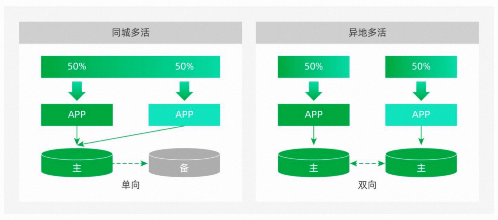

###### 应用多活的优势

- **分钟级 RTO：** 恢复时间快。
- **资源充分利用：** 资源不存在闲置的问题，多机房多资源充分利用，避免资源浪费。
- **切换成功率高：** 依托于成熟的多活技术架构和可视化运维平台，相较于现有容灾架构，切换成功率高。
- **流量精准控制：** 应用多活支持流量自顶到底封闭，依托精准引流能力将特定业务流量打入对应机房，企业可基于此优势能力孵化全域灰度、重点流量保障等特性。

###### 应用多活的设计标准

应用多活定位是一套支持跨地域、跨平台的通用多活架构方案。应用多活架构的标准架构，需要满足以下设计标准：

- 业务流量多活：应用多活的最终呈现是业务，多活容灾系统具备按照业务特征进行生产流量的精细化调配。
- 同城多活：应用是分布式系统的最小服务集合，当主中心出现问题进入容灾态时，要具备全局或局部应用的多活切换能力。
- 异地多活：在超远距离（机房间距超过 300 公里）时，业务系统仍具备较好的访问性能。进入容灾态时，RTO、RPO 在分钟级。
- 混合云多活：向上对业务屏蔽容灾细节，提供统一的多活编程范式。
  向下对云平台技术保持兼容，支持公有云、私有云、托管私有云、边缘计算节点等不同部署模式的多活场景。

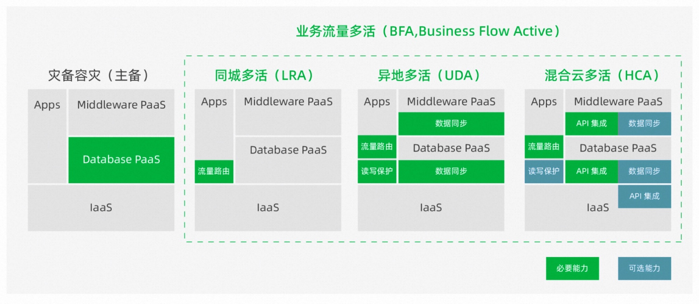

###### 应用多活的典型架构

**同城场景的应用多活**

同城应用多活，顾名思义就是分布在同城多个机房内的应用同时对外提供服务。同城机房物理距离较小 （物理距离小于 100 公里）。
同城场景下多机房的网络、服务互通，某机房局部故障会影响到全局，爆炸半径不可控。应用多活架构的难点，在于机房之间的流量路由和隔离。
当某机房出现故障，可以做到机房级的快速切换。更精细化的场景，如果是某中心内某应用的故障，还需要做到应用级的切换。

为了实现机房间的流量调度，同城应用多活架构下，建立多个服务部署的逻辑区，这个逻辑区称之为“单元格（Cell）”。
每个单元格内的业务流量尽可能的在本区域内调用优先。由于同城跨机房 RT 较小，因此多个单元格的云服务采用单集群模式，
从而可以避免数据一致性上的复杂度。同城应用多活的架构如下图所示：

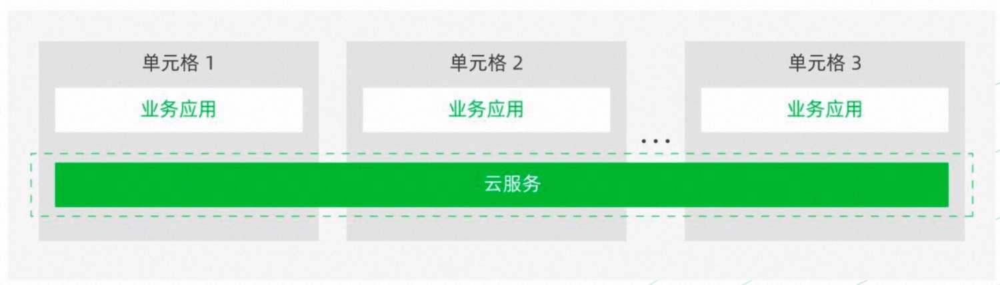

同城应用多活对应用系统的代码侵入较小，基于灵活的流量调度和单元格间的流量路由，能做到故障场景下的业务快速恢复，实现业务恢复与故障恢复的解耦。

**异地场景的应用多活**

同城近距离的容灾建设难以抵御地域级别的灾难，参考银行业的容灾标准，灾备中心建设都要求满足“三不原则”
（即灾备中心与生产中心不应设立在同一地震带，同一江河流域，同一电网），因此异地灾备中心一般距离生产中心 300 公里以上。

异地应用多活，顾名思义就是分布在异地多个机房内的应用同时对外提供服务。在异地超远距离的场景下建设应用多活，
最大的挑战在于超远距离带来的网络延迟。由于网络延迟大，云服务很难跨地域的以单集群的模式提供服务，而多集群模式下会带来数据一致性的复杂度。

解决单集群无法突破物理距离限制的问题，核心思路在于对数据进行分片，通过自上而下的流量路由，
让特定分片的数据到特定中心完成读写，以此解决数据一致性的问题，并在此基础上解决了业务的容灾和水平扩展问题。这个可以水平扩展的逻辑中心称为“单元（Unit）”。

单元分为两种类型，中心单元与普通单元。单元内部署的业务分为三种类型，全局业务、核心业务、共享业务。中心单元只有一个，
部署全局业务、核心业务、共享业务。普通单元部署核心业务、共享业务，普通单元具备水平的扩展能力，可以任意复制。

- 全局业务：强一致性的业务，在中心单元写，在中心单元读。
- 核心业务：做应用多活拆分的业务，在普通单元写，在普通单元读。
- 共享业务：被核心业务高频依赖的全局业务读服务，在中心单元写，在普通单元读。

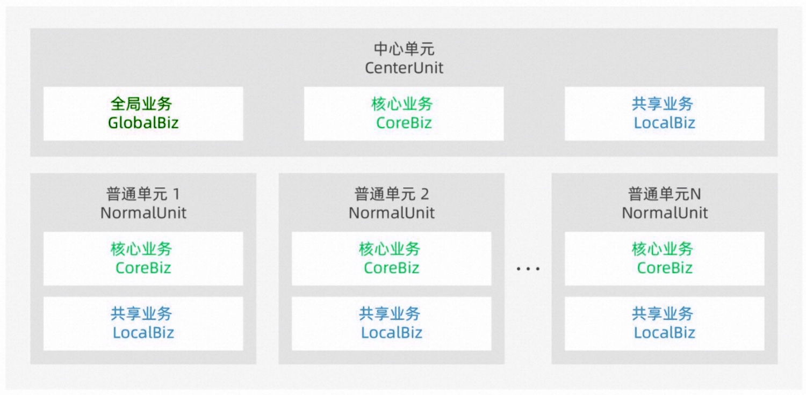

**混合云场景的应用多活**

混合云融合了公有云、私有云、托管私有云、边缘计算节点等不同部署模式，面向企业云上基础架构、中间件、开发全生命周期和/或应用平台的各种能力需求，
为云上开发、构建、运维、运营、管控等各种技术与业务实践提供支持。

经数据统计表明，目前企业选择上云时多云和混合云是主流趋势：

| 上云方案                | 市场占比 |
| ----------------------- | -------- |
| 多个公有云 + 多个私有云 | 43%      |
| 多个公有云 + 一个私有云 | 29%      |
| 一个公有云 + 多个私有云 | 12%      |
| 一个公有云 + 一个私有云 | 9%       |
| 一个公有云/私有云       | 7%       |

混合云应用多活，顾名思义就是分布在混合云平台的应用均对外提供服务。混合云应用多活架构是在多云和异构场景衍生的容灾架构方案，
将业务恢复和云基础架构、云服务解耦。混合云多活管理产品对开发者和上层用户屏蔽混合云容灾的复杂度，提供一致的开发、运维、运营体验。

为了实现多云集成与数据互通，混合云多活管理需要有多云适配来屏蔽底层的差异，主要依靠三大核心功能：

- 云服务接口适配，对下通过插件化支持多云适配，对上提供统一的云服务接口。
- 数据模型适配，对云的账号、权限、资源、数据进行抽象，屏蔽多云的数据差异。
- 统一容灾接口，提供标准化的容灾定义和接口，利于异构云异构技术栈的快速接入。


###### 应用多活的技术方案

应用多活的技术方案一般分为三部分，分别为应用层、数据层和云平台。三部分组件遵循应用多活的设计标准，支撑应用构建应用多活架构能力。
应用层是业务应用流量主经的链路，基本构成可分为三部分：

- 接入网关：接入网关作为业务流量打入机房的第一跳，负责应用多活入口流量的识别和分发，具备机房路由和应用路由两个核心能力。
- 微服务：业务流量在机房内部和跨机房的同步调用方式，一般有 Consumer、Provider、注册中心等角色，具备流量路由、流量保护、故障隔离三个核心能力。
- 消息：业务流量在机房内部和跨机房的异步调用方式，基于消息削峰填谷，一般有 Producer、 Consumer、Broker 等角色。

数据层涵盖业务应用数据读写、数据存储和数据同步，其具备流量路由、数据一致性保护、数据同步三个核心能力。

云平台是支撑业务应用运行的核心基石，基本构成覆盖单云、单机房、多云、混合云等形态。

##### 数据容灾

###### 设计原则

数据容灾是指在数据中心或服务器发生故障、灾难或意外情况时，能够保证数据的安全性和可用性的一系列措施和策略。
数据容灾的目标是确保在不可避免的情况下，数据的完整性、可恢复性和可用性不受到严重影响，以保障业务的持续运行和数据的可靠性。
数据容灾通常包括备份、复制、快速恢复、灾难恢复计划等措施，以及实施这些措施的技术和流程。

**数据容灾必要性**

数据容灾的必要性主要包括以下几点：

- 数据是企业的核心资产，是企业发展的基础和命脉，一旦出现数据丢失或损毁的情况，将直接对企业的生产、经营和管理等方面产生影响，甚至会带来巨大的经济损失；
- IT 系统的故障或灾难是不可避免的。如果没有数据容灾措施，数据中心或服务器发生故障或灾难时，数据的完整性、可恢复性和可用性都将受到严重影响；
- 数据容灾可以保障企业业务的持续运行和数据的可靠性。在数据中心或服务器出现故障或灾难时，
  能够快速恢复数据并保持业务的正常运行，可以最大程度地减少因数据丢失或损毁而对企业造成的影响；
- 数据容灾可以提高企业的安全性和可信度。对于一些重要的数据和业务，通过实施数据容灾措施，可以保障数据的安全性和可信度，从而提高企业的竞争力和形象。

因此，数据容灾对于企业来说是非常必要的，数据灾备是企业保护核心数据的重要手段，
能有效降低勒索病毒、系统故障、自然灾害和运维事故导致的数据丢失和损坏问题，同时满足行业安全和合规要求，
可以保障企业的正常运行和稳定发展。

**数据容灾目标**

数据容灾的目标是在灾难性事件发生时，确保数据的完整性、可恢复性和可用性。具体来说，数据容灾的目标包括：

- 数据的完整性：确保数据在发生故障、灾难或意外情况时不会丢失或损坏，保持数据的完整性；
- 数据的可恢复性：能够在数据中心或服务器发生故障或灾难时，快速恢复数据，以尽量减少业务中断时间和数据恢复的成本；
- 数据的可用性：保证数据在任何时候都能够被访问和使用，确保业务的连续性和稳定性。

业界衡量因数据带来的故障会用到两个指标：

- RPO（Recovery Point Objective）即数据恢复点目标，以时间为单位，即在灾难发生时，系统和数据必须恢复的时间点要求。
  RPO 标志系统能够容忍的最大数据丢失量。系统容忍丢失的数据量越小，RPO 的值越小。
- RTO（Recovery Time Objective） 即恢复时间目标，以时间为单位，即在灾难发生后，信息系统或业务功能从停止到必须恢复的时间要求。
  RTO 标志系统能够容忍的服务停止的最长时间。系统服务的紧迫性要求越高，RTO 的值越小。

**数据容灾设计关键措施**

云计算数据容灾设计是指在云计算环境中，为保障数据的安全性和可恢复性而进行的容灾方案设计。其目的是确保在发生灾难性事件时，
云计算系统能够快速、可靠地恢复数据，并确保业务连续性。以下是云计算数据容灾设计的一些关键要点：

- 多地域备份：将数据备份到不同的地理位置，以防止单一地理区域的灾害对数据造成严重影响。备份数据可以存储在其他数据中心、可用区或跨地域的云服务提供商；
- 冗余存储：通过使用冗余存储技术，如磁盘阵列、分布式文件系统等，将数据复制到多个存储设备上。这样可以确保一台设备故障时，数据仍然可用；
- 容灾计划：制定容灾计划，包括灾难恢复策略、应急响应流程和恢复时间目标（RTO）等。容灾计划应该经常进行测试和演练，以确保其可行性和有效性；
- 数据备份与恢复：定期进行数据备份，并确保备份数据的完整性和可用性。同时，建立快速恢复的机制，以便在发生故障时能够迅速恢复数据；
- 自动化监控与报警：通过自动化监控系统，实时监测云计算环境的状态，如网络、存储、计算资源等。当发生异常或故障时，及时发出警报并采取相应的响应措施；
- 容灾演练：定期进行容灾演练，模拟灾难事件，并测试数据恢复的能力和容灾计划的有效性。根据演练结果进行调整和改进；
- 安全控制：加强对云计算环境的安全控制，包括身份认证、访问控制、加密传输等措施，以防止数据泄露和未经授权访问。

总之，云计算数据容灾设计是一个综合性的工作，需要综合考虑数据备份、恢复、监控、安全等多个方面，以确保数据的安全性和可恢复性。

**数据容灾生命周期管理**

容灾的建设维护是一个能力建设的过程，而不是简单的 IT 资源配置过程，数据容灾的生命周期可以划分为容灾设计、容灾建设、日常维护三个阶段，对于单一业务系统的容灾来讲，还可以包括下线终止阶段。

- 容灾设计：根据业务系统的重要程度进行等级划分，并根据法律法规在不同业务中的要求、对应的成本因素等进行评估，
  设计整体的容灾统一规划、职责分工，并制定对应的制度流程；
- 容灾建设：依据整体的容灾统一规划，并结合单一业务系统的实际情况，建设容灾的管理流程，并配置对应的 IT 资源、选择对应的最佳技术选型进行实施建设；
- 日常维护：容灾系统实施建设后，在日常工作中对容灾系统进行维护，
  包括日常监控运维、计划的容灾模拟演练、灾难异常情况下的灾难恢复、灾难恢复后的处理、以及业务系统变更后的迭代更新等过程；
- 下线终止：在某一业务系统终止下线后，对应的容灾部分也需要随之下线终止，来释放对应的 IT 资源。

###### 最佳实践

**存储服务数据容灾最佳实践**

- **冗余存储**

    基于底层存储系统的本地冗余存储和同城冗余存储两种存储冗余类型，覆盖从单可用区到多可用区的数据冗余机制，以保证数据的持久性和可用性。
    其中本地冗余存储采用单可用区（AZ）内的数据冗余存储机制，将用户的数据冗余存储在同一个可用区内多个设施的多个设备上，本地冗余存储能确保硬件失效时的数据持久性和可用性。
    同城冗余存储采用多可用区（AZ）内的数据冗余存储机制，将用户的数据冗余存储在同一地域（Region）的多个可用区。当某个可用区不可用时，同城冗余存储仍然能够保障数据的正常访问。

- **跨区域复制**

    如果用户对数据的安全性和可用性有极高的要求，对所有写入的数据，都希望在另一个数据中心显式地维护一份副本，
    以备发生特大灾难（如地震、海啸等）导致一个数据中心损毁时，还能启用另一个数据中心的备份数据。
    道客提供跨地域跨数据中心数据备份功能，异步备份到其他地区集群，用户可以通过该功能简历关键业务容灾，保护数据同时提升业务连续性。

- **定时备份**

    存储数据可以使用定时备份功能将存储空间内的文件定期备份到云存储或对象存储中，
    当用户的数据意外丢失时，可通过备份数据进行恢复。
    通过配置备份策略生成多个备份副本数据，可以在发生数据丢失或受损时及时恢复文件。

**数据库容灾最佳实践**

- **数据库备份**

    道客数据库中间件具备数据库的备份恢复能力，在数据库进行备份后，可利用现有备份集恢复数据库实例的数据至相同的地域可用区，
    或者异地恢复至其他地域的可用区。

- **数据盘冗余**

    道客 HwameiStor 存储通过多副本冗余确保数据可靠性，同时高可用版本的数据库还具备主备节点的冗余能力。

- **同城容灾**

    除适用于测试环境的单节点基础版数据库实例外，道客中间件产品具备主备的高可用能力，主备之间通过数据复制实现实时的数据同步，
    后台管控通过准实时的节点探测及时发现节点异常，并根据探测到的异常主动触发主备高可用切换。
    用户可基于跨多可用区部署集群方式实现数据库产品的跨可用区容灾能力。

#### 容错

分布式系统将计算任务和数据分布在多个节点上以实现更高的性能、可靠性和可扩展性，当一个节点发生故障或错误时，其他节点可以继续工作，
相比于单机系统，架构本身就有较高的节点容错性。但随着服务拆分，更多组件的引入，分布式系统的复杂度升高，异常风险也随之增加，为了解决局部异常不对整个系统造成影响，所以需要做系统容错。

容错是指系统能够在部分组件出现故障或错误的情况下，依然能够继续正常运行，并提供正确的输出结果。这意味着系统具有自动检测、纠正和恢复错误的能力，
以保证系统的可靠性和可用性。系统容错的目标是使系统能够在面对硬件故障、软件错误、通信故障或其他异常情况时，能够继续执行，并且不会导致整个系统崩溃或数据损坏。

分布式系统常按云端部署架构划分为 IaaS、PaaS、SaaS，每层又都依赖计算、存储、网络资源进行构建，在并发访问下通过“同步”服务进行资源协作，
处理并发，确保多个节点之间的一致性，保障系统能够正确地运行。所以可以从计算资源、存储资源、网络资源进行风险点分析并给出对应的容错策略。

##### 计算资源

计算资源常指用于执行计算任务的软硬件资源，包括 CPU、GPU、内存、操作系统和特定计算任务的软硬件环境等。计算资源的主要作用是执行各种计算任务，
包括数据处理、算法运算、业务逻辑执行等。计算资源的性能和容量直接影响到系统的计算能力和响应速度，影响到服务质量。
以下详细介绍几个计算资源风险点和应对的容错策略。

###### 资源分配不均

指因任务分配策略缺陷、长连接等问题造成的某些节点的负载过重，而其他节点的负载压力小。另外分布式系统中不同节点之间可能会竞争有限的计算资源，
例如某个节点过度占用了计算资源，导致其他节点无法获得足够的资源，这会导致性能下降和任务延迟。计算资源分配不均可能会导致系统性能下降、任务延迟增加、资源浪费等。常见的容错策略如下：

- **负载均衡** ：通过合理的负载均衡算法，将请求或任务均匀地分配到不同的节点上，以实现负载的均衡。这样可以充分利用系统的计算资源，提高整个系统的性能。
- **资源调度** ：根据系统的负载情况和资源利用率，动态调整资源的分配。当节点负载过重时，可以将部分任务或数据迁移到其他节点上，以平衡资源的利用。

###### 资源容量不足

指 CPU、内存资源不足。CPU 资源不足会导致任务延迟增加，系统响应变慢，甚至导致任务无法正常执行。
内存资源不足会导致系统频繁进行内存交换，系统的性能和响应速度大幅降低，甚至引发 OOM。常见容错策略如下：

- **弹性扩容** ：通过云平台弹性扩缩容能力，通过添加新的节点或升级现有节点实例，以增加计算资源的容量，解决此问题。
- **资源调度** ：同上述“资源调度”说明。

###### 任务异常中断

在执行计算任务的过程中，由于各种原因导致任务无法正常完成或被中断的情况，从而造成任务失败。常见的容错策略如下：

- **检查点和恢复** ：在任务执行过程中，定期创建检查点，将任务的中间结果和状态保存下来。
  当任务中断时，可以通过加载检查点来恢复任务的执行进度，避免重新执行整个任务。
- **监控和自动重试** ：定期监控任务的状态和进度，一旦检测到任务中断或异常，可以自动进行失败重试。
  这可以通过使用监控工具和任务管理系统来实现。
- **切分和并行计算** ：将计算任务切分成较小的子任务，并分布到不同的计算节点上执行。
  即使其中一个节点发生故障或异常中断，其他节点仍然可以继续执行剩余的子任务，提高任务的容错性和可靠性。

###### 任务重复执行

由于各种原因导致计算任务被多次执行的情况，如重复操作、消息重复、调度重复等原因。常见的容错策略如下：

- **去重** ：可以使用唯一标识符来标识任务，检查任务是否已经在系统中存在。如果任务已经存在，则不再重复执行，而是直接返回已有的结果。
- **幂等** ：在计算任务的设计中，尽量保持幂等性。即，无论任务执行一次还是多次，都不会对系统状态和结果产生额外的影响。
  这样即使任务被重复执行，也不会对系统的状态和结果造成错误。

###### 任务阻塞堆积

由于某个或某些任务的执行时间过长或发生阻塞，导致其他任务无法及时执行，从而使得任务堆积积压在系统中无法完成，影响整体性能和响应时间。常见的容错策略如下：

- **超时机制** ：对于每个任务设置合理的执行时间限制，一旦任务执行时间超过设定的阈值，系统可以中断或取消该任务，并标记为异常或失败。
  这样可以避免一个阻塞的任务拖延整个系统的执行。
- **异步** ：对于耗时较长的任务做异步执行处理，可以充分利用计算资源，加快任务处理，避免阻塞整个任务执行流程。
- **优先级** ：根据任务的重要性和紧急程度，设置不同的任务优先级。优先执行高优先级的任务，避免其被阻塞或堆积，保证系统的响应性和任务的及时完成。
- **切分和并行计算** ：同上述“切分和并行计算”说明。

除以上五点外，常见计算资源风险点还有“资源相互影响”、“资源节点崩溃”、“依赖服务异常”、“服务进程无响应”、“数据格式异常”、“证书过期”等。
可以使用资源隔离、配额控制、多副本冗余、服务降级、服务熔断、心跳上报、主动探活、数据校验、自动更替等容错策略来分别处理以上风险点。

##### 存储资源

存储资源是指用于存储和管理数据的硬件和软件资源，包括节点的本地磁盘、分布式文件存储、数据库和缓存等。存储资源的主要作用是存储和管理系统的数据。
存储资源需要提供数据的持久性、可靠性和高效性，以满足系统的数据存储和访问需求。存储资源的性能直接影响计算资源的处理能力，
存储资源的可靠性直接影响数据的准确性。以下详细介绍 5 个计算资源风险点和应对的容错策略。

###### 本地磁盘满

节点的本地磁盘空间不足，无法存储或处理更多的数据。常由日志配置不合理，磁盘容量不足等原因造成的，是比较常见的问题。可能造成数据丢失、系统崩溃等影响。常见的容错策略如下：

- **使用率预警** ：定期监控计算节点的磁盘空间使用情况，并设置告警机制。当磁盘空间即将满时，系统可以发送警报通知运维人员，以便及时处理。
- **定期清理归档** ：对于不再需要或冗余的数据，及时进行清理和归档。可以通过定期清理临时文件、删除过期的日志和备份文件等方式，释放磁盘空间。
- **数据压缩** ：对于需要长期存储的数据，可以采用数据压缩和存储优化技术。通过压缩数据文件、使用更高效的存储格式，减少数据的存储空间占用。
- **日志异步写入** ：在磁盘满的情况下，如果服务应用日志同步写，会造成线程阻塞，从而造成服务无响应等问题。需要将应用日志改为异步写入，防止因磁盘满对在线服务造成影响。

###### 磁盘 IO 负载高

磁盘 IO 操作非常频繁或负载过大，导致磁盘 IO 性能下降或系统响应变慢的情况。磁盘性能下降，读写速度变慢，任务执行时间增加，
系统的实时性降低，当磁盘 IO 负载过大无法承受时，可能导致磁盘故障、系统崩溃或数据丢失。常见的容错策略如下：

- **数据缓存** ：将数据暂时存储在内存中，减少对磁盘 IO 的频繁访问。可以利用内存缓存系统或操作系统的文件缓存功能，提高数据的访问速度和磁盘 IO 的利用效率。
- **分布式存储** ：将数据分布到多个计算节点的存储设备上，采用分布式存储系统或数据分片的方式。这样可以分散磁盘 IO 负载，平衡数据访问压力，
  并利用多个计算节点的磁盘 IO 资源，提高系统的并发能力。
- **数据压缩** ：对需要存储的数据进行压缩和存储优化，减少磁盘 IO 的负载。通过压缩数据文件、使用更高效的存储格式等方式，减少磁盘 IO 的数据量和读写操作。

###### 缓存穿透

大量的请求查询或访问不存在的数据，导致缓存无法命中，每次都需要访问后端数据源，从而增加了后端数据库的负载和响应时间。
可能会造成系统性能下降，数据库压力增加等问题。常见的容错策略如下：

- **布隆过滤器** ：使用布隆过滤器对请求进行预处理，过滤掉一部分可以明确判断不存在的请求。
  布隆过滤器是一种空间效率高、判断存在与否比较快速的数据结构，可以快速判断请求的 key 是否可能存在，从而减轻后续查询的压力。
- **缓存空对象** ：对于查询结果为空的请求，将空结果也存入缓存中，并设置一个较短的过期时间，这样在一段时间内对于相同的请求不会再次查询数据源，减少了后端访问的负载。
- **限流** ：可以采用限流策略，对频繁请求的来源进行限制，防止缓存穿透问题进一步扩大。
- **异步加载** ：对于缓存无法命中的请求，可以异步加载数据，并将加载后的数据存入缓存中，以便后续的请求可以命中。
- **预热** ：同时，可以通过缓存预热机制，在系统启动时提前加载热点数据到缓存中，减少缓存穿透的可能性。

###### 数据库连接池满

在应用中使用的数据库连接池已经达到设置的最大连接数，无法再创建新的数据库连接的情况。
数据库连接池满可能会造成响应延迟、请求阻塞、服务无法响应等问题。可以采用以下容错策略：

- **配额管理** ：根据系统负载和需求，合理配置应用使用的最大连接数，防止因单应用服务数据库访问异常造成数据库连接池满，影响其他业务。
- **超时回收** ：在连接池中设置连接超时时间，当连接在一定时间内没有被使用时，自动回收并释放连接。这可以避免长时间占用连接资源，增加连接可用性。
- **连接复用** ：尽量使用连接复用的方式，即一个请求完成后，将连接释放回连接池，供其他请求复用。
- **限流** ：可能因上游服务调用导致当前服务数据库访问频次增大，导致数据库连接数增加，超出当前服务处理的最大请求，需要当前服务具有限流能力，保障自身服务可用性。

###### 数据库实例异常

是指数据库系统在运行过程中出现异常情况，导致数据库无法正常工作或提供服务的状态。
可能原因包含数据库服务进程异常退出、数据库节点宕机、数据库网络异常等，常见的容错策略如下：

- **自动重启** ：当数据库实例异常终止或崩溃时，可以设置自动重启和恢复机制，自动重新启动数据库服务，并进行必要的数据恢复操作，以确保数据库的可用性和数据完整性。
- **HA 切换** ：通过使用主备、集群、分布式等方式，确保数据库的冗余和故障切换。当主数据库实例出现异常时，可以自动切换到备用实例，保证系统的持续可用性。
- **数据备份和恢复** ：定期进行数据库备份，并将备份数据存储到可靠的位置。当数据库实例发生异常时，可以通过备份数据进行恢复，避免数据丢失。

除以上几点外，常见的存储资源风险点还有“挂载卷无法访问”、“数据盘读写 IO Hang”、“依赖文件不存在”、“缓存雪崩”、“配置推送错误”、“数据库 IO 不足”、“数据库存储空间不足”、“数据库副本丢失”等。
可以使用自动检测与恢复、依赖降级、故障迁移、多级缓存、配置验证与回滚、读写分离、分库分表、多副本等容错策略分别应对以上风险点。

##### 网络资源

网络资源是指用于节点之间通信和数据传输的硬件和软件资源，除了包括广域网、局域网、交换机、路由器，还包括常用到的虚拟交换机、负载均衡、弹性公网、VPN、DNS、CDN 等资源。
在分布式系统中，网络资源的主要作用是支持节点之间的通信和数据传输。网络资源需要支持安全的数据传输和通信协议，以保护分布式系统的敏感数据和通信内容的机密性和完整性。
网络资源还需要提供高带宽、低延迟和稳定的网络连接，以确保节点之间的通信和数据传输的效率和可靠性。网络资源是流量入口和数据交互的基础设施，常见的网络资源风险点如下：

###### 网络带宽不足

指网络连接的带宽无法满足系统或应用程序的需求，导致网络传输速度慢，影响系统的响应和性能。针对网络资源带宽不足的情况：

- **带宽监控预警** ：实时监控网络带宽的使用情况，包括带宽利用率、丢包率、流量峰值等指标。当带宽使用达到预设阈值时，及时发送报警通知，以便及时处理问题。
- **数据压缩** ：对传输的数据进行压缩处理，减少数据的传输量。可以使用压缩算法对数据进行压缩，减少网络带宽的占用。
- **缓存** ：将一些常用的资源进行缓存，减少对网络带宽的依赖。可以使用缓存技术将静态资源或热门数据缓存到本地或离用户较近的地点，提高资源的访问速度。
- **限流** ：对网络流量进行限流和流量控制，确保带宽的合理分配和使用。可以采用流量控制策略，限制每个连接或用户的带宽使用，防止某个连接或用户占用过多的带宽资源。
- **增加带宽容量** ：当网络带宽不足无法满足需求时，可以考虑增加带宽的容量。可以与网络服务提供商协商增加带宽的容量，以满足系统的需求。

###### 网络分区故障

指网络中的一部分节点无法与其他节点进行正常的通信，导致网络被分割成多个独立的区域，节点之间无法互相访问。
可能影响系统和应用程序之间的数据传输和交互，造成数据丢失、数据冲突，也可能会导致整个系统不可用。

常见的容错策略如下：

- **分布式一致性协议** ：使用分布式一致性协议，确保在网络分区恢复后，节点之间的数据一致性和同步。
- **心跳检测和超时处理** ：实施心跳检测机制，定期检测节点之间的通信状态。
  如果节点长时间无法接收到心跳信号，可以判定为网络分区，进行相应的容错处理，例如切换到备用节点或等待网络分区恢复。
- **容灾** ：建立容灾和高可用的系统架构，将系统部署在多个地理位置或数据中心，并使用负载均衡和故障切换技术，以确保即使发生网络分区，系统仍然可以继续提供服务。

###### 网络闪断故障

指网络连接在短时间内频繁中断和恢复，造成网络连接不稳定的情况。网络闪断故障可能由多种原因引起，
如网络设备故障、电力波动、通信线路故障等。网络闪断会导致数据传输中断，影响系统和应用程序之间的数据传输，
频繁的网络闪断可能导致系统或应用程序无法正常运行。常使用的容错策略如下：

- **设备冗余** ：使用冗余的网络设备，如多个交换机、路由器等，通过冗余设备提供备用路径，当主路径出现闪断时，能够自动切换到备用路径，保持网络连接的稳定性。
- **心跳检测** ：实施心跳检测机制，定期检测网络连接的状态和连通性。当检测到网络闪断时，可以及时进行处理，例如切换到备用路径或设备。
- **数据缓存** ：对于网络闪断导致的数据传输中断，可以使用数据缓存机制，将数据暂时缓存起来，并在网络恢复后进行重传，确保数据传输的完整性和准确性。
- **重新建连** ：系统服务要具备重新建立连接的能力，网络闪断后可自动重新建立新连接，恢复通信，实现故障自愈能力。

###### DNS 服务异常

进行域名解析时，DNS 服务器无法正常提供服务，导致无法将域名解析为对应的 IP 地址。DNS 服务异常可能由多种原因引起，
如 DNS 服务器故障、网络连接问题、配置错误等。DNS 服务异常可能会造成域名解析失败，导致无法外部服务调用等，或导致服务不可用。常使用的容错策略如下：

- **DNS 缓存** ：在客户端或本地网络环境中设置 DNS 缓存，将已解析的域名和对应的 IP 地址缓存起来，
  在 DNS 服务异常时，可以直接使用缓存的解析结果，避免对 DNS 服务器的依赖。
- **故障转移** ：当主要 DNS 服务器发生异常时，能够自动切换到备份 DNS 服务器，确保域名解析的连续性和稳定性。

#### 容量

合理的容量设计是确保系统稳定的基础。性能压测、容量规划、弹性伸缩这三方面是容量设计中的重点，也是保障业务稳定运行、提升用户体验和降低成本的关键。
性能压测可以为容量规划提供参考依据，以确定系统稳定运行所需的资源规模和配置，弹性伸缩能力则是在实际运行中，
根据实际负载情况自动调整资源规模和配置，以达到系统性能和成本效益的平衡。

##### 性能压测

性能压测是通过模拟大量并发用户访问系统，测试系统在高负载情况下的性能和稳定性。通过性能压测可以发现系统的性能瓶颈，评估系统的承载能力，
并提前发现系统的性能问题和潜在风险，并为系统的容量规划和性能优化提供参考。其实施方案主要包括：

1. 确定测试目标和负载模型：首先需要明确测试的目标和负载模型，包括确定测试的场景、负载类型、负载量和测试时间等。
2. 配置测试环境：为进行性能压测，需要先搭建测试环境，包括硬件设备、网络环境和测试工具等。
3. 制定测试计划和测试脚本：为确保测试的可重复性和准确性，需要制定详细的测试计划和测试脚本，包括测试场景、测试数据和测试结果的分析方法等。
4. 进行测试和数据分析：执行测试脚本并记录测试结果，包括对系统的响应时间、吞吐量、并发用户数、CPU 和内存使用率等指标进行监测和记录，
   然后对测试数据进行分析和评估，确定系统的性能瓶颈和优化方案。
5. 性能优化和再次测试：根据测试结果进行性能优化，包括对系统的硬件设备、网络环境和应用程序等进行优化，然后再次进行性能测试，以确认性能是否得到改善。

性能压测包括单点和全链路在内的检查测试。通过性能压测，可以在业务系统上线前发现潜在的性能问题，并为系统的容量规划和性能优化提供参考。

目前主流的几种性能压测工具，其对比项结果参考如下。

| **对比项** | **PTS** | **Apache JMeter** | **ApacheBench** | **wrk** | |
| --------- | ----------- | ------------------ | -------------- | -------- | --- |
| **成本** | 学习成本 | 低 | 中 | 低 | 低 |
| 部署、运维成本 | SaaS 服务，免部署 | 单机部署成本低、分布式部署成本高 | 低 | 低 | |
| 是否收费 | 是 | 开源、免费 | 开源、免费 | 开源、免费 | |
| **分布式能力** | 是否支持分布式施压 | 是 | 是，但部署、运维成本高 | 否 | 否 |
| **压测引擎能力** | 单机性能 、稳定性 | 自研引擎，高 | 低 | 中 | 高 |
| 是否支持多协议 | 支持 | 支持 | 不支持 | 不支持 | |
| 施压量级 | 高，最大百万并发、千万 TPS | 低 | 低 | 低 | |
| **压测场景构造** | 是否支持客户端录制流量 | 支持，支持 Chrome/iOS/Android 录制器 | 不支持 | 不支持 | 不支持 |
| 是否支持流程编排 | 支持，无需编码 | 支持 | 不支持 | 不支持 | |
| 是否支持出参提取、断言、逻辑控制器等 | 支持 | 支持 | 不支持 | 不支持 | |
| **压测数据构造** | 是否支持文件数据源 | 支持 | 支持 | 不支持 | 不支持 |
| 是否支持从 DB 中读取数据作为压测数据源 | 支持 | 不支持 ，需自己实现 | 不支持 | 不支持 | |
| 是否支持使用函数生成或者二次加工压测数据 | 支持 | 支持 | 不支持 | 不支持 | |
| **压测模型构造** | 是否支持并发模型 | 支持 | 支持 | 支持 | 支持 |
| 是否支持吞吐量模型 | 支持 | 不支持 | 支持 | 支持 | |
| 是否支持流量漏斗模型 | 支持 | 不支持 | 不支持 | 不支持 | |
| 是否支持自动递增、阶梯递增等流量模型 | 支持 | 支持 | 不支持 | 不支持 | |
| **压测流量构造** | 是否支持多地域流量定制 | 支持 | 不支持，依赖自己部署 | 不支持，依赖自己部署 | 不支持，依赖自己部署 |
| 是否支持 IPv6 流量 | 支持 | 不支持，依赖自己部署 | 不支持，依赖自己部署 | 不支持，依赖自己部署 | |
| **压测流量控制** | 是否支持压测过程中手动调速 | 支持 | 不支持 | 不支持 | 不支持 |
| 是否支持施压过程中动态扩展最大压力、施压机引擎 | 支持 | 不支持 | 不支持 | 不支持 | |
| **压测数据可视化** | 是否支持压测过程中多维度实时指标监控 | 实时秒级数据、多维度分析 | 支持，但分析维度有限 | 不支持 | 不支持 |
| 是否支持压测报告 | 支持完整压测报告 | 支持，报告较简单 | 支持，报告较简单 | 支持，报告较简单 | |
| 是否支持关联被压系统监控数据 | 支持，可关联道客 Insight 监控数据 | 不支持 | 不支持 | 不支持 | |
| 是否支持性能基线能力 | 支持 | 不支持 | 不支持 | 不支持 | |

##### 容量规划

容量规划是指根据业务需求和系统性能，包括用户量、数据量、并发量等指标，合理规划和配置系统集群资源，
以满足系统扩展、用户增长和负载增加的需求。通过容量规划可以确定系统能够承载的最大用户量和并发请求量，并提前预防系统资源不足和性能瓶颈问题。
容量规划的实施方案包含如下：

1. 收集需求和数据：首先需要明确系统的需求和预测，包括用户数量、数据量、并发请求量、响应时间要求等。同时，还需要收集历史数据和趋势分析，以便更准确地预测未来的需求。
2. 分析系统架构和资源消耗：分析系统的架构和资源消耗情况，包括 CPU、内存、磁盘空间、网络带宽等。通过监测系统的性能指标和资源利用率，确定系统的性能瓶颈和资源瓶颈。
3. 容量评估和规划：根据需求和数据分析的结果，进行容量评估和规划。确定系统所需的硬件设备、软件配置和网络带宽等资源，以满足系统的性能和可用性要求。
4. 容量测试和验证：根据容量规划的结果，进行容量测试和验证。通过模拟真实的负载情况，测试系统在高负载下的性能和资源消耗情况，
   以验证容量规划的准确性。如果测试结果与规划不符，可以进行调整和优化。
5. 容量管理和监控：容量规划不是一次性的工作，而是一个持续的过程。需要建立容量管理和监控机制，对系统的性能和资源利用进行监测和管理，及时调整和优化容量规划。

容量规划需要综合考虑系统链路中使用到的各个产品模块以及对应的性能要求。将链路中各个节点的容量瓶颈整体提升，实现高性能和高可用性的目标，
避免资源浪费和成本过高。在进行容量规划时，可以根据历史数据、业务预测等进行分析和预估，也可以根据实际使用情况进行动态调整。

容量规划涉及计算、存储、网络等基础能力，其具体评估指标和内容如下：

###### 计算类产品

提供可弹性调整的计算资源，结合应用场景和性能需求，可以在具体的实例中使用不同的 CPU 核数。
也可以关注无虚拟化损耗的裸金属一体机，能获得更加高效和灵活的计算能力资源。

###### 存储类产品

对象存储适用于图片、音视频、文档等非结构化数据存储和访问。
在进行对象存储容量规划时，通常需要考虑数据的大小、访问频率、数据增长率等因素，以确定所需的存储容量。

文件存储可以为多个实例提供共享存储空间，适用于文件共享、备份、灾备等场景。
在进行文件存储容量规划时，需要考虑文件数量、文件大小、读写频率等因素，以确定所需的存储容量。

块存储是基于分布式存储架构的本地存储和基于物理机本地硬盘的本地盘产品。可以根据业务需求自定义本地存储的预配置性能以及性能突发的能力。

不同的规格和类型的存储具有不同的 IOPS 和吞吐量上限，客户可以根据业务需求灵活自定义选择。

###### 数据库产品

对于数据库产品的容量规划，一般在业务确定用户和量级之前就需要考虑到对应的数据库选型。常见方案为缓存数据库+关系型数据库配合实现更高的 TPS，
同时满足多用户场景的业务并发。也有部分公司会存在更大的数据容量和数据挖掘需求，同时会引入分布型数据库，分析型数据库和大数据库分析工具等。

完成数据库选型后，需要针对业务特性了解不同数据库所需要关注的指标，以常见的 MySQL 和 Redis 数据库为例，主要需要关注到业务访问的 TPS 和数据量等指标，
对应到 MySQL 数据库，则需要关注 QPS、CPU、IO、存储空间等，而对于 Redis 数据库还需要额外关注带宽等，
这些指标需要结合具体业务模型和压测结果给出完整的评估报告输出到对应人员进行采购和部署。

###### 网络类产品

在进行网络产品的容量规划时，主要考虑出入带宽和网络延迟相关的指标。

1. 网络带宽需求：根据业务的网络流量和带宽需求，确定所需的带宽容量。是选择按固定带宽还是按流量，可以结合历史数据和业务预测进行分析和预估。
2. 网络延迟指标：根据业务需求和用户分布，选择合适的地域和可用区部署服务，可以结合网络智能服务观测和评估地域之间的网络连接数据。
3. 安全需求：根据业务的规模和安全要求，可以选择包括云原生防护、访问控制等一系列网络安全产品和策略来加强业务的安全性。

##### 弹性伸缩

弹性伸缩（Auto Scaling）是指系统根据实际需求动态调整资源（例如计算资源、存储资源、带宽等），以满足不同负载情况下的业务需求。
通过弹性伸缩，系统能够在高峰期自动增加资源，在低峰期自动释放资源，提高系统的稳定性和性能。弹性伸缩能力是业务稳定性方案中的重要组成部分。
它可以应用于各种系统，包括云计算环境、Web 应用、数据库等。弹性伸缩的主要目的是提供可靠的系统性能，确保系统在高负载和低负载情况下都能有效利用资源。

弹性伸缩有以下特点：

1. 自动化：弹性伸缩是自动进行的，无需人工干预。系统会根据预设的规则和策略自动调整资源。
2. 实时响应：弹性伸缩能够根据实时的负载情况快速调整资源。当负载增加时，系统会自动增加资源以满足需求。当负载减少时，系统会自动释放多余的资源以节省成本。
3. 灵活性：弹性伸缩可以根据不同的需求和规则进行配置。可以根据不同的指标，如 CPU 使用率、内存利用率、网络带宽或者自定义业务指标（QPS，RT）等来触发伸缩操作。

具体实施方案如下：

1. 监测和度量：首先需要对系统的负载和资源进行监测和度量，收集关键的性能指标和数据。可以使用监控工具和指标系统来实现。
2. 规则和策略：根据监测数据，制定弹性伸缩的规则和策略。这些规则可以包括资源阈值、触发条件、伸缩策略等。
3. 自动化伸缩：根据规则和策略，配置自动化的伸缩机制。这可以通过云服务提供商的弹性伸缩功能、自动化脚本或者容器编排工具来实现。
4. 监测和优化：定期监测和评估弹性伸缩的效果，并进行优化。根据实际情况，调整伸缩规则和策略，以获得更好的性能和成本效益。

道客的弹性伸缩服务具有自动化、降成本、高可用、灵活智能以及易审计的优势。
通过简单的操作步骤就可以配置多种伸缩模式，结合业务场景实现自动化的伸缩机制，使系统能够快速响应负载的变化，并根据需求调整资源，从而提供更好的用户体验和服务质量。

传统管理应用实例数有固定实例数、HPA 和 CronHPA 三种方法，分别有各自的缺陷和不足点，比如资源浪费，弹性滞后，
以及需要根据业务变化调整定时策略，易用性较差的问题。尤其是在时效性上有极致要求的，则需要更加精准和快速启动的能力。

### 变更风控

变更是指对线上系统的任何操作（如：发布、增加、修改或移除等），或其他对生产业务可能有影响的任何操作。
基于道客的历史经验，有一半以上的重大故障皆为变更触发，因此，变更过程的风险防御显得尤为重要，会直接关乎业务的稳定性。

变更系统是指承载任何对线上生产环境变更操作的系统或工具。
例如拥有控制台的白屏化系统/工具、压测/演练平台、黑屏脚本、开放出来的可触发变更操作的 API、不以变更为主要功能和目标的平台/系统，
如具备了对生产环境实施变更的功能，则相应的变更功能部分也视同变更系统对待等。

变更风控首先是一个业务理念，是稳定性领域内指导变更操作的一套标准，同时规范经济体变更系统的能力建设。
其次变更风控是一套技术体系，通过技术手段干预变更的整个生命周期，在变更前进行准入检测，变更中约束渐进式的执行过程，
并通过宏观的观测手段验证变更的阶段结果，及时发现问题进行回滚止血，同时在变更后，通过影响面的拓扑提供变更数据的应用，辅助故障定位和问题排查。

变更风控主要有三个目的：

- 收敛因变更触发的重大故障；
- 规范业务团队的变更操作，沉淀通用变更能力和执行标准；
- 帮助变更系统建设风控能力，护航业务变更执行。


标准的变更过程一般可分为：计划、执行、结束三个部分，其中：

1. **计划阶段** ：该阶段主要包含变更申请，以及申请的准入审批。变更申请需要明确变更计划、窗口期、潜在影响以及回滚方案。
2. **执行阶段** ：首先对变更行为进行二次校验，如确定变更环境是否满足要求，业务流量已按预期停止等。
  变更过程建议先在测试环境验证后，再进入生产环境变更阶段，同时灰度、分批进行。每批次间设定一定间隔时间，
  并进行观察记录至少一项可反应核心业务健康状态的指标（业务监控项、日志文件名等），同时须具备回滚能力。
3. **结束阶段** ：通过监控、日志等数据验证业务是否正常，并记录上报相关数据。

对线上系统的任何操作（如：发布、增加、修改或移除等），或其他对生产业务可能有影响的任何操作时，都需要满足变更风险防控的三原则“可观测、可灰度、可回滚”。

#### 可观测

变更观测是指在变更执行过程中，任何因变更触发的且预期外的线上业务异常（含监控、报警、日志等）均能实时被变更执行人感知的能力。
是变更人主动并及时发现问题，降低重大故障影响半径的有效方式之一。变更观测是变更执行人的基础工具之一，变更可观测能力是对变更系统最基础的要求。

##### 变更观测三大原则

- 变更执行期间需有效观测：变更系统逐步实现强管控，所有变更从第 1 批执行开始时即要启动变更观测。
- 变更执行每批次灰度均需观测：变更执行时需全程进行变更观测，确保验证该批次变更观测无异常后再进行下一批次变更。
- 每批次变更需保证充分的观测间隔时长：各业务可结合自身经验和特性，推行适合各业务的不同观测间隔时长，尽量避免观测不到位问题。

##### 可观测层次

可观测覆盖可以综合参考监控的对象和方式，将可观测划分为 4 层：

- **基础设施监控** ：主要关注机房、网络等基础设施的运行情况。
  在平台的基础设施监控也指宿主机节点、网络基础组件的性能监控等。
  这部分可观测可通过道客 Insight 监控实现。如查看节点负载、CPU、内存、网络等指标的使用率等。
- **系统应用监控** ：主要关注实例、中间件等基础服务的运行情况。这部分可观测也可通过 Insight 监控实现。
- **业务监控** ：通过采集应用程序中的业务状态数据，如接口的请求次数、成功率和响应时长等，产出业务级别的监控指标，以数据反映业务健康状况，
  从而完成对业务的监控。道客 Insight 以代码无侵入的方式，可视化定义业务请求，提供贴合业务的丰富性能指标与诊断能力。
  也可使用道客日志服务作为自定义指标的观测方案。
  用户可通过暴露业务指标，使用道客自定义的采集能力，来配置业务大屏，观测自己的业务情况或做系统审计。
- **用户反馈监控** ：主要从舆情、客诉等反向收集用户对功能可用性的反馈，作为兜底监控。

#### 可灰度

灰度为变更提供一种快速低成本的试错机制，其具有多种不同层面的实现形式。一种典型的灰度机制，是提供一套完整而独立的灰度环境，
用于正式生产变更前的提前验证。另一种较为典型的灰度机制，为在生产环境分批次变更，通过细化控制变更的节奏和影响范围，实现小规模生产试错能力。

##### 灰度环境

灰度测试环境的目的是隔离生产流量，减少风险影响，在环境内形成调用闭环，方便测试，具体灰度环境建设如下图所示。
灰度环境灰度的时间点位一定要在上线生产之前。可引流内网全部流量和线上 1% 流量作为测试覆盖的基础。

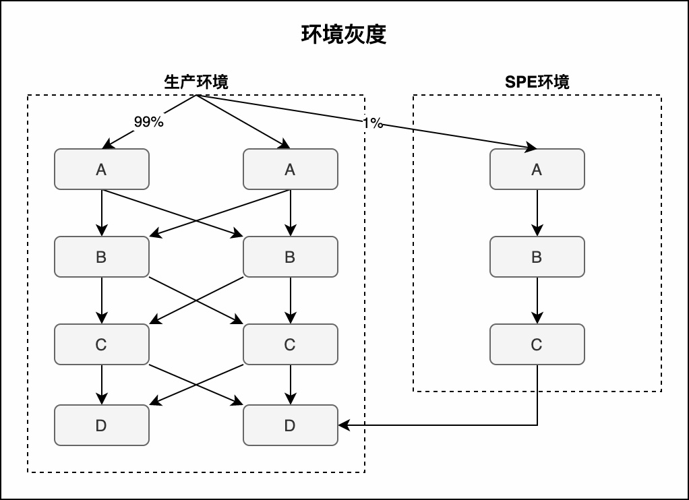

##### 灰度分批

这里列举三个常见的分批方式：簇内分批、簇间串行、簇间打散，每个层面中对应的灰度方式如下图所示：

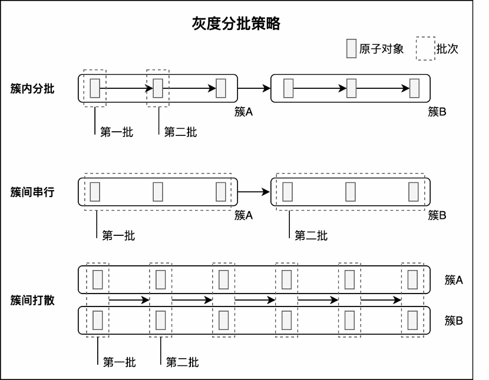

图中的簇指的是可以继续拆分的逻辑组，包含但不限于单元、地域、机房、可用区、VLAN、集群、分组、自定义逻辑区域等。

线上生产环境灰度变更建议包含以下要求：可分批、可控制分批间隔、可观测/可验证、可暂停/可回滚。

- 可分批：指灰度方式必须至少满足灰度分批方式中的一项：簇内分批、簇间串行、簇间打散。
  确定好灰度方式后，至少需要 2 批进行发布。如果确实不具备灰度能力，建议提升审批申报层级。
- 可控制间隔：指变更可对每批次的发布时间间隔进行控制。一般建议重大风险的变更灰度时长至少一个小时。
  核心系统的生产环境灰度发布总观测时长不少于 30-60 分钟。第一批变更完后至少观测 20 分钟，后续发布批次间隔可自定。
- 可观测：指变更系统每批次发完后，需要观测并验证本批次发布无问题后才能进行下一批次的发布。
  观测和验证的手段包括但不限于以下方式：在变更系统里至少记录一项核心反应健康状态的指标（业务监控项、日志文件名等）或记录二次确认人员或采用自动化观测等，
  并能通过对线上文件验证等方式确定已发布成功。
- 可回滚：指灰度时需具备分批回滚、全量回滚的能力，回滚单要有变更记录并可追溯。

#### 可回滚

变更回滚是指当服务、配置或数据出错时，能顺利恢复到最近一个正确版本的可逆操作，且回滚范围应同变更前的范围一致。
任何线上变更需具备回滚方案，如果发生概率性风险事件或者未知风险导致的系统或业务异常，必须有相关的措施可以第一时间恢复到变更前的状态。

对回滚进行模型提炼和属性解构，根据变更对象恢复到变更前状态的方式，可以分为两种典型的回滚模式：

1. **backward 模式** ：又称回退模式回滚，主要指将变更对象从当前状态回退到变更前状态的回滚方式。执行变更前，线上服务处于 A 状态，
   变更执行使得线上服务处于 B 状态，此时进行变更回滚，则线上服务会恢复到变更前的 A 状态，用状态机表达式可以描述为：roll-back: A->B->A。

1. **forward 模式** ：又称前进模式回滚，主要指将变更对象从当前状态再一次变更到新状态，而新状态即为变更前状态值的回滚方式。
   执行变更前，线上服务处于 A 状态，变更执行使得线上服务处于 B 状态，此时进行变更前滚，则线上服务会前进至 A'状态，
   但 A'状态同 A 状态满足内容一致性，用状态机表达式可以描述为：roll-forward: A->B-A'。

##### 回滚五要素

为实现变更的一次成功回滚，需具备如下五个基本要素：变更对象、回滚模式、变更已生效范围、变更对象在变更前的状态值、变更对象在变更后的状态值。

- 变更对象，是指变更执行所操作的原子资源，例如：应用包、配置项等。
- 回滚模式，是指采用 rollback 模式或者 forward 模式来将变更对象恢复到变更前状态的回滚模式。
- 变更已生效范围，是指在变更灰度过程中已生效的变更范围。
- 变更对象在变更前的状态值，是指变更对象在变更前的稳定状态原子描述。
- 变更对象在变更后的状态值，是指变更对象在变更后的稳定状态原子描述。

#### 变更发布策略

通过合理的流量分配及部署策略，可将生产流量逐步切至已发布新版本的应用上实现灰度及快速回滚，以最大限度避免非预期的变更部署问题导致的影响。
业界广泛采用的发布策略包括：

- 蓝绿发布：通过对服务新版本进行冗余部署实现。一般会将新版本的实例规格和数量与旧版本保持一致。当新版本服务验证通过后，将业务流量全部切至新版本。
  旧版本作为热备。如新版本上线后出现问题，可将流量全部切回至旧版本完成回滚，缩短故障恢复时间。
- A/B 测试：通过用户请求的元信息将流量路由到新版本，是一种基于请求内容匹配的灰度发布策略。常见的做法包括基于 HTTP Header 和 Cookie，
  将特定请求或用户灰度至新版本，降低故障影响范围。
- 金丝雀发布：通过调整流量权重比例，逐步将流量从老版本切换至新版本。同时对老版本服务进行缩容，对新版本进行扩容，相比蓝绿发布资源利用率较高。

道客云原生网关以托管的方式来做流量入口，
提供丰富的流量治理能力，支持多种服务发现方式，如容器服务、Nacos、Zookeeper、固定地址和 DNS 域名，
并以统一的模型支持服务版本以及灰度发布能力。支持以上三种发布策略及应用无损上下线等功能。

### 故障应急

故障管理体系是围绕故障全生命周期采取的一系列控制流程，包括故障基础数据管理（故障等级定义、应急场景监控覆盖、服务组&值班表管理、故障订阅管理），
故障发现（7*24 监控值班、智能基线告警），故障应急协同（故障通告及更新、故障应急协同群），故障恢复（初因推荐、快恢推荐），故障复盘（故障复盘规范、故障数据运营）。

#### 故障基础数据管理

##### 故障场景等级定义

日常运营中，除用户方环境或自身操作引起的问题外，无论什么原因导致的服务中断、服务品质下降或用户服务体验下降的现象，都称为故障。
对故障影响程度的划分就是故障等级定义。

定义故障等级是为了指定故障等级定义作为各业务的安全生产法则，推进各业务稳定性提升。如评判各业务团队的故障发现能力的标准就是故障等级定义的监控发现率等。
在定义故障等级的时候，需要从功能等级、业务体量、业务特性、量化影响 4 个维度进行设计，一个简要的通用故障等级定义参考模板如下：

| 业务量级 | 功能分类 | 影响面 | P1 | P2 | P3 | P4 |
| -------- | ----- | ------ | --- | --- | --- | --- |
| 大体量 | 核心功能 | 成功率下跌 30% 及以上 | P1 | | | |
| 成功率下跌 20%～ 30% | | P2 | | | | |
| 成功率下跌 20%以下 | | | P3 | | | |
| 非核心功能 | 成功率下跌 30% 及以上 | | P2 | | | |
| 成功率下跌 20%～ 30% | | | P3 | | | |
| 成功率下跌 20%以下 | | | | P4 | | |
| 小体量 | 核心功能 | 10 分钟内总体成功率下跌 45% 及以上 | P1 | | | |
| 10 分钟内总体成功率下跌 30%～ 45% | | P2 | | | | |
| 10 分钟内总体成功率下跌 30% 以下 | | | P3 | | | |
| 非核心功能 | 10 分钟内总体成功率下跌 45% 及以上 | | P2 | | | |
| 10 分钟内总体成功率下跌 30%～ 45% | | | P3 | | | |
| 10 分钟内总体成功率下跌 30% 以下 | | | | P4 | | |

##### 故障场景监控覆盖

基于故障等级定义场景，配置对应的监控项接入 7*24 监控值班，同时对接入的监控数据额外提供基于算法的智能告警，
或者接入研发可自闭环的风险预警，保障业务故障的监控发现率，减少故障持续时间，降低故障影响。

为保障故障发现率，故障场景监控覆盖率建议维持在 95% 以上。

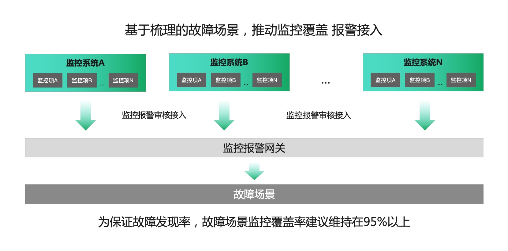

##### 服务组&值班表管理

将故障应急的相关人员群体，通过前置到故障场景的干系人做绑定配置，同时支持服务组和值班表，实现故障启动后自动快速通知负责人上线处理的效果。

在设计相应的管理方案时，需要考虑以下内容：

1. 服务组：提供服务的人员群体，服务包括故障处理，工单处理等
2. 值班表：可以对服务组成员进行排班，让故障应急工作更有计划性、不易遗漏
3. 升级组：服务组的一种，通过服务组和升级组，可表达组与组之间的升级路径
4. 服务组与故障业务线的关系：一个服务组对应故障中一个角色，但可以服务多条故障业务线
5. 服务组与工单问题分类的关系：一个服务组可以服务工单多个问题分类
6. 服务组与组织架构的关系：一个服务组可以服务多个组织架构，一个组织架构可以拆分为多个服务组

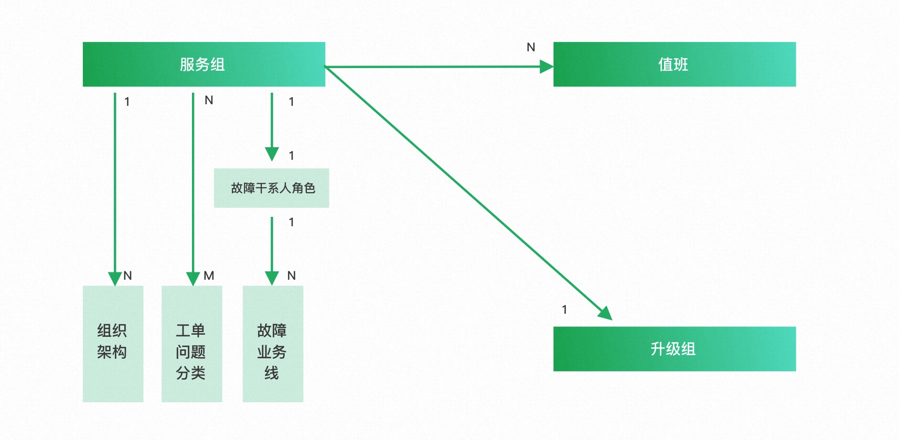

##### 故障订阅管理

故障通告订阅是用来维护故障通告接收对象，可根据不同的条件发送不同的渠道。
故障订阅可以分为 3 种类型的对象：个人、干系人角色、企业微信群或其他通知渠道。通过合理的配置故障通告和订阅，能够确保相关干系人及时收到告警。

#### 故障发现

##### `7*24` 监控值班

对于有条件的企业，可以设立全国运行指挥中心，实现 7*24 监控值班，时刻关注核心业务线上异常与故障。
对于完成监控覆盖的核心业务场景，在异常上报时，通过工具自动检测或值班人员人工判断，及时识别风险或故障，
以风险预警和故障通告的形式快速调度应急负责人上线处理，避免业务受损或降低业务受损程度。

之所以设立 `7*24` 监控值班，是因为报警准确率无法达到 100%。
为了保证触达业务研发的电话报警准确度、降低无效打扰，需要人工判断是否真实异常；
各业务对故障的重视程度都非常高，误发、漏发故障都会产生较大影响，故障需要人工确认发送保证准确；故障处理过程需要人工组织跟进；
故障应急争分夺秒，Oncall 时效难以保障。7*24 监控值班的主要考核指标有：通告及时率、通告准确率、快恢执行率。

##### 智能基线告警

智能基线告警是一套集成了统计学方法与机器学习算法，自动学习指标数据的历史规律，进而检测曲线异常突变的智能化告警；
针对具备周期规律的监控指标，智能基线告警相比自定义告警规则，具备较高的异常检测准确率。

智能基线报警特点：

- 无需人工配置报警规则，基于曲线指标的历史数据自动生成异常检测参数实现报警；
- 抑制短暂冲高回落引发的误报，对应大促时业务指标冲高的业务场景；
- 抑制周期性误报，当跌落型异常在同一时刻持续多天时抑制该报警，对应每天大促或消息型任务每天定时跌落的业务场景。

建议重点覆盖成功（总）量、成功（失败）率、失败量三类场景的业务指标。

#### 故障应急协同

##### 故障通告及更新

基于 7x24 监控值班工作特性，对于业务异常达到故障等级时，
以用户定制的（语音、短信、IM）的方式在约定时间内将故障影响信息以及处理进展通知给对应的接收人/组，并持续更新直至故障结束。

##### 故障应急协同群

故障发生后，可以基于企业微信的沟通协同能力和 API，创建故障处理应急协同场景群。
将故障相关成员直接拉进处理群，相关成员包括故障受影响业务的“应急接口人”、可疑原因业务的“应急接口人”。
进群后的成员，可直接在群内签到。每个故障建议设置单独的故障处理群，群内成员均为故障的相关人，为故障的协同处理提供了天然的协同环境。

故障应急协同群贯穿整个故障处理过程：

```text
7*24 故障启动 -> 自动创建应急协同群 -> 自动拉人/通知 -> 定位信息/止损预案推送 -> 一键电话会议 -> 故障恢复应急结束指标汇总
```

故障应急过程中的重点角色和职责有：

- **故障处理人**（ 技术支持、监控值班）：负责故障应急启动、确保应急有序、协调各方资源确保故障快速恢复；同时，在应急过程中，
  及时更新故障内容，确保各方能够及时获取故障相关信息；同时视情况做好故障升级预告；
- **应急处理人** （研发、测试、稳定性接口人等）：根据应急指挥人明确的分工，负责故障定位、快速恢复，按照 SLA 的要求响应故障、兜底同步进展；
- **应急指挥人** ：根据故障等级由不同人员担任，如 P1P2 故障由业务部门稳定性负责人或值班长承担；P3P4 由技术团队 TL 或团队指定稳定性接口人承担。
  在故障发生时，第一时间（5 分钟内）指定应急处理人的分工（A 负责排查原因、B 负责快速恢复、C 负责同步进展），协调故障快速恢复，
  兜底同步故障进展。注意：在应急止血过程中，止血动作造成的影响不得大于故障本身的影响。

#### 故障止损恢复

##### 故障初因定位

集成企业内部可利用的所有稳定性相关数据（变更事件，数据库、MQ 等中间件异常事件），以及集成各业务自建的定位工具能力，
并在故障及风险预警的应急过程中进行可疑原因定位，帮助促进故障及风险预警初因定位的时长缩短。

##### 快恢预案推荐

通用的故障恢复方法一般包括 **重启、回滚、扩容、切流、限流、降级** 等。快恢的执行效率很大程度取决于是否有完备的预案和定期演练。

建议在故障应急协同群中推荐输出常见的快速恢复能力，并提供 PC、手机端的一键快速执行能力，减少研发在各自平台上查找快恢入口的时间，
也解决研发在外无电脑应急的尴尬局面。快恢能力主要包含人工梳理快恢预案、通用垂直专项快恢能力：

- 人工梳理预案：通过全面梳理故障场景及风险场景的可用降级预案来达到该场景触发故障时，系统自动推荐前期关联的预案，
  提供故障群内一键执行的方式，也提供设定执行条件，符合条件后系统自动执行的方式。
- 通用垂直专项快恢能力：通过集成包括变更极速回滚、多活容灾切流快恢等通用的快恢能力，结合监控、日志等数据自动定位的故障原因进行对应的快恢方式推荐。

#### 故障复盘

故障复盘作为故障体系中的重要一环，整体复盘流程包括故障处理过程、改进分析、故障定责，基于包含标准化的复盘 SOP、对应预防
action 推荐、问责管理机制，全面地回溯线上故障的发生，产出故障复盘报告和改进措施，避免故障重复发生。

复盘遵循以下标准流程：

- 过程回溯：可使用 5-why 方法提出多个问题对处理过程进行深挖。如本次故障为什么会发生？为什么没有提前发现？
  过程中各个团队是如何处理的？处理过程是否有可以优化的空间？
- 问题剖析：回溯完成过程之后，需要深层次剖析：是否流程机制层面问题？是否质量检验层面问题？是否产品业务层面问题？
  是否系统设计层面问题？有没有更好的防御机制？如何避免再次发生？
- 经验总结：剖析出来深层次原因之后，需要切实给出可落地的 Action，包括给出短期治标 Action，长期治本 Action，以及沉淀经验和教训。
- 定级定责：完成原因和改进方案后，针对本次故障做最终的等级认可和故障责任划分。责任团队分为主要责任团队和次要责任团队，以及测试责任团队。
- 改进追踪：当完成复盘后，如无法有效的落地执行改进，将导致复盘的成果白费。所以在故障复盘中就需要明确改进方案并限定完成时间。
    - 制定的 action 需要符合 SMART 原则，即：
        - Specific：即改进项。需要改进、优化的单项、指标是什么？
        - Measurable：即验收标准。指定改验收标准是什么？
        - Attainable：即改进项是否可以达到。避免出现一些假大空、无法落地的改进；
        - Relevant：即要与其他改进具有一定的相关性。即尽可能避免出现孤立的改进；
        - Time-bound：即预期解决时间。这个时间建议最长不要超过三个月，避免改进流于形式；
    - 一个完整的 action 建议记录以下内容：标题、计划完成时间、负责人（及其团队或协助处理人）、验收方式及验收人、跟踪人、改进措施的类别、具体改进内容描述及验收标准。
      在改进项完成后可有选择地进行验收，如评审验收、演练验收等。验收完成后由验收负责人完结此改进 action 的整体工作。

复盘文档一般包含以下内容：

- 故障简述：故障概述、影响面、处理人等
- 故障背景：故障发生时的业务链路
- 故障时间线：着重强调故障引入、故障发生、故障发现、业务响应、恢复执行、故障恢复几个时间点
- 故障原因分析：建议先一句话总结，再进行具体原因剖析
- 故障过程分析：可从需求评估、代码发布、故障应急等环节进行分析
- 后续改进：后续改进措施，明确改进方和责任人
- 故障等级/责任：参考上述故障等级定义，定义本次故障等级，并明确责任团队和责任人。

##### 故障数据运营

基于基础故障数据，通过不同维度和形式，以线上和线下结合的方式，在报表平台、安全生产报告、安全生产会议等不同场合进行故障数据的披露和运营。
目的是利用历史故障数据，度量稳定性现状和能力。故障数据运营的核心是通过故障分量化计算考核，实现整体故障收敛。

###### 故障分整体目标

安全生产故障分目标，经过与各业务团队沟通采用自上而下拆解方式进行设定。比如本财年故障分同比上财年收敛 20%-30%。
安全生产故障分更深层次拆解由各业务团队内部根据实际情况设定。

###### 故障分计算方案

在设计故障分的计算规则时，建议考虑以下维度数据指标：

**故障时长**

故障时长=故障恢复时间-故障发生时间

**故障发生时间**

最接近故障等级定义激活（P4 起）的时间点。按照如下顺序：

1. 针对业务监控：取首次达到故障等级（P4 起）的时间为准；
2. 针对用户上报：取业务开始受影响的时间点；
3. 若无法评估受影响的时间点则取首次用户上报的时间。

**故障恢复时间**

故障止血（即：不再发生新增业务/用户影响）的时间点（客户端以测试通过且可实际修复问题版本提交 APP 审核为恢复时间）；

如果有业务监控以监控恢复至正常基线为准，否则以止血时间为准。

!!! note

    故障时长及是否降级/减免如有争议，以安全生产值班长判定为准。

**收敛比**

一般指本财年与上财年对比结果，体现与自身同期收敛效果，为负数代表收敛，负值越大说明收敛效果越好，为正数代表发散，正值越大说明发散越严重，具体计算方法为：

收敛比=（本财年某时段-上财年同时段）/上财年同时段

**消耗比**

一般指本财年实际消耗故障分，占故障分目标的比例，体现与设定收敛目标的差距，提示达到收敛目标的剩余消耗空间，数值越小越好。

消耗比 = 本财年累计消耗故障分/财年故障分目标

制定故障分建议考虑以下原则：

- **确定横向标准** ：在企业上层确定标准，降低各个子部门和业务团队的理解成本。
- **减少重大故障影响** ：针对特大故障，设置较大的系数倍数，以凸显特大故障对故障分的影响。
- **鼓励快速恢复** ：针对不同 P 等级故障，差异化设置系数，以体现恢复时长要求。比如同时针对 P1P2 级重大故障，
  设置了 “5 分钟内恢复降一级，10 分钟内恢复故障分计 80%” 的通用标准。
- **细化责任拆解** ：设置主次责团队的故障分拆解逻辑，比如主次责团队默认按 7:3 比例拆分故障分。
- **故障分统计默认排除** ：容灾演练&全链路压测符合预期故障、特定打标过不参与故障统计的业务等。

#### 故障演练

对于很多大型企业（如道客）来说，经过多年的技术演进，系统工具和架构已经高度垂直化，服务器规模也达到了比较大的体量。
当服务规模大于一定量（如 10000 台）时，小概率的硬件故障每天都会发生。这时如果需要人的干预，系统就无法可靠的伸缩。

为此每一层的系统都会面向失败做设计，对下游组件零信任，确保在故障发生时可以快速的发现和处理。
但这些措施在故障发生时的有效性、故障恢复工具的真实容灾能力、处理问题人员的熟练度，沟通机制、容灾措施对上层的影响等问题，
平时并没有太多的机会验证，往往都是在真实故障中暴露。

故障演练就是这个背景下诞生的，沉淀通用的故障场景，以可控成本在线上故障重放，以持续性的演练和回归方式的运营来暴露问题，
不断验证和推动系统、工具、流程、人员能力的提升，从而提前发现并修复可避免的重大问题，或通过验证故障发现手段、故障修复能力来达到缩短故障修复时长的作用。

##### 演练方案设计理论基础

技术型故障分析归纳，大致可以按照 IaaS、PaaS、SaaS 的层次进行归类。

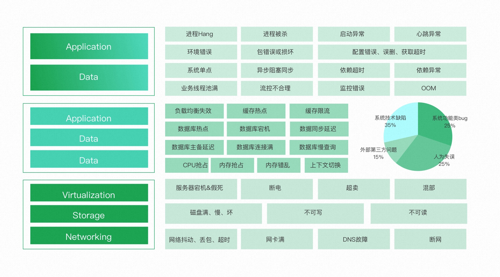

上面的分类是一个宏观视角，不是一个系统设计的视角。所以可以对故障模型再做一次升级，并得到一些推论：

- 故障是来自于硬件、软件（如 PaaS 或 SaaS）的故障。并且有个规律，硬件故障的现象，会在软件故障现象上有所体现。
- 故障隶属于单机或是分布式系统之一，分布式故障包含单机故障。
- 对于单机或同机型的故障，以系统为视角，故障可能是当前进程内的故障，比如：如 FullGC，CPU 飙高；
  进程外的故障，比如其他进程突然抢占了内存，导致当前系统异常等。
  对于大多数无损突袭演练的故障模拟，只需要关注故障对当前系统的影响，而不是真的需要外部产生故障。
- 此外，还有一类故障，可能是人为失误，或流程不当导致，这部分不做重点讨论。

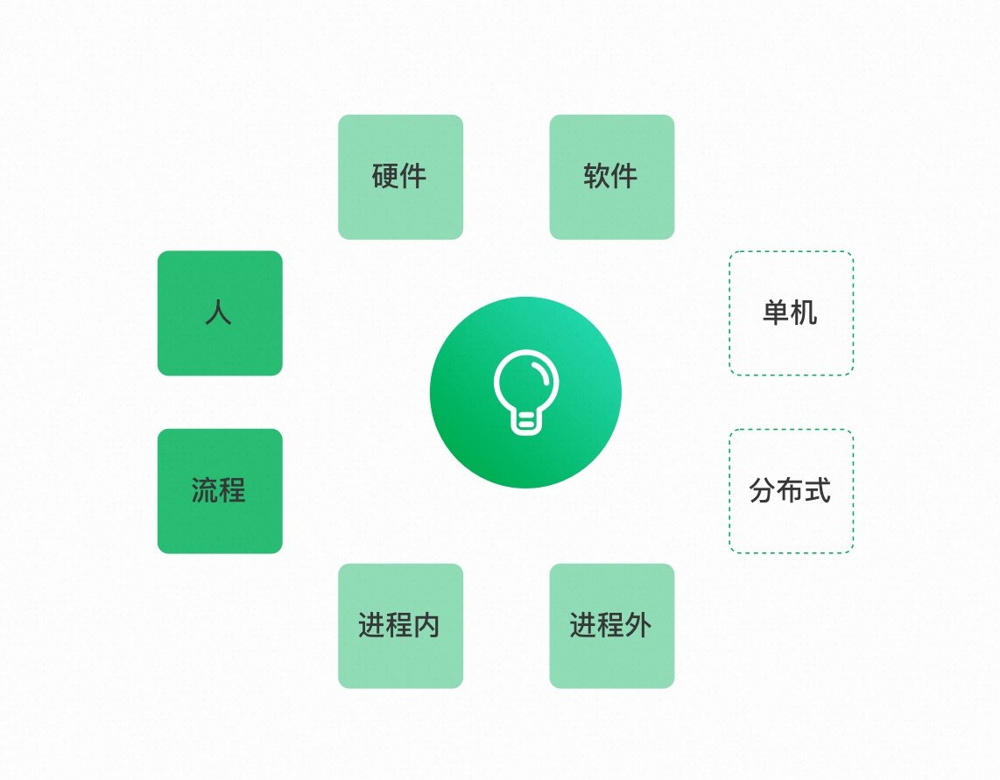

常见的故障类型都可以映射到这个故障模型中，模拟故障的演练系统及方案也可以基于该模型进行设计。
在设计演练方案的过程中，可以考虑在模型中每个环节进行故障注入，验证故障应急方案。

##### 不同演练类型和目标

根据演练过程对线上业务的影响，演练可分为有损演练和无损演练。由于对业务的影响不同，两种演练可以进行的演练频次、可实现的业务验证目标都有不同。

有损演练是指直接在线上真实业务环境注入异常进行演练，演练模拟的真实有效性高，为了平衡业务影响一般会选择最核心场景、在业务最低峰期做演练，
而且演练频次相对较小，例如为了验证多活容灾能力的机房断网演练，一般是一个月一次的演练频次；无损演练是指在一套无线上真实业务流量的隔离环境做演练，
配合压测模拟流量注入异常进行演练，由于业务无损，可以支持较高频次的演练，比如为了类比/形变复现线上类似故障、验收故障复盘的改进
action、演练监控感知能力/报警响应能力等，可以组织对不同业务团队轮流参与的每周 1 次的高频演练。

| **演练类型** | **演练方案优缺点** | **演练环境** | **演练频次** | **主要演练目标** |
| ----------- | --------------- | ----------- | ----------- | ------------- |
| 有损演练 | 优点：真实有效性高缺点：线上业务有损 | 线上真实业务环境 | 1-2 月一次 | 容灾多活机房断网验证演练重要架构/业务问题模拟验证全链路生产突袭模拟演练 |
| 无损演练 | 优点：线上业务无损缺点：逼真度有限 | 全链路灰度环境/新建业务环境 | 每周 1-2 次 | 监控感知能力/报警应急响应类似故障复现/改进 action 验收应急组织流程、止损预案验证 |

## 成本优化

云计算能够为企业 IT 基础设施带来敏捷性和效率提升，随着云上业务体量和业务场景复杂度不断增加，
企业在云上资源配置不合理或配置过度的现象普遍存在。与此同时，企业在多组织成本管理效率、成本可控、平衡业务目标与成本等方面均面临巨大挑战。

成本优化支柱提供了云成本管理及优化的设计原则和最佳实践，帮助企业高效地使用云服务来构建业务应用，减少不必要的开支并提升运营效率，
让企业在云上更具经济效益。成本优化并不意味着只追求低价格，在过程中需要进行必要的权衡取舍，
关键在于提升成本管理效率、合理选择云资源及避免成本浪费，并在业务目标、安全合规、稳定性等方面与成本之间达成平衡。

成本优化贯穿企业整个上云用云全生命周期，本支柱从云财务规划及管理、成本可视化及分摊、成本监控、云服务及计费方式选择、应用负载成本优化等方面进行阐述，
为企业在云上以最优成本达成业务目标提供深入指导。

### 设计原则

在成本优化过程中需要遵循一些重要的优化原则，这些原则能够帮助企业提升成本管理效率，更好地达成优化目标。

- **实施云上财务规划及管理** ：企业内部需要贯彻成本文化、建立成本责任制，由相关团队协作共同参与财务规划管理，包括高管、财务团队、技术团队及业务团队；
  在云上规划实施与组织架构相匹配的账号架构及财务管理模式，在团队协作的基础上落实具备成本意识的管理及优化流程，充分利用云上财务及成本管理服务，
  在云上具备预算编制与规划、统一结算、成本可视化、成本分摊等能力。
- **衡量投入产出比** ：设定业务目标及云成本预算，通过衡量投入产出比 (ROI) 推动云成本持续优化。借助云成本可视及分摊能力，
  企业能够更好地对应用负载的成本进行度量分析，结合业务收益数据，决策是否需要对应用负载加强投入或降低成本。
- **选择适合的资源及计费方式** ：全面了解业务目标及需求，除基础业务目标外还应包含应用负载在稳定性、性能、安全合规等方面的要求。
  充分了解云产品的功能特性、规格选型、计费方式、最佳使用方式等，根据业务需求选择适合企业的云产品及资源规格，结合业务特性及资源利用情况选择计费方式，
  平衡目标与成本。与 IaaS 层产品相比，使用云原生的 PaaS 或 SaaS 层产品通常在整体成本上更有优势。
- **为应用负载引入弹性机制** ：针对业务特性，为稳定的应用负载预留资源，为动态负载引入弹性伸缩机制，通过动态供应资源在满足业务目标的同时节约成本。
  为应用申请云资源时按照最小需要原则进行申请，跟随业务的发展、访问量情况进行动态扩缩容，充分利用云提供的弹性优势。
- **持续监控及优化** ：成本管理及优化是一个反复迭代和持续运营的过程，需要在预算目标达成、成本构成、资源利用率等方面持续进行监控分析，
  在企业内建立定期检查及治理流程，发现问题并持续优化。例如定期检查资源利用率，对闲置资源、低负载资源、高负载资源进行治理，
  通过对资源进行释放、升降配及调整计费方式等方法，高效使用资源，减少成本浪费。

### 云成本管理框架

“云成本管理与优化”不是一蹴而就的项目，是一个涵盖企业上云用云全生命周期，关系到企业内部管理机制的体系化工程，是一个反复迭代和持续运营的过程。

根据 FinOps 官网《What is FinOps》的描述，“FinOps 是一种不断发展的云财务管理学科和文化实践，
通过帮助工程师、财务、技术和业务团队协作制定数据驱动的支出决策，使组织能够获得最大的业务价值。”

FinOps 是“Finance”和“DevOps”的合成词，强调业务团队与工程师团队之间的沟通和协作。

FinOps 通过 Inform、Optimize、Operate 三个生命周期阶段实现云成本的可视、优化与持续运营，鼓励实践
6 大 FinOps 原则，将众多 FinOps 能力划分为 6 大领域，最终通过 Crawl（爬行）、Walk（行走）、Run（奔跑）3 个程度来衡量实践的成熟度。

“FinOps”在行业中常见的别名有：

- 云成本管理
- 云成本优化
- 云财务管理

#### 道客云成本管理与优化框架

道客在 FinOps 核心理念基础上，融合自身实践经验，提出更加细化落地的本土化“云成本管理实施框架”，供企业客户参考实施。

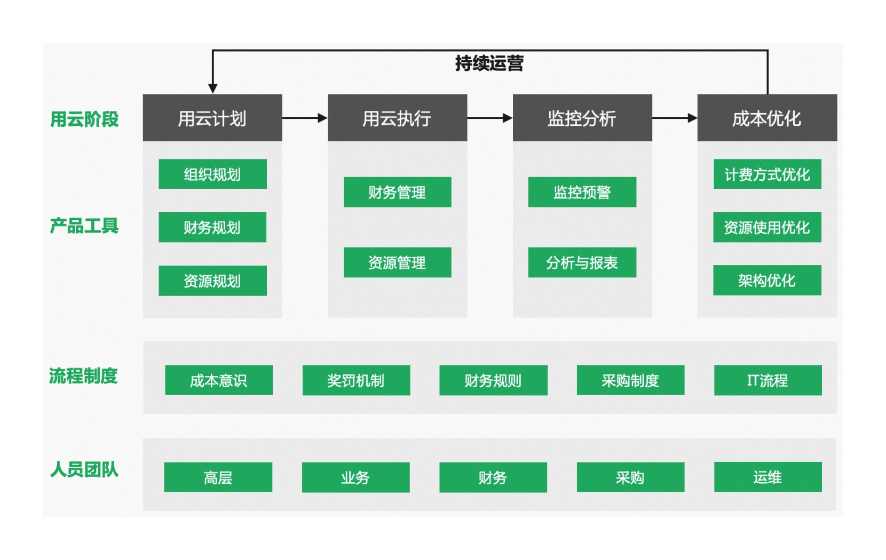

##### 云成本管理贯穿上云用云全生命周期

从企业上云及用云的历程看，大致可以分为用云计划、用云执行、监控分析、成本优化等阶段，成本管理贯穿各个阶段，每个阶段的关注点各有不同。

**用云计划阶段** ：场景包括企业首次上云、增量上云、存量复购。

1. 做好组织规划：包括企业上云的组织架构梳理、账号体系规划、权限体系规划、企业权益（如优惠、信控）的规划、资金结算关系的规划。
2. 做好财务规划：包括预算编制与规划、财务资产规划（如现金、代金券）、成本规划（如成本权责、分摊规则）、
   对云服务商的计费方式进行了解和选型（如按量付费、节省计划、资源包等）。
3. 做好资源规划：包括标签规划、资源容量规划、资源配额规划。

**用云执行阶段** ：场景包括采购执行、用云管云规则执行（包括财务规则设置、资源配额设置等）、商务履约执行（包括对账、充值、开票等）。
在用云执行阶段，从财务管理和资源管理两个视角做好成本管理。

1. 财务管理视角：要做好资金、账单、发票的统一管理，并借助云服务商提供的企业级财务管理能力，实现跨组织多账号的统一结算管理和财务资产管理，
   为了后续监控分析的成本可看清，要通过财务单元做好成本分账规则的设置。
2. 资源管理视角：选择合适的技术选型和资源规格进行采购，可以借助云服务商提供的资源保障和容量预定等能力确保资源的有效获取，并通过配额设置实现企业云资源采购管控。

**监控分析阶段** ：对应 FinOps 的 Inform 阶段，主要解决成本分摊与成本可视化问题。

1. 成本分摊：借助平台能力和前序阶段配置的分摊规则实现成本的有效分摊（包括摊销、分账等），是监控、分析甚至优化的前提。
2. 成本监控：通过多种监控手段对成本和资源数据进行监控，并有效预警通知给相关人员，监控手段通常分为两类，
   基于业务规则（比如基于预算、成本金额、资源使用率等人为设定阈值的预警）和基于人工智能算法（比如无需人为设定阈值、由算法智能识别的异常检测等）。
3. 成本可视化：通过监控预警感知到成本变化时，借助多种可视化工具进行成本分析，找到问题点或优化机会，
   常见的可视化分析工具包括各类成本或资源报表、预算与实际的对比分析、多维成本统计分析工具等，也可借助成本预测算法观察未来趋势。

**成本优化阶段** ：对应 FinOps 的 Optimize 阶段，主要通过计费方式优化、资源使用优化和架构优化来落地执行。

1. 计费方式优化：云服务商通常提供多种计费方式，通过切换不同的计费方式，可以获取到更低的实际折扣、或提升权益资产的使用效率，从而实现成本节约。
   常见的如按量付费搭配节省计划，可以通过承诺更长时间的消费，获取更低价格；购买合适的资源包，也可以抵扣按量付费流量，从而节约成本。
   可以借助平台提供的测算工具，对比已购买和未购买的计费方式，切换为更加合适的计费方式。
2. 资源使用优化：优化云资源的使用率，是实现成本优化的有效手段。常见的方法有释放闲置资源、降配低负载资源、升配高负载资源、弹性扩缩容等，
   通常借助资源监控工具发现优化机会，并结合业务特性、性能、成本等综合考虑后谨慎执行。更多策略方法详见下文。

**持续运营** ：云成本管理是一个反复迭代和持续运营的过程，企业应持续循环以上四个阶段，形成长效运作机制，使云成本可以有效管控、持续优化。

##### 人员、工具和机制是云成本管理的关键要素

###### 人员是基础，业务、财务和技术须协同运作

云成本管理团队是企业实施云成本管理的基础。云成本管理不是某一个角色或某一个团队需要做的事情，而是需要多个角色共同参与，打破原有各管一段，
各自为战的传统 IT 管理方式，各角色长期协作共同努力以达到成本长期治理的目标。云成本管理团队需要宣传云成本管理意识和文化，推动云成本管理最佳实践，
确定企业云成本管理的方向，协调企业各部门开展成本管理工作。比如，可以定期举行成本管理会议，回顾和复盘成本管理中遇到的一些问题，从而推动持续改进。

企业组建云成本管理团队需要满足以下三个条件：

- **人员构成须跨职能** ：云成本管理团队应由企业各个部门如财务部门、IT 部门、运营部门和业务部门等利益相关者共同组成。
- **知识体系须完备** ：成本管理团队需要具有多学科方法，具备项目管理、数据科学、财务分析和软件/基础设施开发等能力，可以对照成本优化目标来衡量各部门的执行和交付能力。
- **管理层须认可与支持** ：管理层要成为云成本管理理念的倡导者，为云成本管理团队提供支持，
  确保按组织确定的优先级开展成本管理活动，确保企业在有效利用云资源的同时，持续创造业务价值。

###### 工具是手段，监控、分析与调优是必备能力

云成本优化工具是企业实施云成本管理与优化的手段。云成本管理是一个复杂而耗时的过程，需要将各项能力沉淀到工具。
一方面，由于云成本的可变性和多云平台的复杂性，云成本优化基于分析结果和优化策略之上并非所有操作都适合人工完成，
企业通过工具可以有效提升对云成本的管理及优化水平。另一方面，成本优化往往是以项目方式实施，由项目制驱动转为体系化的日常自助优化尤为重要。
因此，需要将成本管理的能力沉淀为工具或平台，构建可度量指标，驱动实际各相关组织自助降本。

###### 机制是保障，成本意识和奖罚机制双轮驱动

云成本管理相应的长效运营机制在云成本管控中起到关键作用，面对云成本特殊的支出模式和账单结构，
企业需要更新一套更加合适的云成本管理流程制度确保优化工作能够在企业内部精确、高效运转。云成本管理流程制度包含三个方面：

- 对企业内部云成本进行权限管控，包含支出采购、 分配修改等。
- 对企业云资源各采购账号进行体系管理，包含账单核算、托管代付等。
- 对企业各类资源或成本进行统一的配额和预算管理，包含资源开通、支出审批等。

企业可以通过提高成本意识和建立奖惩制度来落实云成本管理制度。企业内部云成本日常运维的主要动力和保障来源于云成本管理制度，
一是云成本管理团队需要宣传云成本管理意识和文化，推动云成本管理最佳实践，确定企业云成本管理的方向，协调企业各部门开展成本管理工作。
二是建立 KPI 奖罚制度，云成本管理作为绩效考核的项目覆盖所有相关部门，根据实际情况合理设置优化目标，如资源闲置率、成本节省额度等，
对各部门资源使用进行统一价值量化，按照周期内优化成果进行适当奖罚措施。

### 用云计划阶段

#### 用云成本需求分析

实施用云成本规划首先要全面获取用云成本需求。在计划阶段，通过对用云成本进行需求分析，确保相关人员的业务需求都被识别和跟踪，
并在规划和实施阶段有针对性的采取措施，使资源利用率达到最优，进而使用云成本在组织内部做到可管可控、可持续经营。

##### 捕获成本需求

企业级客户主要从以下几个方面获取用云成本需求：

- 业务地域性
- 合规性
- 安全性
- 业务连续性和稳定性
- 技术团队管理
- 自动化和标准化
- 成本优化目标

##### 分析成本需求

###### 业务地域性

业务终端客户所在的地域，比如某亚洲企业在本地和上海都有仓库，上海仓库的管理系统按照就近接入原则部署在道客云操作系统上海地域。
同时地域的选择也要考虑地域之间网络专线和数据传输的成本。

###### 合规性

企业会面临外部对企业云原生系统的合规要求，如等保 2.0、3.0 法规要求，同时当云上资源达到一定规模时，
在内部会制定合规管控的基线，满足自身管理效率和安全合规的需求，包括记录云上资源管理的操作日志、资源。

配置变更日志，还需依赖云平台提供的持续监控和自动告警能力，实现合规性的自主监管。
企业级客户面向云上资源的操作审计和配置审计涉及到配置审计、操作审计等服务的实践操作。
操作审计的操作日志投递到相应地域的审计组件，根据您日志的具体量级会产生不同的存储费用。

###### 安全性

安全性是企业选择基础设施中最重要也是必不可少的需求之一，同时也是影响成本的重要因素之一。
安全性措施可保护组织的重要数据，防止数据和信息泄露，同时安全防御功能保障了业务的完整性和可用性，防止系统受到外在的攻击和被滥用。

将安全性要求纳入云成本分析的一部分，安全性涉及到数据中心安全，网络安全，数据安全，身份安全，安全防御体系等多方面，
例如身份验证、这些选项会增加成本。云基础网络架构设计中涉及的云安全组和应用安全产品也会增加成本。
并且安全的监控和运营以应对复杂的安全环境也是安全的考虑因素。道客的安全模块提供了良好的企业级安全监控和运营功能。

日志的存储和安全的审计，也是为了应对安全和监管要求必要的选型。

数据备份是另一个为了满足安全要求而进行的必要的操作，按照数据安全的合规，企业有可能会增加数据备份的频率，数据备份选择的工具的实效性，数据存储和带宽都是会影响成本的约束。

###### 业务稳定性和连续性

企业级应用不论是对内部客户提供服务的，还是对外部用户提供服务，业务都具有必须要满足的服务级别协议，根据业务的稳定性和连续性需求，需要创建高可用性和灾难恢复策略。

为了可用性要求，总体服务水平协议 (SLA)、恢复时间目标 (RTO) 和恢复点目标 (RPO) 可能会重新制定云基础架构和产品选择。
例如，你可能会选择跨区域托管应用程序，此选择的成本比单个区域托管应用程序更高，但支持高可用性。例如您可能会选择多可用区部署的数据库产品。

通常情况下，如果高可用性的成本超过了应用程序故障时间的成本，则说明你可能过度设计了高可用性策略。
相反，如果高可用性的成本低于合理故障时间的成本，那么你可能需要做出更多投入。

假设故障时间成本相对较低，那么你可以通过恢复备份的方式进行灾难恢复来节省成本。
如果故障时间每小时的成本可能很高，那么应在服务的高可用性和灾难恢复方面做出更多投资。
需要在服务预配、可用性要求和组织对风险的响应三个方面进行权衡。

根据应用程序的可用性和生命周期，和服务的特性，选择相应的实例可以很大程度上提高云产品的使用率和管理成本，例如：

1. 实例的选型：了解实例规格的关键特点，选择更合适的实例类型可以提高资源利用率，节约成本您需要结合性能、价格、工作负载等因素，
   做出性价比与稳定性最优的决策。根据业务场景和 vCPU、内存、网络性能、存储吞吐等配置划分。
   可以先使用低配置资源，观察评估运行资源负载后升级配置，或将使用率低的资源降低配置或释放。

1. 计费模式的选择：根据业务特性选择合适的计费方式是成本优化最直接的方式，从付费层面来看，
   按照业务场景长期使用的稳定业务资源需求通过选择成本较低的节省计划方式来支撑负载。

1. 良好的设计弹性架构：在做架构设计时要根据应用的生命周期制定可以弹性伸缩的架构，在业务高峰期通过计算资源的弹性机制增加部署节点，
   在业务低峰期缩减云资源，能极大提升资源利用率和成本利用最大化。

1. 通过调研业务部门未来一段时间的业务规划，梳理并列出适合业务并留有一定冗余量的资源规格和用量。

###### 技术团队管理

让技术人员和合作伙伴更好的学习和使用道客，让技术人员掌握最新的云管理技能。
也可以考虑选择道客的企业工单服务，企业支持计划，专家服务和道客大学的学习资源。

1. **工单服务** 提供在线支持服务，专家在线解答技术人员的问题。
2. **企业支持计划** 在基础售后支持以外，业务系统复杂的客户或对服务有更高要求的客户，还可选择道客提供的多种企业支持计划，获取工单极速响应、专属技术保障通道、技术服务经理等专属支持。
3. **企业增值服务** 提供全周期的专业服务，满足企业各类场景的服务需求，包含上云前的方案咨询，上云中的迁移部署，以及上云后的运维管理与优化提升。
4. **面向客户的专业培训解决方案** 面向行业企业数字化转型需求及高校应用型复合人才培养需求，提供专业的合作方案及培训体系。
   企业培训依托道客的行业数字化实践和云计算、大数据、人工智能、云原生等前沿领域科技探索，沉淀专业的人才培养体系和服务，
   以行业数字化培训赋能，以道客生态商业链接，突破发展转型的短板与瓶颈，助力企业实现跨越式发展。

###### 自动化和标准化

通过标准化流程和工具定义云资源开通和部署的过程，包括账号管理，云资源管理，访问设置、事件响应和灾难恢复。
标准化的流程和工具可以帮助您节约用云成本，但是实施标准化过程可能会发现需要额外的开发成本。

比如，使用云命令行和 Jenkins 来定义 IT 基础设施：

- 自动化管理基础结构 Jenkins 能够创建配置文件的模板，以可重复、可预测的方式定义、预配和配置 DCE 资源，
  减少因人为因素导致的部署和管理错误。能够通过使用部署同一模板，创建相同的开发、测试和生产环境。
- 基础架构即代码（Infrastructure as Code）可以用代码来管理维护资源。允许保存基础设施状态，
  从而使您能够跟踪对系统（基础设施即代码）中不同组件所做的更改，并与其他人共享这些配置。
- 降低开发成本, 您通过按需快速的创建开发和部署环境来降低成本，并且具有可移植性。

###### 成本优化目标

在企业和组织发展的不同的阶段，企业成本核算部门会对用云提出不同的成本要求，比如，每年的企业用云成本约束，云资源使用量明显增长，
但是云资源的费用较慢增长（与资源用量非线性）。这不光是对于云厂商通过自身技术迭代增加算力减少成本的要求，
同时也是对企业自身 IT 系统技术演进的要求。成本优化的目标，也可以是在保持存量业务不变的情况下，减少 10% 的云资源使用。
这些成本管理和优化的目标需求需要被识别，并在计划阶段进行管理，并在后续的执行阶段得以实施。

在规划阶段，企业需要关注云计算相关技术最新发展趋势，利用好技术红利带来的成本优化。
伴随云计算的发展，新技术、新产品、新工具会不断出现，往往都会带来性能或效率上的提升，
从而提升企业用云性价比和管理效率。如服务器、数据库的升级、研发效能平台的推出等，企业利用新技术架构或产品类型适配自身业务发展可提升用云效能。

###### 最佳实践

从实践的角度，我们给出以下需求分析的建议：

1. 为了与业务目标保持一致，企业的相关干系人必须定义需求。

    - 好的实践：企业需要从自身内部定义 IT 需求，做好需求收集和跟踪管理的顶层设计，并对需求实施的结果进行反馈，进而找到完备的，长期有效的需求收集活动和路径。
    - 不好的实践：完全依赖供应商和放任供应商定义和资源企业云资源，而不给供应商相应的指导和约束，这样会导致后续云治理的工作异常的复杂。

1. 企业在 IT 实施过程中要收集安全需求并加以实施。

    - 好的实践：在对业务需求进行规划的时候，对业务的安全需求和企业的安全需求进行分析
    - 不好的实践：对安全需求视而不见，或者在 IT 系统部署完成时才部署安全产品，没有第一时间将安全成本加以管理。
      在安全产品部署之前，导致业务安全受损和稳定性受损可能会给企业带来更大的损失。

1. 企业按照服务等级创建高可用性和灾难恢复策略。
1. 企业有必要对自动化和标准化进行投入，但也要考量实际情况和业务需求，避免过度实施。

#### 组织规划

做好组织规划是上好云的基础，在上云之前应根据企业的实际情况做好相关的组织规划，包括企业上云的组织架构梳理、账号体系规划、权限体系规划等。

###### 梳理组织架构

企业在上云之前需要做好组织架构梳理，建立和维护用云成本意识文化，组织用云成本管理活动和成本优化活动。组织管理活动因企业内部组织的不同而不同，可以有以下三种模式：

- **集中式管理** ：通过指定的团队集中管理和运营云平台资源，如集中管理财务运营、成本优化，并在全公司范围内推动最佳实践。
  比如成立云计算卓越中心（CCOE）团队，它也可以是企业内部的一个团队，还可以是一个由整个企业的关键财务、技术和组织利益相关者组成的新团队。
- **分布式管理模式** ：不同业务团队和技术团队分散管理云业务和用云成本，并支撑技术实现。
- **混合管理模式** ：集中式管理和分散式管理相结合，共同开展成本优化工作。可以根据成本优化目标（如工作量效率指标）来衡量职能部门的运行和交付能力。

确定组织架构后，需要将组织架构合理的反映到云的账号体系中，实现多组织跨部门的高效管理，云服务的精细化管理，经济型使用。

##### 权限体系规划

良好的身份和权限的规划能够确保只有授权的身份才能够在指定的条件下访问对应的云资源，明确身份并合理授权对于财务管理和成本管理十分重要。
降低管理成本，阻止未经授权的访问，保护云上资金和数据的安全。关于财务相关的身份及权限规划部分建议如下：

- **根据组织设置权限** ：建议将企业组织中日常运营身份与系统做好权限映射，保持权责一致原则。
  使系统权限与业务管理关系对应，减少运营成本。企业管理员可以授权二级管理员或下级管理员，企业管理员只做为管理职责，由被授权的管理员做业务管理。
- **区分程序和人员身份** ：建议将程序和人员身份进行区分，便于进行权限管理及操作追溯。一些企业会通过程序拉取账单进行成本分析，
  该场景下应仅对程序身份授予账单读取权限。程序、人员身份共用的情况下，访问控制用户所关联的权限需要包含所有身份的使用场景，
  可能导致权限扩大，一处泄漏会导致所有应用都受到影响，风险扩大，同时增加了泄漏后的止血难度。
- **权限最小化** ：平台的权限管理的核心原则就是权限最小化，只给财务相关身份授予必要的权限，确保权限最小够用。
  对于财务管理相关身份，通过访问控制仅授予财务工作职责相关的权限，阻止未经授权的资源访问。

更多身份及权限管理实践请参考安全合规支柱。

##### 预算编制及规划

企业的全面预算需要包含云的预算管理，数字化云上预算管理的意义在于：

- 将各 BU 的年度预算额度关联存量资源利用率进行考核，并结合技术优化指标，持续提高存量资源利用率，最大化资源效能。
- 为经营责任制下，面向云的业财一体能力打好了基础，通过统一数字化平台，同时满足财务、业务、运维、研发的不同分析需求。
- 预算不再依赖于人的判断，基于系统人员自运营，来关注云成本消费，通过数据和算法更准确反映历史情况并提供预测未来的决策参考，从而算清楚企业每笔云上交易花费的成本。
- 通过“预算-资源-人-实体组织-成本治理”的数字化联动模式，升级企业组织架构，让业务及时感知成本变化。
- 结合成本和营收，将精细化管理下获取的盈利在财年底释放红利返回给业务 BU。

企业可以借助道客提供的预算管理工具，进行事前的云成本规划与预算编制、事中预算监控与预警通知、事后的预实对比分析，提高云成本精细化管理水平。

使用道客提供的多种预算的方式在预算和预测流程中实施基于趋势或基于业务驱动因素的方法，或者两种方法结合应用。
比如基于费用预算的预算可以根据设置的预算金额监控费用情况，并在触及自定义的阈值时，发出预警通知，费用预算可以管理不同范围的预算，
比如基于账号、财务单元、产品、地域和消费类型等等。按量编制预算支持根据资源用量进行预算金额设置，根据预算金额监控费用情况，并在触及自定义的阈值时，发出预警通知。

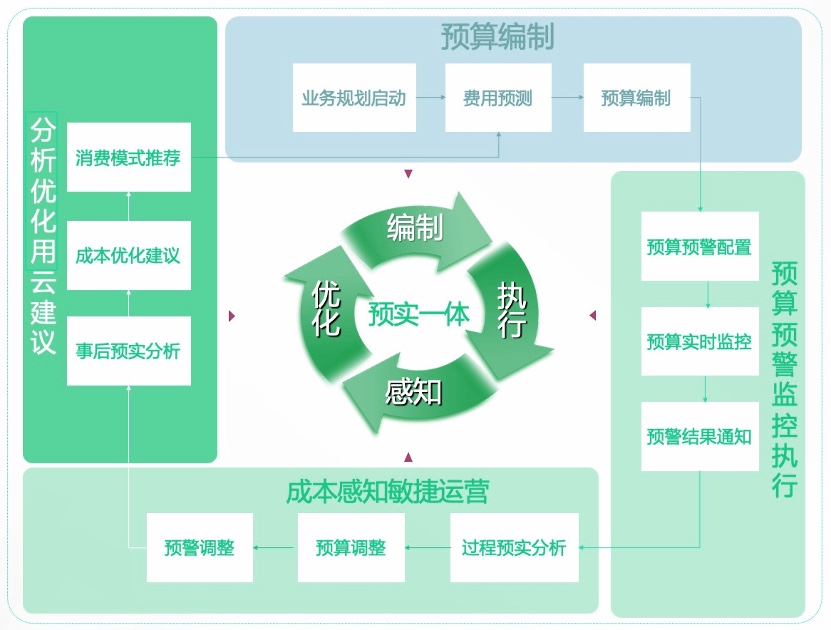

#### 资源规划

很好地了解定价的原则、做好规划，可以节省使用的费用。
同时数据中心资源也有热度和稀缺性，企业客户要做好对资源的供应规划。
按照业务需求和成本需求进行资源规划，并在即时供应和预置需求之间取得平衡以协调业务增长，资源故障、高可用性和预置时间。

##### 根据业务演进计划做资源规划

可预见的业务演进计划可以帮助我们做资源规划，预留资源，并反映到成本预估里面，客户侧的业务演进涉及到：

1. 新业务上云部署，需要为新业务和系统做资源规划
2. 存量业务增长需要新的算力
3. 现有云平台系统迁移至 DCE 部署
4. 混合云场景下云网络改造涉及的新增边界产品
5. 数据存储增加

上云和 DCE 平台迁移前企业需要对云资源容量进行规划设计，通过管控手段使云成本运营更高效，成本更节省。
通常情况下，容量评估可以从常驻资源和弹性资源两个维度进行评估和规划。

常驻资源通常承载在线业务、常驻的作业等，这部分的容量规划通常需要根据实际业务场景的水位来预估。
对于可靠性要求较高的场景，可以设置峰值水位为常驻容量。对可靠性要求不高的场景，可以使用均值水位为常驻容量。

弹性资源通常应对突发流量，一次性任务等业务需求。对预期内的业务流量增加，比如促销活动、考试报名，
可以通过弹性资源来满足需求。而将非预期内的突增流量和临时任务，也通过弹性资源来满足需求。

企业可通过调研业务部门未来一段时间的业务规划，梳理并列出适合业务并留有一定冗余量的资源规格和用量。
企业客户可以按照月度和季度，以及财年的维度做资源规划，也可以基于当前资源的消耗对未来资源的使用量进行预测，辅助规划。

##### 规划配额

- 实例配额按照资源供应确定性分为总配额、预留配额和保障配额。
  总配额为该实例的保有上限，保障配额为该实例的保障供应下限。
  根据您的实例使用情况，系统会周期性自动调整您的实例配额值，以保证总配额的自动增长可以满足您的日常资源用量增长。
  如果总配额不能满足您的需求，您可以自助申请提升总配额：
- 提升镜像、云盘、安全组等资源的配额限制；
- 规划特权项目：包括实时降配、复制镜像、导出镜像等。

##### 弹性伸缩计划

可以使用弹性伸缩计划，对周期性的短期，且会影响到的业务的资源进行保障：比如仅在每天、每周或每月的固定时段运行计算任务，每次任务都需要一定量的资源。
如果不能保证资源供应确定性会影响业务，但其他时段需要的资源量较少，整体使用量偏少，可以考虑使用弹性伸缩计划。

##### 规划流量资源用量

规划流量资源用量，在做架构设计时，通过网关管理入向和出向公网流量，共享公网流量带宽。

##### 构建容器集群时选择合适的实例类型

容器集群需要做好集群宿主机的规格的规划，根据业务类型选择合适的基础设施，
例如进行模型训练集群需要配备 GPU、加速网卡等高配硬件资源。
建议基于裸金属设备搭建云平台，基于裸金属搭建平台优势如下：

1. 节约资源开销，无需虚拟化层 CPU/内存/磁盘开销，节省资源可用于部署更多业务应用
2. 运维排错简单，当应用或平台出现故障时，便于快速排错，无虚拟化层干扰。

创建 Kubernetes 集群时，使用很多小规格集群 的做法有以下弊端：

- 小规格 Worker 集群的网络资源受限。
- 如果一个容器基本可以占用一个小规格集群，此集群的剩余资源就无法利用（构建新的容器或者是恢复失败的容器），在小规格集群较多的情况下，存在资源浪费。

##### 道客应用市场服务的规划和计费结构

道客应用市场同时提供了道客服务产品以及来自第三方供应商的服务。其中每个类别都有不同的计费结构。
计费结构包括免费、一次性购买费用或订阅产品/服务。

##### 成本优化目标下的资源规划

识别和管理成本优化目标的需求，进行资源缩减规划，有以下方法可以考虑：

1. 抽取共享资源到共享资源组，资源得到最大化利用，可以分摊成本到不同的业务部门；
1. 在成本归集分析中找到费用比较高的资源和资源利用率不高的资源开始规划资源的缩减计划；
1. 拆解成本优化目标到资源组和账单单元，有针对性的指定成本优化目标；
1. 按照成本优化的最佳实践设计，通过架构优化减少资源规模和成本；
1. 成本优化要先置，资源规划先于资源开通和管理有助于成本控制；

结合成本优化阶段建议，来完成以成本优化需求的目标。

### 用云执行阶段

#### 资源管理

道客资源管理服务是一系列企业 IT 治理产品和服务的集合，主要包括工作空间（Workspace）、资源组、资源共享和标签。
您可以使用工作空间（Workspace）在云上构建企业业务组织关系，使用资源组和标签分层次管理云上资源，使用资源共享在企业成员之间共享云上资源。
结合资源管理服务管理资源的全生命周期和成本归集是良好的实践。

##### 管理工作空间（Workspace）和资源组

工作空间（Workspace）支持您基于企业的业务或生态环境，更快捷地构建出体现资源关系的目录结构，并将企业多个账号分布到这个目录结构中的相应位置，
从而形成资源间的多层级关系。您可以依赖设定的组织关系进行资源的集中管理，满足资源在财资、安全、审计及合规等方面的管控需要。

最佳实践是以企业视角审查与管理云资源的成本费用设定专门的财务账号，为组织或单元下所有账号付费并管理账单，以此实现企业级的统一财资管理能力；
通过文件夹、账号或资源组，企业以不同的维度实现分账管理。

工作空间（Workspace）提供的多账号方案，单账号下给资源打标签方案，和资源组管理方案都可以满足部门分账账单管理功能支持按资源组进行分账，
解决财务成本分摊的问题的需求。企业可以根据安全，审计的需求综合考虑资源管理目录方案。

##### 管理资源实例

计算资源通常分为常驻资源和弹性资源。对于常规业务，可以通过常驻资源承载，这类业务通常是指企业内部管理平台，
在线业务、常驻的作业等，这部分的容量规划通常需要根据实际业务场景的水位来预估。
使用 Insight 监控监控生产系统资源的运行情况，可以获得资源利用率的真实数据。通过构建云资源监控体系，持续监控系统与资源对应的各项指标，来优化资源容量。
将非预期内的激峰流量和临时任务，交给弹性资源进行补充和供给。使用弹性伸缩按需取用，自动释放资源，无需担心不能及时释放冗余资源，造成成本浪费。
弹性伸缩能够适时调整计算能力，提高资源利用率，降低了资源的拥有成本。此外，企业无需投入大量人力来调整计算资源，节约了人力成本和时间成本。
按照业务需要动态分配资源，对于可预测的云资源变化，比如可预见的业务高峰时段，可以采用基于时间的自动扩缩容以及时提供正确的资源量，
也可以根据工作负载分析，使用弹性资源组配置计划扩容和缩容。

利用道客 API 和自动化的能力，动态改变架构中云资源的数量也是推荐的做法，
在需求高峰期间自动增加资源数量以保持业务，也可以在需求量降低时减少容量以降低成本。
运维编排服务是道客提供的云上自动化运维服务，能够自动化管理和执行任务。
如果业务系统在每天都有特定的流量高峰期时间段，在此时间段内需要大量的实例。
当过了每日的流量高峰期时间段后，工作负载可定时缩容释放资源。

##### 管理资源配额

从云资源管理和运维的角度，企业可以通过配额查询不同组织部门的配额限制，也可以根据业务的需要在线调整配额。
通过运营管理模块，可查看不同部门、不同资源维度的资源使用情况，调整资源陪额。

从云资源管理和运维的角度，企业可以通过配额查询不同组织部门的配额限制，也可以根据业务的需要在线调整配额。
配合运营管理模块查看不同部门、不同维度的资源使用情况，帮助资源配额优化。

##### 缩减停止资源

通过手动或自动的方式，根据资源规划的生命周期对闲时资源自动缩容，和对闲置资源及时关停。在资源创建时可以使用标签和分组的方式标记资源的生命周期。
比如添加标签：测试阶段使用的机器，为某任务创建的 3 个月到期的实例，这样可以更方便地了解资源的使用情况，及时采取措施。

根据业务需要缩减资源, 如果在企业的系统架构中，充分使用了弹性伸缩的架构和能力，资源会在业务容量缩减的时候按照预先设置的弹性规则自动缩减。

对于不具备自动弹性能力的资源，在业务量下降或者停止服务时，资源也要及时进行缩减和停止。
另外，在经历完整的研发流程之后，对研发资源和测试资源进行缩减是很有必要的。

在资源监控工具中查看资源水位，也可以实施工作负载吞吐量监控或警报，在工作负载吞吐量下降时，及时处置有可能产生的资源浪费。

##### 释放资源

及时释放不再需要的资源也是管理资源过程中节约资源成本的常见做法。
这不只是为了节约云资源成本考虑，也要综合考虑这些不再使用的资源留存带来的管理成本和安全隐患。

##### 管理数据传输和流量

管理正在发生的数据传输的位置、传输的成本以及相关业务目标。监控数据传输带宽和质量。

管理数据传输可以结合您的安全设计方案，安全方案的实施可以减少不必要的和危险的数据传输，对于按流量计算的数据传输来讲，
好的安全方案既可以抵御传输安全和数据安全的风险，同时也可以减少不必要的传输成本。
启用防护白名单对公网 IP 的入向流量和出向流量进行安全管控可以减少不必要的流量和费用。
开启访问日志，可以查看客户端的访问情况，对访问次数过多，超出正当使用范围的客户端，
及时限流也是一种推荐的方式。更多安全产品可以参考安全合规支柱中相关章节的内容。

##### 存储资源管理

采用存储和计算分离的架构设计更容易对计算资源和存储资源进行管理，按照不同存储类型的产品，对资源的存储方案进行管理。

##### 跟踪工作负载中资源的使用量

企业需要跟踪工作负载中的每一个资源的资源使用率，并根据使用率的变化对资源和实例规格进行调整。
运维人员不但要对资源的高使用率，高负载进行监控，同时也需要对资源低使用率，低负载进行监控。
对弹性业务场景和不确定性业务场景，资源创建可以从较低的资源配置开始，然后根据需要扩展资源是良好的实践。

企业可以通过道客提供的 Insight 监控服务来监控各个云资源的监控指标，及时了解云上资源的使用情况。
并针对每个指标的基线阈值生成报警。根据业务流量的变化用户可以微调报警阈值，以管理真实的业务水位，避免过度响应。

##### 管理资源的计费类型

通过管理资源的计费类型，优化资源使用和成本结构，可以参考成本优化阶段的计费方式优化中相关的内容。

#### 预算和成本管理

企业通过管理云上预算可以在上云前对云成本进行规划与预算编制、在上云过程中对预算消耗情况进行监控与预警、以及预算和实际消耗的对比分析。
实现云成本管理闭环，提高云成本精细化管理水平。

将云成本相对准确地分摊到业务是云成本管理的关键环节，将成本进行分摊才能落实成本责任制，
企业要定期对责任团队所分摊的成本进行监控分析，追踪超支原因，让责任团队能够主动、持续的优化成本。

##### 管理平台的预算

**按云资源使用量** 编制预算也是一种有效的预算管理办法，根据业务需求规划资源用量，根据资源用量计算预算金额。根据预算金额监控您的费用情况。

按照 **使用率与覆盖率** 进行预算管理，比如可以按照组织部门、规格等维度，设置节省资源使用计划。

##### 分摊云成本

###### 通过财务单元进行成本分账

购买的云产品可能由不同的部门、项目、业务线使用，在成本精细化管理的要求下，应根据“谁使用谁承担”的原则将成本分摊给实际使用者。

使用财务单元功能将部门、项目、业务线等对应云资源实例产生的费用，用自定义的“财务单元”标识，并以目录树的形式建立自定义的费用层级结构。

可以使用三种分配方式把已购买的资源实例分配到对应的财务单元中。自动分配支持按规则把资源实例，分配到指定的财务单元；
手动分配支持手动把资源实例，分配到指定的财务单元；公摊分配将需要公摊的费用，按自定义规则分摊到其他财务单元。

### 监控分析阶段

#### 监控预警

成本监控和预警有助于发现成本问题和成本优化机会点，因此企业应该通过各种监控工具对成本数据和资源数据进行有效监控，
并通过预警的方式通知到相关的运维人员或财务人员，从而对发现的问题或优化机会进行跟踪处理，避免预期外费用、优化资源使用率，实现成本节约。

##### 管理预算并预警

对云成本进行预算管理是管控云成本的有效手段，通过预算编制、预警和预测、滚动调整预算、预实分析和优化，建立起基于预算的成本闭环管理链路。

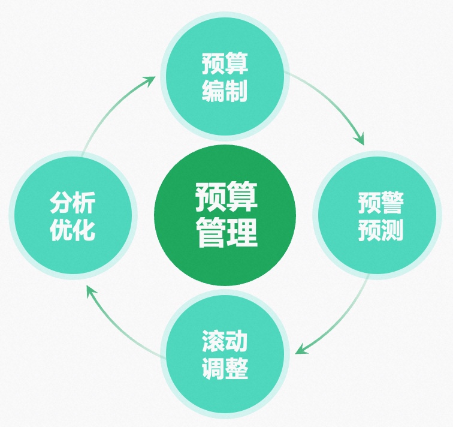

企业可以使用预算管理工具进行事前的云成本规划与预算编制、事中预算监控与预警通知、事后的预实对比分析。比如企业可以：

- 基于组织部门、账号等多种维度对成本进行多维度预算管理。
- 基于费用预算、使用率与覆盖率预算、按量编制预算，对云资源进行预算跟踪。
- 对实际费用和预测费用分别进行预警。
- 通过预实对比分析，及时发现预实差异产生的原因。

##### 监控资源水位

对云资源的资源使用率监控可以掌握云资源的消耗水位，对云资源水位过载，资源水位偏低，资源闲置等情况进行及时跟踪，可以帮助企业更好的管理云资源的使用。
在监控的基础上，企业可分析以往数据，有效预测云平台容量未来变化，提前预警。

###### 日常云资源使用监控

1. 需要日常建立对云资源水位的监控，云上用户可以使用 Insight 监控的能力，实时或者准实时观测云资源的使用情况，同时也可以设置报警规则。
2. 云资源高负载运行通常意味着可能需对云资源进行弹性扩容。企业需要对资源高负载运行的情况进行数据分析，看是否存在资源使用不当的情况，
   需要进行架构优化或者代码优化如果资源消耗是正常的，则可以根据成本计划阶段制定的计划和标准进行新增资源的审批，财务批准后进行资源扩容。
3. 云资源低负载运行通常意味着低负载资源或者闲置资源，会造成资源的浪费，可以分析之后进行资源的缩容，缩容的操作应避免对业务产生影响，并在业务低峰期进行。
4. 设置了计算资源弹性伸缩等规则的资源变更时间也要进行监控，避免因为规则设置不当导致的过度扩容或者没有及时的缩容，增加额外的成本。
5. 对于闲置的，长时间没有使用的计算资源要进行资源关停和释放，对于不需要的存储文件，如快照等也可以及时删除，避免资源的持续浪费。

根据持续一段时间周期的监控数据，评估可优化的资源使用空间，通过监控数据，可以观测到存在忙时及闲时流量特性的场景，可指导企业采用灵活组合多种计费方式资源以节省成本。

###### 使用企业级 Insight 监控应对复杂的部署和使用场景

企业借助工作空间（Workspace）轻松实现企业跨道客账号资源的统一监控。
对于混合云场景，建议使用企业级 Insight 监控立足云上，高效、低成本解决云下资源的监控数据的汇聚，快速构建云上云下一体化监控体系。
使用智能水位分析报告工具可以使企业轻松获取基于道客大数据的性能报告，采用人工智能算法深度分析产品使用状态。

###### 结合预算计划监控数据和资源监控数据进行相关性分析

预算监控数据可以帮助我们观测资源的消耗，并关联到相关的产品模块的具体使用情况，
结合云资源的监控数据可以分析出资源消耗发生的时间点、事件，并采取相关的措施。

#### 成本可视化

通过成本分摊可以有效地获取分摊后的成本数据，企业通过采用成本可视化工具，对成本进行多维度分析，找到更多的成本问题和成本优化机会。

##### 成本分析可视化

定期对云成本进行全方位多维度的分析是非常必要的，能够帮助企业从不同维度进行经营管理分析，并及时发现业务问题和成本优化机会。

通过使用成本分析工具，企业可以多维度查看资源成本的趋势（最大支持 12 个月），分析全面的成本组成结构，并对未来成本趋势进行预测等，
也可将一组筛选后的数据及对应条件保存为报告，便于快捷查看。

- 使用成本分析功能按照月、天、小时的时间粒度进行成本展示，采用多维度展示消费账单情况，
  比如按照产品、产品明细、财务单元、账号、资源组、标签等维度，可以使企业清晰的了解云服务资源的消费情况。
- 对消费趋势进行预测，了解长期，比如 12 个月的成本趋势。
- 订阅报告，可以将常用的成本分析维度保存为报告，后续能以报告的视角快捷地分析成本。
- 成本分析结果导出，方便组织内分享。

##### 对比预算和设计消费

在预算编制完成后，除了可以设置监控阈值进行自动预警外，还应该定期对预算执行情况进行分析，通过预实分析功能，
可以查看预算与实际消费金额的对比情况。通过可视化工具查看预算信息，累计的实际消费金额，以及每个滚动周期预实对比情况是在监控分析阶段必要的分析活动。

- 预实走势报表可以展示累计实际值、累计实际值与预测值之和，按照月维度的增长趋势；
- 本期预实报表可以展示本期实际值、本期实际与预测之和，分别与本期预算金额的占比；
- 预算记录可以展示预算起止日期内，各滚动周期的预测值、实际值、预算值，及实际值、预算值之间差异；
- 明细报表可以针对单个滚动周期的发生明细，以及关联对应日期的实际消费明细数据。

##### 分析和预测成本趋势

分析成本不仅要针对已经过去的历史周期，还应该对未来可能发生的成本进行预测分析，定期分析预测成本，有助于做好预算管理和财务规划。

使用成本预测工具，支持在预算管理和成本分析两个场景中的预测。

- 在预算管理中支持最多 12 个月的费用预测，并可支持账号、产品、产品明细等粒度的预测，为预算编制提供参考建议。
- 在预算管理中可以对预测费用进行预警设置，当成本预测值达到阈值就可以触发预警。

##### 采用成本优化建议

使用“成本优化”建议可以获得部分云资源实例的使用建议，达到节省成本的目的。

成本优化由多个成本优化工具组成，每个成本优化工具适用于不同的场景。成本优化建议是基于历史账单数据、产品特征、折扣等信息进行的模拟测算，
与未来的实际可能存在差异，仅供参考，需结合企业的实际业务情况验证后执行，并持续监控执行效果。

### 成本优化阶段

#### 资源使用优化

资源使用优化是成本优化的必要手段也是有效手段。云资源利用率不佳往往由于用云经验和技术债务等原因，比如传统企业数字化程度不高且经验不足，
在面对云原生架构的引入时，缺乏有效的成本洞察和成本控制的手段；也或者由于云原生技术的一些不当使用而带来的技术债务，造成了成本增加。
再者，云服务除存量稳态运行的资源之外，每年还会有新增机器，一般情况下，随着业务的增长，资源规模与成本总是逐年增加的。
面对如此规模增长，资源管理需要聚焦整体的效率提升，并通过高效的集群管理和资源管理来提升整体资源利用率，节约资源成本。

##### 典型资源优化场景

###### 基础设施云原生化

云原生化之前，传统 IT 架构迁移上云，或者需要对传统 IT 架构进行云原生化改造。
此阶段是对基础设施的一次重大变更，需要在关键时机对成本进行规划和治理。此阶段需要重点关注以下内容。

- 推荐借助压测工具评估业务系统容量
- 根据业务选择合适的基础设施型号

###### 应用云原生化改造

云原生化进行中，云原生化后的应用可以借助 Kubernetes 提供的弹性扩缩容、混部等机制，具有高可用的稳定性优势。
同时，在业务流量动态涨跌波动时，使容器按照承载业务的标准部署单元进行扩缩容，从而具备按业务需求量申请资源成本的智能化策略的削峰填谷能力。

###### 稳定运行的云原生业务

云原生化进行后，业务持续运行过程中需要根据业务的动态变化制定相应的成本治理策略，常见于以下场景：

- 业务呈现较明显周期性波动，例如出现早九晚五是流量高峰期的现象。此场景推荐使用成本洞察功能观测规律，并采取合适的弹性能力等成本优化手段。
- 新老业务交替频繁是很多新兴业务领域的常见现象。在业务新兴阶段，应用的资源成本面临容量规划的挑战。
  推荐使用成本洞察功能观测应用的资源成本使用情况，同时推荐使用资源画像功能，合理规划应用的配置规格。
  通过资源现状评估可以获知资源使用，通过设计资源使用架构，优化资源利用等措施，可以达到资源利用优化的目标，进一步节约成本。

##### 资源现状评估

在云计算越来越趋于基础设施化的今天，企业使用云服务时通常会遇到资源通常分散在不用的云服务中，这不便于从应用架构的角度来管理资源的挑战。
通过工具辅助人工方式定期对云上整体资源进行梳理、调整和更新，将资源可视化，高效指导资源的优化方向，从而避免云资源在持续使用过程中由于各种原因产生不必要的浪费。
如存在孤岛资源、闲置或低利用率资源等。

###### 存储选型

为了配合使用场景和云服务进行针对存储选型，需要回答好业务和技术指标方面的问题，以便于更清楚存储承载的应用环境。
其他业务指标如用户量规模，百万还是千万级；整体存储数据量，数据压缩率，数据量预估和日均增量情况；
读写偏好，数据是读多一些还是写多一些；数据是强事务型还是分析型需求；
存储所支持的数据服务引擎如关系型、非关系型、键值存储、行或列存储还是图文存储等；运行性能要求，业务并发量、高峰和低谷分别的预估情况等。
不同指标对选择存储类型和规格均有一定影响，需要根据不同场景进行适配。

##### 设计资源架构并合理使用

###### 释放未使用的资源

对于在非工作时间不需要使用或用于临时性测试资源，可以在非工作时间自动关闭这些虚拟机或在测试任务完成后删除这些服务器。
在判断闲置资源时，参考道客 Insight 监控过去 30 天的资源性能数据，按照 CPU 使用率和磁盘 IO 以及网络利用率为参考指标。
当 CPU 资源峰值利用率 < 1%，磁盘 IO 小于 <10，网络利用率低于 1% 时，判断该服务器为闲置资源。由于内存为占用型资源，故不考虑将其纳入到判断指标内。

###### 优化存储资源使用

在选择存储资源时，时刻评估你的存储资源如何根据业务特性配置合理的生命周期并养成定期清理磁盘的良好习惯，删除不用的内容。
在超大数据规模的存储场景下，可以使用存储容量包降低整体使用成本。

###### 优化存储结构

如果您持续采集某应用的日志，每天的写入量为 100 GB，存储 30 天并建立全文索引，此数据量日志服务成本就很高。
如果您更关心的是其中某一类 Pod 的日志，例如操作日志与出错日志。假设这类日志的比例是 20%，且希望存储 30 天。
对其他的日志只需要存储 7 天。

###### 优化存储内容

假设您只关心原始日志中的某些字段，则可以通过数据加工将关心的字段存储 30 天并建立索引，其他冗余字段仅存储 3 天即可。那么推荐您使用如下加工方案：

假设每条日志经过加工后大小约为原来的 60%，与加工之前相比大约可以节省 30% 的成本。

###### 合理规划网络

当使用网络服务时，在架构优化层面可以尽量使用内网进行应用间的通信；
在跨 IDC 或者跨子网的流量互通时规划好网络架构及带宽。
重新评估公网出口的规划设计，推荐使用网关等服务做网络出入流量的统一管理并持续监控网络流量的使用，
实时监控网络流量和费用，防止突发的人为或者意外的大规模数据传输而导致成本的飙升。

##### 为应用负载引入弹性机制

为应用的计算资源引入弹性服务，可以减少业务低峰时资源的浪费，也可以减少运维成本。

###### DCE 弹性机制

计算弹性伸缩是云的核心特性之一，根据用户的业务需求和策略，自动调整其弹性计算资源的管理服务。
用户根据自己的业务需求自动调整其弹性计算资源，在业务需求增长时，无缝地增加弹性计算实例，并在业务需求下降时，自动减少实例以节约成本。
弹性伸缩 Auto Scaling 是一个免费的服务，使用弹性伸缩服务的能力，无需投入大量人力来调整计算资源，无需提前预备计算资源，
也无需担心不能及时释放冗余资源。弹性伸缩在适当的时间进行伸缩任务，降低资源拥有成本。

###### 容器化改造，提升资源利用率

容器技术通过隔离运行在主机上不同进程，实现进程之间、进程和宿主操作系统相互隔离、互不影响，它有自己的一套文件系统资源和从属进程。
容器服务没有管理程序的额外开销，与底层共享操作系统，性能更加优良，系统负载更低，在同等条件下可以运行更多的应用实例，可以更充分地利用系统资源。
同时，容器拥有不错的资源隔离与限制能力，可以精确地对应用分配 CPU、内存等资源，保证了应用间不会相互影响。更小的计算开销意味着更低的总体成本。
容器可以显著减少您启动和管理的虚拟机数量。通过消除每个应用程序都需要运行一个虚拟机的需求，可以减少整体计算开销。
这种浪费、重复的操作系统和资源的减少可以转化为巨大的成本节省。过去多年大量的互联网企业经历了应用容器化改造。
毋庸置疑，企业应用的容器化改造，不仅可以提升开发运维效率，同时依靠道客弹性容器实例相关能力将计算资源的利用率大幅提升，节约大量成本。更多容器弹性策略请参考如下内容。

##### 优化资源利用率

资源利用率提升本质就是用最少的资源最大化满足算力需求，同时需综合考虑业务布局、容灾和稳定性、机器故障率、预留缓冲空间等因素，这些因素交织在一起共同资源使用效率。
概括起来需要被关注到的内容包括：明确资源利用率统计口径、优化业务布局和集群架构部署、基于分配率和利用率驱动资源运营、统一资源池和节点管控、完善的资源数据监控能力、
统一的资源调度和单实例资源的精细化隔离及水位控制。同时，当成本占比最高的生产环境资源的利用率显著提升，对整体云服务而言，其使用的综合成本收益将会最大化并保障服务质量。

###### 通过 Insight 监控明确资源利用率统计口径

使用 Insight 监控各云服务资源的监控指标，探测云服务可用性，并针对指定监控指标设置报警。
可以全面了解道客上资源的使用情况和业务运行状况，并及时对故障资源进行替换，高负载资源进行升配处理，保证业务正常运行，对低负载资源进行减配，减少资源浪费。

###### 云原生弹性伸缩满足统一资源节点管控

容器服务弹性伸缩是根据业务需求和策略，经济地自动调整弹性计算资源的管理服务。弹性伸缩是云容器服务被广泛采用的功能。
为最大化提升资源使用率，在如在线业务弹性、大规模计算训练、深度学习 GPU 或共享 GPU 的训练与推理、定时周期性负载变化等场景均有较大的适用空间。

弹性伸缩服务支持两个维度，第一个是调度层的弹性，主要是负责修改负载的调度容量变化。
例如水平伸缩 HPA 是典型的调度层弹性组件，通过 HPA 可以调整应用的副本数，调整的副本数会改变当前负载占用的调度容量，从而实现调度层的伸缩。
第二是资源层弹性，主要是集群的容量规划不能满足集群调度容量时，会通过弹出容器资源的方式进行调度容量的补充。

两层的弹性组件与能力可以分开使用，也可以结合在一起使用，并且两者之间是通过调度层面的容量状态进行解耦。

###### 云原生资源调度通过应用负载合理调度资源

为了实现精准、实时的实例伸缩和放置，必须把应用负载的特征作为资源调度依据，使用弹性调度策略，云平台负责管理应用所需的弹性计算资源。
调度平台可以识别应用特征，在应用负载快速上升时，及时扩容计算资源，保证应用性能稳定。
在负载下降时，及时回收计算资源，加快资源在不同租户间的流转，提高资源利用率。
使用更实时、更主动、更智能的容器服务精细化调度是获得良好用户体验的关键。
通过计算资源的弹性调度，完成指标收集、在线决策、离线分析、决策优化的闭环。

#### 管理存储生命周期

随着应用与业务系统的长期运行，企业将积累大量数据。同时伴随着业务团队承接的业务体量越来越大，所需要的数据源的类型会变的越来越多。

通常情况下，最近写入的数据访问频率会比很久之前写入的数据高很多，此时我们可以认为这些数据为“热”的。
随着时间的推移，初始写入的，被认为是“热”的数据，访问频次逐渐下降，当每周只被访问几次的时候，就会转换为“温”的数据。
在此后，3~6 个月里面，当数据一次都未被访问，或者访问频率降低到一个月几次或者几个月一次，它就可能被定义为“冷”数据。
最终，当数据一年之中极少用到，仅有一两次使用频率的时候，它在生命周期内的温度可能就是“冰冻”的了。

不断增长的冷数据或冰冻数据对现有集群的存储空间压力越来越大，成本也越来越高。
冷数据存储空间带来的成本不可控影响不容忽视外，在存储生命周期管理的架构设计上也需要为访问频繁的热数据留出性能优化空间。

通过不同组合，冷数据的长期存储成本需要低于热数据存储成本，并且冷数据要能便于读取分析被访问的文件资源创建时间分布情况，
进行全生命周期的管理，通过不同存储介质的不同成本情况进行保存，从而达到降低数据存储成本的目的。
在云上，可以通过数据的访问频次进行区分不同存储类型，全面覆盖从热到冷的各种数据存储场景，从而达到数据在生命周期内达到存储成本最优，且能满足日常业务需要。

##### 云原生场景下的资源治理

云原生技术提供了共享、隔离、弹性等资源管理能力，能够非常简单高效地提升资源使用效率并降低企业资源使用成本。
然而现实情况可能是大部分企业在使用云原生容器化弹性计算资源的成本有所增加。

造成这一现象的原因可能有两方面。第一，由于云原生技术的一些不当使用而带来的技术债务，造成了成本增加。
第二，传统企业主要还是以线下业务开展为主，数字化程度不高且经验不足，在面对云原生架构的引入时，
往往缺乏有效的成本洞察和成本控制的手段，难以分析成本增加的原因。
引入先进技术的同时成本管理的复杂度也对应被引入，如何在容器层做好资源的管理，是摆在每个企业面前的现实问题。

通过云原生场景的成本治理实践，将成本优化能力融入容器管理平台，并从物理和逻辑两个维度进行聚合分析，
物理维度包括集群的 Node、节点池和资源组，逻辑维度包括 Pod、应用负载和命名空间，并将物理维度的费用和逻辑维度的费用进行打通，
建立完整的资源成本画像，从而更准确合理地进行一系列治理工作。

##### 通过自动化来达到资源的合理使用

线上资源含通过自动弹性自动化工具来管理，达到资源的合理使用，可以减少人工运维成本和误操作成本。

- 弹性伸缩：适合业务负载存在峰谷波动的场景。
- 弹性供应：一键部署实例集群。适合需要快速交付稳定算力并需要降低成本的场景。
- 资源编排：一键部署并维护包含多种云资源和依赖关系的资源栈。适合交付整体系统、克隆环境等场景。

#### 持续架构优化

有些企业在最初上云的时候，通过迁云的工具将应用和数据从原有数据中心迁移到云上。这些应用没有采用云原生的架构，
无法利用云原生在弹性、韧性、安全、可观测性、灰度等优势，没有释放云的最大优势和效能。通过分析后发现这些业务，
随着业务的发展，新的业务场景也会出现，云厂商也会推出新的产品类型和产品规格，通过持续架构优化，适配业务需要，并优化云资源使用，降低用云成本。

##### 对应用架构进行云原生化改造

云原生架构是基于云原生技术的一组架构原则和设计模式的集合，旨在将云应用中的非业务代码部分进行最大化的剥离，
从而让云设施接管应用中原有的大量非功能特性（如弹性、韧性、安全、可观测性、灰度等），
使业务不再有非功能性业务中断困扰的同时，具备轻量敏捷、高度自动化和资源按需消费等特点。

以容器为代表的云原生技术作为云计算的服务新界面加速云计算普及的同时，也在推动着整个商业世界飞速演进。通过云原生化改造，
企业可以充分利用云的强大能力，从云原生架构中获得更高的系统可用性与可扩展能力，利用云提升发布和运维的效率以及组建成本最优的架构。

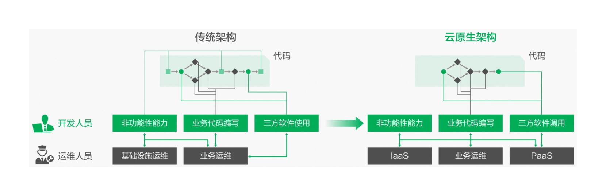

###### 应用容器化

软件交付的困难在于公司环境到客户环境之间的差异，以及软件交付和运维人员的技能差异，填补这些差异的是一大堆的用户手册、安装手册、运维手册和培训文档。
容器就像集装箱一样，以一种标准的方式对软件打包，容器及相关技术则帮助屏蔽不同环境之间的差异，进而可以基于容器做标准化的软件交付。
容器作为标准化软件单元，它将应用及其所有依赖项打包，使应用不再受环境限制，在不同计算环境间快速、可靠地运行。

容器技术和容器服务 DCE 提升了企业 IT 架构敏捷性的同时，让业务迭代更加迅捷，为创新探索提供了坚实的技术保障。
使用容器技术可以获得几倍的交付效率提升，这意味着企业可以更快速的迭代产品，更低成本进行业务试错。同时在互联网时代，
企业 IT 系统经常需要面对促销活动、突发事件等各种预期内外的爆发性流量增长。通过容器技术，企业可以充分发挥云计算弹性优势，
降低运维成本。一般而言，借助容器技术，企业可以通过部署密度提升和弹性降低将近一半的计算成本。

###### 应用微服务化

以前，创建一个后端应用程序最简单的方法是使用单个后端应用程序来提供和集成所有服务，这就是所谓的单体架构。
但是，随着业务的扩展和需求的不断增长，单体应用程序变得越来越复杂。为了解决单体架构带来的集中式项目更新问题，微服务架构被开发出来。

微服务架构通过将应用程序分解为多个分布式服务，实现了应用程序的水平扩展和多副本部署，这有效地克服了单体应用在可扩展性和可靠性方面的固有结构弱点。

采用微服务化之后，应用的不同模块可以独立进行业务更新，这样快速变化的部分不会受到更新缓慢部分的影响，
从而提高了整体的开发速度和系统稳定性，并提高了资源利用率。

但是微服务化的目的并不是简单地为了分解服务，而是要根据业务需求合理地划分原有的单体应用。通过微服务化的重构，代码模块和部署结构被解耦。

每个服务的接口都可以独立部署和调整规模，使得资源配置更加经济，成本更低。
同时，利用云服务的自动化功能，应用的更新效率得到了显著提升，相比于手动软件部署，效率有了大幅度提高。

微服务引擎为用户提供服务注册发现、配置管理、网关管理、服务治理等高性能和高可用的企业级云服务能力。
其中注册中心、配置中心全托管（Nacos），支持多种类注册中心接入（兼容 Nacos/ZooKeeper/Eureka/Consul/Kubernetes），
网关管理全托管，基于 Contour 构建并兼容 Kubernetes Ingress 标准。

服务治理无侵入增强 Spring Cloud、Apache Dubbo 等开源微服务框架。帮助用户更便捷地使用开源技术构建自己的微服务体系。

打通容器集群和微服务注册中心，轻松实现服务的自动发现、路由转发。支持超时重试、熔断降级、流量泳道等功能。

##### 探索混合部署

为提升资源整体利用率，解决资源碎片问题并降低离线作业成本，将不同类型的在线、离线任务调度到相同资源上，
通过调度和资源隔离等控制手段保障服务的能力称为在离线或离在线混部。两者区别在于是以在线业务为主还是以离线业务为主的资源进行复用。

从集群维度来看，混部也是将多种应用在一个集群内部署，通过预测分析应用特性，实现业务对集群资源的充分利用。

从节点维度看，混部是将多个容器部署在同一个节点上，这些容器内的应用既包括在线类型，也包括离线类型。根据应用对资源质量需求的差异，
在线应用可以归纳为延时敏感型，通常对请求压力或访问延迟等指标有明确的要求，对资源质量较为敏感。
离线应用可以归纳为资源消耗型，通常是一些计算密集型的任务类应用，有较好的容错重试能力，对资源质量的要求相对较为宽松。

混部的过程中，对于资源管理员而言需要对资源进行整体管理，洞察各类应用的资源容量、分配量和使用量，提升集群资源利用率，从而达到降低成本的目的。
通过混合部署，离线享用在线空闲的计算资源，业务也能够享受到技术的红利。

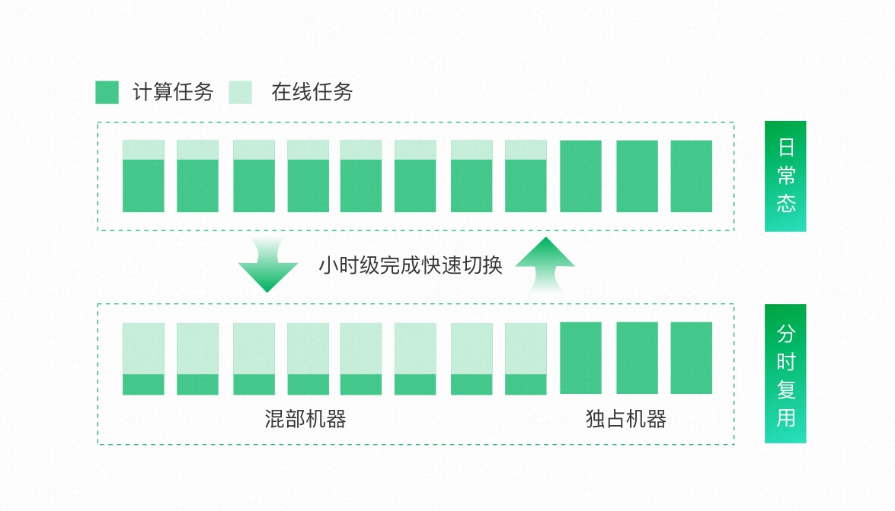

混部追求的是资源的极致利用，混部架构需要进行持续治理，从而达到稳定性、运维简化和成本优化的综合收益。

##### 计算存储分离

面对业务不断增长带来的数据持续增加，不管是在线还是离线系统，其所需要的存储规模以及存储成本，成倍上涨。
如果还是采取传统的分散式存储管理方式，不但带来高昂的管理分散式存储的成本，而且还会增加存储成本。

应用需要计算和存储分别可以高效按需扩容且节省成本的面向数据计算和存储场景的管理方式，此时分布式存储架构应运而生，
基于此架构的数据管理也随之而来，分布式且共享的存储架构，让数据库的一写多读、多写多读、全国多活容灾、数据一致性等等能力特性有了技术基础。

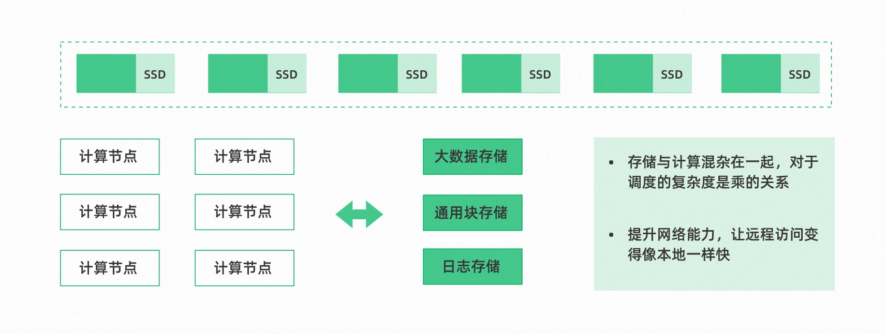

**存储计算分离架构**

传统的存储方式，是单台服务器类型的，将计算资源与存储资源绑定在一起。因此一台机器 CPU，内存与存储设备比值都是固定的。
这带来的一个问题，就是我们会比较频繁的改变我们的机型，因每年我们的计算资源与存储资源的配比都在变化，业务数据的增长非常快。
这也在某种程度上提高了机器的使用成本。

计算存储分离架构，解除了这两者紧密耦合的现状，可以分别进行弹性扩容。计算节点也不再需要考虑存储容量与内存容量的比例。
多个节点上的存储资源能够形成单一的存储池，这能降低存储空间碎片化、节点间负载不均衡的风险，同时通过降低索引量，优化存储空间使用。
同时存储容量和系统吞吐量也能容易地进行水平扩展。计算资源和存储资源解耦后，各自可以按不同的策略进行过保，在一定程度上降低了成本。

### 平衡业务目标与成本

企业需要选择合适的云产品及资源规格满足业务诉求，在应用负载的设计及资源选择过程中除了成本还应考虑稳定性、性能、安全合规、运营效率等方面的要求，在各项目标与成本之间进行权衡。

适合业务的应用负载设计并不意味着只追求低成本，首先需要全面了解各方面需求。
单纯的低成本通常意味着在其它方面做出妥协，全面了解各方面需求后，按照业务特性对应用负载各方面要求进行权重排序，综合考虑后再做出选择。

#### 成本与稳定性

如果业务对稳定性要求很高，设计出的应用负载也会花费很高的资源成本。
例如对服务水平 (Overall Service Level Agreement，SLA)、恢复时间 (Recovery Time Objective，RTO)
和恢复点 (Recovery Point Objective，RPO) 等指标要求严格，
为了让业务应用高可用，应用服务需要更多的资源进行跨可用区或跨区域部署，跨区域进行数据复制也会增加成本。

企业可以根据业务重要性对应用负载进行分层，确定稳定性优先级，选择合适的稳定性方案。
对于生产环境的在线应用通常建议选择同城双活、异地多活等高稳定性方案，重要数据选择同城冗余、跨地域备份等方式保障数据安全，测试环境可考虑降低稳定性要求以节约成本。

#### 成本与性能

高性能要求的应用负载通常会花费更高的成本，企业需要根据业务特性对应用负载设定性能要求，
在性能与成本之间进行权衡。关于成本优化与性能的一些建议如下：

- 在对资源选型阶段进行性能测试，满足要求后再增加购买量。
- 引入弹性机制，关注应用负载资源利用率、压力峰值时段等，动态调配资源供应，按需使用。

#### 成本与安全合规

高安全性要求的应用负载通常会导致高成本，企业需要根据业务特性对应用负载设定安全性要求，不建议在应用负载的安全及合规上进行妥协。
关于成本优化与安全合规的一些建议如下：

- 合规审计：使用管控策略、配置审计、操作审计等产品便捷实现云上持续合规，产品自身目前可免费使用（以官网计费说明为准）。
- 网络安全：进行网络安全防护以及流量隔离，实现管理/业务网络隔离，不同业务通过网络策略进行流量隔离。
- 密钥安全：使用密钥服务进行密钥统一管理，支持多账号共享实例，无需在每个账号重复购买。

#### 成本与卓越运营

构建可观测性系统、标准变更流程和自动化流程是卓越运营的重要组成部分，企业在建设初期通常会增加成本，
但成本会随着时间推移逐渐降低；在云上做好成本管理也是提升企业运营效率的重要环节。关于成本优化与卓越运营的一些建议如下：

- 使用云原生的 PaaS 类监控产品，避免自己维护基础设施带来的维护成本及稳定性问题。
- 使用 Jenkins 等基础设施自动化编排工具构建自动化流程，让基础设施代码化，降低开发和运维成本。

## 卓越运营

卓越运营是指在商业运营中注重细节、流程和效率，从而使企业取得卓越成果的一种管理模式。
卓越运营强调持续改进，注重提高业务效率、客户满意度和整体业绩。在企业数字化转型过程中，
基于云计算平台服务，可以让企业快速构建新业务、减少业务故障率、持续观测业务指标、提升业务稳定性，使企业更加专注于业务本身。
总体而言，主要包括以下几个关键领域：

卓越运营第一个关键领域是确定组织的运营模型和组织文化。在企业选择运营模型时，需要考虑自身规模、需求和预算来确定适合的运营模型；
同时要构建具备学习掌握新知识的能力、反思和持续完善的能力、快速调整和演化的能力、团队协作能力的组织。

卓越运营第二个关键领域是围绕事件管理、变更管理、问题管理定义企业 IT 运营的标准流程，同时要结合 ITIL4 理论和企业数字化转型的最佳实践。
事件管理，主要是迅速解决引起或可能引起业务中断和服务质量下降的事件，减少或消除存在或可能存在于服务中的干扰因素给整个业务带来的影响，
从而确保维持最佳的服务质量和服务 SLA。变更管理，主要是确保以受控方式记录、评估、授权、计划、测试、实施和验证对服务的更改。
问题管理主要是确定引起事件发生的潜在原因，从而防止问题和由此产生的事件再次发生，并尽量减少无法预防的事件的影响。

卓越运营第三个关键领域是围绕快速和规律的自动化部署确定企业 IT 运营的技术平台，推动基础设施即代码、自动化运维、自动化配置等能力中心的技术架构，
提高组织高速交付应用程序和服务的能力，与使用传统软件开发和基础设施管理流程相比，能够帮助组织更快地发展和改进产品。

卓越运营第四个关键领域是构建可观测性系统。在云原生时代，架构与应用部署方式的变化是非常频繁的，通过获取系统内部的信息，
来主动发现问题显得非常重要，构建可观测系统可以协助企业提升发现问题-判断和决策-解决问题的能力。

### 构建运营模型

运营模型是指组织和业务团队使用云计算平台支持业务的过程中，根据业务需求、企业架构、组织文化、现有的技术水平和工具等构建的模型。
每个企业的运营模型都是独特的，本文将介绍四种常见的运营模型以供参考。

构建运营模型的目的是为了实现更高效、更灵活的基于云计算平台的管理和运营。具体来说，构建运营模型的目的包括以下几个方面：

1. 实现快速部署和扩容：通过云计算平台构建标准的发布工程，实现快速部署和扩容，提高服务的响应速度和灵活性。
2. 提升决策的有效性：通过构建可观测系统，从而以高度统筹与整合的方式将业务数字化操作所产生的可观测数据进行反馈并创造决策循环，提高组织决策有效性。
3. 优化资源配置和利用效率：通过对云计算平台中各种资源（如计算、存储、网络等）的实时监控，配合一些优化措施，能够提高资源的利用效率，降低云服务的成本。
4. 提高业务的稳定性和可靠性：基于云平台提供的监测和专业技术能力，可以协助企业提升故障响应速度，缩短故障诊断时间，提高业务的稳定性和可靠性。

#### 运营模型定义

##### 分散式运营模型

应用，是一个可独立交付的对外提供服务的单元，是开发、部署、发布、运维的最小逻辑单元。
在研发态，通常对应一个到多个功能模块，关联一个或多个代码库；在运行态，通常对应一个或多个服务。

这里的开发指的是开发和测试应用程序和基础设施；运维指的是部署、更新和持续支持应用程序和基础设施。

在分散式运营模型中，不同人员是由不同的目标驱动的：

- 开发是由功能性需求（通常与业务需求直接相关）驱动的。
- 测试是由 BUG 性需求（寻找功能缺陷）驱动的
- 运维是由稳定性（非功能性）需求（例如可获得性、可靠性、性能等）驱动的。

在分散式运营模型中，每个象限中的活动由单独的团队执行。每个团队分工明确，能够更快地响应客户需求，更好的做出决策和采取行动；
当每个团队被赋予更多的自主权和责任时，员工可以在其责任范围内更好的进行创新与决策。但是在分散式运营模型中，
跨团队之间的沟通与协调的复杂性会降低整个组织效率。如果团队被狭窄地专业化、物理隔离或逻辑隔离，可能还会阻碍各个团队之间的沟通和协作。

##### 分散式+管理服务运营模型

在分散式运营模型组织中，如果组织需要更加专业的团队来支持云计算平台服务的运营，或者希望将日常基础架构运营相关的部分工作外包给专业服务提供商，
可以考虑选择道客的管理服务。道客的管理服务能够提供专业的云平台支持和安全合规要求，并支持安全和法规目标。

##### 分散式+ISV 运营模型

在分散式运营模型组织中，如果组织需要进行特定领域或特定行业的软件开发，可以自己考虑选择 ISV 来提供这样的服务。
ISV 通常能够与公司的其他产品形成互补，提供更好的解决方案，从而帮助公司更好地满足其客户需求。道客生态合作伙伴，
可以为组织提供应用程序开发、测试、部署和管理服务，以帮助组织实现更轻松地开发和部署其应用程序。

##### 集中式运营模型

基础架构工程师团队提供一个标准化平台（例如基础设置自动化、配置管理、应用发布）服务给应用程序团队，
这些服务可以帮助应用程序团队更高效地开发和运营其应用程序，并提供高质量的服务，以满足客户需求。

应用工程师团队通过标准化平台，负责应用的自动化开发、测试、运维，使得开发、测试、发布软件能够更加地快捷、频繁和可靠，从而缩短应用开发周期，提供高质量的持续交付。

在集中式运营模型中，集中化的团队通过专业知识和标准化可以为组织带来更高的稳定性、更好的运营性能和更少的成本。
基础架构工程师团队通过对生产环境的统一管理，减少了其他团队提升权限的需求，这有助于限制特权用户数量来减少违规行为。
但是在数字化转型过程中，云平台的运营可能会成为组织未来主要的运营平台，为 IDC 建立的现有平台和团队可能不适应云平台的运营。
此外，基础架构工程师团队之外的团队访问环境的权限是有限的，这不利于实验和创新。

##### 集中式+管理服务运营模型

在集中式运营模型组织中，如果组织没有现有的技能或团队来支持云平台运营，或者希望拥有能够区别于其他组织的独特能力，
但又想将日常基础架构运营相关的部分工作外包给专业服务提供商，可以考虑选择道客的管理服务。
道客的管理服务能够提供专业的云平台支持和安全合规要求，并支持组织的安全和法规目标。

##### 集中式+ISV 运营模型

在集中式运营模型组织中，如果组织需要进行特定领域或特定行业的软件开发，可以自己构建应用工程师团队或者考虑选择 ISV 来提供这样的服务。
ISV 通常能够与公司的其他产品形成互补，提供更好的解决方案，从而帮助公司更好地满足其客户需求。
道客的生态合作伙伴能够为组织提供应用程序开发、测试、部署和管理服务，以帮助更轻松地开发和部署其应用程序。

##### 云卓越中心运营模型

云卓越中心 CCoE 是驱动云转型的最佳实践。企业通常至少有一个云管理团队，或由相关负责人组建一个云卓越中心负责规划和对接上云的整体方案，
包括在组织层面确认上云的整体计划、步骤，以及收集组织的具体需求。

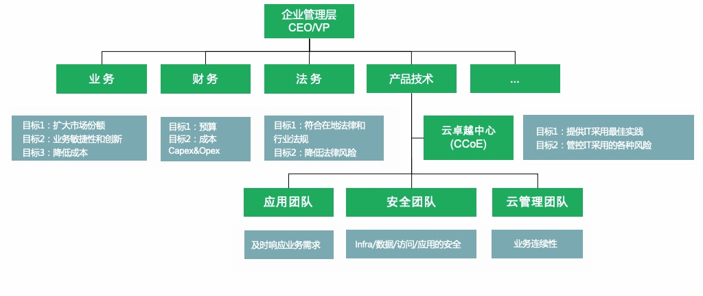

云卓越中心运营模型组织通常包括：

- 企业管理层：企业管理层需要明确云在公司的战略地位以及各个团队应该如何使用云。
- 云卓越中心：该团队可以是虚拟的组织，设计云服务的供给模式和管理体系，并提供相应的技术准备。其中的成员包括：
    - 架构师和专业技术人员，负责上云架构设计和业务上云迁移工作；
    - 安全、合规等领域专家，负责设计企业 IT 治理方案、预估风险和制定治理规则；
    - 财务专家，负责制定财务的管理流程和成本分摊规则。
- 云管理团队：在企业业务全面上云之后，持续优化云上架构，为新业务提供云上环境。建立企业云上运维体系，搭建运维平台，以及通过自动化运维的方式，
  对云上环境进行持续治理和管理。根据新业务需求，分配所需云资源和所需权限，并对资源进行初始化配置后交付。应用团队只需用云，无需关注基础设施搭建。

##### 云卓越中心运营+管理服务运营模型

在构建云卓越中心的过程中，组织可以基于自身的优势和特点，将云平台运营相关的部分工作外包给专业服务提供商，
道客的管理服务能够提供专业的云平台支持和安全合规要求，并支持组织实现自身的安全和法规目标。

##### 云卓越中心运营+ISV 运营模型

在构建云卓越中心的过程中，组织可以基于自身的优势和特点，如果组织需要进行特定领域或特定行业的软件开发，可以考虑选择 ISV 来提供这样的服务。
ISV 通常能够与公司的其他产品形成互补，提供更好的解决方案，从而帮助公司更好地满足其客户需求。
道客生态合作伙伴，可以为组织提供应用程序开发、测试、部署和管理服务，以帮助组织实现更轻松地开发和部署其应用程序。

#### 不同运营模型的选择

随着组织从本地环境迁移到云，需要基于组织的战略规划和组织文化确定使用哪种运营模型，分散式、集中式、CCoE 模型都有其适用的场景：

1. 分散式：更适合由持续创新、复杂程度很高的应用构成的 IT 环境，在这种环境中往往需要对应用不同的运营需求进行重点关注；
   有些组织是开发团队同时负责应用相关的 IT 环境的运营。
2. 集中式：更适合由稳定状态的应用构成的强管控 IT 环境，在这种环境中应用较为稳定，无需重点关注各个应用的运营需求，组织的重点是对 IT 环境进行管理。
3. CCoE 模式：如果组织计划实现大规模的云迁移工作或希望使用云来推动与市场优势相关的创新，可以考虑 CCoE 模型。在这种模型中，通过建立企业云上运维体系，
   搭建运维平台，以及通过自动化运维的方式，业务开发团队在遵守一系列准则和既定的可重复控制措施的同时做出自己的决策，保持业务开发团队的敏捷和灵活性。

不论组织现在采用了哪种运营模型，都是适应了现阶段的业务需求和战略发展规划。如果组织基于未来的战略规划重新定义运营模型并决定对现在的运营模型进行转变，
那么在很长一段时间内可能会存在两种模型共存的现象。任何变化都不是一蹴而就的，组织需要持续的进行计划、试验、改进，反复迭代不断优化进而达到既定目标。

### 设计阶段

#### 设计原则

##### 做好 IT 能力和业务需求的平衡

首先，企业需要了解自己的 IT 架构和技术能力，以确保选择的服务能够与现有应用兼容，并能够顺利集成。
如果企业在 IT 技术方面比较薄弱，建议选择管理服务提供商来提供技术支持和培训服务。

其次，企业在进行设计时，需要平衡 IT 能力和业务需求。企业需要明确自己的业务需求和目标，并将其转化为 IT 架构的实现需求。

##### 做好技术选型

面对众多的技术/工具选型，组织应参考长期技术演进路线、社区活跃程度、技术成熟度、安全性等几个主要方面进行判断和选型。
例如在针对自动化工具和技术方案选型的过程中，可以从配置管理、不可变基础设施、过程性/声明性语言、云厂商支持程度、社区活跃度、技术成熟度等多方面进行对比。

##### 做好团队环境和技术选型的对接

团队环境往往是新技术落地过程中往往被忽略的重要角度，团队的学习成本、组织的支持程度、技术的工作习惯和老员工对于本次技术升级的看法都是非常重要的。
应将人和技术有机结合起来去判断和思考。

##### 做好责任分工

做好卓越运营，不仅需要开发/运维团队参与进来，更需要各个角色（财务、安全等）能够在整个卓越运营运行中扮演业务知识输出和重要节点业务审批的步骤。

##### 做好工作流程制定

与快速实现业务目标相比，先把基础框架搭起来效果会事半功倍。
例如在 IaC 落地之前组织好基础设施代码管理与本地仓库之间的人、权限、流程的设定，会让逐步落地的基础设施自动化代码越来越顺畅。

##### 做好生产环境的运营

通过自动化能够帮助组织实现很多方面的转型和提效，但是生产环境的自动化管理和运营是一个复杂的积累过程，
不是一蹴而就的，组织可以选择覆盖场景最多、最能提升效率的场景入手，通过不断完善自动化做好生产环境的运营。

##### 做好供应商的管理

引入外部供应商是将组织内执行的价值活动转移到组织外部，由另外一家公司执行。
决定某个软件系统是由企业自研还是引入外部供应商取决于在组织内执行这项研发所带来的额外价值是否超出了管理此类研发的成本。

**确定需要引入哪些供应商**

企业的战略模式是通过重新部署资源和能力，探究有竞争力的差别优势。
当一个企业决定采购外部软件时，从本质上来讲，它需要评估外部供应商的资源和能力。
一旦确定了要采购的外部服务，需要明确以下事宜：

- 此供应商提供的服务是否能够改善企业的资源和能力？
- 此供应商与企业的竞争性和战略资源及能力关系有多密切？

**供应商结构**

企业要对云治理负全部的关键责任。企业应采用正式的治理方法，制订一套工作模式来管理其供应商服务并保证价值提供。
企业内部应该建立一组标准和流程，主要职责包括：

- 监控与供应商协议执行情况及与供应商的整体关系。
- 提供合作过程中问题和事件的上报机制。
- 确定供应商引入规范，入门门槛。

企业首先应关注的是明确定义服务，即具体的业务需求。
一旦开始资源与组织讨论，就一定要对引入全新的关键技能进行说明。
这些能力虽然是动态变化的，但一般可以划分为三类：业务、技术与交付能力。

**供应商准入标准**

在进行任何实施前，企业内部应建立一套云上准入标准。
如果没有此类准入指标，就比较难评估当前这个供应商实施的真正影响。衡量可采取两种形式：

- 技术指标：Cloud First、成本最优、系统稳定、安全合规、运营效率等
- 业务指标：业务流程效率、成本节省、服务级别等

企业对供应商的准入考核在技术上面可以从：成本、稳定、安全、性能这四个维度制定详细的规范。比如：

- 功能组件是否优先使用云产品，而非自建。因为自建带来的维护成本高，稳定性差。
- 功能组件是否有明确的监控指标，能够让企业运维团队清晰了解系统运行状况。
- 功能组件是否存在安全漏洞，导致上线之后出现安全事件。影响到企业业务。
- 功能组件部署在云上之后，系统负载率情况是否具备可观测性，能否清楚知道资源的使用水位和成本。

#### 可观测性的设计原则

可观测性设计是指为了更好地监控、分析和管理系统运行状态而进行的设计。
在云原生、微服务等技术越发流行的今天，系统的可观测性变得越来越复杂。
平台的可观测性主要从监控指标、链路追踪、日志记录、监控看板和事件告警五大方面来进行设计，从而实现云上全方面的可观测性体系能力建设。

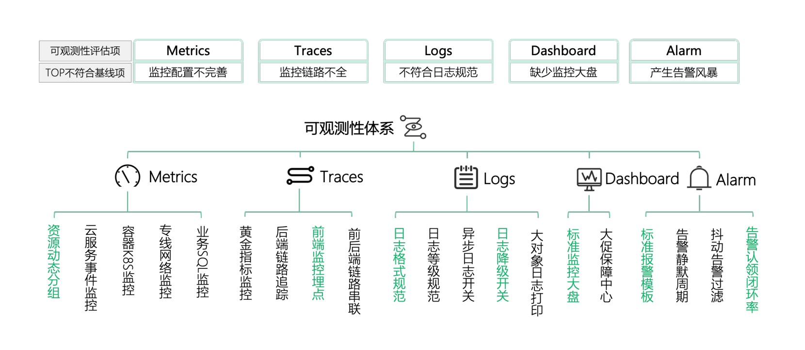

##### 监控指标

系统需要收集和显示有关运行状况的指标，例如 CPU 使用率、内存使用率、网络流量等。
监控系统的指标可以让组织了解系统的健康状况和性能情况，以便在系统出现异常时快速发现问题。

监控指标可以通过监控工具来实现，并允许在发生异常时发送警报。有很多监控工具可以使用，例如 Prometheus、Grafana 等，以及道客提供的 Insight 监控服务。
这些工具可以定期收集指标，提供可视化的指标报告，并且可以发送警报，以帮助组织及时发现问题。

##### 链路追踪

当系统出现问题时，需要能够追踪系统中每个组件的行为和交互情况。通过在系统中实现分布式跟踪，可以快速定位问题并进行有效的故障排除。

链路跟踪可以通过在系统中添加跟踪标识符来实现。当请求进入系统时，标识符将被添加到请求中，并在整个系统中传递。
每个组件都可以将标识符添加到它们的日志中，以便在出现问题时进行故障排除。

##### 日志记录

系统需要记录关键事件和故障，以帮助诊断问题和解决故障。对于一个系统来说，日志是非常重要的。
它可以记录在系统中发生的一切，包括成功的操作、错误的操作、警告信息等等。因此，日志记录是可观测性设计中最基本的需求之一。
通过将事件和错误信息记录到日志文件或数据库中，可以方便地进行故障排除和问题诊断。

但是，仅仅记录日志并不足够，还需要对日志进行有效的管理和分析。
如果日志太多，将会成为一个负担，因为它们需要占用存储空间，并且需要花费很长时间来查找有用的信息。
因此，需要对日志进行过滤和归档，以便更好地管理它们。

##### 监控看板

为了更好地理解系统的运行状况，需要将监测指标和跟踪信息可视化展示。可视化可以通过图表、仪表盘等方式来实现。

可视化可以帮助我们更好地理解系统的运行状况和性能情况。
通过可视化，我们可以快速了解系统中存在的问题，并采取相应的措施来解决问题。
可视化可以使用各种工具来实现，例如 Grafana、Kibana 等。

##### 事件告警

系统需要监测安全事件和行为，例如未经授权的访问、恶意攻击等。安全监测可以通过实现日志记录和实时警报来实现。

安全日志记录可以帮助组织了解系统中的安全事件和行为。通过分析安全日志，可以发现安全漏洞和攻击行为，并采取相应的措施来保护系统安全。
实时警报可以及时通知相关人员可能存在的安全威胁，以便迅速采取行动。

总之，可观测性设计需求是为了提高系统的可靠性、稳定性和性能而进行的设计。通过实现上述功能的落地，可以有效地监控和管理系统运行状况。
可观测性已经成为一项必须的设计需求，任何一个软件系统都需要考虑可观测性设计。

#### 自动化运营的设计原则

##### 定义符合组织当前阶段的自动化目标

**原则一：由小至大，灵活组合**

这一原则是指在组织云上业务自动化中，应该首先从小的业务需求入手，逐步扩大自动化的范围，灵活地组合各种自动化工具和技术，达到最优的自动化效果。
这种方式可以帮助组织逐步掌握自动化的技术和方法，并且能够通过逐步了解和抽象自身业务过程中锤炼业务与技术的平衡性，同时也可以最大化地提升业务效率和质量。

**原则二：业务驱动，逐步成型**

业务驱动是指在组织云上业务自动化中，应该以业务为中心，通过逐步实现各项业务需求来驱动自动化。
这种方式可以让组织更好地理解自动化的价值和意义，同时也可以降低自动化实施的风险和复杂度，逐步成型，最终实现业务的全面自动化。
从业务依赖单一、ROI 高的“小闭环”场景入手，并逐步组成由多个小场景组合而成的复杂链路来落地自动化，对组织来说是风险低、可靠性强的解决办法。

**原则三：场景整合，智能提效**

场景整合是指在组织云上业务自动化中，应该综合考虑各种场景，通过智能化的方式提高自动化效率和质量。
这种方式可以将各种自动化工具和技术整合起来，实现更加智能化的自动化过程，提高自动化效率和质量。
同时，场景整合也可以帮助组织更好地识别自动化和人工操作的边界，从而实现最优的资源利用和效率提升。

##### 选择合适的自动化手段

组织在做技术选型过程中，遵循 5 符合 3 关注的原则。从实际组织需求角度出发，而不是管理者偏好出发去进行长期的、可持续的和符合组织发展的技术选型方案。

**符合组织长期战略发展**

选择的技术应符合组织长期战略发展，即技术选择应该与组织的长期目标和战略一致。
这意味着技术选择应该考虑技术的可持续性和长期发展潜力，以确保选择的技术能够为组织长期发展提供支持和帮助。
比如：组织的长期技术战略是“对内降本，对外增效”，则自动化的选型方向也应该遵循组织内部较多/主流的开发方式，而不是应用最新的技术。

**符合组织技术演进发展**

选择的技术应符合组织技术演进发展，即技术选择应该与组织现有技术架构和技术路线一致。
这意味着技术选择应该考虑与现有技术的兼容性和可集成性，以确保选择的技术能够为组织技术演进提供支持和帮助。

**符合主要技术人员发展**

选择的技术应符合主要技术人员的发展，即技术选择应该考虑主要技术人员的技术水平和发展方向。
这意味着技术选择应该考虑主要技术人员的技术兴趣和技能，以确保选择的技术能够为主要技术人员提供发展机会和帮助。
比如：组织不应频繁的去换技术框架，如果不符合开发/运维人员的个人职业发展，也就谈不上组织的可持续发展。

**符合组织业务长线发展**

选择的技术应符合组织业务长线发展，即技术选择应该与组织业务发展的长期规划和目标一致。
这意味着技术选择应该考虑技术与业务的匹配度和可应用性，以确保选择的技术能够为组织业务长线发展提供支持和帮助。

**符合长期维护需求发展**

选择的技术应符合长期维护需求发展，即技术选择应该考虑技术的易用性和可维护性。
这意味着技术选择应该考虑技术的稳定性和可靠性，以确保选择的技术能够为组织长期维护需求提供支持和帮助。
比如：在选择云服务时，应选择公测及以后阶段的产品作为运维底座，邀测的产品/试用产品可作为项目试点。

**关注业务成熟度**

选择的技术应关注业务成熟度，即技术选择应该考虑业务发展的成熟度和阶段。
这意味着技术选择应该考虑技术的成熟度和适用性，以确保选择的技术能够为业务的成熟度和阶段提供支持和帮助。

**关注社区活跃度**

选择的技术应关注社区活跃度，即技术选择应该考虑技术社区的活跃度和发展趋势。
这意味着技术选择应该考虑技术社区的贡献和创新能力，以确保选择的技术能够与技术社区的发展趋势保持一致，并得到技术社区的支持和帮助。
比如：技术的迭代往往是非常快的，选择上升期/稳定期的原生/开源产品往往可以让组织在技术上的投入“更保值”

**关注投入回报比**

选择的技术应关注投入回报比，即技术选择应该考虑技术的投入成本和回报率。
这意味着技术选择应该考虑技术的成本效益和收益情况，以确保选择的技术能够在投入成本和回报之间取得平衡，为组织带来最大的收益。
往往很多时候过度追求技术先进性，投入回报反而不高。
自动化的过程也不宜存在一口吃个胖子的想法，从最紧迫的业务问题出发，通过技术手段带来价值的过程中不断迭代。

### 构建阶段

服务构建阶段关注风险及效率，在这个阶段主要关注两个层面：

- 部署管理：与传统 IDC 相比，云最大的变化就是基础设施可以通过 API 编排，极大地提升了整个部署效率。
  在云上推荐采用自动化手段来完成各层资源部署。
- 变更管理：变更管理工作贯穿在整个云上环境及各类系统的生命周期，是 ITIL 管理中非常重要的一个流程环节，和其他流程关系非常紧密，稍有不慎就容易导致故障。
  如何让变更有章可循，是企业需要在这个阶段重点考虑的问题。

#### 部署管理

##### 自动化

从应用程序发布周期、客户服务到故障管理以及其他内部支持流程，一切都需要更快，
自动化不仅仅是加速基建，也加速了业务应用的部署过程，加速了整个业务转型的启动，进而提升了企业探索和发现机会的能力。

自动化的优势主要体现在以下几个方面：

- 更高的生产效率：员工可以将更多时间投入到对业务影响更大的事务上。重复性工作则交由自动化程序来处理。
- 更加可靠：减少人工干预，就可以减少出错和问题。所有相同的工作流都会以相同的方式完成，这样可以准确掌握作业的开始时间和持续时长，并且信赖最终的结果。
- 监管更容易：人员数量越多，出现信息空白的几率就越高。信息空白越多，协同代价越高，监管难度更大。把一切事务编写成代码，就意味着更好的掌控。

云服务是通过提供大量的 OpenAPI 将底层的计算、网络、存储和应用等能力暴露出来，以更简单的形态提供服务，
让租户通过编程来定义和完成高阶服务能力，从而形成资源管控到应用交付的全生命周期自动化。

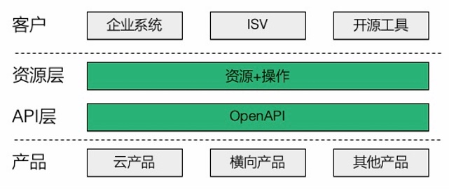

通过 OpenAPI 编排能力，可以方便地组合出多种形态的自动化。
为了更好的管理资源，企业的系统能够与云平台高度自动化地集成。当前常见的云自动化可以分为下面几类：

- Pipeline as Code：通过脚本和引擎让原本独立运行于单个或者多个节点的任务连接起来，实现单个任务难以完成的复杂发布流程。
- Policy as Code：通过自动化代码来管理权限管控或者安全策略，提升自动化能力。

##### 可重复基础设施

主要有以下两种方式用于集成云服务，实现可重复基础设施。

###### 通过 OpenAPI 和原生工具集成云服务

云计算的客户，从访问云资源的方式上，通常分为两大类，通过控制台可视化界面操作的普通群体、通过 OpenAPI 和其原生工具集成的开发者群体。

控制台提供了图形化的界面，让用户可以通过简单的操作完成对云资源的贯通。
例如，运维人员通过控制台创建、配置和监控集群、网络、存储等资源，查看和处理系统告警和日志，业务人员可以通过控制台访问应用程序和查看业务数据等等。
总之，这类用户一般不需要编写代码，通过相对简单的操作即可与云资源交互。

然而，API 被人读、被机器读并最终被机器执行。API 是抽象的，但也需要具象的方式才能被人类更高效的集成使用。

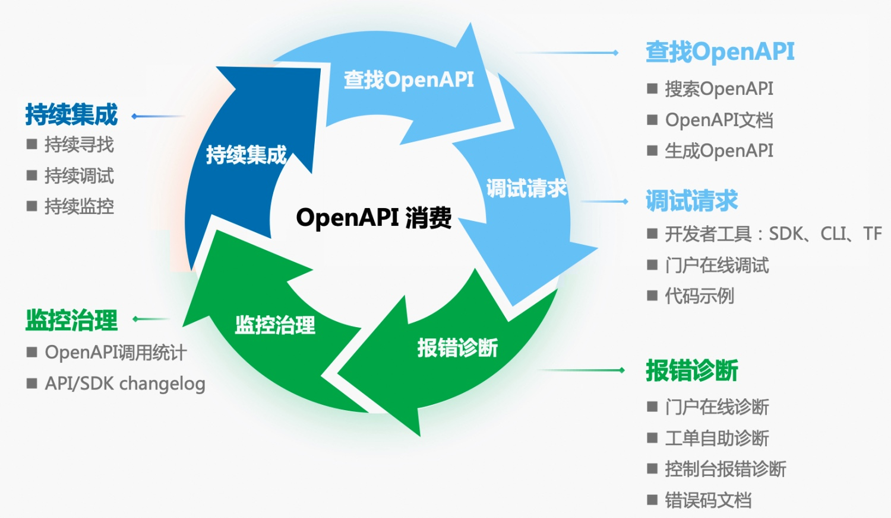

OpenAPI 用户在不同阶段需要关注的原则和建议主要包括 OpenAPI 规范、API 的质量和稳定性、API 的使用效率、API 的性能和效率、API
版本和变更、API 的安全性和可靠性、错误信息和日志记录等，以便于更好地评估、使用和维护 API，提升使用效率。

**OpenAPI 的探索与评估**

1. 探索匹配业务需求的 OpenAPI：云服务商原则上应该提供和控制台能力完全对等的 OpenAPI 原子能力，而每个 OpenAPI 都具备详细的文档，
   包括 API 的功能描述、业务参数、错误码等信息。开发者通过平台提供的 API 探索工具或查阅文档来选定符合需求的 OpenAPI。

1. 评估自身业务场景与能力支撑：哪部分业务自动化？开发资源投入成本？业务技术架构是否符合标准？开发者在实际业务场景中权衡取舍，
   通过 OpenAPI 找到云业务自动化、效率、投入成本与产出之间的最优解。

**OpenAPI 的调试与集成**

1. 调试 OpenAPI：测试 OpenAPI 的请求以验证其是否满足业务需求，以确保 API 功能符合预期、响应稳定、设计规范，更是为了准备更深一步的集成与稳定上线。
   在 OpenAPI 调试过程中，通常需要学习参数结构、参数组合、Endpoint 规范、报错原因诊断等等。通过云厂商官方提供的 API 调试工具可以最大化开箱即用的体验。

1. 选择合适的原生开发工具：云厂商面向不同的阶段、场景、能力的开发者提供了诸多一方工具，选择合适的开发工具可以极大的提升 OpenAPI 的使用效率。
   例如，SDK 降低了开发者需要编写复杂的代码来实现调用 API 的成本，而无需了解底层的实现细节；CLI 用于通过命令行界面管理和操作云资源；
   Jenkins 用于管理复杂的基础设施环境，跨多个云服务提供商、多个地域、多个账号等。

1. 遵循 OpenAPI 供应商的要求：根据流控配额等相关的服务端限制，合理管控 API 调用量，避免超额调用导致的额外费用或服务中断，或根据业务流量估算，提前规划配额提升或限流容灾方案。

**OpenAPI 的运维与治理**

1. 关注 API 变更与版本迭代升级：持续关注 API 的变更与新发布便于及时根据 API 的变化而做出业务响应。同时在必要时快速调整代码提升服务可用率，降低可能出现有损变更带来的业务稳定性负面影响。

1. 跟踪调用日志与错误信息：

    - 所有 OpenAPI 的请求都是可被审计的，API 网关可以记录、存储和查询 API 的请求和响应信息。
      这些信息包括请求和返回参数、请求时间、状态码、响应时间等，可以用于监控 API 的性能和安全性。
    - 通过 API 的调用记录，可以帮助开发者了解 API 的使用情况，为 API 的优化和改进提供参考。
      此外，这部分审计信息还可以用于追踪 API 的访问记录，帮助企业合规管理，保证 API 的安全性，协助企业进行应急响应和安全排查。
      关注 API 的请求日志是保证 API 安全和优化 API 使用的重要手段之一。

###### 通过资源化方式集成云服务

通过 OpenAPI 的方式集成云服务往往会遇到以下挑战：

- API 数量多：随着道客服务不断更新和扩展，API 的数量也越来越多。这是一件好事情，说明道客的服务能力在不断增强。
  但对于开发者来说，需要花费更多的时间和精力来学习和理解各种 API 的用法和功能，同时也需要更多的测试和调试，以确保集成的正确性和稳定性。
- 集成复杂：道客服务的不断增加和更新，也意味着集成的复杂性也在不断增加。开发者需要考虑如何将多个 API 集成在一起，
  如何处理各种数据格式和协议的转换，以及如何处理异常情况等。这些都需要耗费更多的时间和精力。
- 维护困难：随着 API 的增加和集成的复杂性增加，维护也变得更加困难。开发者需要时刻保持对道客服务的了解和掌握，
  以及对集成的系统进行监控和维护。同时，如果道客服务发生变化，开发者也需要及时更新和调整集成系统，以确保系统的稳定性和可用性。这些都需要很高的技术能力和精力投入。

在云上，推荐使用资源化的方式集成云服务，降低集成成本。具体的实现手段主要有以下两种：

但企业同时也要关注其带来的一些诸如配置复杂、学习成本高、大规模部署速度慢等一些限制条件。
在进行技术路径选择的时候需要权衡学习成本和部署速度等因素。
在组织内推广这些方式时，往往会受到一些阻力。基于大量客户实践，推荐从以下几个方面入手：

**转变思维方式**

如果团队成员已经习惯了手动管理基础设施，他们更倾向于直接实施所有变更。例如，他们可能会通过 SSH 连接到服务器并执行一些命令。
然而，迁移到基础设施即代码则需要改变思维方式，因为现在更改是通过间接方式进行的：首先编辑代码并提交，然后让某些自动化过程来部署更改。
此新增加的“间接方式”可能会受到团队成员的抵触。对于简单的任务而言，这种方式可能比直接实施部署更为缓慢，尤其是在团队成员仍在学习新的自动化工具的初期，差距更加明显。

**升级开发模式**

面向过程到面向对象的开发模式升级；与庞大的 OpenAPI 细粒度集成体验不同，资源化的设计理念初衷是降低开发者理解 OpenAPI 之间关系的成本。
组织不论是自己封装资源对象，还是通过云服务商提供的一套描述性的、面向对象的统一的界面/产品都是可以的。

**提升开发效率**

将业务抽象成基础设施代码，意味着运维团队需要花费大部分时间来编写大量代码，如业务模块、测试模块等。
尽管有些运维工程师喜欢编码且乐于接受改变，但其他工程师可能会发现这是一个艰难的任务。
许多运维工程师和系统管理员已经习惯了手动进行更改，偶尔会写一些简短的脚本，但接近全职地进行软件开发工作，可能需要学习新的技能或需要直接雇用新人。

**降低学习成本**

组织如果通过自己基于云服务提供方的 OpenAPI 提升集成效率/降低学习成本，是一个费时费力且收益不高的方式。
可以采用云服务商直接提供的资源化集成能力；也可以采用开源社区的热度较高的产品（如 Terrafrom、Ansible 等）来直接减少这一环。

与此同时，对于内部常见的集成问题，通过知识记录、分享、培训等多种形式也可以有效提升学习效率和效果。

##### 配置管理

###### Ansible

Ansible 是一个配置管理工具，可以简化复杂的部署、配置和管理任务。
它是一种轻量级、模块化和可扩展的工具，可用于自动化各种 IT 操作，例如部署应用程序、配置服务器、管理虚拟机和容器等。
Ansible 具有强大的扩展功能，可以与其他工具和平台集成，例如 Jenkins、道客、Docker 等。
它还具有强大的安全性和可靠性，可以确保操作的一致性和正确性，从而大大提高 IT 操作的效率和可靠性。

##### 发布工程

###### 应用的概念

企业数字化转型过程中，产研数字化已变成必选项。需要打通业务、产品、开发和运维的价值交付链路，保障业务发展和激发业务创新。
在企业数字化转型过程中，软件研发管理面临重要挑战。越来越多企业也在思考如何通过提升研发效率，进而提升业务敏捷性，最终实现业务成功。

随着业务上云之后，研发模型也在往 DevOps 转型。企业有必要落地一套研发工具链，统一数字化模型，
共享底层数据，连通协作和工程，重构交付链路，提升交付的效率、质量和有效性。

**应用的概念**

应用，是一个可独立交付的对外提供服务的单元，是开发、部署、发布、运维的最小逻辑单元。
在研发态，通常对应一个到多个功能模块，关联一个或多个代码库；在运行态，通常对应一个或多个服务。

**以应用为中心的 DevOps 敏捷研发模式**

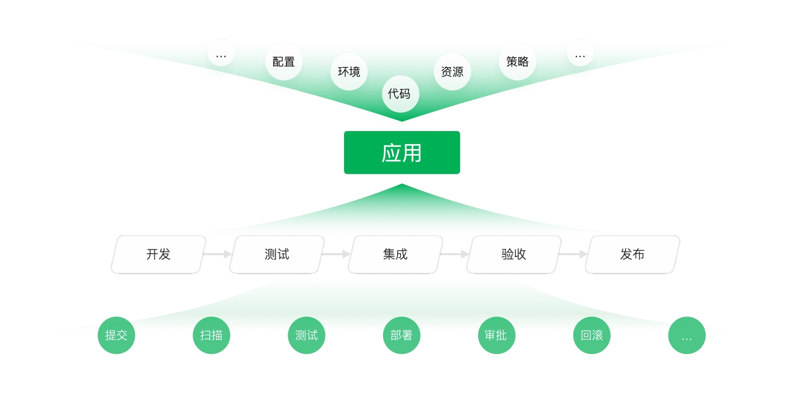

###### 应用开发

**应用环境**

环境是应用在某个环境级别运行态的载体，是应用维度做部署和运维的操作界面，通常对应着一组资源实例、或者一组主机服务。
标准的应用变更流程会涉及到：开发、测试、预发、生产四个阶段，分别对应多套环境。

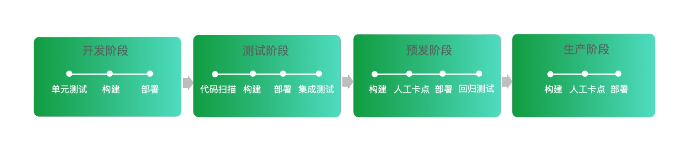

**代码管理**

代码管理是对企业源代码进行安全、可靠、高效地管理。包括对企业代码进行托管、代码评审、代码搜索等，帮助企业实现安全、稳定、高效的研发过程管理。

对于企业客户上云，推荐提供一站式代码管理服务，为企业提供代码托管、代码评审、代码检测、代码搜索等服务。

###### 应用集成

**持续集成（Continuous Integration）**

开发人员提交代码之后，立即进行构建、测试（自动化的单元测试或集成测试），
**让提交的代码得到快速的质量反馈，** 并确保集成的代码不会破坏原有代码的功能正确性。

持续集成让提交的代码能快速得到反馈，测试通过后才能将代码成功集成到集成分支中，从而减少集成后出现的问题。
对于现代的分布式应用开发任务而言，持续集成是：
**通过自动化的手段** ，持续的构建和验证快速演进的分布式应用所有组成部分，
**为团队提供有效的反馈和信心；** 自动化的手段意味着低成本，可重复；
有效的反馈，意味着更快的定位问题，交付质量更高的软件；有效践行持续集成的软件开发团队具备更高的软件开发效能。

从上述的定义出发，有效的持续集成应该具备如下特征：

1. **快速反馈环：** 有问题的变更越往后定位的代价就越高，每一次集成对团队而言都是一次反馈环，所有的反馈都被团队转换成有效的行动项，使得问题被尽早发现，尽早修复。
2. **自动化：** 每一次的代码提交都应该触发自动构建和自动测试，并通过红绿的颜色告知团队所有成员。

常见的自动触发，是通过自动化的 CI 服务或工具，自动监听代码库 Git Push & MR 等事件触发，常见的工具如 Jenkins、GitlabCI、GithubActions 等等。

**持续交付（Continuous Delivery）**

是持续集成的下一步，持续频繁地将软件的新版本交付到类生产环境（常见的如：测试、预发环境），交付给测试、业务团队验收。

持续交付强调的是“交付”，不管怎么更新，软件是随时随地可以交付的，相比持续集成，持续交付除了交付到类生产环境之外，
还会执行一些集成测试、API 测试等等，确保交付的产物可以直接交付部署。

**持续部署（Continuous Deployment）**

是持续交付的下一步，“自动”将代码部署到生产环境，持续部署强调的是“部署”，它的目标是，代码在任何时刻都是可部署的，可以进入生产阶段。

持续部署和持续交付触发方式的区别是，持续部署是自动完成的，持续交付是手动完成的。

**CI/CD 流水线**

应用工作台是一款企业级、自动化的持续集成和持续交付工具，通过构建自动化、集成自动化、验证自动化、部署自动化，
完成从开发到上线的 CI/CD 全流程，帮助企业高质量、高效率的交付业务。

- **部署策略**

    在真实的上线过程中，如果采用全量发布，会给开发运维团队带来未知的风险，为了减少发布对线上业务的影响，在应用部署过程中，建议采用灰度发布，分批发布这种模式，
    可以最大限度的避免不稳定发布对用户的影响，保障业务交付稳定。

- **发布过程可观测**

    对于生产系统，一旦线上有代码变更，那就要开始关注业务的可观测性。可观测性主要包括如下三个方面：

    - 指标监控：即各种指标监控，比如基础资源指标（如主机 CPU、内存使用率）、服务性能指标（响应时间 RT 上升等）、业务的调用指标（如用户登录失败数上升，下单失败上升等）。
      指标也需要再做下分级，具体可以查看可观测性章节。
    - 日志：要关注各种设备和服务的运行日志监控，特别要关注是否有异常或 Error 日志。
    - 调用链：关注当前发布的应用其上下游调用链分析。

- **发布回滚**

    一旦代码发布到生产之后，服务或业务如果有影响，优先执行回滚，确保业务平稳。
    在回滚过程中需要考虑服务是否具备平滑，数据是否存在脏写等问题。

    企业选择相关 CI/CD 工具的时候也要关注需要支持快速回滚的能力。道客服务提供回滚操作，用户可在流水执行记录下的部署历史中，
    查看到该流水线所有执行的部署历史记录，并可选择其中任意一条历史记录进行回滚操作。
    流水线会根据当时运行的部署脚本和构建制品重新执行部署任务，以实现回滚的效果。

#### 变更管理

变更管理分为组织变更与变更支持：

- 组织变更：确保组织中的变更顺利实施，并通过管理变更的人为方面来实现业务连续稳定运行的实践。
- 变更支持：正确地评估变更风险、对变更进行合理授权、管理变更时间表，通过增加成功变更次数来实现业务的稳定运行。

变更管理是一种 IT 实践。旨在对关键系统和服务进行操作的同时最大限度的减少服务中断的风险。

##### 变更管理的重要性

变更管理作为在项目/组织在运行过程中重要一环，一直以流程笨重、繁琐著称。很多使用者对其产生抵触心理，认为其过于僵化。
但事实并非如此，如果将变更管理作为一套标准化流程来严格对待，虽然在实际使用人会感受到限制，但在逐渐成熟的变更管理体系中，
会逐渐感觉变更管理更像是一种技术支持。如果变更管理运行良好，可以让组织的工作方式更接近标准的行为准则、规划组织的流程机制、
加强变更操作的规范性、降低变更导致的故障数量，同时极大的提升业务运行的稳定性。

变更管理是任何系统稳定运行的重要环节之一。它需要具备以下特质或能力：

- **标准的变更管理流程** ：变更管理流程是变更管理最佳实践的第一步。该流程应该包括变更发起、变更审批、变更实施和变更验证等环节。
  在引入变更管理流程时，需要确保流程的透明度和可追溯性，以便在变更过程中及时发现和解决问题。
- **标准的变更管理数据库** ：标准的变更管理数据库是变更管理最佳实践的第二步。
  该流程应该包括变更系统、变更等级、变更对象的分类、以及确定不同变更内容的对应标准审批流程。
  并及时保证数据的完整性与准确性，保证变更发起时可以匹配到对应的数据。
- **变更数据持续运营** ：变更数据持续运营是变更管理最佳实践的第三步。该流程应该包括变更结果数据统计、变更看板等。
  在看板内可对数据进行筛选分析，逐渐规范组织内的变更流程与操作规范。从而让业务更好的连续运行。

##### 最佳实践

###### 标准的变更管理流程

在建立标准的变更管理流程前，首先需清晰明白变更各个流程的定义：

- 变更发起：在变更发起前，需明确变更内容与变更原因等信息。
  信息的明确可减轻变更评估人的工作量，同时明确变更的意义。变更信息包括：
- 基本信息：标题、时间、变更人、原因等。
- 变更信息：变更系统、变更场景、变更类型等。
- 变更方案：变更实施方案、回滚方案、验证方案等。
- 变更审批：由于变更系统相关的负责人进行审核，确保变更风险级别，若无法控制或无法预测，则建议明确变更方案或禁止变更。
  变更审批流程可由多人进行组合，包括：业务负责人、团队 TL、技术 TL 等，变更涉及的人员可根据变更的影响程度以及影响范围等因素确定。
- 变更执行：通过发起时确认的执行人来进行执行工作的分派，以确保执行变更的是与变更内容相关的技术人员，从而确保变更的准确执行。
- 变更验证：在变更完成后，对变更对象与变更内容进行检查，确保变更并未影响实际业务，检查完成后，发布变更结果。
- 变更关闭：在变更完成后，关闭变更任务。对变更记录进行留存，便于后续变更数据的运营与分析。

在清楚变更各环节的定义后，严格按照此规范进行，可帮助组织/企业规范化操作流程、提升变更效率、降低风险、提高业务连续性。

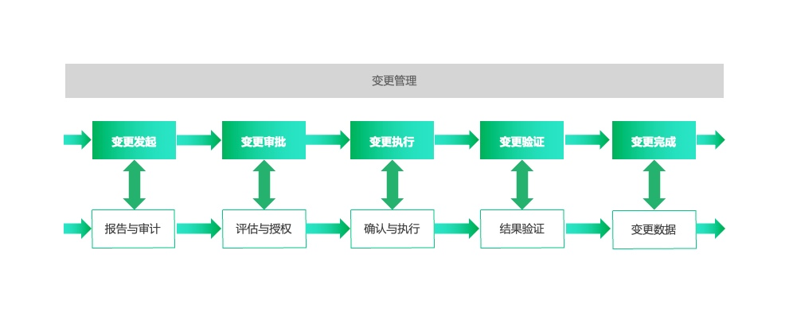

###### 标准的变更管理数据库

在建立标准的变更管理数据库时，我们需对组织内部的业务、人员、体系等相关信息进行梳理。通过对信息的维护，保证信息的完整性与准确性。
通过变更管理数据库，可以建立完善的变更流转机制以及确保受众知晓变更，并在变更之前给出他们的建议。
同时在变更发起时、变更执行时等各个状态下，可以通知到相关的关注人、责任人等。

需维护的数据包括，但不限于以下几点：变更系统、变更类型、变更场景、审批流程、变更记录等。

###### 变更数据持续运营

在流程规范后，组织需要用一种有规律的形式将所有变更的记录进行留存与管理。
通过变更数据的留存，可以做到对变更的更好的可见性。
通过不同的对比、展示方式，可以分析问题、事件等产生的原因，以助于后续的知识管理与沉淀。
可针对不同的问题类型，作出快速应急方案。使用变更改进技术流程，从而不断增强组织提供更好的服务能力。

运维事件中心是道客提供的云上变更管理服务，提供丰富的监控集成、强大的报警降噪、可靠的通知、灵活的事件流转、基于 ITIL 的故障管理等功能，
一站式管理、多端协同，帮助企业实现更实时的数字化管理、更快的故障响应、更短的故障时长、更连续的业务体验。

### 运营阶段

通过前期的设计，到构建，服务进入日常运营环节。在这个阶段往往会产生大量的运营事件，比如日常的资源申请。
企业在持续运营过程中也会产生或大或小的生产故障，需要做好线上故障管理，提升服务 SLA。

#### 事件管理

事件是指任何可能中断或降低服务质量（或具有此类威胁）的计划外事件。
例如业务出现风险、服务器运行缓慢、接口响应延时过高等一系列问题均属于事件。
它可能影响工作效率、降低客户体验，即使未造成严重后果，也应该归类为事件。

事件来源一般分为：

- 人工上报
- 系统发现

事件管理是针对事件进行识别、记录、分类、分派、分析、解决和完结的过程。
事件管理的目标是及时、准确的接受时间，并进行服务回复。
尽可能的减少业务影响。通过事件管理可以实现快速定位问题、提高解决效率、减少重复问题的发生频率、增强业务连续性、提高用户体验、规范企业工作流程。

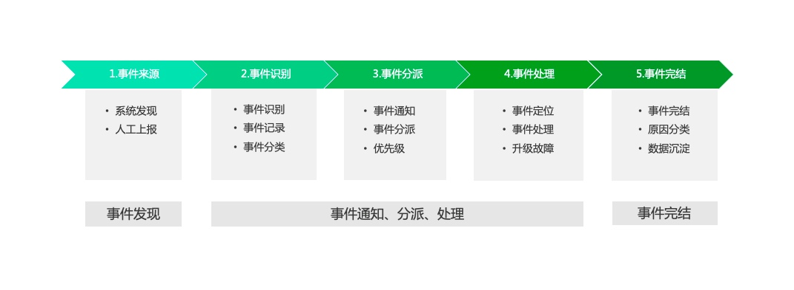

事件管理包括以下几点：

- 事件的识别与记录：通过监控工具、日志分析、人工上报等方式发现事件，并将其记录。
- 事件分级与分类：根据事件的相关信息，可对事件进行分级、分类，便于进一步处理。
- 分级：根据影响程度可分为：P1、P2、P3、P4。
- 分类：根据发生原因可分为：监控误报、业务波动、代码逻辑等问题。
- 事件处理人分派：可根据事件的影响面/服务/应用等相关信息，将事件分派至对应的人/群组。
  便于事件的快速响应与处理，同时提高内部信息的同步效率。
- 事件解决与分析：事件处理人可查看报警详细信息，对事件进行初步判断与分析。
  并对事件进行响应与解决。在解决的同时需记录解决方式与判断条件等信息，便于后续发生同类事件的处理。
- 事件完结：在处理完成相应事件时，需关闭此事件。事件记录将被留存，在后续发生同类问题时可根据同类事件进行查看，并快速处理此列问题。

通过事件管理，建立标准的事件操作流程的优势包括：

- 快速解决事件。
- 降低业务的损失与成本。
- 持续改进与学习

运维事件中心是道客提供的云上事件管理服务。通过集成监控源告警数据，并按照规则条件分派预通知的，都可以被称之为事件。
事件比报警优先级更高，将强调分派到具体责任人，并持续跟进解决、归档记录。

事件主要用于管理通过规则自动触发或人工手动新增的事件任务，运维事件中心的事件管理支持灵活的任务流转，
关键事件优先响应、完结处理等操作以便提升关键任务的 MTTA 和 MTTR；支持将影响恶化的事件一键升级为故障，实现事件全生命周期的在线化管理。

- 集成告警数据：可集成多种告警源例如：Prometheus、Dynatrace 等数十种监控系统。同时支持自定义集成，可自动解析告警信息。
- 事件分类与分派：首先维护服务、人员、服务组之间的关系。其次通过流转规则将系统内接受的告警信息按影响的服务/应用进行分类，
  可按告警信息字段设置触发事件规则，同时将自动按预先设置的流程将事件分派至对应的处理人或组。
- 事件的处理与解决：事件处理人接受事件，并查看相应的告警详细信息，初步分析告警原因。
  在事件处理时，可查看、参考相似事件的处理方式，以便于快速解决。同时支持在处理事件时进行内容记录，便于后续的分析与参考。
- 事件的完结与持续运营：当事件解决后，需完结事件。在完结时需对事件进行打标处理，填写事件触发原因、解决方案等信息。
  通过这些信息的汇聚，可在后期统一进行分析查看，协助后续类似事件发生的处理以及对系统架构的优化提供可靠依据。

#### 故障管理

故障管理是源于 ITIL 的一个概念，在 IT 企业或者互联网企业进行故障管理的目的是当生产环境出现重大宕机时尽快恢复正常的服务运营，
将组件失败对业务所造成的负面影响降到最低，从而确保满足事先与业务客户之间所约定的服务级别的目标和服务级别质量。

在 IT 和互联网企业的实践中，以下情况都有可能造成故障：

- 按计划进行的硬件、操作系统维护所引起的故障，包括更换硬盘、操作系统补丁。
- 应用性故障，包括软件应用性能问题、应用缺陷（bug）、系统应用变更。
- 人为操作故障：包括误操作以及不按规定非标准操作引起的故障。
- 系统软件故障：包括操作系统死机、数据库的各类故障。
- 硬件故障：包括硬盘、网卡损坏。
- 相关设备故障：包括 UPS 失效引起的电力中断。
- 自然灾害，包括洪水、火灾、地震。

这里以道客集团为例。为降低故障的影响，道客集团故障管理体系从整体体系化治理的角度出发，将影响真实业务的场景定义、发现和应急能力以及后续治理都纳入故障管理的范围。
结合道客集团创新性的“风险预警”，从“隐患”就开始管理，同时覆盖造成一定影响导致性能下降的普通故障，以及严重影响业务的“重大故障”。

此外，考虑到互联网企业的一些特性，如企业存在大量对快速响应要求极高的场景，内部多运用和实践 DevOps/Agile 等快速迭代的开发环境，
同时重大故障应急涉及多部门（法务、政务、公关、客服、技术支持）的联动机制等等，本故障管理体系也结合了以上的互联网企业特性做了对应的机制优化。

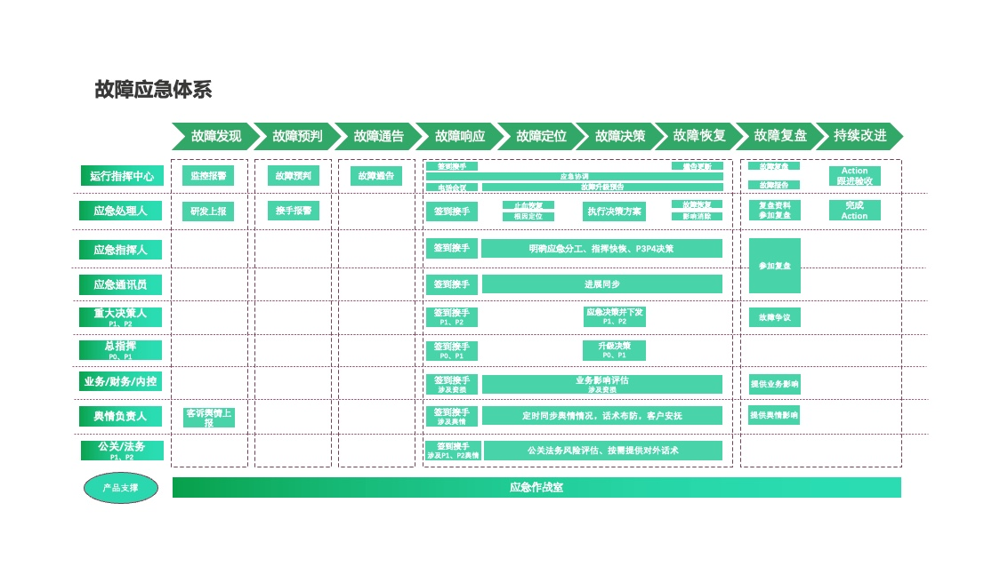

##### 故障管理的重要性

无论是理论还是实践，均证明故障只要有发生的可能，它总会发生。根据墨菲定律，假设某意外事件在一次实验（活动）中发生的概率为 p（p>0），
则在 n 次实验（活动）中至少有一次发生的概率为 `P=1-(1-p)n`。
由此可见，当实验次数 n 趋向于无穷时，pn 会越来越趋于 1，即成为必然事件。

为了保障业务稳定性，可以通过故障管理来达到：

- 提前发现、解决风险来预防问题；
- 及时发现，快速定位、快速恢复故障达到降低故障的影响面（1-5-10 解决方案）；
- 确保改进措施有效落地、避免故障重复发生。

通过建立一个规范可遵循、全流程闭环的故障管理体系，配合技术手段的提升，可以有效降低故障发生的几率，缩短故障的 MTTR，最终使故障造成的破坏性趋近于 0。

在日常运营中，无论什么原因导致业务服务中断、服务品质下降或用户服务体验下降的现象，称为故障，但不包括用户侧环境或用户自身操作引起的问题。

- “用户体验下降”说明故障的核心要关注用户感受，可通过客服渠道获知用户投诉，也可通过监控渠道推知用户端的使用情况；
- “服务中断、服务品质下降”说明即使用户没有投诉（甚至没有用户使用），但是如企业提供的服务出了问题，也是故障；
- “无论什么原因”指无论是企业自身原因，还是第三方如供应商、运营商的原因，只要影响到了用户，就都是故障。

##### 故障管理

故障管理是单独针对故障的一整套完成的应急相应流程机制，包括：故障应急、故障收敛、故障追踪、故障复盘、故障改进等核心功能。
通过建立故障应急机制，可保证服务稳定运行、服务体验保证等。故障管理也可以理解为重大事件的升级。

故障管理应包含以下几点功能或特性：

- 故障等级定义：针对不同的业务线，需召集不同的人员进行统一制定。确定得到各方人员的认同。且制定故障等级需遵循以下几点：
- 功能重要性
- 影响产品、服务、应用
- 影响面（用户数、损失数、舆情等）
- 故障应急：支持故障全局应急通告，电话、短信、邮件、IM 多种通知渠道，确保故障关键进展及时通知至相关人员，加快信息流转；
- 故障收敛：支持按时间/次数进行告警收敛，将告警收敛到一个故障中统一处理；
- 故障追踪：支持对故障的最新进展、故障影响面（影响服务）、舆情反馈、Timeline 时间线进行在线化管理、协同，基于统一视角协同处理故障，提升故障处理效率；
- 故障复盘：基于最佳实践经验，沉淀了对故障进行深度复盘的结构化要求，形成了线上检查点，以产品的方式承载流程落地。
  包括根因检查点（如故障原因、最近活动、注入方式、恢复方式等）、故障变更检查、监控检查，并需要对每一个故障明确责任人及团队；
- 故障改进：支持对故障制定明确的改进及验收措施、责任人及完成时间，确保每个深度复盘后的故障都能对业务连续性形成改进，避免历史同类故障重复发生。

##### 最佳实践

在运维事件中心可以录入对应的故障等级，在相关联的监控触发后，可以自动匹配到对应的等级定义，方便快速得到故障严重性的界定。

###### 服务组和故障应急群

服务组是一组人员，可以跟一个或者多个故障场景绑定，当故障触发时，会自动外呼对应的服务组值班成员以及加服务组成员到故障应急群。
同时服务组也支持排班。简而言之服务组就是在故障平台的一组值班人员。

故障应急群是在故障通告后自动创建的故障处理群，除了自动加入的处理成员，其他相关人员也可以主动加入，进行故障的排查。
故障应急群同时具备签到响应、辅助排查、作战手册等故障处理相关功能。

###### 故障记录

在故障进行中进行故障相关的关键时间点、关键操作等相关内容进行记录。

###### 故障复盘与改进措施

故障复盘信息同步，在故障结束后，对故障原因责任人等进行定位与定责。

对故障进行复盘后，需针对此次故障件进行针对性的改进，避免后续再次发生此类故障。

## 高效性能

性能度量了系统在单元环境内承载工作负载的效率，系统性能通常可以由 QPS、并发和 RT（响应时间）等典型指标来衡量。
在传统 IT 环境中，系统的容量评估和规划是系统设计的重要环节，通常会基于系统对峰值负载表现出来的性能承载能力来给系统选择合适的节点数量规划，
在双活系统中考虑到 failover 会需要给单节点设计更大的冗余，对于过载的场景也需要有过载控制相关功能模块来避免整体宕机。
这个设计的环节是相对固定和长周期的工作，因为往往节点的部署和交付都是相对长周期的工作。

在云的基础设施环境中，灵活的弹性功能很好地解决了传统 IT 环境中的痛点，将容量评估和线上扩容变得相对简单，同时也为高性能设计带来了更多选项和复杂性。
除了设计层面的容量评估和灵活弹性，实现层面的性能测试、性能监控和性能优化之外，充分发挥云产品因为技术迭代带来的性能红利同样成为高性能系统需要考量的重要因素。
本节会全面描述基于云基础设施的高性能系统设计、实施和优化等环节，包括如下主要内容：

- 高性能架构设计：包括高性能架构常见设计准则、业务适应规格和类型、可伸缩和可扩展、性能层面部分架构设计最佳实践和挑战和注意事项等内容。
- 性能测试：包括性能测试介绍、性能测试的适用场景和性能测试最佳实践等内容。
- 性能监控：包括为什么需要性能监控、什么是性能监控和性能监控最佳实践等内容。
- 常见性能优化手段：包括弹性计算优化、网络优化、数据库优化和架构优化等内容。

### 高性能架构设计

#### 设计准则

性能是系统的一个重要指标，如果性能无法达到用户预期，会造成大量的用户流失。
而很多时候性能问题和系统最初的架构设计相关（当然系统架构是可以持续演进和迭代的），任何架构设计都必须考虑可能带来的性能问题。

因为性能问题几乎无处不在，所以优化性能的手段也非常多，从用户浏览器到数据库，影响用户请求的所有应用相关环节都可以进行性能优化。
随着云计算在 IT 支出占比的不断提升，越来越多的用户核心业务系统跑在云上，云的架构设计和选型也对性能非常重要。
基于云的特点，云架构中有关性能设计的方面，有以下注意事项和基本原则：

##### 有效的云资源选型

作为一个软件系统，应用层面有很多性能优化和架构设计的考虑点，但是一个系统的性能基石其实是底层计算和存储资源的性能，这个是原子能力。
当系统使用的计算和存储资源性能越好，越有利于上层应用进行整体性能调优和优化，所谓“工欲善其事必先利其器”。

在大规模分布式系统不断发展的趋势下，计算场景和对算力的需求越来越丰富。比如在很多通用计算的场景下，
最关心的其实是计算集群的规模，对计算节点本身的单节点能力并没有高要求（比如短时大量计算请求的峰值场景）；
而在现在火热的 AI 模型训练场景下，则必须使用类似 A100 GPU 计算卡的裸金属机器来快速满足大规模 AI 训练的要求。
同时云资源大都是按可用区维度进行部署的，一旦选择可用区进行大量资源部署后迁移和改造成本会很高，因此选择有效的可用区也非常重要。
在选择可用区时，需要综合考虑延时，库存，资源类型等因素。

即在场景越来越丰富的情况下，云资源的资源选型从一开始就能很大程度影响最终的系统性能。因此从云架构的实际角度来看，云资源的选型非常重要。

##### 可伸缩、可扩展的云架构

大型系统需要面对大量用户的高并发访问和存储海量数据，在需要的场景下，可以及时通过调整计算和存储资源来缓解高并发带来的计算和存储压力，
从而实现在访问峰值场景下可以向用户有效提供稳定的服务，在访问低谷的时期又可以释放不必要的资源或保持系统的低位运行来节省 IT 支出。

对于一个严格设计的微服务应用系统来说，存在多类型工作负载，应用服务如果是无状态的场景下（无数据持久化需求），那么工作负载伸缩是比较简单直接的；
对于一些中间件、数据库服务来说，实时的伸缩是比较困难的，需要提前做好数据备份和数据同步等方式提升中间件、数据库服务可用性和性能。

##### 云上架构设计的部分最佳实践

在云计算高度发展的今天，云平台上已经运行了大量的核心业务系统。这些业务系统从设计到逻辑等方面都考虑了云本身带来的便利性，
同时云厂商的发展也不断吸取这些业务系统的需求来不断优化自身的产品设计，并推出更适配业务需求的云产品。
因此，在一些比较有特点的场景下形成了最佳实践，借助这些最佳实践预期可以有效提升云架构设计初期的架构设计能力，
提升系统整体性能，具体可以参考每个云产品文档中的最佳实践相关内容。

##### 关注架构设计的注意事项

性能并不需要盲目地追求极致，在高性能架构设计的过程中，还需要关注性能设计中的一些挑战和注意事项，避免引起不必要的资源浪费和研发投入。

#### 评估合适的云服务

在进行高性能架构设计时，首先需要关注的是计算、存储、网络等基础云服务的选择。
充分了解自身业务特征及指标，熟悉架构主要组件所涉及云产品方案类型，有利于业务和工作负载在不同的产品方案中受益，并使系统架构得以持续优化。

数据库的选型是一项专业性很强的工作，通常除了性能外还有很多考虑方面，此处不进行展开阐述，
需要关注的是数据库产品组合在高性能架构设计上的合理使用，如很多业务场景利用 Redis 这类缓存数据库实现性能的显著提升。

##### 计算

熟悉主要计算方案，针对各业务系统和工作负载，评估使用合适的计算方案。

| 道客服务 | 类型 | 业务场景 | 主要特征 |
| ------ | ---- | ------ | ------- |
| 集群 | 集群 | 服务器迁移、整体应用环境、定制化镜像 | 运行于物理机之上、满足 VM 层面系统设置需求、丰富的类型与规格 |
| 容器服务 | 容器 | 微服务、混合云部署 | 运行于集群之上、轻量化、快速部署、可移植、可扩展 |

###### 计算指标

提到计算性能，人们通常会用具体的指标来形容与量化，如磁盘满足 10 万 IOPS 能力、单台服务器网络带宽 10Gbps 等。
充分认识各计算方案涉及云产品的指标，并将识别和收集的业务系统指标与之关联，是深入理解业务瓶颈与资源使用率的关键。
通过使用 Insight 监控可以方便地对相关指标进行持续跟踪与维护，用以驱动性能与架构的不断优化。

###### 计算规格

对于计算服务，结合指标的跟踪分析，综合考虑工作负载与 CPU、内存、磁盘以及网络使用率的关联性，用以选择合适的类型与内存核数比，满足最佳性能的同时优化成本效益。

例如，能用 GPU/FPGA 加速的业务，需要配备合适的异构基础设施。

##### 存储

云相对传统自建数据中心，有更丰富的存储业务场景以及与之相匹配的存储服务，针对业务进行灵活适配，才能充分发挥云的优势。
使用单一的存储类型往往无法满足最佳的性能与效率，在架构设计过程中，有必要对业务场景以及对应工作负载的存储需求进行梳理，
并明确核心存储指标，用以评估符合需求且合适的解决方案。

常规存储方案会重点从块存储、对象存储以及文件存储这三类来进行评估，往往先通过业务场景明确访问方式与访问链路，
比如需要支持公网访问基于对象 API 的互联网应用，对象存储会是最佳选择，
而容器化部署应用、为了实现专业网络环境共享读写访问以及充分弹性能力的持久化存储，文件存储则更具优势。

###### 存储指标

在业务场景、功能和架构的基础上，还需要将业务系统数据转化为存储性能指标以便进一步评估存储产品和类型选择，
主要的存储指标包括吞吐量、IOPS、I/O 延迟、访问频率、数据规模、数据增长率、数据可靠性等，必要的基准测试以及持续的性能数据收集将有助于获取和分析这些指标。

##### 网络

网络是云上环境的重中之重，它负责云服务、本地数据中心、应用程序组件等各节点的连接，对业务工作负载的性能影响极大。

###### 网络指标

相较于计算和存储，网络性能受更多方面限制，一般来说，在架构设计过程中需要重点关注时延、丢包率、带宽、吞吐量、每秒请求数、并发连接数、新建连接数等。
对网络性能的分析意味着对整个请求整个链路的分析，压测和持续的监控有利于明确工作负载的核心指标并定位链路瓶颈，进一步实现动态的规格优化与方案优化。

#### 资源伸缩和系统扩展

在云上架构设计过程中，需要考虑架构的可伸缩性和可扩展性，以实现高性能的云上架构。不同的应用部署方式需要使用不同的伸缩方案，常见的伸缩方案主要有以下几种：

##### 云服务自动扩缩

在道客云操作系统上进行自动伸缩依赖的云服务是弹性伸缩（Auto Scaling），是指根据业务需求和策略自动调整计算能力（即实例数量）的服务。
目前支持实例的弹性伸缩。弹性伸缩具有广泛的应用场景，不仅适合业务量不断波动的应用程序，同时也适合业务量稳定的应用程序。

###### 适用场景

**无规律的业务量波动**

某新闻网站播出了热点新闻、访问量突增、新闻的时效性降低后，访问量回落。由于该新闻网站的业务量波动无规律，
访问量突增和回落的具体时间难以预测，所以手动调整实例很难做到及时性，而且调整数量也不确定。

此时可以利用弹性伸缩的报警任务，由道客自动根据 CPU 使用率等衡量指标进行弹性伸缩。

- 示例：可以设置两个报警任务，报警任务执行的伸缩规则配置为简单规则类型。
  一个报警任务用于在实例的 CPU 使用率超过 70% 时，自动增加 3 个工作负载实例；
  另一个报警任务用于在实例的 CPU 使用率低于 30% 时，自动减少 3 个工作负载实例。
- 示例二：可以设置一个报警任务，报警任务执行的伸缩规则配置为目标追踪。

**有规律的业务量波动**

某游戏公司每天 18:00 业务需求急速增长进入高峰期，到 22:00 业务需求降低，高峰期结束。
该游戏公司的业务量波动有规律，但是每天手动调整计算能力浪费人力和时间成本。

此时可以利用弹性伸缩的定时任务，由道客定时自动进行弹性伸缩。可以设置两个定时任务，报警任务执行的伸缩规则是简单规则类型。
一个定时任务用于在每天 17:55 自动为用户增加 3 个工作负载实例，另一个定时任务用于在每天 22:05 自动为用户减少 3 个工作负载实例。
该方式可以很好地应对每天 18:00~22:00 高峰期的业务量，且在高峰期结束后及时释放实例，不浪费多余的实例资源和成本。

**无明显的业务量波动**

某通信公司的业务支撑系统需要全天运作，业务量一段时间内无明显波动。如果现有计算资源突然出现故障，会导致业务受到影响，很难及时进行故障修复或者替换。

此时可以利用弹性伸缩的高可用优势，开启健康检查模式。道客会自动检查实例的健康状态，当发现存在实例不健康时，自动摘除不健康的实例，
确保故障的计算资源及时得到修复。而且伸缩组必须设置最小实例数，确保无论在哪种情况下，伸缩组内的实例数量都至少等于下限，确保业务可以运作。

**混合型的业务场景**

如果某公司的业务场景比较复杂，日常业务量波动不明显，且在某个时间段内，业务量是在一定基础上波动的，用户已经订购了一部分包年包月的实例，只是想针对波动的业务量合理调整实例数量。

此时可以手动将已订购的包年包月实例加入伸缩组，再结合弹性伸缩的报警任务，由道客自动根据 CPU 使用率等衡量指标进行弹性伸缩，更经济、稳定地管理业务的计算能力。

除手动调整实例数量和报警任务，弹性伸缩还支持定时任务、健康检查等。此时可以根据业务场景灵活组合以上功能，从而在使用弹性伸缩的时候获得更丰富灵活的使用体验。

##### 容器自动扩缩

容器越来越成为云计算的核心计算技术，越来越多的应用系统已经完成或正在进行容器化改造，运行在各种容器环境中。
对应的弹性伸缩典型场景包含在线业务弹性、大规模计算训练、深度学习 GPU 或共享 GPU 的训练与推理、定时周期性负载变化等。弹性伸缩分为两个维度：

- 调度层弹性，主要是负责修改负载的调度容量变化。例如，HPA 是典型的调度层弹性组件，通过 HPA 可以调整应用的副本数，调整的副本数会改变当前负载占用的调度容量，从而实现调度层的伸缩。
- 资源层弹性，主要是集群的容量规划不能满足集群调度容量时，会通过弹出资源的方式进行调度容量的补充。

两层的弹性组件与能力可以分开使用，也可以结合在一起使用，并且两者之间是通过调度层面的容量状态进行解耦。

###### 适用场景

在选择具体的弹性方案时，需要考虑相应弹性维度下不同组件和方案的适用场景、资源交付速度和使用限制等。

**调度层弹性**

| **组件名称** | **组件介绍** | **适用场景** | **使用限制** | **参考文档** |
| ----------- | ---------- | ----------- | ----------- | ---------- |
| HPA | Kubernetes 内置组件，主要面向在线业务。| 在线业务 | 适用于 Deployment、StatefulSet 等实现 scale 接口的对象。| 容器水平伸缩（HPA）|
| VPA（alpha） | 开源社区组件，主要面向大型单体应用。| 大型单体应用 | 适用于无法水平扩展的应用，通常是在 Pod 出现异常恢复时生效。| 容器垂直伸缩（VPA） |
| CronHPA | DCE 组件，主要面向应用资源使用率存在周期性变化的场景。| 周期性负载业务 | 适用于 Deployment、StatefulSet 等，实现了 scale 接口的对象。此外 CronHPA 提供了 HPA 对象的兼容能力，您可以同时使用 CronHPA 与 HPA。| 容器定时伸缩（CronHPA） |

#### 挑战和注意事项

介绍在高性能架构设计过程中会遇到的一些挑战以及注意事项。

##### 业务优先

架构的性能规划始终是为业务服务的，需要依赖真实的业务需求展开，严谨的业务评估和预测是十分必要的，不能一味追求高性能。

##### 性能的权衡

设计业务系统时，平衡性能优化与其他制约因素是一个重点，主要因素如成本、稳定性、安全、可运维性等。

- 成本：性能与成本的关系通常不是线性的，各瓶颈点的性能突破往往意味着阶梯式的成本增加，
  需要从产品组合、业务特征等方面综合权衡选择合适的方案，避免单方面的追求某一方面导致整体设计失衡，产生不必要的成本支出。
- 稳定性：高可用和容灾方面的考量会引入架构和资源的冗余，并在诸如备份等动作的执行上拉低资源在工作负载上的性能投入，但该部分的投入是不可或缺的，
  需要结合各业务系统及其数据的重要性进行不同程度高可用和容灾架构的适配。
- 安全性：性能较差或者性能极佳的时候，均可能对架构配套的安全服务提出一定的考验，如较高的性能要求意味着显著增加的安全成本，
  较差的性能导致的业务波动会引入更多的告警并增加 SIEM 的运维投入。
- 可运维性：一方面架构上的性能优化通常会引入一些产品服务来解耦特定的资源依赖，而这也会带来架构复杂性的增加，
  另一方面高性能对业务系统配套的测试复杂度、监控精度、SIEM 链路处理能力以及各运维操作都提出了更高的要求。

##### 持续的监控与性能优化

通常来说，高性能系统建设与性能优化都不是一蹴而就的事情，而是随着业务运行不断迭代和优化提升，这也是业务能持续健康运行的重要保障，需要纳入日常 IT 治理的范畴。

##### 测试左移

云服务部署的敏捷性，大大降低了架构建设成本与试错成本，除了系统测试左移，压测测试也需要左移，
在更早的阶段、更小的业务场景进行压测，以便及时对产品规格、组合进行评估和调整，最大限度的降低整体部署完成后压测调优的复杂度。

### 性能测试

性能测试概念、适用场景和相关的最佳实践。

性能测试是通过自动化的测试工具模拟多种正常、峰值以及异常负载条件来对系统的各项性能指标进行测试。
需要在对系统性能有一定程度了解的前提下，在确定的环境下进行压测。从测试目的上性能压测又可以划分为负载测试、压力测试、并发测试、配置测试以及可靠性测试。

- 负载测试是测试当负载逐渐增加时，系统各项性能指标的变化情况。
- 压力测试是通过确定一个系统的瓶颈或者不能接受的性能点，来获得系统能提供的最大服务级别的测试。
- 并发测试通过模拟用户并发访问，测试多用户并发访问同一个软件、同一个模块或者数据记录时是否存在死锁等性能问题。
- 配置测试是通过对被测系统的软/硬件环境的调整，了解各种不同方法对软件系统的性能影响的程度，从而找到系统各项资源的最优分配原则。
- 可靠性测试是在给系统加载一定业务压力的情况下，使系统运行一段时间，以此检测系统是否稳定。

#### 适用场景

性能压测可以用于以下场景：

1. **新系统上线支持** ：在新系统上线前，通过执行性能压测能够对系统的负载能力有较为清晰的认知，从而结合预估的潜在用户数量保障系统上线后的用户体验。
1. **技术升级验证** ：在系统重构过程中，通过性能压测验证对比，可以有效验证新技术的高效性，指导系统重构。
1. **业务峰值稳定性保障** ：在业务峰值到来前，通过充分的性能压测，确保大促活动等峰值业务稳定性，保障峰值业务不受损。
1. **站点容量规划** ：通过性能压测实现对站点精细化的容量规划，指导分布式系统机器资源分配。
1. **性能瓶颈探测** ：通过性能压测探测系统中的性能瓶颈点，进行针对性优化，从而提升系统性能。

性能压测伴随着系统开发、重构、上线到优化的生命周期，有效的性能压测对系统的稳定性具有重要的指导意义，是系统生命周期中不可或缺的一部分。

#### 最佳实践

##### 确定性能测试目标和基线

性能测试目标可能源于项目计划、业务方需求等。这一阶段需要确定性能测试的业务指标和系统的资源指标。

业务指标中，最需要关注的是以下“黄金三指标”：

- 业务响应时间：具体指标为 RT（Response Time），业务部门一般更关注此指标的具体值。
  一般情况下，不同系统的业务响应时间期望值是不同的，建议１秒以内。像大型电商系统业务 RT 基本在几十毫秒以内。
- 业务吞吐量：具体指标为 TPS（Transaction Per Second，即系统每秒处理事务数），这个指标是衡量系统的处理能力的一个非常重要的指标。
  TPS 可以参照同行业系统和结合具体业务，中小企业 TPS 值为 50~1000 笔/秒，银行 TPS 值为 1000~50000 笔/秒，大型电商系统 TPS 值为 30000~300000 笔/秒。
- 成功率：这个指标是衡量系统处于压力下，业务的成功率，一般业界成功率要大于 99.6%。

确定以上业务指标后，即可定义出性能基线，在手动或自动化执行完性能测试后，将测试结果和性能基线比对，判断性能测试是否通过。

##### 确定性能压测环境

###### 全新生产环境

如果是刚迁移到云上或者是新的机房，全链路的进行业务压力测试之后可以进行正式投产的，这种验证效果较好，因为最终就是真实的性能环境，
一般可以将真实的生产环境数据进行脱敏导入，确保业务数据量（交易数据、流水、各种业务核心业务记录等）维持在半年以上，
同时确保数据的关联完整性（包括跨系统的业务完整性数据），压测基于这些基础数据进行相应的核心业务的流量构建，
最后在投产前做相应的数据清理再初始化一次存量基础数据。

###### 等比性能环境

一般是指在生产环境单独划分区域，准备等比的容量，共享接入层的性能测试环境。这种方案缺点是成本较高，优点是方案简单、风险可控，容量规划较为精准。

在等比性能环境中，必须保证有共享的接入层（LB、4 层 7 层负载均衡等等，确保最重要的网络接入层相同，能发现问题）。
后端的服务容量配比上至少保证是生产环境的 1/4，配比越大精准度也会大幅下降，数据库建议能相同配置。
在基础数据的准备上和上面全新生产环境的方法一致，确保业务数据量维持在半年以上，同时保证数据的关联完整性。

###### 生产环境

生产环境上基础数据基本分为两种方式，一种是数据库层面不需要做改造，直接基于基础表里的测试账户（相关的数据完整性也要具备）进行，
压测之后将相关的测试产生的流水数据清除（清除的方式可以固化 SQL 脚本或者落在系统上）；另一种就是压测流量单独打标（如单独定义的 Header），
然后业务处理过程中识别这个标并传递下去，包括异步消息和中间件，最终落到数据库的影子表或者影子库中。
此外，生产环境的压测尽量在业务低峰期进行从而避免影响生产的业务，无论上述哪种方式都可以通过部署单独的压测专用集群来进一步避免对生产业务的影响。

在云计算时代，推荐使用等比性能环境的方案。在压测时，快速弹性扩容出足够的计算资源，压测结束后，即可缩容，节省成本。

##### 构建性能测试场景

执行性能测试前，需要构造测试脚本，并为脚本准备输入参数文件，来尽可能模拟全业务链路的真实请求链路与负载。
为了保证测试脚本能够拟合真实用户的行为，并且脚本中不遗漏接口，一般会采用录制的方式，从浏览器或客户端将用户行为完整记录下来，
并自动转为压测脚本。开源 JMeter 压测工具和道客 PTS 都提供了脚本录制工具，帮助用户高效构建测试脚本。

##### 执行性能测试，分析测试结果

测试脚本和输入参数文件构造完成后，就可以借助性能压测工具，按照设计来执行测试了。
执行过程中，需要观察请求成功率、响应时间、业务吞吐量，如果发现指标有明显的拐点，比如成功率或吞吐量大幅下降、响应时间大幅上升，
就代表系统已经遇到性能瓶颈，可以根据系统资源监控和应用监控，定位具体的瓶颈点，做对应的弹性扩容。调优后，重新执行测试，验证扩容效果。

##### 持续压测，防止性能退化

性能测试通过后，需要定期执行回归测试，并比对性能基线，防止在持续迭代过程中系统性能退化，一般定期的频率与敏捷开发的周期一致，
推荐每一周或两周，自动化定时执行性能测试，如果发现性能大幅退化，可以及时回滚系统版本，并配合性能监控，排查瓶颈点。

### 性能监控

什么是性能监控，以及性能监控的对象有哪些。

伴随着突发流量、系统变更或代码腐化等因素，性能退化随时会发生。如在周年庆大促期间由于访问量暴涨导致请求超时无法下单；
应用发布变更后，页面频繁卡顿导致客诉上升；线上系统运行一段时间后，突然发生 OOM 或连接打满拒绝访问。

性能退化最直观的影响就是用户体验，比如打开一个商品详情页面的耗时从 0.5s 上升至 3s，那么用户继续浏览的意愿度就会大幅下降。
当性能进一步退化至超时阈值（比如 5s），就会导致无法正常提供服务，影响服务可用性，进而带来巨额的业务损失或口碑崩坏。
因此，性能退化不仅会损害用户体验或服务可用性，还可能决定着业务的成与败。

防治性能退化的最佳实践是“预防为主、防治结合”。由于性能退化一旦发生，就会不可避免的影响用户体验或业务数据，因此，
应该尽可能在架构设计、代码编写、测试验证等阶段，提前完成性能优化，规避常见的性能问题。
此外，在性能退化发生期间，能够及时识别性能风险，快速定位性能瓶颈，及时修复解决。

无论是提前预发，还是事后治理，都需要一套精准、实时的性能监控体系，帮助业务团队准确、快速的识别性能瓶颈点与影响面，
针对性地采取下一步措施。越是复杂、庞大的 IT 系统，越需要建立完备、好用的性能监控体系，尽早介入，快速定位，降低危害。

性能监控是指在软件、硬件或系统运行期间对其性能指标进行监测和记录，以便分析和优化系统性能。
通过收集和分析性能数据，可以识别系统瓶颈、优化资源分配、提高系统可靠性和稳定性等。
性能监控通常包括对系统资源的监控，如 CPU、内存、磁盘、网络等，以及对应用程序的监控，如响应时间、吞吐量、并发数等。

##### 性能监控对象

性能监控的对象包括计算机系统、网络、应用程序等，主要分为以下几类：

1. 服务器：包括物理服务器和虚拟服务器，监控服务器的 CPU、内存、磁盘、网络等资源使用情况。
1. 数据库：监控数据库的连接数、查询响应时间、事务处理等。
1. 应用程序：包括 Web 应用、移动端 App、分布式微服务应用等，监控应用程序的响应时间、吞吐量、并发数等。
1. 网络设备：监控网络流量、带宽、延迟等指标。
1. 云服务：包括云中间件、云数据库等，监控其资源使用情况、网络延迟等指标。

通过对这些对象进行性能监控，可以及时发现问题，提高系统的性能和可用性。

#### 性能监控指标

性能监控指标是用于衡量系统或应用程序性能的量化指标。这些指标可以帮助开发人员和系统管理员了解系统或应用程序的运行状况，以及识别潜在的性能问题。
常见的性能监控指标包括 CPU 使用率、内存使用率、磁盘 I/O、网络带宽、响应时间、并发连接数、错误率、日志记录、资源利用率和事务处理量等。
通过监控这些指标，可以及时发现系统或应用程序的性能问题，并采取相应的措施来优化性能，提高用户体验。常见的性能监控指标有以下几种：

##### 耗时

耗时（Latency）作为黄金三指标之一，是度量应用接口性能的最佳指标。不同于请求量或错误数，对耗时次数或总量的统计通常不具备实用价值，
最常用的耗时统计方式是平均耗时。比如 10000 次调用的耗时可能各不相同，将这些耗时相加再除以 10000 就得到了单次请求的平均耗时，它可以直观地反映当前系统的响应速度或用户体验。

不过，平均耗时有一个致命的缺陷，就是容易被异常请求的离散值干扰，比如 100 次请求里有 99 次请求耗时都是 10ms，但是有一次异常请求的耗时长达 1 分钟，
最终平均下来的耗时就变成 （60000 + 10*99）/100 = 609.9ms。这显然无法反映系统的真实表现。因此，除了平均耗时，
我们还经常使用耗时分位数和耗时分桶（可以借助耗时直方图进行观测）这两种统计方式来表达系统的响应情况。

###### 耗时分位数

分位数，也叫做分位点，是指将一个随机变量的概率分布范围划分为几个等份的数值点，例如中位数（即二分位数）可以将样本数据分为两个部分，
一部分的数值都大于中位数，另一部分都小于中位数。相对于平均值，中位数可以有效的排除样本值的随机扰动。

分位数被广泛应用于日常生活的各个领域，比如教育领域的成绩排布就大量使用了分位数的概念，某大学在 A 省招收 100 人，
而该省有 1 万人报考该大学，那么该大学的录取分数线就是所有报考学生成绩的 P99 分位数，也就是排名前 1% 的同学可以被录取。
无论该省的高考试题是偏难还是偏简单，都能准确录取到预定的招生人数。

将分位数应用在 IT 领域的耗时指标上，可以准确的反映接口服务的响应速度，比如 P99 分位数可以反映耗时最高的前 1% 接口请求的处理时间。
对于这部分请求来说服务的响应速度可能已经达到了一个无法忍受的程度（例如 30 秒），相对于平均耗时，耗时 P99 分位数额外反映了 3 个重要的信息：

1. 有 1% 的服务请求可能正在忍受一个超长的响应速度，而它影响到的用户是远大于 1% 的比例。
   因为一次终端用户请求会直接或间接的调用多个节点服务，只要任意一次变慢，就会拖慢整体的终端体验。
   另外，一个用户可能会执行多次操作，只要有一次操作变慢，就会影响整体的产品体验。
2. 耗时 P99 分位数是对应用性能瓶颈的提前预警。当 P99 分位数超出可用性阈值时，反映了系统服务能力已经达到了某种瓶颈，如果不加处理，当流量继续增长时，
   超时请求影响的用户比例将会不断扩大。虽然你现在处理的只是这 1% 的慢请求，但实际上是提前优化了未来 5%、10%，甚至更高比例的慢请求。
3. 根据经验表明，往往是那些数据体量大，查询条件复杂的“高端”用户更容易触发慢查询。同时，这部分用户通常是影响产品营收和口碑的高价值用户，需要优先响应解决。

除了 P99 分位数，常用的耗时分位数还包括 P99.9、P95、P90、P50 分位数，可以根据应用接口的重要性和服务质量承诺（SLA）选择适当的分位数进行监控和预警。
当一条时间序列上的分位数连在一起就形成了一条“分位线”，可用于观察耗时是否存在异常的变化趋势，如下图所示：

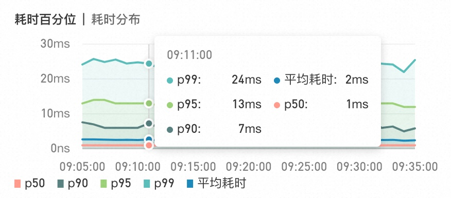

###### 耗时直方图

耗时分位数和平均值将接口响应速度抽象成了有限的几个数值，比较适合监控和告警。但是，如果要做深度的分析，识别所有请求的耗时分布情况，直方图是最适合的统计方式。

直方图的横坐标代表请求耗时，纵坐标代表请求次数，并且横/纵坐标值通常都是非等分的，因为耗时与次数的分布通常是不均衡的，使用非等分坐标轴更容易观测重要且低频的慢请求分布，
而等分坐标轴很容易将低频值忽略掉。如下图所示，可以直观的发现不同耗时范围内的请求次数分布：耗时在 100ms 左右的请求次数最多，超过了 10000 次；
耗时在 5-10s 范围内次数也不少，接近 1000 次，而超过 30s 以上的请求也有接近 10 次。

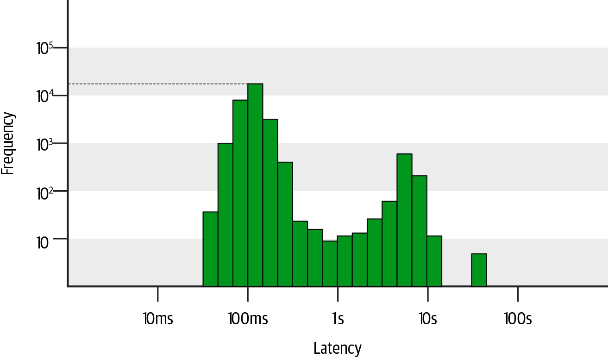

直方图可以与分位数结合使用，每一个耗时分位数都会落在直方图具体的某个区间内。这样，不仅能够快速发现最慢的 1% 请求耗时阈值是 3s，
还能进一步区分这 1% 最慢的请求在 3-5s，5-7s，7-10s，10s 以上的具体分布数量。同样的 P99 分位数（3s），慢请求全部集中在 3-5s 区间，
和全部集中在 10s 以上区间所反映的问题严重程度，以及问题背后的原因可能是完全不同的。

通过对比不同时段的直方图分布，可以精准发现每一个耗时区间的变化情况。如果业务是面向终端用户，每一个长尾请求都代表着一次糟糕的用户体验，
那应该重点关注耗时区间最高的那部分变化，比如 P99 分位数所在的区间；如果该业务系统是负责图形图像处理，更加看重单位时间内的吞吐率，
不那么在意长尾耗时，那应该优先关注大部分请求的耗时变化，比如 P90 或 P50 所在区间的分布变化。

##### 缓存命中率

缓存可以有效提升高频重复请求的响应速度，比如订单中心可以将商品详情记录在 Redis 缓存中，只有查询缓存未命中时才去请求数据库。
因此，在实际生产环境中，缓存命中率可以作为度量系统性能的一个重要指标。

举个例子，某订单中心每次促销活动刚开始的时候会出现访问量激增又下降再缓慢回升，伴随耗时大幅抖动的现象，而缓存和数据库的请求量也会相对应的抖动变化，如下图所示。

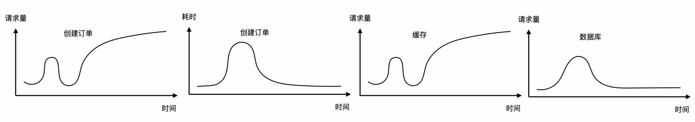

我们可以看到缓存请求量的变化是与创建订单接口大致相同的，而数据库的请求量有一个比较大幅的增长。可以初步判断是由于促销活动初期出现了大量缓存未命中，
从而调用数据库导致的创建订单接口耗时异常，因为查询数据库的耗时开销要远大于缓存。缓存未命中的原因主要有两种，一种是查询了大量冷数据导致的缓存命中率下降，
另一种是查询量激增导致缓存连接被打满，超过其服务提供能力。两种原因的具体表现可以结合缓存命中率指标进一步区分，如下图所示。

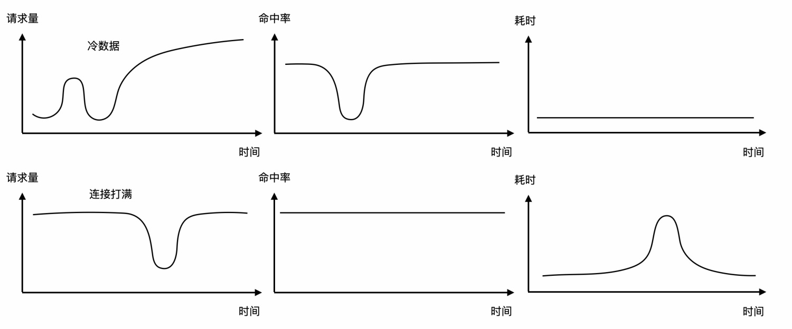

为了减少冷数据对促销活动体验的影响，可以提前进行缓存预热提高命中率；而连接打满的问题可以提前调整客户端或服务端的缓存连接池最大连接数限制，
或者提前扩容。缓存命中率下降的严重后果会导致大量请求击穿数据库，最终导致整体服务不可用。因此，在生产环境中建议对缓存命中率设置告警，提前发现风险。

##### CPU 使用率

CPU 使用率就是 CPU 非空闲态运行的时间占比，它反映了 CPU 的繁忙程度。比如，单核 CPU 1s 内非空闲态运行时间为 0.8s，
那么它的 CPU 使用率就是 80%；双核 CPU 1s 内非空闲态运行时间分别为 0.4s 和 0.6s，
那么，总体 CPU 使用率就是：

```text
(0.4s + 0.6s) / (1s * 2) = 50%
```

其中 2 表示 CPU 核数，多核 CPU 同理。

在 Linux 系统下，使用 top 命令查看 CPU 使用情况，可以得到如下信息：

```plain
Cpu(s): 0.2%us, 0.1%sy, 0.0%ni, 77.5%id, 2.1%wa, 0.0%hi, 0.0%si, 20.0%st
```

- us(user)：表示 CPU 在用户态运行的时间百分比，通常用户态 CPU 高表示有应用程序比较繁忙。典型的用户态程序包括：数据库、Web 服务器等。
- sy(sys)：表示 CPU 在内核态运行的时间百分比（不包括中断），通常内核态 CPU 越低越好，否则表示系统存在某些瓶颈。
- ni(nice)：表示用 nice 修正进程优先级的用户态进程执行的 CPU 时间。nice 是一个进程优先级的修正值，如果进程通过它修改了优先级，则会单独统计 CPU 开销。
- id(idle)：表示 CPU 处于空闲态的时间占比，此时，CPU 会执行一个特定的虚拟进程，名为 System Idle Process。
- wa(iowait)：表示 CPU 在等待 I/O 操作完成所花费的时间，通常该指标越低越好，否则表示 I/O 存在瓶颈，可以用 iostat 等命令做进一步分析。
- hi(hardirq)：表示 CPU 处理硬中断所花费的时间。硬中断是由外设硬件（如键盘控制器、硬件传感器等）发出的，需要有中断控制器参与，特点是快速执行。
- si(softirq)：表示 CPU 处理软中断所花费的时间。软中断是由软件程序（如网络收发、定时调度等）发出的中断信号，特点是延迟执行。
- st(steal)：表示 CPU 被其他虚拟机占用的时间，仅出现在多虚拟机场景。如果该指标过高，可以检查下宿主机或其他虚拟机是否异常。

由于 CPU 有多种非空闲态，因此，CPU 使用率计算公式可以总结为：

```text
CPU 使用率 = (1 - 空闲态运行时间/总运行时间) * 100%
```

根据经验法则，生产系统的 CPU 总使用率建议不要超过 70%。

##### 平均负载

平均负载（Load Average）是指单位时间内，系统处于可运行状态（Running / Runnable）和不可中断态的平均进程数，也就是平均活跃进程数。

可运行态进程包括正在使用 CPU 或者等待 CPU 的进程；不可中断态进程是指处于内核态关键流程中的进程，并且该流程不可被打断。
比如当进程向磁盘写数据时，如果被打断，就可能出现磁盘数据与进程数据不一致。不可中断态，本质上是系统对进程和硬件设备的一种保护机制。

在 Linux 系统下，使用 top 命令查看平均负载，可以得到如下信息：

```plain
load average: 1.09, 1.12, 1.52
```

这 3 个数字分别表示 1 分钟、5 分钟、15 分钟内系统的平均负载。该值越小，表示系统工作量越少，负荷越低；反之负荷越高。

理想情况下，每个 CPU 应该满负荷工作，并且没有等待进程，此时，平均负载 = CPU 逻辑核数。

但是，在实际生产系统中，不建议系统满负荷运行。通用的经验法则是：

```text
平均负载 = 0.7 * CPU 逻辑核数
```

- 当平均负载持续大于 `0.7 * CPU 逻辑核数`，就需要开始调查原因，防止系统恶化；
- 当平均负载持续大于 `1.0 * CPU 逻辑核数`，必须寻找解决办法，降低平均负载；
- 当平均负载持续大于 `5.0 * CPU 逻辑核数`，表明系统已出现严重问题，长时间未响应，或者接近死机。

除了关注平均负载值本身，也应关注平均负载的变化趋势，这包含两层含义。一是 load1、load5、load15 之间的变化趋势；二是历史的变化趋势。

- 当 load1、load5、load15 三个值非常接近，表明短期内系统负载比较平稳。此时，应该将其与昨天或上周同时段的历史负载进行比对，观察是否有显著上升。
- 当 load1 远小于 load5 或 load15 时，表明系统最近 1 分钟的负载在降低，而过去 5 分钟或 15 分钟的平均负载却很高。
- 当 load1 远大于 load5 或 load15 时，表明系统负载在急剧升高，如果不是临时性抖动，而是持续升高，特别是当 load5 都已超过 0.7 * CPU 逻辑核数时，应调查原因，降低系统负载。

##### CPU 使用率与平均负载的关系

CPU 使用率是单位时间内 CPU 繁忙程度的统计。而平均负载不仅包括正在使用 CPU 的进程，还包括等待 CPU 或 I/O 的进程。
因此，两者不能等同，有两种常见的场景如下所述：

- CPU 密集型应用，大量进程在等待或使用 CPU，此时 CPU 使用率与平均负载呈正相关状态。
- I/O 密集型应用，大量进程在等待 I/O，此时平均负载会升高，但 CPU 使用率不一定很高。

#### 性能监控最佳实践

##### 建设一体化性能监控平台

随着互联网技术的不断发展，企业的业务规模和复杂度也在不断增加。为了保证业务的稳定性和可靠性，企业需要对其系统进行全面的性能监控。
而一体化性能监控就是一种集成了多种监控工具和技术的综合性监控方案，可以帮助企业更加全面、高效地监控其系统的性能。

1. **提高监控效率** ：传统的性能监控方案往往需要使用多个不同的监控工具，例如网络监控、服务器监控、数据库监控等。
   这些工具往往需要单独配置和管理，而且监控数据也分散在不同的系统中，导致监控效率低下。
   而一体化性能监控则可以将多个监控工具集成在一起，通过一个统一的监控平台进行管理和监控。
   这样可以大大提高监控效率，减少监控人员的工作量，同时也可以更加全面地监控系统的性能。
2. **提高监控精度** ：传统的性能监控方案往往只能监控系统的基本指标，例如 CPU 使用率、内存利用率等。
   而一体化性能监控则可以通过集成多种监控工具和技术，监控系统的各个方面，例如网络流量、磁盘 IO、数据库响应时间等。
   这样可以更加全面地了解系统的性能状况，及时发现和解决问题，提高监控精度。
3. **提高故障排查效率** ：当系统或应用出现故障时，传统的性能监控方案通常需要 IT 运维人员手动分析监控数据来确定故障原因，这样会浪费大量的时间和精力。
   而一体化性能监控能够对多种关联的监控数据进行自动分析和处理，帮助 IT 运维人员快速定位故障原因，从而提高故障排查效率。
4. **提高监控可视化程度** ：一体化性能监控可以通过统一可视化界面，综合展示不同类型的性能监控数据，使监控数据更加直观、易于理解，帮助监控人员更快地发现和解决问题。
   同时，一体化性能监控还可以通过报警机制，及时通知监控人员发现问题，提高监控的实时性和响应速度。

因此，一体化性能监控是当今企业信息化建设中不可或缺的一部分。通过将多个性能监控工具整合在一起，形成一个统一的监控平台，
可以提高监控效率、监控精度、故障排查效率和可视化程度，从而帮助企业更好地了解其业务系统的运行情况，提高业务系统的稳定性和可靠性。

##### 建设一体化性能监控平台步骤

一体化性能监控平台是指将多个性能监控工具整合在一起，形成一个统一的平台，以便更好地监控和管理系统的性能。建设一体化性能监控平台通常需要以下步骤：

1. **确定监控需求** ：首先需要明确监控的目标和需求，包括监控的对象、监控的指标、监控的频率等。这些需求将决定后续的监控工具的选择和配置。
   性能监控的常见对象包括请求耗时、缓存命中率、FullGC 次数、数据库连接数、CPU 使用率等等。几乎覆盖了全栈 IT 设施，比如用户终端、网关、微服务应用、数据库、容器或物理机等。
2. **选择监控工具** ：根据监控需求，选择适合的监控工具。常见的监控工具包括 Nagios、Grafana 等。
   这些工具可以监控服务器、网络、数据库、应用程序等各个方面的性能指标。
3. **配置监控工具** ：根据监控需求，对所选的监控工具进行配置。这包括添加监控对象、设置监控指标、调整监控频率等。
   同时，还需要设置告警规则，以便在系统出现异常时及时通知管理员。
4. **整合监控工具** ：将多个监控工具整合在一起，形成一个统一的监控平台。这可以通过使用开源的监控集成工具，如 Prometheus、Grafana 等来实现。
   这些工具可以将不同的监控数据整合在一起，形成一个统一的监控视图。
5. **数据可视化** ：将监控数据可视化，以便管理员更直观地了解系统的性能状况。这可以通过使用 Grafana 等工具来实现。
   Grafana 可以将监控数据以图表、仪表盘等形式展示出来，方便管理员进行分析和决策。
6. **自动化运维** ：将监控平台与自动化运维工具结合起来，实现自动化运维。这可以通过使用 Ansible、SaltStack 等工具来实现。
   这些工具可以根据监控数据自动化地进行故障排除、性能优化等操作，提高系统的稳定性和性能。

建设一体化性能监控平台需要根据监控需求选择合适的监控工具，进行配置和整合，实现数据可视化和自动化运维，以提高系统的稳定性和性能。
从 0 到 1 自建一套一体化性能监控平台，需要投入巨大的人力研发、运维和试错成本。道客可观测团队面向海量用户场景，通过多年的自研技术沉淀，
探索出了一套符合开源标准、稳定可靠、易扩展的一体化性能监控最佳实践。

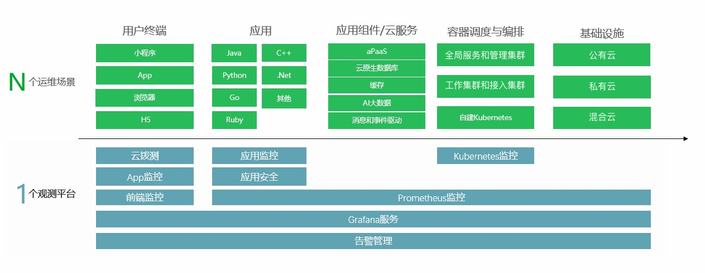

##### 实现端到端全链路追踪

链路追踪的价值在于“关联”，终端用户、后端应用、云端组件（数据库、消息等）共同构成了链路追踪的轨迹拓扑大图。
这张拓扑覆盖的范围越广，链路追踪能够发挥的价值就越大。而全链路追踪就是覆盖全部关联 IT 系统，能够完整记录用户行为在系统间调用路径与状态的最佳实践方案。

完整的全链路追踪可以为业务带来三大核心价值：端到端问题诊断，系统间依赖梳理，自定义标记透传。

- **端到端问题诊断：** VIP 客户下单失败，内测用户请求超时，许多终端用户的体验问题，追根溯源就是由于后端应用或云端组件异常导致的。而全链路追踪是解决端到端问题的首选方案。
- **系统间依赖梳理：** 新业务上线，老业务裁撤，机房搬迁/架构升级，IT 系统间的依赖关系错综复杂，已经超出了人工梳理的能力范畴，基于全链路追踪的拓扑发现，使得上述场景决策更加敏捷、可信。
- **自定义标记透传：** 全链路压测，用户级灰度，订单追溯，流量隔离。基于自定义标记的分级处理&数据关联，已经衍生出了一个繁荣的全链路生态。然而，一旦发生数据断链、标记丢失，也将引发不可预知的逻辑灾难。

###### 全链路追踪的挑战

全链路追踪的价值与覆盖的范围成正比，它的挑战也同样如此。为了最大程度地确保链路完整性，无论是前端应用还是云端组件，
无论是 Java 语言还是 Go 语言，无论是公有云还是自建机房，都需要遵循同一套链路规范，并实现数据互联互通。
多语言协议栈统一、前/后/云（多）端联动、跨云数据融合是实现全链路追踪的三大挑战。

**多语言协议栈统一**

在云原生时代，多语言应用架构越来越普遍，利用不同语言特性实现最佳的性能和研发体验，已经成为一种趋势。
但是，不同语言的成熟度差异，使得全链路追踪无法做到完全的能力一致。目前业界的主流做法是，
先保证远程调用协议层格式统一，多语言应用内部自行实现调用拦截与上下文透传，这样可以确保基础的链路数据完整。

但是，绝大部分线上问题无法仅通过链路追踪的基础能力就能够有效定位并解决，线上系统的复杂性决定了一款优秀的 Trace
产品必须提供更加全面、有效的数据诊断能力，比如代码级诊断、内存分析、线程池分析、无损统计等等。充分利用不同语言提供的诊断接口，
最大化的释放多语言产品能力是 Trace 能够不断向前发展的基础。

- **透传协议标准化** ：全链路所有应用需要遵循同一套协议透传标准，保证链路上下文在不同语言应用间能够完整透传，不会出现断链或上下文缺失的问题。
  目前主流的开源透传协议包括 W3C、Jaeger、B3、SkyWalking 等。
- **最大化释放多语言产品能力** ：链路追踪除了最基础的调用链功能外，逐步衍生出了应用/服务监控、方法栈追踪、性能剖析等高阶能力。
  但是不同语言的成熟度导致产品能力差异较大，比如 Java 探针可以基于 JVMTI 实现很多高阶的边缘侧诊断。
  优秀的全链路追踪方案会最大化的释放每种语言的差异化技术红利，而不是一味的追求趋同平庸。

**前后云（多）端联动**

目前开源的链路追踪实现主要集中于后端业务应用层，在用户终端和云端组件（如云数据库）侧缺乏有效的埋点手段。
主要原因是后两者通常由云服务商或三方厂商提供服务，依赖于厂商对于开源的兼容适配性是否友好。而业务方很难直接介入开发。

上述情况的直接影响是前端页面响应慢，很难直接定位到后端哪个应用或服务导致的，无法明确给出确定性的根因。
同理，云端组件的异常也难以直接与业务应用异常划等号，特别是多个应用共享同一个数据库实例等场景下，需要更加迂回的手段进行验证，排查效率十分低下。

为了解决此类问题，首先需要云服务商更好的支持开源链路标准，添加核心方法埋点，并支持开源协议栈透传与数据回流（如应用实时监控服务的前端监控能力支持 Jaeger 协议透传与方法栈追踪）。

其次，由于不同系统的业务归属等问题，无法完成全链路协议栈统一，为了实现多端联动，需要由 Trace 系统提供异构协议栈的打通方案。

为了实现异构协议栈的打通，Trace 系统需要支持两项能力：

1. **协议栈转换与动态配置** ，比如前端向下透传了 Jaeger 协议，新接入的下游外部系统使用的则是 ZipKin B3 协议。
   在两者之间的 Node.js 应用可以接收 Jaeger 协议并向下透传 B3 协议，保证全链路标记透传完整性。
2. **服务端数据格式转换** ，可以将上报的不同数据格式转换成统一格式进行存储，或者在查询侧进行兼容。
   前者维护成本相对较小，后者兼容性成本更高，但相对更灵活。

**跨云数据融合**

很多大型企业，出于稳定性或数据安全等因素考虑，选择了多云部署，这种部署架构下，由于不同环境的网络隔离，以及基础设施的差异性，为运维人员带来了巨大的挑战。

由于云平台间仅能通过公网通信，为了实现多云部署架构下的链路完整性，可以采用链路数据跨云上报、跨云查询等方式。
无论哪种方式，目标都是实现多云数据统一可见，通过完整链路数据快速定位或分析问题。

**跨云查询**

跨云查询是指原始链路数据保存在当前云网络内，将一次用户查询分别下发，再将查询结果聚合进行统一处理，减少公网传输成本。

跨云查询的优点就是跨网传输数据量小，特别是链路数据的实际查询量通常不到原始数据量的万分之一，可以极大地节省公网带宽。
缺点是需要部署多个数据处理终端，不支持分位数、全局 TopN 等复杂计算。比较适合多主架构，简单的链路拼接、max/min/avg 统计都可以支持。

跨云查询实现有两种模式，一种是在云网络内部搭建一套集中式的数据处理终端，并通过内网专线打通用户网络，可以同时处理多个用户的数据；
另一种是为每个用户单独搭建一套 VLAN 内的数据处理终端。前者维护成本低，容量弹性更大；后者数据隔离性更好。

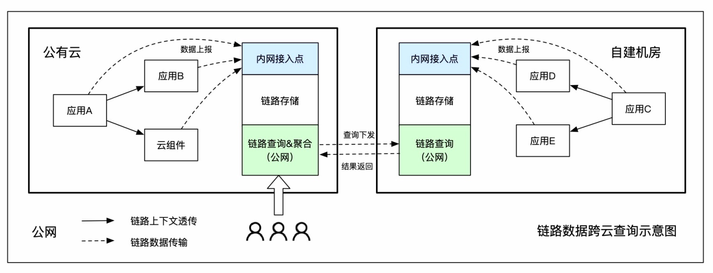

**其他方式**

除了上述两种方案，在实际应用中还可以采用混合模式或仅透传模式。

混合模式是指将统计数据通过公网统一上报，进行集中处理（数据量小，精度要求高），而链路数据采用跨云查询方式进行检索（数据量大，查询频率低）。

仅透传模式是指每个云平台之间仅保证链路上下文能够完整透传，链路数据的存储与查询独立实现。
这种模式的好处就是实现成本极低，每朵云之间仅需要遵循同一套透传协议，具体的实现方案可以完全独立。
通过同一个 TraceId 或应用名进行人工串联，比较适合存量系统的快速融合，改造成本最小。

###### 道客全链路追踪最佳实践

道客环境下，可以基于可观测链路 OpenTelemetry 版，从 0 到 1 快速构建一套贯穿前端、网关、服务端、容器和云组件的全链路追踪体系。

- Header 透传格式：全链路统一采用一种透传协议，可以是 W3C TraceContext、B3 或 Jaeger 等格式。
- 前端接入：可以采用 Script 注入或 NPM 两种低代码接入方式，支持 Web/H5、小程序等场景。
- 后端接入：推荐接入可观测链路 OpenTelemetry 版，将数据上报至对应接入点，实现多语言应用间的链路透传与展示。

全链路追踪仅仅只是开始，远远不是结束。基于全链路追踪生态，关联更多的指标、日志、事件、Profiling 等数据或工具，
提升问题诊断或业务分析效率，才能更好的发挥全链路追踪的价值。

结合道客用户实践，一个典型的链路筛选与诊断过程，主要分为以下几步：

1. 根据 TraceId、应用名、接口名、耗时、状态码、自定义标签等任意条件组合过滤出目标调用链。
2. 从满足过滤条件的调用链列表中选中一条链路查询详情。
3. 结合请求调用轨迹，本地方法栈，主动/自动关联数据（如 SQL、业务日志）综合分析调用链。
4. 如果上述信息仍无法定位根因，需要结合内存快照、Arthas 在线诊断等工具进行二次分析。

### 性能优化

云上计算类产品提供灵活的弹性功能和策略，对无规律的业务量波动和有规律的业务量波动性能要求都能完成较好的适配。
弹性资源的类型主要包括如下几类：

#### 容器弹性伸缩

弹性是容器服务被广泛采用的功能，典型的场景包含在线业务弹性、大规模计算训练、深度学习
GPU 或共享 GPU 的训练与推理、定时周期性负载变化等。弹性伸缩分为两个维度：

- 调度层弹性，主要是负责修改负载的调度容量变化。包括 HPA、VPA、CronHPA 等类型，
  例如 HPA 是典型的调度层弹性组件，通过 HPA 可以调整应用的副本数，调整的副本数会改变当前负载占用的调度容量，从而实现调度层的伸缩。
- 资源层弹性，主要是集群的容量规划不能满足集群调度容量时，会通过弹出 DCE 等资源的方式进行调度容量的补充。

在实际应用当中，建议两者有机结合，同时，在高性能场景下，对容器的弹出速度提出了更高的要求。

#### 网络优化

随着云上应用场景的多样性趋势和复杂度增加，需要从如下几个方面考虑网络优化方案：

### DCE 网络性能优化

网络性能代表了用户的算力在云上所能获得的最大的内网和互联网的访问能力，当前道客单实例提供的网络性能给用户提供丰富的优化选项。

#### 负载均衡性能优化

在网络密集型应用场景中，负载均衡通常作为集群流程的入口，通过将流量分发到不同的后端服务器来扩展应用系统的吞吐能力，并且可以消除系统中的单点故障，提升应用系统的可用性。

#### 架构优化

通过弹性计算、网络和数据库几大类 PaaS 云资源性能优化，可以为用户在云上环境中获得云基础设施资源层面的调优。
在实际架构、部署和运维过程中，用户通常以运行在云平台上的应用性能优化为度量目标。应用架构层面的架构优化需要根据实际情况考虑多方面内容，比如以下方面：

- 应用架构的部署方式：使用单机、分布式和微服务架构会有较大区别；单机架构取决于对单机本身的软硬件性能和应用对单机资源的使用率；
  分布式架构除了取决于单机性能瓶颈外，也取决于系统拆分效率和可扩展性；微服务架构中，服务拆分效率和服务调用效率又是另外的重要影响因素。
- 编程语言实现：不同编程语言实现一定程度会影响单机基线。C/C++ 等编译型语言运行时不需要重新翻译，直接使用编译成的机器码运行，
  不用依赖于解释器，程序执行效率较高；Python、Ruby 等解释型语言程序在运行时才翻译成机器码，
  每次执行都依赖于解释器的翻译，在增加灵活性的同时程序执行效率与编译型语言相比较低。

## 结束语

在云上落地卓越架构并非一蹴而就，需要不断迭代并持续演进。企业使用云技术是一个动态的过程，大部分情况下的良好架构都是基于一个时点的“共时性”设计，
但企业 IT 既有自身的历史，也有未来的发展，云产品和最佳实践也在不断迭代，因此架构的演进需要有更多的“历时性”观点，始终关注架构的演进和变化。
在使用云技术的过程中，有大量企业的认知和实践停留在上云最初的那一刻，从而导致技术固化后无法达成对业务的有效支撑。
企业的业务团队、技术相关职能人员等必须要保持对新技术的洞悉，并勇于进行必要的实践，卓越架构不能成为一成不变的“完美架构”，而是时刻伴随业务和技术发展的“当前最优”架构。

对于追求卓越架构的企业而言，构建基于或包含云技术的卓越架构指南，形成自身战略规划以及上云、用云、管云的最佳实践，
将使企业能够持续发挥云计算的最大价值，为企业中各个直接或间接受云技术影响的团队带来持续的正面回报。

卓越架构框架是道客架构师团队、产品团队及全国交付团队在服务众多客户，帮助客户在道客云操作系统上设计和落地卓越架构过程中的经验总结，
因此特别感谢这么多给予我们信任、帮助我们改进的客户。随着道客的不断发展，我们也将继续与客户合作学习，不断完善卓越架构的定义和最佳实践。
