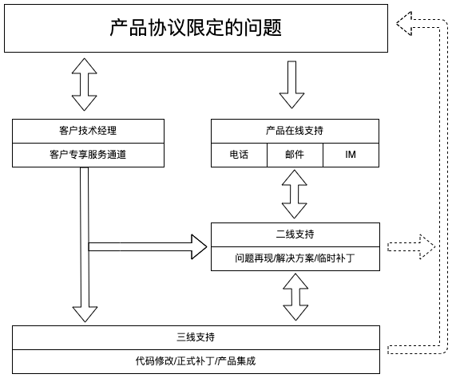

---
hide:
  - navigation
---

# DaoCloud 产品支持政策

[阅读和下载 PDF](./support.pdf)

除非另有说明，本文所述的这些政策适用于 DaoCloud Enterprise（简称 DCE）软件及其所含模块的维护与支持。

“客户”是指已从 DaoCloud 订购产品维护与支持服务的实体。

要从 DaoCloud 获取下述[支持级别](#_1)中所描述的维护或支持服务，客户必须：

- 拥有已签署的维护订单，其中指定了产品、其适用的支持级别、所选的可选服务增强功能（如有）和费率；
- 拥有目前已获得许可和支持的软件版本；
- 支付维护和支持服务相关费用。

基于订阅的软件许可获得适用于该类型软件或产品所特有的支持。

DaoCloud 可以在执行特定支持任务或在特定地点服务时使用分包商。DaoCloud 使用了全国服务支持模式，
该模式代表了 DaoCloud 可以充分使用全国各地支持中心员工开展下述维护和支持服务，以充分利用全国各地员工的经验与技能。
任何客户对该服务模式的限制都被认为是非标准的，并可能导致本文所述的维护与支持策略产生变更和额外费用。
由于客户对 DaoCloud 的全国服务支持模式的限制，对交付维护和支持的任何更改都必须以书面形式达成。

“DaoCloud 产品支持”是适用于 DaoCloud 产品的支持和服务机制，该支持可以为用户提供很有价值的支持服务，
例如用户手册、软件安装包、事件跟踪记录和最佳实践文档等。

windsonsea marked this conversation as resolved.
DaoCloud 产品支持政策可由 DaoCloud 酌情更改并在 DaoCloud 官网公示，恕不另行通知。
对于已支付此类支持费用的客户，DaoCloud 的政策变更不会导致合同支持期（在服务订单中定义）内向客户提供的产品支持服务方式有客户不认可或不接受的重大变化。

## 事件处置

技术支持使用下面的定义对问题分类，针对不同级别的事故，按照有关服务水平协定提供不同响应时间的服务。

**事件级别划分：**

| 级别 | 事故类型   | 描述   |
| ---- | -------- | ----- |
| 1 级 | 生产灾害性事故   | 严重影响客户生产，使客户系统失效或难以正常开展工作，导致数据丢失等严重问题，且无程序上的避开或备用方法 |
| 2 级 | 影响严重性事故   | 客户系统受到较大干扰，导致效率下降，但是系统仍能勉强工作并保持业务运行，且存在相应的避开或备用方法 |
| 3 级 | 影响一般性事故   | 系统能够正常工作，只是涉及某些非关键性功能模块的运行或稳定性，系统能够自动调节或仅需进行简单处理 |
| 4 级 | 操作使用配置问题 | 系统不受影响也无需进行特别处理，主要体现在指导客户使用系统或根据相关流程进行对应配置 |
| 5 级 | 优化和改进建议   | 客户对产品扩充或日后的修改建议，对软件或系统的质量、功能或性能均不构成影响 |

当事件被指定为 1 级和 2 级时，客户需要让 DaoCloud 对受影响产品进行立即、安全的远程访问，也可选择与 DaoCloud 服务中心预约派遣服务代表到达客户现场。
如果远程访问延迟或问题现场无法进入，问题解决工作将受到影响，并且可能会延误问题解决。

客户有权对 DaoCloud 产品提出建议，相关建议会被定义为 5 级事件。DaoCloud 会根据产品规划、社区技术演进和客户使用场景充分分析，并答复是否接受该建议。

## 支持服务

DaoCloud 在支持服务范围内为其产品提供维护和支持。对于第三方许可或带有 DaoCloud 的版权或徽标的生态软件和模块产品，DaoCloud 负责组织支持服务开展，具体技术支持服务内容由原厂提供。

DaoCloud 提供的支持服务有以下几种类型：

- [标准服务](#_3)
- [高级服务](#_4)

### 标准服务

| **服务代码** | **服务名称** | **服务内容** | **服务人员** | **收费方式** | **推荐购买用户** |
| ----------- | ---------- | ----------- | ----------- | ---------- | -------------- |
| SNS | 产品支持和订阅 | 产品售后服务  - 升级版本获取 | 售后工程师 | 产品规模 | 产品已经在生产环境运行，售后即将到期并且没有购买S360的用户，需要购买SNS为生产环境提供最基础的保障。|
| PDS | 产品实施服务 | 现场或远程产品实施专业服务  - 产品交付规划、部署实施  - 产品培训服务  - 产品维护与升级服务 | 交付工程师（中级以上） | 人/天 | 用户自身不具备很强的网络、存储等基础设施运维能力；产品部署方案比较复杂、或者存在个性化的产品部署需求。|

- SNS（Support and Subscription，产品支持和订阅服务）由 DaoCloud 专业的云原生实施团队为客户提供产品支持和订阅服务，
  该服务涵盖产品订阅生命全周期：产品上线支持、运维支持、监控和告警支持，以及产品升级支持。根据客户场景，
  提供产品运行的建议、产品运维服务的建议、监控指标项的分析和指导，以及产品补丁/新版本特性的建议和产品安装包下载。

    - **产品售后服务**：对产品运行提供对应的支持服务，包括产品上线的指导、产品运行过程中的运维支持、告警信息的支持分析、产品故障的支持和修复；
      产品告警系统中的消息分析、监控系统中的指标项的分析和建议等。

    - **升级版本获取** ：对产品版本的已知问题的支持、对产品新版本的新特性和问题修复的支持，以及对应新版本、补丁的下载支持。

- PDS（Product Deployment Service，产品实施服务）由 DaoCloud 专业的云原生实施团队为客户提供产品实施服务，该服务涵盖产品实施生命全周期，
  即交付规划、实施部署、日常运维和产品升级等环节。根据客户场景，提供整体的部署规划及详尽的资源规划建议、产品部署实施全过程文档、标准产品演示及使用培训服务、
  产品运维指导及相关规范、故障处理机版本升级实施等服务，帮助客户完成产品落地，保障客户业务连续性。

    - **规划阶段** ：根据客户实际环境，对产品的交付部署做整体的设计规划，制定总体目标并分阶段推进。
      交付内容包含部署架构图、部署整体环境要求及在开发、测试、生产环境所需的包含IP 规划、操作系统配置、外部依赖梳理、机器资源规划、网卡规划等信息的具体资源规划方案。

    - **实施阶段** ：根据规划进行部署实施，协助客户准备部署阶段所需的环境，并进行相对应的部署工作，帮助客户进行租户授权规划。
      交付内容包含对应的账号密码信息、产品使用手册和授权规划操作手册。

    - **产品培训服务** ：根据客户需求，制定培训计划并组织产品培训，帮助相关部门对产品有更深入的理解。
      交付内容包含技术专家答疑、培训 PPT 和培训视频。

    - **产品运维** ：帮助客户应对在生产实践过程中关于产品使用和维护的相关问题，提供包含应用无法启动，
      容器不断重启、错误信息提示、应用无法访问、节点状态未就绪、Pod 常见错误、网络故障排查及其他集群故障应急处理等信息的产品排障手册和故障应急处理手册。

    - **产品升级** ：提供基于客户当前版本的产品升级服务，包含升级方案制定、升级前检查、升级实施操作、升级后验证及回退方案等。

### 高级服务

| **服务代码** | **服务名称** | **服务内容** | **服务人员** | **收费模式** | **推荐购买用户** |
| ----------- | ---------- | ----------- | ----------- | ---------- | -------------- |
| S360 | Success360 关键业务成功 | 以产品为基础，为企业提供更加主动的、体系化专业服务支撑，并提供有针对性的个性化专业指导  - 专属客户服务团队  - 高级产品方案设计  - 主动巡检服务  - 产品升级提醒服务  - 关键事件的运维保障 | - 项目经理  - 架构师（高级）  - 运维工程师（高级） | 产品规模 | - 平台已经承载重要负载的客户  - 集群规模较大  - 平台承载的应用数量多 |

S360（Success 360，客户成功 360 服务）由 DaoCloud 为客户提供专属的云原生技术团队，全方位助力客户成功。
根据客户行业属性和服务要求，进行服务人员的动态配置。提供定制化的高级产品方案设计，对产品进行定期健康巡检，
主动识别隐患问题并提供生产实践改进或优化建议，并在客户重点保障阶段（如业务高峰期、关键业务上线、应用升级等）提供业务连续性保障服务。

- **专属客户服务团队** ：根据客户行业属性与服务要求，组建专属的专家服务团队，助力客户成功。
- **高级产品方案设计** ：根据客户需求，提供个性化的产品方案，包括：蓝绿发布、灾备方案、监控方案、日志方案、灰度发布方案、大型集群方案等。
- **主动巡检服务** ：定期对产品进行健康巡检，提供产品巡检报告，包含：整体信息、管理节点、计算节点、应用状态、功能需求及问题处理、总体评价。
- **产品升级提醒服务** ：主动为客户提供产品更新报告和社区软件漏洞报告，根据具体情况提供相关产品的修订及版本升级服务。
- **关键事件运维保障** ：在客户重点保障阶段（如业务高峰期、关键业务上线阶段、应用升级等）提供业务连续性保障服务。
  提供变更策略设计和方案探讨，协助故障处理并形成报告，以便后续自行查询。交付内容包含：服务计划及人员配置名单、服务过程记录和服务报告。

## 请求服务

如果客户在使用受支持的产品时遇到问题，DaoCloud 将为客户提供 DaoCloud 产品支持服务，并且将激活其自动事件创建诊断工具。
客户可以在每周 7 天、每天 24 小时任意时间报告问题，DaoCloud 将在订单指定的覆盖时间内提供支持。

| 级别 | 标准服务响应时间 | 标准服务渠道 | 高级服务响应时间 | 高级服务渠道 | 专业服务响应时间 | 专业服务渠道 |
| --- | ------- | ------ | ------- | ------- | ------- | ------- |
| 1 级 | 四小时 7*24 | 客服/电话/远程支持 | 二小时 7*24 | 客服/电话/远程支持/现场支持 | 一小时 7*24 | 客服/电话/远程支持/现场支持 |
| 2 级 | 八小时 5*8 (9:00 - 18:00) | 客服/电话/远程支持 | 四小时 7*24 | 客服/电话/远程支持/现场支持 | 二小时 7*24 | 客服/电话/远程支持/现场支持 |
| 3 级 | 二个工作日 5*8 (9:00 - 18:00) | 客服/电话/远程支持 | 一个工作日 5*8 (9:00 - 18:00) | 客服/电话/远程支持 | 四小时 5*8 (9:00 - 18:00) | 客服/电话/远程支持/现场支持 |
| 4 级 | 四个工作日 5*8 (9:00 - 18:00) | 客服/电话/远程支持 | 二个工作日 5*8 (9:00 - 18:00) | 客服/电话/远程支持 | 一个工作日 5*8 (9:00 - 18:00) | 客服/电话/远程支持/现场支持 |
| 5 级 | 无 | 客服/电话/远程支持 | 定期探讨 | 客服/电话/远程支持 | 每月探讨 | 客服/电话/远程支持/现场支持 |

服务支持的大致流程如图所示：

### 覆盖时间

覆盖时间是指以客户系统所在的当地时间计算的时间。如果服务无法在请求服务当天的覆盖时间内完成，服务将在覆盖期限的下一个发生时间继续进行。

如果客户未直接联系 DaoCloud 服务代表，相关人员将在属于客户的响应时间内给客户回电。当客户报告事件时，服务代表将对查询做出响应，并确保事件得到解决。

远程响应时间按照在客户约定的远程覆盖时间内从客户初次联系（通过电子方式收到事件或接通电话） DaoCloud 到首次联系（通过电子方式收到事件或接通电话）DaoCloud 代表之间的时间间隔度量。

现场响应时间按照在客户约定的现场覆盖时间内从 DaoCloud 服务中心派遣服务代表到他/她到达客户现场之间的时间间隔度量。服务代表派遣由 DaoCloud 自行决定。

### 除外条款

不能正常享受产品支持服务的情况（超范围服务）：

- 非法的和授权范围外的 DaoCloud 软件维护服务
- 对 DaoCloud 软件擅自更改后的部署
- 客户直接进行的重大变更
- 除特殊约定外的技术预览功能
- 由任何第三方软件引发的问题，或因为底层硬件本身引发的问题。DaoCloud 在线服务人员可帮助用户定位这些问题，但需用户联系相关供应商来解决所供产品问题。

DaoCloud 仅在已与客户商定适用的超范围服务费的情况下才提供超范围服务（“附加服务”）。
如果某项服务是超范围工作项，DaoCloud 将在开始工作之前告知客户。但是，如果 DaoCloud 有理由认为提供某项产品服务将会导致安全隐患，则不会提供该项服务。

## 支持生命周期

DaoCloud 将在客户合同期内为未停产和经过认证的软件产品提供远程软件支持。
DaoCloud 将为受支持的操作系统、DaoCloud 软件和工具提供诊断和解决问题的服务。任何现场软件服务由 DaoCloud 自行决定提供。

windsonsea marked this conversation as resolved.
### 生命周期公告

- DCE 5.y 系列

    | **英文缩写** | **中文含义**     | **英文全称**             | **描述**  |
    | ------------ | ---------------- | -------------------- | ----- |
    | GA           | 全面上市         | General Availability     | 产品发布于 2023 年 6 月 1 日 |
    | EOSS         | 停止标准支持服务 | End of Standard  Support | 产品发布后将在 2026 年 6 月 1 日后停止补丁版本开发并停止全面文持 |
    | EOSL         | 停止所有支持服务 | End of Support  Life     | 产品发布后将在 2028 年 10 月 30 日后停止服务 |

- DCE 4.y 系列

    | **英文缩写** | **中文含义**     | **英文全称**             | **描述**  |
    | ------------ | ---------------- | -------------------- | ----- |
    | GA           | 全面上市         | General  Availability    | 产品发布于 2020 年 3 月 31 日 |
    | EOSS         | 停止标准支持服务 | End of Standard  Support | 产品发布后将在 2023 年 3 月 31 日后停止补丁版本开发并停止全面文持 |
    | EOSL         | 停止所有支持服务 | End of Support  Life     | 产品发布后将在 2025 年 3月 31 日后停止服务 |

- DCE 3.y 系列

    | **英文缩写** | **中文含义**     | **英文全称**             | **描述**  |
    | ------------ | ---------------- | -------------------- | ---- |
    | GA           | 全面上市         | General  Availability    | 产品发布于 2018 年 7 月 15 日 |
    | EOFS         | 停止标准支持服务 | End of Standard  Support | 产品发布后将在 2021 年 7 月 30 日后停止补丁版本开发并停止全面文持 |
    | EOSL         | 停止所有支持服务 | End of Support  Life     | 产品发布后将在 2023 年 7 月 30 日后停止服务 |

## 受支持的软件版本

大多数 DaoCloud 软件产品都有几个不同类型的软件版本。这些版本用版本编号 x.y.z 加以区分

- 编号 x 指的是主要软件版本，也是 DCE 的版本号
- 编号 y 指的是次要软件版本升级
- 编号 z 指的是维护版本更新

“服务包”和“热修复”都是软件修复的第三方名称。根据 DaoCloud DCE 版本编号定义，“服务包”是维护版本 (z)。

### 软件维护与补丁版本访问

所有平台维护与支持服务级别均包含对标准产品的软件维护、补丁下载和修复版本下载的访问权限。对于大多数问题，
客户可以访问 DCE 文档站（docs.daocloud.io）以获取软件补丁及修复版本的更新，或者 DaoCloud 可应客户要求提供单一介质副本，不额外收费。
客户可以为每个已支付费用并获得许可的软件复制副本和/或安装补丁或维护版本更新。

### 停用后的软件维护和支持

软件代码修复维护在停用软件上不可用。不保证对停用产品的支持的可用性，具体取决于专业技术专家和支持产品所需的其他资源的可用性。

### 已变更软件的软件维护和支持

如果客户对其指定的软件做了变更，该软件将被称为“已变更软件”。DaoCloud 不提供与已变更版本兼容的任何级别（x、y、z）的软件版本。
将新软件与已变更版本结合使用时，DaoCloud 不保证新软件的运行与 DaoCloud 的说明一致。

## 客户可安装和可升级软件

对于客户可安装的软件，即客户可以通过 DCE 文档站下载的软件，DaoCloud 将提供用户文档的访问，
该文档在 DaoCloud 社区内提供支持和讨论。DaoCloud 还将提供远程安装支持，包括：

- 就如何通过用户文档查找已知问题解决方案提供指导
- 提供解决程序性问题的信息
- 解答常见问题
- 为上报的问题提供解决方案

### 软件订购/订阅许可

通过这项服务，客户有权获得许可软件一般商用的主要 (x) 和次要 (y) 版本。DaoCloud
订购或订阅许可包括客户维护和支持协议以及任何已支付的许可费用所涵盖的 DaoCloud 软件、实用程序以及工具。订购或订阅许可中不包括软件实施。

### 病毒防护扫描软件

DaoCloud 不提供用于病毒防护扫描软件的捆绑解决方案，也不提供有关任何病毒防护软件的配置和软件选择方面的咨询。

DaoCloud 对客户系统上的病毒不承担任何责任，如果在客户的系统硬盘上检测到病毒，系统维修和病毒隔离不在维护和支持服务的范围之内。
在客户系统上检测到病毒时，虽然 DaoCloud 在客户请求的情况下会做出商业上合理的努力以提供协助，但 DaoCloud 对与此类病毒有关的数据丢失不承担任何责任。

## DaoCloud 软件程序

### DaoCloud 管理软件及其他软件支持生命周期

对于 DaoCloud 软件，DaoCloud 将提供软件问题解决服务，其中包括代码级维护，
以及任何针对当前主要/次要软件版本提供现有更正或临时解决方案以解决报告的软件问题的任何活动。
当客户的软件版本不再是最新版本且客户尚未升级到最新版本时，DaoCloud 将在支持期内提供“仅支持”服务，并且此类支持可能需要额外的费用。

### 服务有效期

产品初次部署：

- 软件产品：自软件首次正式 License 激活完毕之日作为服务开始时间，根据购买的服务年限，向后顺延作为服务结束时间
- 一体机产品：自一体机送达之日作为服务开始时间，根据购买的服务年限，向后顺延作为服务结束时间

产品扩容：

- 若产品扩容以新建集群的方式安装实施，则扩容产品的服务有效期也适合初次部署的定义
- 若产品在原有集群中扩容，则扩容产品的服务有效期与原集群服务有效期一致

### 延长软件维护 (EAM)

某些软件产品的支持到期后，DaoCloud 最多还可提供 2 年延长软件维护服务。延长软件维护服务按 1 年增量提1供。延长软件维护服务包括：

- 每周 7 天、每天 24 小时事件呼叫受理
- 面向 1 级和 2 级事件的代码级维护，对新问题和现有问题提供应急修复
- 可以通过 DaoCloud 产品支持记录问题呼叫
- 如果不存在可接受的临时解决方案，仅向后移植关键电子修复（如有可能）
- 仅提供远程服务支持方法，不提供现场支持
- 延续当前级别的覆盖时间

为获得享用延长软件维护服务的资格，客户必须符合下列标准：

- 客户必须有稳定的环境，用户负载不增长，或者没有计划大规模软件变更。客户必须根据其当前版本的受支持配置矩阵保留受支持配置
- 客户必须运行主要/次要版本的最新维护版本，并愿意升级到最新电子修复，以获得更正
- EAM 合同不允许支持覆盖时间有任何空缺。只要当前软件版本的电子修复支持到期，就鼓励客户迁移到 EAM 合同。
  任何请求支持但未签署 EAM 协议的客户，都需要签署新的 EAM 协议，并支付自电子修复支持结束之日起覆盖时间内的拖欠费用。

延长软件维护服务不包括：

- 非法的和授权范围外的 DaoCloud 软件维护服务
- 对 DaoCloud 软件擅自更改后的部署
- 客户直接进行的重大变更
- 除特殊约定外的技术预览功能
- 由任何第三方软件引发的问题，或因为底层硬件本身引发的问题。
  DaoCloud 在线服务人员可帮助用户定位这些问题，但需用户联系相关供应商来解决所供产品问题。

## 第三方软件

第三方软件生态产品支持由相关供应商提供，除非 DaoCloud 与该供应商之间就第三方软件支持达成了特定协议。
当 DaoCloud 确实与第三方有特定协议，并且客户与 DaoCloud 签订合同，为第三方的产品提供支持时，
第三方软件和驱动的安装、实施、升级和更新是客户的责任，如备份和恢复第三方软件和驱动。如果 DaoCloud
与第三方供应商之间不存在正式的支持关系，则 DaoCloud 不会对这些软件产品执行任何认证或测试。
客户有责任确定供应商是否已就该软件在客户自己部署环境中的使用进行了认证。即使第三方产品经认证可以与
DaoCloud 产品一起使用，DaoCloud 对第三方产品的安装、集成、维护或支持也不承担任何责任。

在大多数情况下，DaoCloud 同意客户安装和使用第三方软件，除非 DaoCloud 先前已确定存在兼容性问题。如果
DaoCloud 识别出某第三方产品会带来一些性能、兼容性或功能上的不利影响，DaoCloud
将建议客户立即禁用或删除该产品并联系第三方供应商以获得支持。如果客户不接受 DaoCloud 的建议，
这种拒绝可能会对 DaoCloud 提供的支持水准产生负面影响，并可能导致客户与 DaoCloud 之间的支持协议失去法律效力。
DaoCloud 了解与第三方产品相关的问题后，将会记录这些问题。由第三方产品引起的任何问题诊断和/或解决将被视为客户服务协议的“超范围”服务内容。

## 全国支持

DaoCloud 在全国范围内提供产品售后支持服务。

DaoCloud 全国技术支持中心经过战略布局，可以让您高效地对接所在地区的支持中心。每个中心都配备专业技术工程师，
可以提供行业领先的云原生专业知识和产品使用经验。DaoCloud 致力于提供企业级的全球化支持，并牢记一个使命：帮助客户取得持续成功。

### 问题解决

软件问题解决包括：

- 提供关于通过用户文档查找已知问题解决方案的指导、解决程序性问题的信息和常见问题的解答；
- 在后续软件版本可以解决问题时提供升级建议；
- 在提供修复程序/代码级变更之前提供规避问题的临时应对措施；
- 提供用于解决上报的问题的修复程序/代码级变更。修复程序/代码级变更；仅由 DaoCloud 自行决定为工具和实用程序/客户端软件的受支持版本提供。
- 安装或分步安装咨询；
- 客户安装的修补程序和维护版本的测试；
- 客户安装失败后的产品或系统恢复。

DaoCloud 软件问题解决不包括：

- 非法的和授权范围外的 DaoCloud 软件维护服务；
- 对 DaoCloud 软件擅自更改后的部署；
- 客户单方面进行的重大变更；
- 除特殊约定外的技术预览功能；
- 由任何第三方软件引发的问题，或因为底层硬件本身引发的问题。
  DaoCloud 在线服务人员可帮助用户定位这些问题，但需客户联系问题相关供应商来解决所供产品问题。

### 问题上报

DaoCloud 支持流程包括上报、通知和解决指导。系统将根据事件的等级以及对产品性能的影响来调用这些触发程序。

#### 沟通事件上报的状态

所有 1 级事件应立即上报至当班主管和指定的 DaoCloud 客户服务代表，这些问题的状态将于每小时通过电话会议等途径提供给客户。
对于 2 级和 3 级事件，客户可以使用 DaoCloud 产品支持并根据自己的需求选择适当的“查看事件”选项来检查状态。
客户还可以请求自动接收有关任何事件的电子邮件更新通知。

#### 超出批准的变更控制计划的停机上报

对于生产系统上超出计划停机的变更控制，DaoCloud 将立即声明出现 1 级事件并全力处理，直到系统运行完全恢复。
一旦系统恢复，DaoCloud 将与客户一起对事件进行回顾，找出防止问题再次发生的办法。

## 事件管理

当客户发起 1 级事件时，DaoCloud 将立即尽全力使客户系统处于可操作状态。为了有效解决 1 级事件，
DaoCloud 要求客户立即授予对系统的无限制访问权限，并确保有适当的客户工作人员协助解决问题。否则，DaoCloud 会将事件重新分类为 2 级事件。

一旦远程 DaoCloud 支持人员开始为 1 级事件提供支持，他们将持续地、不间断地解决该问题；
如果认为有必要派遣 DaoCloud 现场支持人员，他们还将协助支持人员解决问题。
对于 2 级或 3 级事件，DaoCloud 可以自行决定中断客户服务代表的工作并可能重新指定客户服务代表来解决问题。

### 事件关闭

在提供事件解决方案后，DaoCloud 将请求客户同意以关闭事件。在提供解决方案时客户积极与 DaoCloud 接洽，
并且客户认可解决方案已解决和/或解答了问题，在这种情况下，DaoCloud 将关闭事件。

如果在提供解决方案时客户并未直接参与（例如，客户只是通过 DaoCloud 产品支持或电子邮件获知了解决方案），DaoCloud
将为客户提供同意关闭事件的机会。并且客户未通知 DaoCloud 此类事件未修复，DaoCloud 将把事件标记为”已转移给客户”并关闭。
这些事件将于两年内在 DaoCloud 产品支持中显示为“已转移给客户”。

在客户未向 DaoCloud 提供正确诊断和解决问题所必需的信息的情况下，DaoCloud 也将关闭事件。如果
DaoCloud 未在合理的时间段（由事件等级确定）内收到所请求的信息，DaoCloud 将关闭事件并标记为“已由客户取消”。
对于 3 级事件，客户应在 7 天内响应请求；对于 4 级事件，客户应在 14 天内响应请求。

事件解决的定义如下：

- 提供了咨询，并且解决和/或解答了该问题
- 提供了应对措施，并且应对措施被认为是永久性解决办法
- 需要变更请求

### 变更控制请求

DaoCloud 要求客户在实施变更之前至少提前 28 天发出通知，以便于开发变更控制计划。

## 客户责任

客户有责任履行特定义务以确保 DaoCloud 提供服务。如果客户未能履行后面列出的义务，DaoCloud 可能会：

- 就额外的、超出范围的或现场工作收取时间成本费和材料费
- 重新分类事件级别
- 不执行服务

### 现场准备

客户有责任根据 DaoCloud 的规范准备（在交付要使用或维修的产品之前）、维护和/或在必要时更新客户现场，并为 DaoCloud 的维护人员提供安全、充分的工作条件。

#### 远程连接

DaoCloud 需要远程连接到客户的系统，以提供所有能够远程交付的服务。客户必须允许 DaoCloud 及其支持合作伙伴访问客户的系统，
以实现远程连接以及使用 DaoCloud 支持工具进行下述操作。此外，根据 DaoCloud 的要求，客户必须提供远程访问系统所需的登录名和密码。
如果客户拒绝安装，或者在任何时候不允许 DaoCloud 通过专用网络连接来充分利用远程连接，则与支持相关的 SLA 将无效，DaoCloud
将无法提供提供任何能够远程交付的可选附加支持和服务。

对于集成的 DaoCloud 平台，如果客户不允许通过 DaoCloud 专用网络远程连接来交付支持服务，
则除年度支持服务费用外，客户将需要支付与现场服务交付相关的额外费用。

除了远程连接之外，如果 DaoCloud 支持服务工具套件未完全启用，则无法提供 DaoCloud 支持的全部功能以及具有最高级别安全性和自动化级别的适用服务，
并且客户将负责管理这些服务。例如使用 DaoCloud 沟通系统在 24 小时内通知 DaoCloud 所有故障和警报，以及提供所有事件日志信息等。
我们的支持合作伙伴的监控/报告工具套件也需要这种远程连接。

#### 产品移动、添加或恢复

如果客户需要对服务中的产品进行移动、添加或删除，或者希望变合同更服务时间，那么必须至少提前 30 天向 DaoCloud 发出书面通知。
通知中必须提供变更的新机房和生效日期。如果客户未发出必要的通知，那么对于由此（包括诸如 DaoCloud 的技术人员被派往错误地点这样的情况）
引起的延误所产生的额外服务，DaoCloud 保留向客户收取额外费用的权利。

对于在之前的维护和支持订单的服务范围之内、现需在新的维护和支持订单下恢复的产品，无论客户选择的是哪种服务级别或选项，
必须先全额支付所有已到期的维护和支持费用以及任何适用的重新认证费用，然后 DaoCloud 才能接受产品以提供服务。
不在 DaoCloud 保修范围之内的产品须经 DaoCloud 重新认证后，DaoCloud 才能根据维护和支持订单提供服务。

### 操作

客户负责与系统相关的所有操作，包括：

- 获得操作相关的适当培训；
- 确保按照 DaoCloud 的规范执行与问题相关的所有安装、升级和更正操作；
- 在系统出现故障时为系统恢复提供备份和恢复系统、流程及服务；
- 在 DaoCloud 执行服务之后恢复数据、数据连接和软件；
- 在 DaoCloud 执行任何服务之前，按规定的时间间隔安全存储所有软件数据和存放可移动存储；
- 执行任何必要的测试；
- 及时安装 DaoCloud 针对上报的问题提供的更正程序；
- 解决任何系统性能问题。

客户必须按照 DaoCloud 的说明文档操作产品。除非由 DaoCloud 执行或经 DaoCloud 批准，否则客户不得对产品作出或促成作出任何更正、修理或变更，或者执行或促成执行任何维护工作。

客户应负责访问 DaoCloud 产品支持以检查变更控制和事件的状态。客户必须：

- 指定合理数量的、经过培训的人员作为与 DaoCloud 客户服务小组对接的支持联系人；
- 检查 DaoCloud 产品支持上的支持和产品停用通知；
- 识别需安装的任何目标软件和/或驱动修补程序及其版本（不同于 DaoCloud 为解决问题而提供的推荐项）。

### 监控工具

客户必须允许 DaoCloud 安装和运行监控和诊断工具/代理。这些工具专门用于收集和存储与支持相关的详细系统数据，
以协助解决问题和实施变更控制，分析和报告系统使用情况，以及检测故障并通知 DaoCloud。系统使用情况数据不包含客户数据。

### DaoCloud 产品支持

客户应以书面形式确定两名员工作为 DaoCloud 产品支持的主要和备份管理员，并确保他们工作时段随时待命。
管理员需负责以下事项：批准自己公司内 DaoCloud 产品支持用户以及 DaoCloud 产品支持功能的添加和删除。

### 初步问题解决

客户应尝试隔离和记录问题，并使用 DaoCloud 产品支持来检查已知问题的更正方法，追踪事件状态，
提交和更新所有服务事件，以及确定问题是否有更正方法和是否有新的软件版本可用。

客户应向 DaoCloud 的技术支持人员提供商业上合理的合作与协助，以及向 DaoCloud 提供与问题相关的完整且准确的信息，
直到问题得到解决。此类客户支持可能包括登录客户系统以诊断问题，下载并安装软件修补程序，检索并传输系统日志/文件，重新安装现有产品并参与修复测试。
