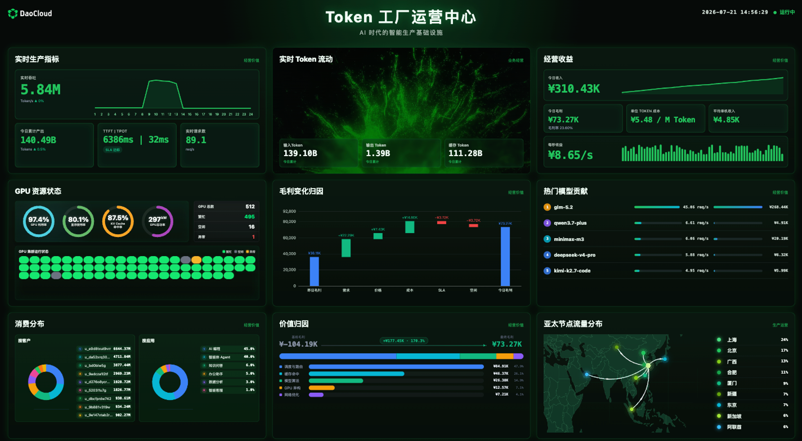

---
hide:
  - toc
---

# Token 工厂

Token 工厂是 DaoCloud 面向 AI 智算场景打造的一体化平台，围绕大模型推理、算力调度和集群运维提供端到端能力支撑。
平台采用 **用户** 与 **管理员** 双视图架构：用户视图面向终端用户，提供大模型服务调用、费用管理和智能应用接入能力；管理员视图面向运维管理团队，提供模型托管、推理引擎、基础设施和全局运营的统一管控。

  

    
云原生 AI

    

      <a class="tf-arch-card tf-arch-card--model" href="../clawos/intro/">
        ClawOS
      </a>
      <a class="tf-arch-card tf-arch-card--model" href="../dak/">
        AI 应用
      </a>
      <a class="tf-arch-card tf-arch-card--model" href="../hydra/">
        大模型服务平台
      </a>
      <a class="tf-arch-card tf-arch-card--model" href="../inferx/">
        InferX 推理
      </a>
      

        redhare 分布式缓存
      

      <a class="tf-arch-card tf-arch-card--model" href="../zestu/">
        算力云
      </a>
    

  

  
▼

  

    
云原生底座

    

      <a class="tf-arch-card tf-arch-card--compute" href="../kpanda/intro/">
        容器管理
      </a>
      <a class="tf-arch-card tf-arch-card--compute" href="../kangaroo/intro/">
        镜像仓库
      </a>
      <a class="tf-arch-card tf-arch-card--compute" href="../topohub/intro/">
        设备管理
      </a>
      <a class="tf-arch-card tf-arch-card--compute" href="../network/intro/">
        云原生网络
      </a>
      <a class="tf-arch-card tf-arch-card--compute" href="../storage/">
        云原生存储
      </a>
    

  

  
▼

  

    
Copilot

    

      

        运营驾驶舱
      

      <a class="tf-arch-card tf-arch-card--ops" href="../leopard/">
        费用中心
      </a>
    

  

  
▼

  

    
运维管理

    

      <a class="tf-arch-card tf-arch-card--ops" href="../insight/intro/">
        可观测性
      </a>
      <a class="tf-arch-card tf-arch-card--ops" href="../ghippo/intro/">
        全局管理
      </a>
    

  

作为面向智算中心打造的高效能 AI Token 生产及经营系统，Token 工厂助力传统算力中心向高效、可盈利的 Token 生产运营模式升级。
平台统一纳管英伟达及国产异构算力，依靠智能调度与推理优化，把分散 GPU 算力转化为低成本、高稳定、可交易的标准化 Token 服务；
依托 Token 工厂管家与统一运营体系，完成资源、生产、成本、供需的全局管控，面向终端用户、管理员、运营者、运维者提供能力，
推动智算中心业务定位从 "提供算力" 升级为 "生产和运营 Token"。

## 驾驶舱大屏 - 运营中心

Token 工厂运营中心是 AI 时代的智能生产驾驶舱，将 Token 生产全链路转化为可量化、可追踪、可优化的实时数据视图，
让运营团队对平台的每一秒运转都了如指掌。驾驶舱以毫秒级数据刷新呈现平台实时运转状态。
