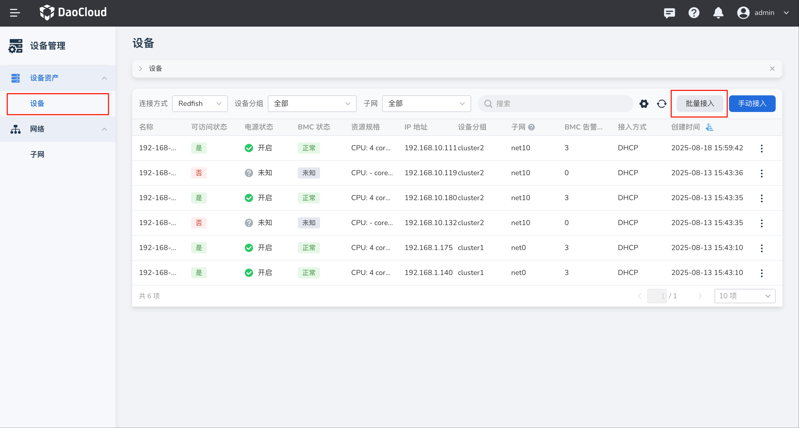
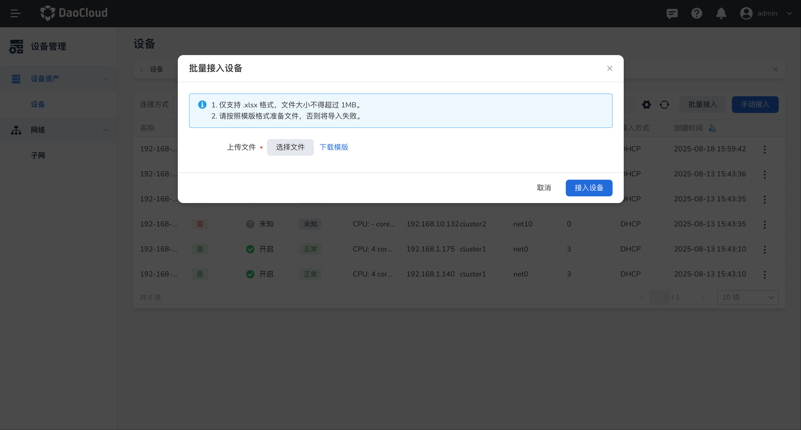

---
hide:
  - toc
---

# 批量接入设备

同一机房或机架设备初始上线时，需要一次性导入几十、上百台设备，逐台接入耗时耗力，
因此提供批量接入设备功能，方便用户快速完成设备导入，提升设备接入效率。

本文介绍如何通过 Excel 模板一次性导入多台设备。

## 前提条件（可选）

- 已按系统提供的模板准备好 Excel 文件。

## 操作步骤

1. 选择左侧导航栏的 **设备** ，进入设备管理列表页面，点击页面右上角的 **批量接入** 按钮。

    

2. 进入 **批量接入设备** 弹窗，点击 **下载模板** 获取 Excel 模板，并在本地按模板表头逐行填写设备信息。
   如果已提前按模板准备好 Excel 文件，请跳过这一步。

    

3. 点击 **选择文件** ，选择已准备好的 `.xlsx` 文件，确认选择无误后，点击 **接入设备**

    !!! note

        未完成全部设备接入前，请不要离开当前弹框页面，否则将导致设备接入中断，且无法查看接入结果。

4. 全部设备接入成功，自动返回设备列表，可以查看新增设备；如果有部份设备接入失败，
   可在弹框页面查看设备记录及失败原因，请根据反馈修改后重新上传。

下一步：[管理设备](./manage-device.md)
