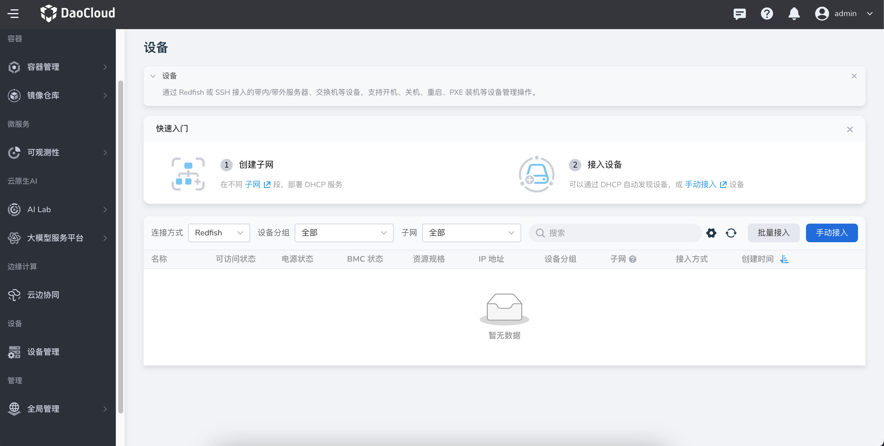
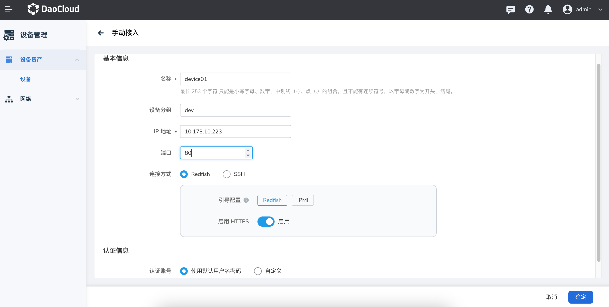

---
hide:
  - toc
---

# 手动接入设备

通过配置设备 IP 地址、账号认证信息，可以将服务器、交换机等设备手动接入到平台进行管理。

本文介绍单台设备接入流程，如果你想快速批量接入设备，请参考[批量接入设备](./batch-access.md)。

1. 在左侧导航栏，点击 **设备管理** ，进入设备管理列表页面，点击页面右上角的 **手动接入** 按钮。

    

1. 填写设备名称、IP 地址、端口、连接方式、用户名密码等配置信息。

    

    | 字段名称 | 是否必填 | 说明 |
    |----------|----------|------|
    | 名称 | 是 | 最长 253 个字符，只能由小写字母、数字、中划线（-）、点（.）组成；不能包含连续符号；必须以字母或数字开头和结尾。 |
    | 设备分组 | 否 | 可选项，可根据设备类型或其他条件将设备划分到特定分组中，方便后续管理。 |
    | IP 地址 | 是 | 设备的管理 IP 地址。 |
    | 端口 | 是 | 与设备建立连接所使用的端口号。 |
    | 连接方式 | 是 | 当前支持通过 Redfish 或 SSH 方式接入设备。若选择 Redfish，需要额外配置 PXE 引导和 HTTPS。 |
    | PXE 引导配置 | 条件必填 | 当连接方式为 Redfish 时需要配置。用于设备启动时通过网络加载操作系统镜像，可选择 Redfish 或 IPMI 协议。 |
    | 是否启用 HTTPS | 条件必填 | 当连接方式为 Redfish 时需要配置。用于指定是否通过 HTTPS 与设备通信。 |
    | 认证 - 使用默认用户名密码 | 可选 | 系统将自动使用部署 Topohub Helm 应用时配置的用户名与密码。 |
    | 认证 - 自定义 | 可选 | 手动输入用户名和密码信息。 |

1. 完成以上信息配置后，点击 **确定** 按钮，完成设备接入，自动返回设备列表。

下一步：[管理设备](./manage-device.md)
