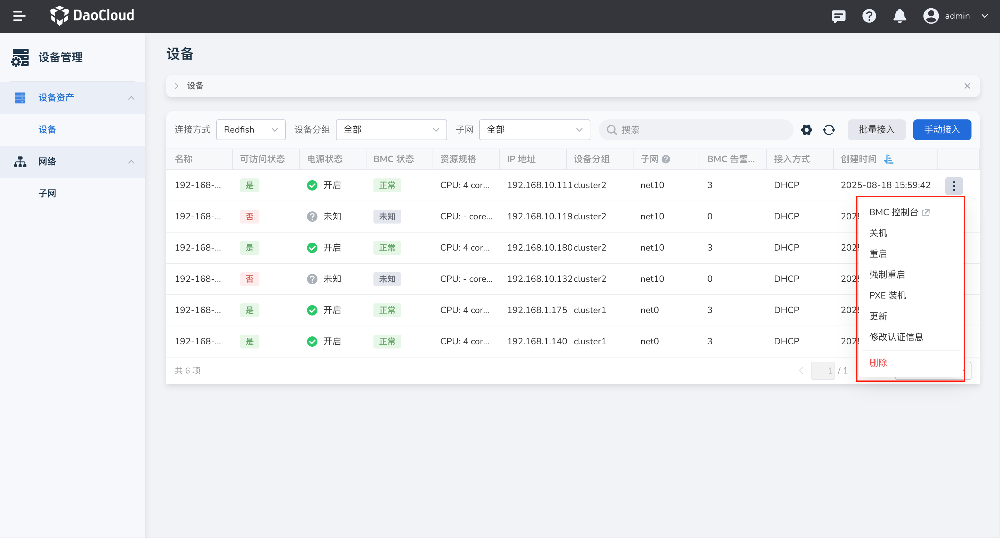

---
hide:
  - toc
---

# 管理设备

设备接入成功后，DCE 5.0 可以对设备进行开关机、重启、PXE 装机等操作。

## 前提条件

- 已完成设备接入，参见[手动接入设备](index.md)或[批量接入设备](./batch-access.md)。
- 账号具备设备查看与操作权限。

## 设备操作

操作步骤如下：

1. 在左侧导航栏，点击 **设备管理** -> **设备** ，进入设备列表页面，找到目标设备，点击右侧 __┇__ 展开操作菜单。

    

2. 根据需要选择对应功能：

    - BMC 控制台：跳转至设备厂商的 BMC Web 控制台页面。
    - 开机/关机/重启：执行正常开机、关机、重启流程。
    - 强制重启：立即断电再上电，可能导致未保存数据丢失，建议在设备无响应时操作。
    - PXE 装机：进入装机流程，请确保已正确配置 PXE 引导与镜像源。
    - 更新：支持对设备管理 IP 、端口、设备分组等配置进行修改。
    - 修改认证信息：更新用于连接设备或 BMC 的认证账号与密码。
    - 删除：将设备从平台移除。删除后设备不再受管，相关历史记录可能不可恢复。

        !!! note

            若设备通过 DHCP 自动接入，删除操作仅临时移除配置，设备可能因 DHCP 自动发现再次出现在列表中。若要永久移除，建议：

            1. 在 BMC 管理器中取消 DHCP 服务端地址分配
            2. 联系管理员关闭 DHCP 服务，手动方式接入设备
