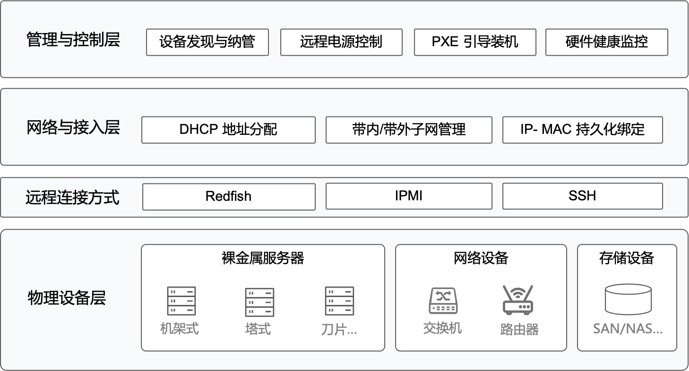

---
hide:
  - toc
---

# 什么是设备管理

设备管理模块是面向智算中心打造的 Kubernetes 云原生基础设施管理组件，能够统一管理主机、交换机等硬件资源。它内置多实例 DHCP 服务，支持自动分配并固定 IP 与 MAC 地址，覆盖主机带内与带外网络，简化 BMC 管理与操作系统部署。通过 PXE 引导实现自动化装机，并提供 WebUI 管理界面，集中管理 IOS、TFTP、ZTP 及相关配置文件。设备管理模块帮助智算中心实现网络、主机与文件服务的一体化管理，全面提升运维效率与自动化水平。

**功能特性**

- 设备发现与纳管

    - 自动识别新接入的服务器、交换机等物理设备
    - DHCP 自动分配带外和带内网络地址
    - 支持批量设备快速纳管，分钟级完成设备上线

- 全生命周期管理

    - 远程电源控制：一键开关机、重启、强制关机
    - PXE 引导装机：自动化操作系统部署
    - 硬件健康监控：实时监测可访问状态、电源等关键指标

- 多子网 DHCP 服务

    - 在不同 VLAN 或子网内启动独立 DHCP Server 实例
    - 支持自动或手动绑定 IP 与 MAC，保证 IP 分配的稳定性
    - 通过 VLAN 实现多租户网络安全隔离

- 统一管理运维

    - 按集群/业务分组管理设备，便利设备运维
    - 采集各项指标、日志及事件数据，快速定位问题
    - 随业务增长动态扩展设备管理能力

**产品逻辑架构**

