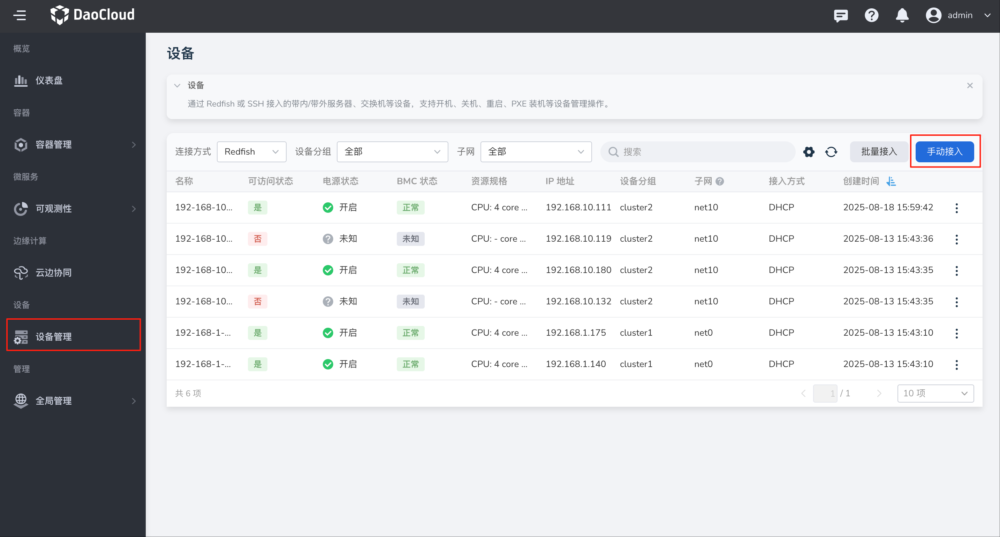

# 手动接入设备

通过配置设备 IP 地址、账号认证信息，可以将服务器、交换机等设备手动接入到平台进行管理。

本文介绍单台设备接入流程，如果你想快速批量接入设备，请参考 [批量接入设备](./batch-access.md)。

1. 选择左侧导航栏的 **设备管理** ，进入设备管理列表页面，点击页面右上角的 **手动接入** 按钮。

    

1. 填写设备名称、IP 地址、端口、连接方式、用户名密码等配置信息。

    - 名称：2 - 63 个字符，必须由小写字母、数字字符或“-”组成，并且必须以字母开头及字母或数字字符结尾
    - 设备分组：可选项，可以根据设备类型或其他条件将设备划分到特定的分组中，方便后续管理。
    - IP 地址：设备的管理 IP 地址
    - 端口：与设备建立连接所使用的端口号。
    - 连接方式：当前支持通过 Redfish 或 SSH 连接方式接入设备。如果通过 Redfish 连接设备，请同时设置 PXE 引导配置和是否使用 HTTPS。
        - PXE 引导配置：用于在设备启动时通过网络加载操作系统镜像，请根据实际环境选择 Redfish 或 IPMI 协议。 
        - 是否启用 HTTPS：是否启用 HTTPS 方式进行设备通讯。
    - 认证账号：
        - 使用默认用户名密码：系统将自动使用部署 topohub helm 应用时配置的用户名与密码。
        - 自定义：手动输入用户名密码信息。

    

1. 完成以上信息配置后，点击 **确定** 按钮，完成设备接入，自动返回设备列表。

下一步：[管理设备](./manage-device.md)