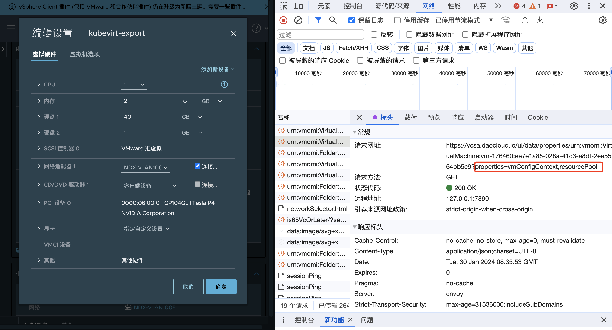
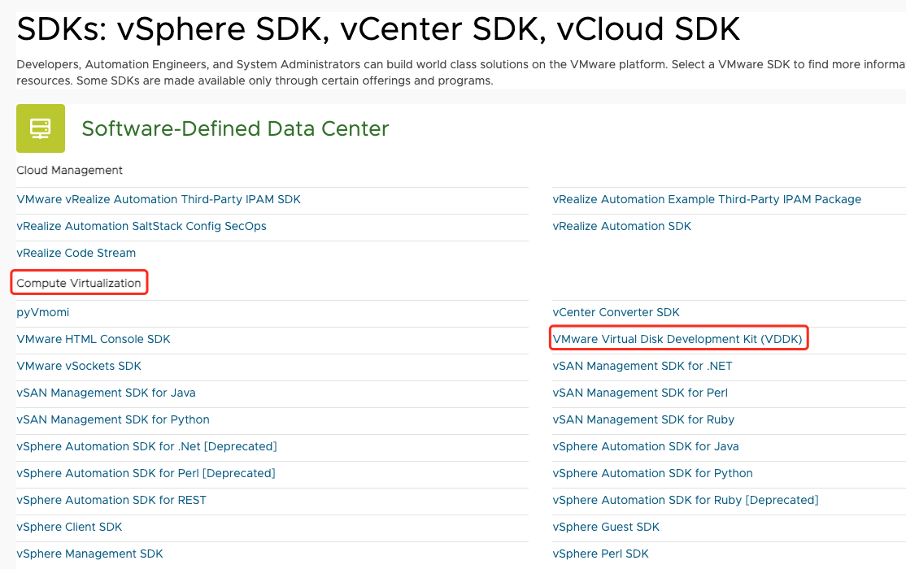
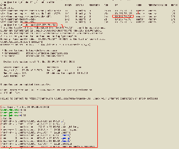

# 如何从 VMWare 导入传统虚拟机到云原生虚拟机平台

本文将详细介绍如何通过命令行将外部平台 VMware 上的虚拟机导入到 DCE 5.0 的虚拟机中。

!!! info

    本文档外部虚拟平台是 VMware vSphere Client，后续简写为 vSphere。
    技术上是依靠 kubevirt cdi 来实现的。操作前，vSphere 上被导入的虚拟机需要关机。
    以 Ubuntu 操作系统的虚拟机为例。

## 获取 vSphere 的虚拟机基础信息

- vSphere URL：目标平台的 URL 地址信息

- vSphere SSL 证书指纹 thumbprint：需要通过 openssl 获取

    ```sh
    openssl s_client -connect 10.64.56.11:443 </dev/null | openssl x509 -in /dev/stdin -fingerprint -sha1 -noout
    ```
    
    输出类似于：
   
    ```output
    Can't use SSL_get_servername
    depth=0 CN = vcsa.daocloud.io
    verify error:num=20:unable to get local issuer certificate
    verify return:1
    depth=0 CN = vcsa.daocloud.io
    verify error:num=21:unable to verify the first certificate
    verify return:1
    depth=0 CN = vcsa.daocloud.io
    verify return:1
    DONE
    sha1 Fingerprint=C3:9D:D7:55:6A:43:11:2B:DE:BA:27:EA:3B:C2:13:AF:E4:12:62:4D  # 所需值
    ```

- vSphere 账号：获取 vSphere 的账号信息，注意权限问题

- vSphere 密码：获取 vSphere 的密码信息

- 需要导入虚拟机的 UUID（需要在 vSphere 的 web 页面获取）

    - 进入 Vsphere 页面中，进入被导入虚拟机的详情页面，点击 __编辑配置__ ，此时打开浏览器的开发者控制台，
      点击 __网络__ —> __标头__ 找到如下图所示的 URL。

        

    - 点击 __响应__ ，定位到 __vmConfigContext__ —> __config__ ，最终找到目标值 __uuid__ 。

        

- 需要导入虚拟机的 vmdk 文件 path

## 获取 vSphere 的虚拟机基础信息

1. 准备 vddk 镜像

    - 下载 vddk：需要在 [vmware 网站](https://developer.vmware.com/)注册账号后下载

        前往 SDKs，点击 __Compute Virtualization__ ，选择并下载合适版本的
        __VMware Virtual Disk Development Kit (VDDK)__ 。

        

        

        

    -  解压并构建成镜像：

        - 解压

            ```sh
            tar -xzf VMware-vix-disklib-<version>.x86_64.tar.gz
            ```

        - 创建 Dockerfile 文件

            ```sh
            FROM busybox:latest
            COPY vmware-vix-disklib-distrib /vmware-vix-disklib-distrib
            RUN mkdir -p /opt
            ENTRYPOINT ["cp", "-r", "/vmware-vix-disklib-distrib", "/opt"]
            EOF
            ```

        - 推送镜像至仓库

## 网络配置

需要根据网络模式的不同配置不同的信息，若有固定 IP 的需求，需要选择 Bridge 网络模式

-  创建 ovs 类型的 Multus CR，可参考[创建 Multus CR](https://spidernet-io.github.io/spiderpool/v0.9/usage/install/underlay/get-started-ovs-zh_CN/)
-  创建子网及 IP 池，参考[创建子网和 IP 池](../../network/config/ippool/createpool.md)

    ```yaml
    apiVersion: spiderpool.spidernet.io/v2beta1
    kind: SpiderIPPool
    metadata:
      name: test2
    spec:
      ips:
      - 10.20.3.90
      subnet: 10.20.0.0/16
      gateway: 10.20.0.1
    
    ---
    apiVersion: spiderpool.spidernet.io/v2beta1
    kind: SpiderIPPool
    metadata:
      name: test3
    spec:
      ips:
      - 10.20.240.1
      subnet: 10.20.0.0/16
      gateway: 10.20.0.1
    
    ---
    apiVersion: spiderpool.spidernet.io/v2beta1
    kind: SpiderMultusConfig
    metadata:
      name: test1
      namespace: kube-system
    spec:
      cniType: ovs
      coordinator:
        detectGateway: false
        detectIPConflict: false
        mode: auto
        tunePodRoutes: true
      disableIPAM: false
      enableCoordinator: true
      ovs:
        bridge: br-1
        ippools:
        ipv4:
        - test1
        - test2
    ```

## 获取 vSphere 的账号密码 secret

```yaml
apiVersion: v1
kind: Secret
metadata:
  name: vsphere   # 可更改
  labels:
    app: containerized-data-importer  # 请勿更改
    type: Opaque
    data:
      accessKeyId: "username-base64"
      secretKey: "password-base64"
```

## 配置 kubevirt cdi configmap（vddk）

1. 在将 vSphere 虚拟机导入 KubeVirt 的 CDI 过程中，需要使用 vddk 组件。
   
2. 请确保 configmap 的命名空间与 CDI 所在的命名空间保持一致
    （Virtnest Agent 的默认命名空间是 virtnest-system，示例中为 cdi）。

    ```yaml
    apiVersion: v1
    kind: ConfigMap
    metadata:
      name: v2v-vmware
      namespace: cdi
      data:
        vddk-init-image: release-ci.daocloud.io/virtnest/vddk:v1
    ```

## 编写 kubevirt vm yaml 创建 vm

!!! tip

    若有固定IP需求，则该 yaml 与使用默认网络的 yaml 有一些区别，已标注。

```yaml
apiVersion: kubevirt.io/v1
kind: VirtualMachine
metadata:
  annotations:
    kubevirt.io/latest-observed-api-version: v1
    kubevirt.io/storage-observed-api-version: v1
    virtnest.io/alias-name: ""
    virtnest.io/image-secret: ""
  creationTimestamp: "2024-05-23T06:46:28Z"
  finalizers:
  - kubevirt.io/virtualMachineControllerFinalize
  generation: 1
  labels:
    virtnest.io/os-family: Ubuntu
    virtnest.io/os-version: "22.04"
  name: export-ubuntu
  namespace: default
spec:
  dataVolumeTemplates:
  - metadata:
      creationTimestamp: null
      name: export-ubuntu-rootdisk
      namespace: default
    spec:
      pvc:
        accessModes:
        - ReadWriteOnce
        resources:
          requests:
            storage: 10Gi
        storageClassName: local-path
      source:
        vddk:
          backingFile: "[A05-09-ShangPu-Local-DataStore] virtnest-export-ubuntu/virtnest-export-ubuntu.vmdk"  
          url: "https://10.64.56.21"                                                       
          uuid: "421d6135-4edb-df80-ee54-8c5b10cc4e78"                                     
          thumbprint: "D7:C4:22:E3:6F:69:DA:72:50:81:12:FA:42:18:3F:29:5C:7F:41:CA"            
          secretRef: "vsphere"
  runStrategy: Manual
  template:
    metadata:
      annotations:
        ipam.spidernet.io/ippools: '[{"cleangateway":false,"ipv4":["test2"]}]'  // 这里添加 spiderpool 网络
      creationTimestamp: null
    spec:
      architecture: amd64
      domain:
        devices:
          disks:
          - bootOrder: 1
            disk:
              bus: virtio
            name: rootdisk
          interfaces:                                                          // 修改这里的网络配置
          - bridge: {}
            name: ovs-bridge0
        machine:
          type: q35
        resources:
          requests:
            memory: 4Gi
      networks:                                                                // 修改这里的网络配置
      - multus:
          default: true
          networkName: kube-system/test1
        name: ovs-bridge0
      volumes:
      - dataVolume:
          name: export-ubuntu-rootdisk
        name: rootdisk
```

## 进入 VNC 检查是否成功运行

1. 修改虚拟机的网络配置

1. 查看当前网络

    在实际导入完成时，如下图所示的配置已经完成。然而，需要注意的是，enp1s0接口并没有包含inet字段，因此无法连接到外部网络。
    
    

1. 配置 netplan

    在上图所示的配置中，将 ethernets 中的对象更改为 enp1s0，并使用 DHCP 获得 IP 地址。
        
    

1. 将 netplan 配置应用到系统网络配置中

    ```sh
    sudo netplan apply
    ```

1. 对外部网络进行 ping 测试

    

1. 通过 SSH 在节点上访问虚拟机。

    
