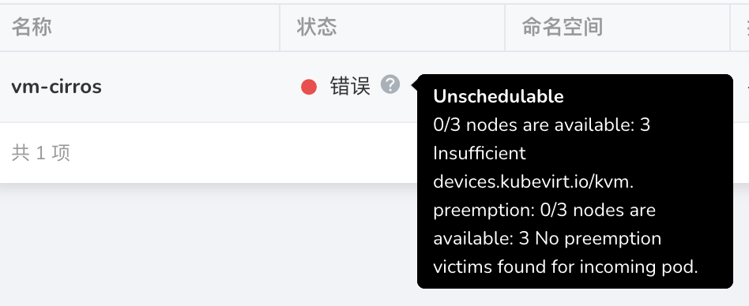
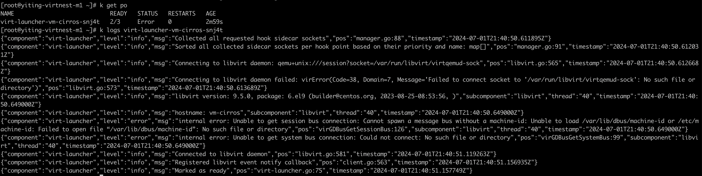

# VM 无法正常使用

若创建的 VM 无法正常使用，原因多样。以下是排查方向：

## VM 创建失败

VM 创建失败时，应在目标集群中查看 VM 的详细信息：

```shell
kubectl -n your-namespace describe vm your-vm
```

如果详细信息涉及存储，如 PVC、PV、SC 等，请检查 SC 状态。
问题未解决时，应[咨询开发人员](../../install/index.md#_4)。

如果详细信息涉及设备，如 KVM、GPU 等，请核实目标集群节点是否完成了[依赖条件](../install/install-dependency.md)检查。
若所有依赖已安装，应[咨询开发人员](../../install/index.md#_4)。

### 案例 1

- 现象：在资源充足的情况下还是报错：

    

- 解决办法：[给节点启用硬件虚拟化](../install/install-dependency.md#_3)

### 案例 2



解决办法：[升级节点操作系统内核](../install/install-dependency.md)

## VM 创建成功但无法使用

若 VM 创建成功但无法使用，应在 DCE 页面检查 VM 的 VNC 页面是否正常。
若显示但仅限启动信息，请检查[依赖条件](../install/install-dependency.md)。
若依赖条件齐全，应[咨询开发人员](../../install/index.md#_4)。

若 VNC 页面显示异常，应使用以下命令查看 VM 详细信息：

```shell
kubectl -n your-namespace describe vm your-vm
```

当详细信息涉及存储信息，如 PVC、PV、SC 等，应检查 SC 状态。
问题未解决时，应[咨询开发人员](../../install/index.md#_4)。

## VNC 可以启动但网络无法访问

按照下面流程进行排查，将相关信息记录下来，反馈给[开发人员](../../install/index.md#_4)。
在 VM 所在集群中执行以下操作：

1. 获取 VM 的 Pod IP

    ```bash
    kubectl -n your-namespace get vmi your-vm -o wide
    ```

2. 在节点上执行 ssh 登录你的 VM

    ```bash
    ssh your-vm-username@xx.xx.xx.xx
    ```

    如果无法访问，请[咨询开发人员](../../install/index.md#_4)。

3. 检查 VM 使用的网络模式

    如果是默认网络模式（masquerade），[咨询开发人员](../../install/index.md#_4)。

    如果是 bridge + ovs，需要确认以下信息。

    - 检查 Spiderpool 是否安装成功，并且确保安装在 `kube-system` 命名空间下。
    - ovs 安装成功，并且 ovs bridge 配置成功。

    若以上信息确认无误，请[咨询开发人员](../../install/index.md#_4)。
