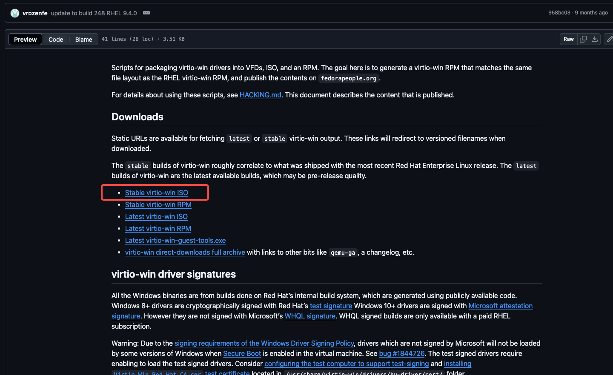
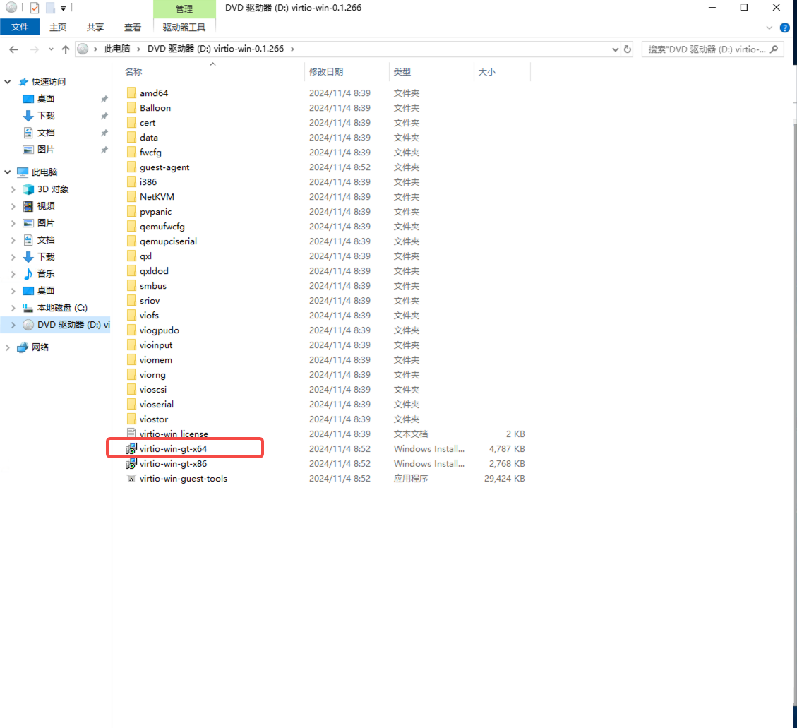
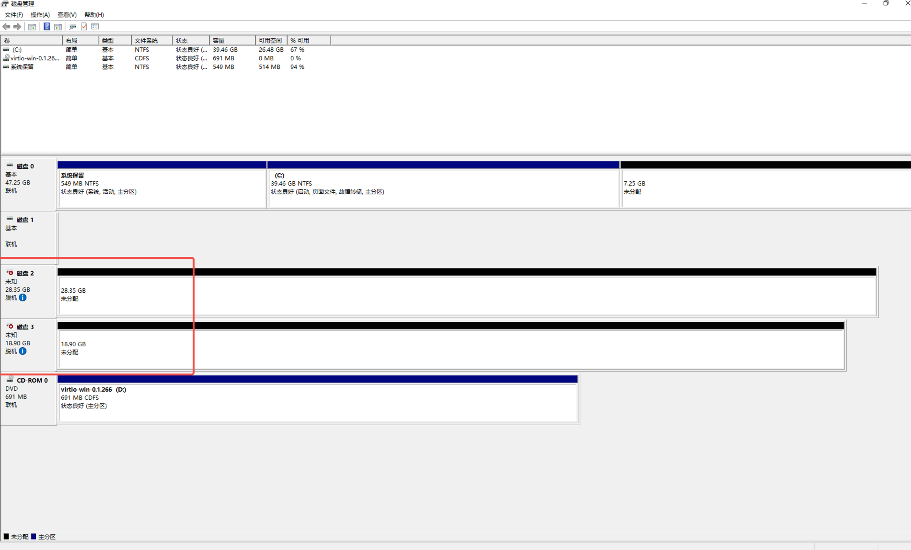

# Windows 虚拟机新增磁盘无法识别问题

通过 KubeVirt 在新安装的 Windows Server 上添加新磁盘时识别不到，需要按照如下步骤安装 virtio 驱动：

1. 下载 stable virtio-win iso

    下载地址为：
    https://github.com/virtio-win/virtio-win-pkg-scripts/blob/master/README.md

    

1. 安装 virtio-win iso

    挂载iso镜像后, 点击virtio-win-gt-x64 进行安装, 安装完成后, 即可看到添加的磁盘

    

1. 添加磁盘后的效果

    
