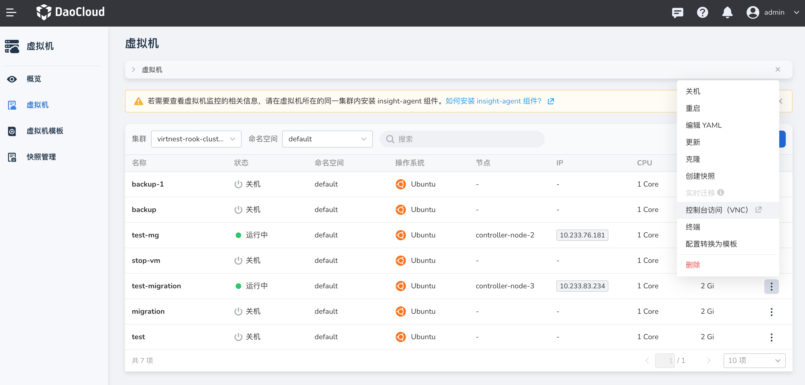
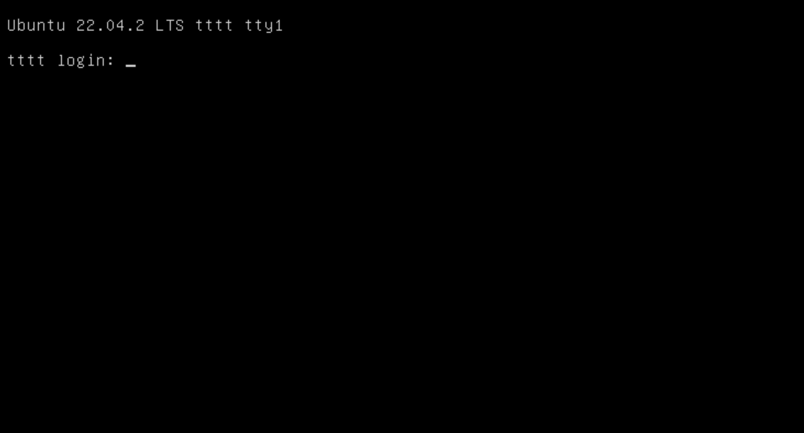

---
hide:
  - toc
---

# 连接虚拟机

本文将介绍两种连接虚拟机的方式，分别为 控制台访问（VNC）和终端方式。

## 终端

通过 终端 访问虚拟机的方式更加灵活和轻量，但是无法直接展示图形界面，交互性较差，且无法多终端同时在线。

1. 点击左侧导航栏上的`容器管理`，然后点击`虚拟机`，进入列表页面，点击列表右侧的 `︙`，支持通过终端方式访问虚拟机。

    

## 控制台访问（VNC）

通过 VNC 访问虚拟机的方式可以实现对远程计算机的完整图形界面的访问和控制，能够直观地操作远程设备，交互性更加好，但是性能会受到一定影响，且无法多终端同时在线。

> Windows 系统选择 VNC。

1. 点击左侧导航栏上的`容器管理`，然后点击`虚拟机`，进入列表页面，点击列表右侧的 `︙`，支持通过控制台访问（VNC）的方式访问虚拟机。

    

