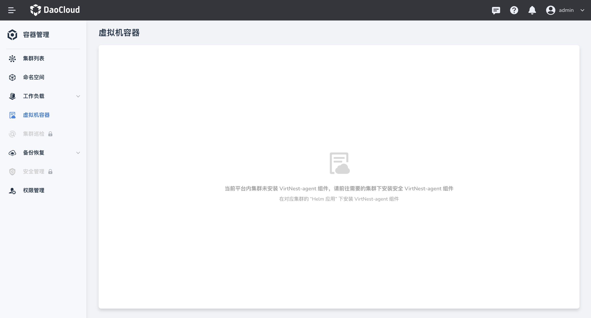
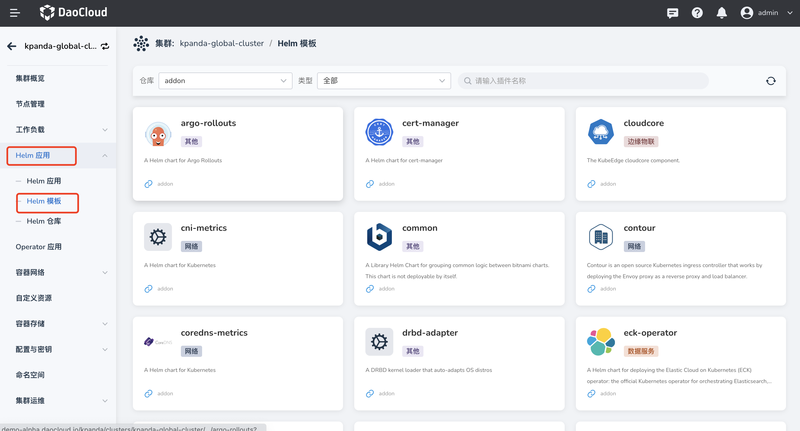
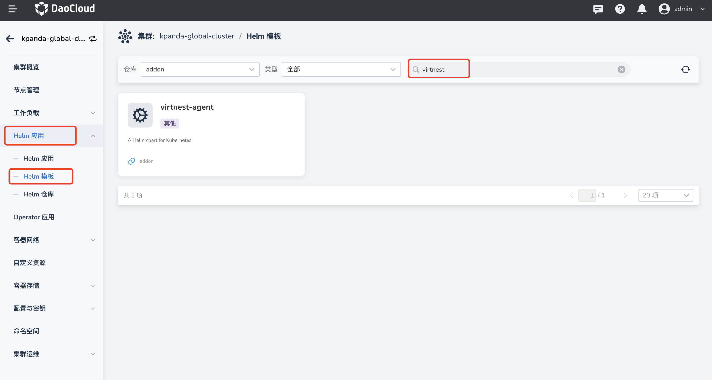
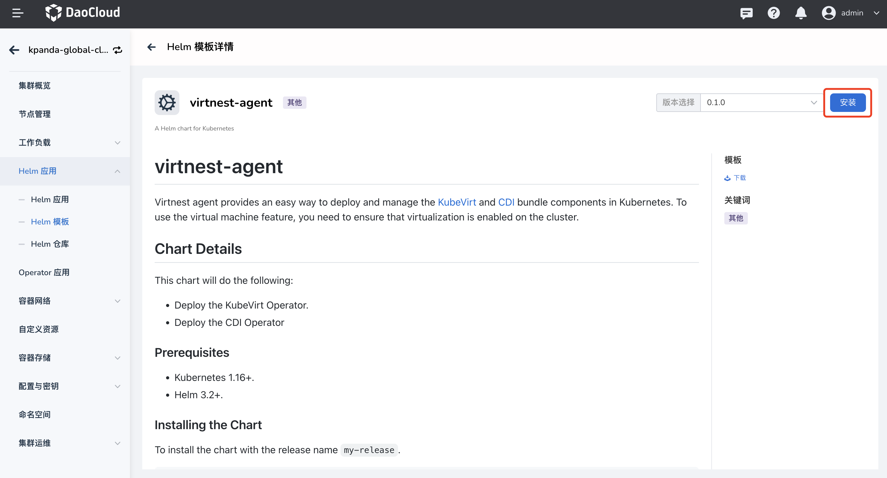
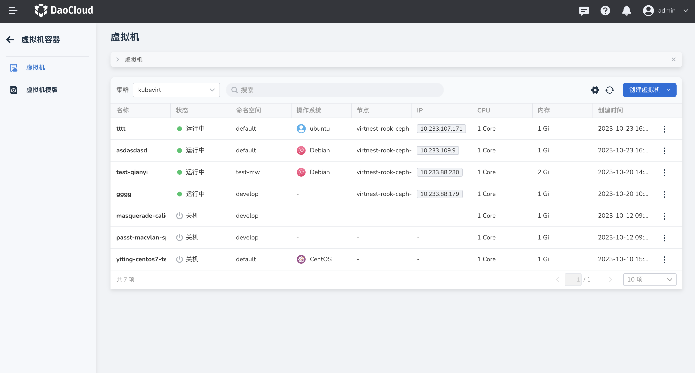

# 在集群内安装 virtnest-agent

本文将介绍如何在指定集群内安装 virtnest-agent。

初始集群需要在 helm 中安装 virtnest-agent 组件后方可使用虚拟机容器的相关能力。

1. 点击左侧导航栏上的`容器管理`，然后点击`虚拟机容器`，若未安装 virtnest-agent 组件，则无法正常使用虚拟机容器能力。将提醒用户在所需集群内进行安装。

    

2. 选择所需集群，点击左侧导航栏的 `Helm 应用`，然后点击 `Helm 模板`，查看模板列表。

    

3. 搜索 `virtnest-agent` 组件，进入组件详情，选择合适版本，点击`安装`按钮，进行安装。

    

    

4. 进入安装表单页面，填写基本信息后，点击`确定`，安装完成。

    

5. 重新点击`虚拟机容器`导航栏，成功出现虚拟机列表，可以正常使用虚拟机容器能力。

    
