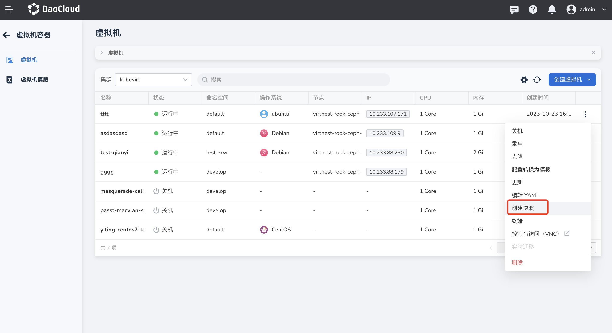
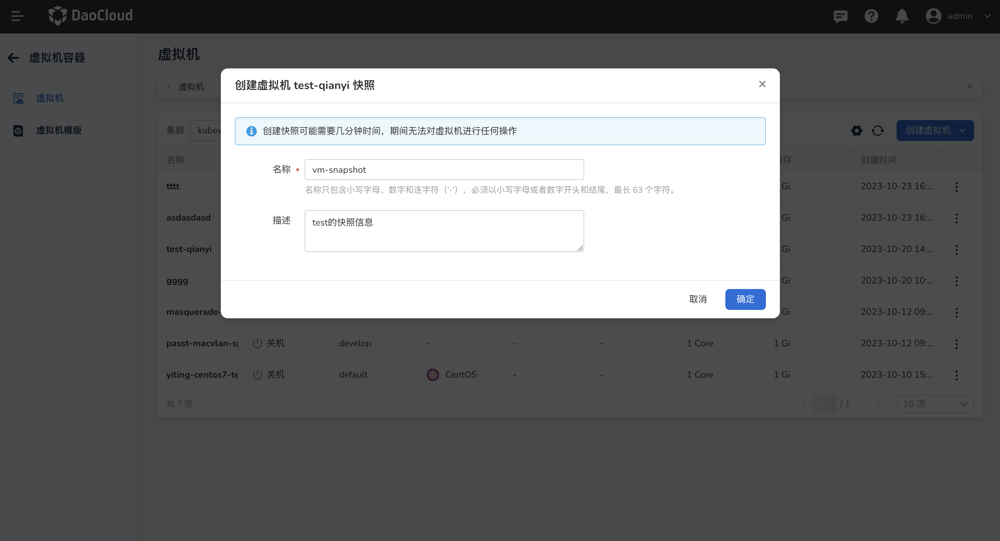
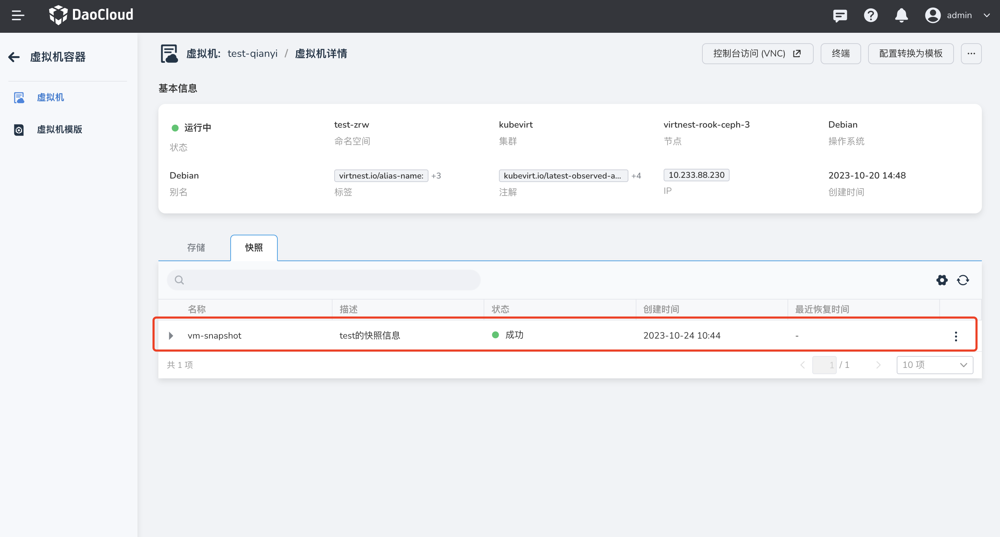
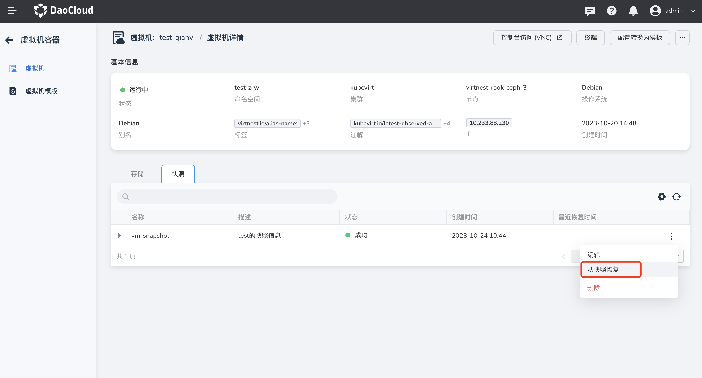
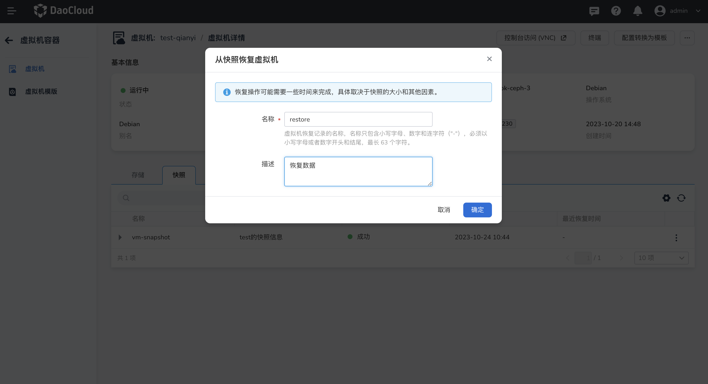

# 快照管理

本文将介绍如何为虚拟机创建快照，并从快照中恢复的。

用户可以为虚拟机创建快照，保存虚拟机当下的状态，一个快照可以支持多次恢复，每次恢复时，虚拟机将被还原到快照创建时的状态。通常可以用于备份、恢复、回滚等场景。

## 创建快照

1. 点击左侧导航栏上的`容器管理`，然后点击`虚拟机`，进入列表页面，点击列表右侧的 `︙`，可以对非错误状态下的虚拟机执行快照操作。

    

2. 弹出弹框，需要填写快照的名称和描述，创建快照大概需要几分钟的时间，在此期间无法对虚拟机做任何操作。

    

3. 创建成功后可以在虚拟机详情内查看快照信息，支持编辑描述、从快照中恢复、删除等操作。

    

## 从快照中恢复

1. 点击`从快照中恢复`，需要填写虚拟机恢复记录的名称，同时恢复操作可能需要一些时间来完成，具体取决于快照的大小和其他因素。恢复成功后，虚拟机将回到快照创建时的状态。

    

2. 一段时间后，下拉快照信息，可以查看当前快照的所有恢复记录，并且支持展示定位恢复的位置。

    