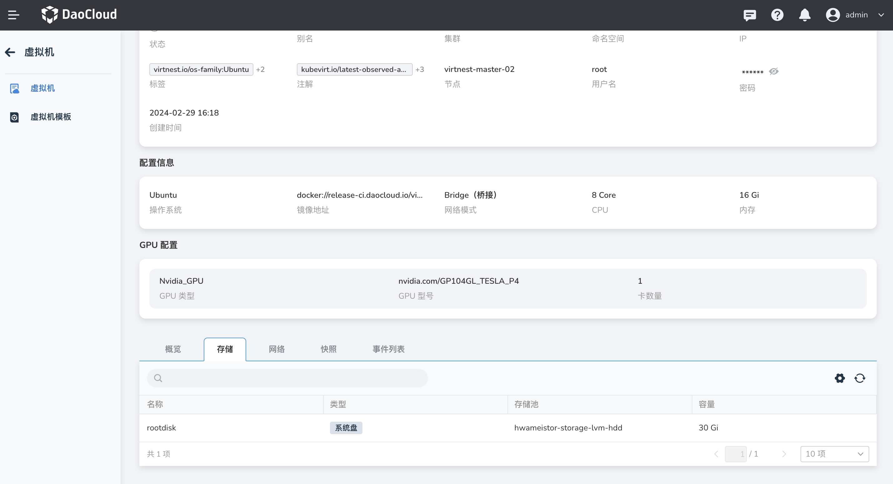
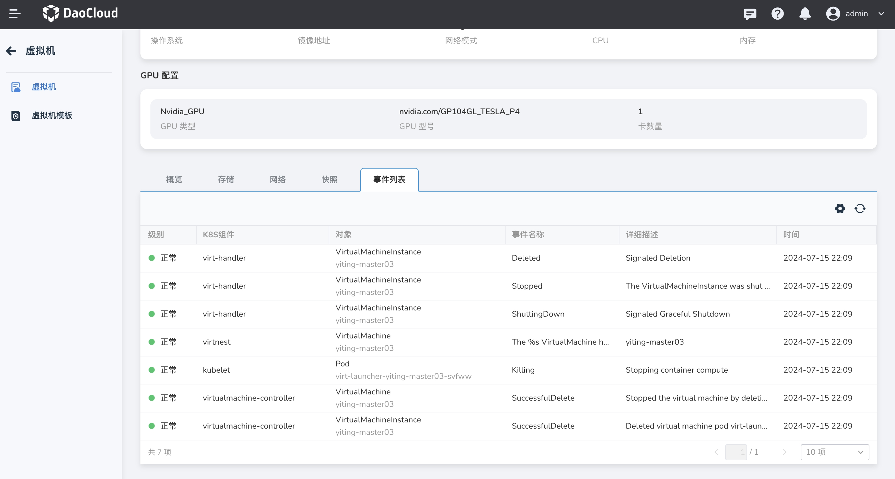

# 虚拟机详情

虚拟机详情包括基本信息、配置信息、GPU 信息、概览、存储、网络、快照、事件等。

点击左侧导航栏上的 __容器管理__ ，然后点击 __集群列表__ ，进入虚拟机所在集群详情，点击 __虚拟机名称__ 查看虚拟机详情。

### 基本信息

- 状态：虚拟机当前的运行状态。
- 别名：虚拟机的别名。
- 集群：虚拟机所在的集群。
- 命名空间：虚拟机所在的命名空间。
- IP 地址：虚拟机的 IP 地址。对于添加多张网卡的虚拟机，会为其分配多个 IP 地址。
- 标签&注解：设置虚拟机的标签和注解。
- 节点：运行虚拟机的节点。
- 用户名/密码：登陆虚拟机的用户名/密码。
- 创建时间：虚拟机的创建时间。

### 配置信息

- 操作系统：安装在虚拟机上用于执行程序的操作系统。
- 镜像地址：是指向一个虚拟硬盘文件或操作系统安装介质的链接，这个地址用于在虚拟机软件中加载和安装操作系统。
- 网络模式：虚拟机配置的网络模式。
- CPU、内存：为虚拟机分配的资源。

### GPU 配置

- GPU 类型：虚拟机所配置的 GPU 的类型。
- GPU 型号：虚拟机所配置的 GPU 的型号。
- 卡数量：虚拟机配置的GPU 卡的数量。

### 概览

虚拟机概览页可查看虚拟机的监控内容。请注意，若未安装 Insight-agent 组件，则无法获取监控信息。

### 存储

展示虚拟机所用的存储，包括系统盘和数据盘的信息。

### 网络

展示虚拟机的网络配置，包括 Multus CR、网卡名称、IP 地址等信息。

### 快照

展示虚拟机的快照信息，支持通过快照恢复虚拟机。

### 事件列表

事件列表包含虚拟机的生命周期中发生的各种状态变化、操作记录和系统消息等。

