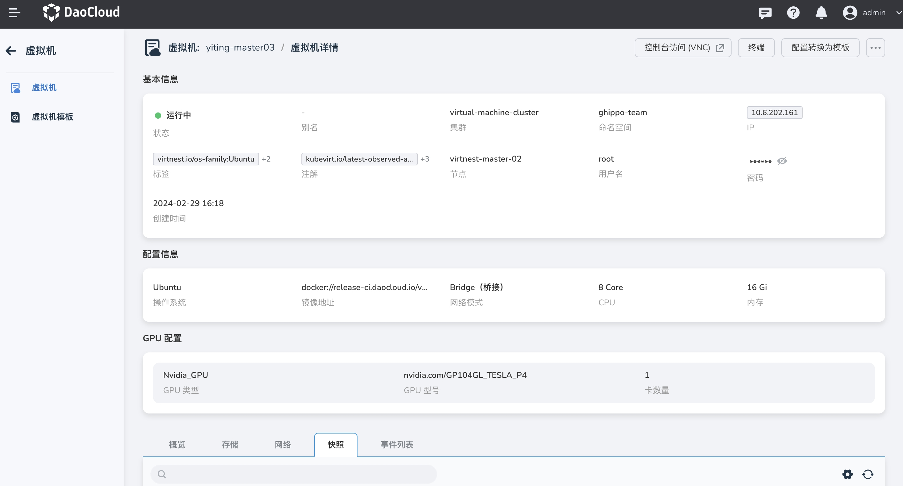
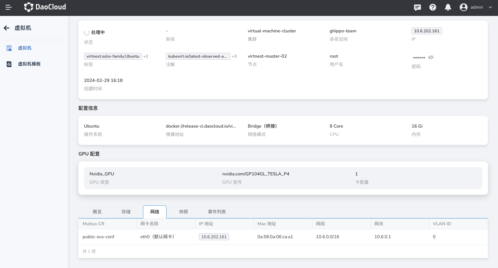
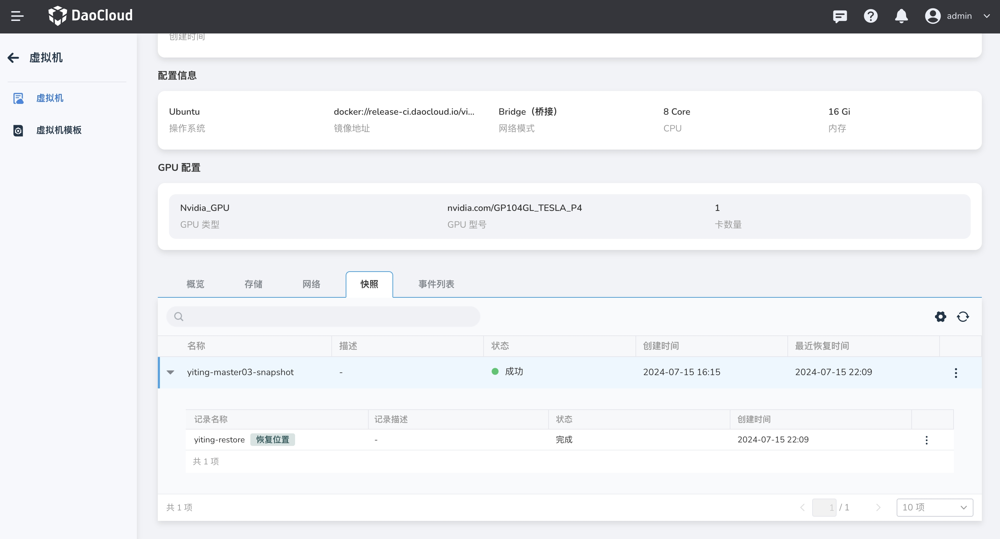

# 虚拟机详情

成功[创建虚拟机](../quickstart/index.md)后，可进入虚拟机详情页面，支持查看基本信息、配置信息、GPU 信息、概览、存储、网络、快照、事件等。

点击左侧导航栏上的 __容器管理__ ，然后点击 __集群列表__ ，进入虚拟机所在集群详情，点击虚拟机名称查看虚拟机详情。

### 基本信息

虚拟机基本信息包含状态、别名、集群、命名空间、IP、标签、节点、用户名、密码、创建时间等。其中，

- 状态：虚拟机当前的运行状态（运行中/处理中/关机/错误）。
- IP ：虚拟机的 IP 地址。对于添加多张网卡的虚拟机，会为其分配多个 IP 地址。

### 配置信息 & GPU 配置

虚拟机配置信息包括：

- 操作系统：安装在虚拟机上用于执行程序的操作系统。
- 镜像地址：向一个虚拟硬盘文件或操作系统安装介质的链接，这个地址用于在虚拟机软件中加载和安装操作系统。
- 网络模式：虚拟机配置的网络模式，Bridge（桥接）或 Masquerade（NAT）。
- CPU、内存：为虚拟机分配的资源。

GPU 配置信息包含 GPU 类型、GPU 型号以及卡数量。

### 其他信息

=== "概览"

    虚拟机概览页可查看虚拟机的监控内容。请注意，若未安装 insight-agent 组件，则无法获取监控信息。

    

=== "储存"    

    展示虚拟机所用的存储，包括系统盘和数据盘的信息。

    

=== "网络" 

    展示虚拟机的网络配置，包括 Multus CR、网卡名称、IP 地址等信息。

    

=== "快照" 
        
    若已经[创建快照](../vm/snapshot.md)，本页将展示虚拟机的快照信息，支持通过快照恢复虚拟机。

    

=== "事件列表" 

    事件列表包含虚拟机的生命周期中发生的各种状态变化、操作记录和系统消息等。

    
