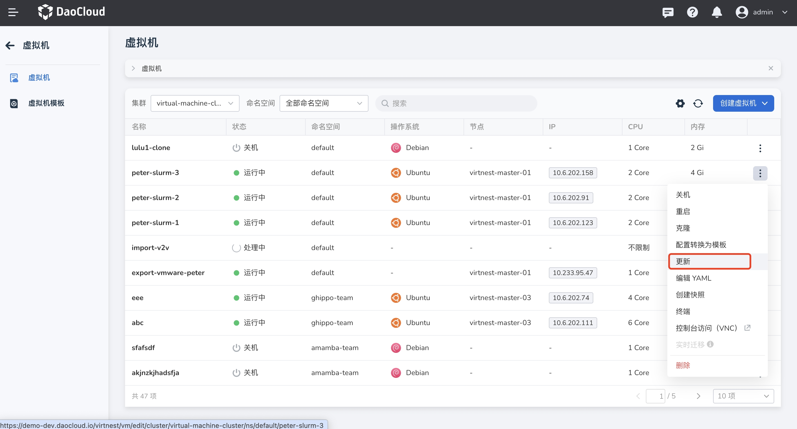
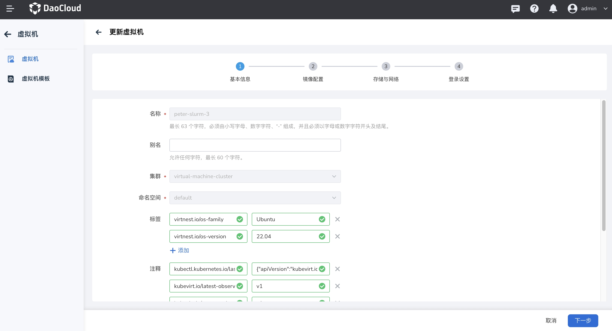
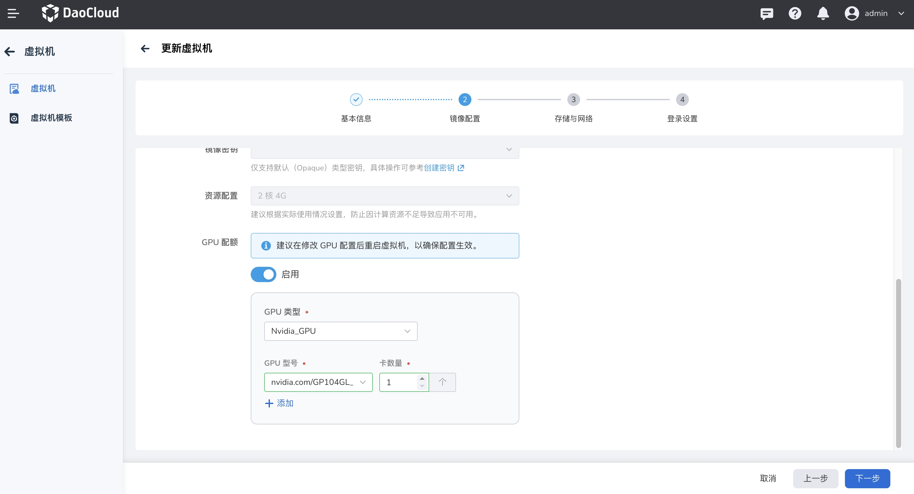
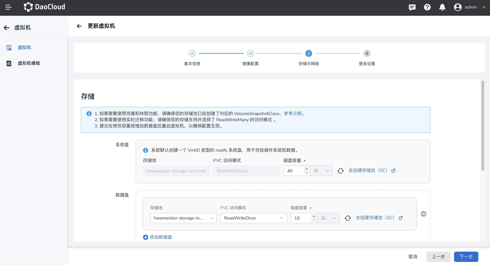
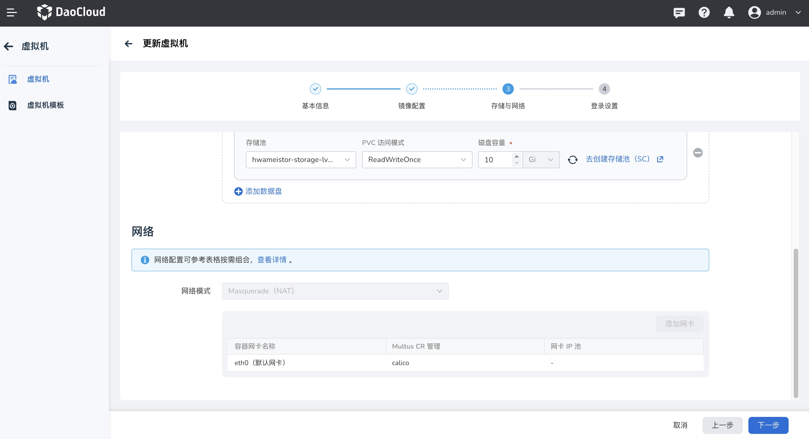
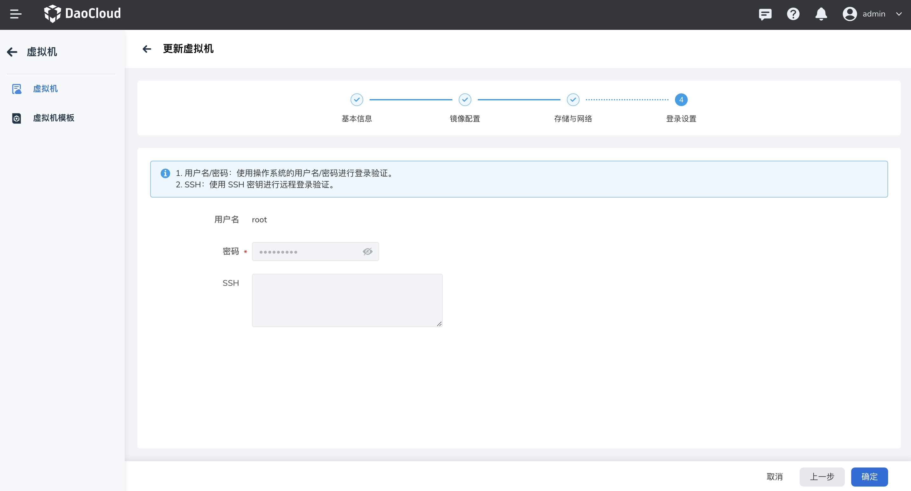
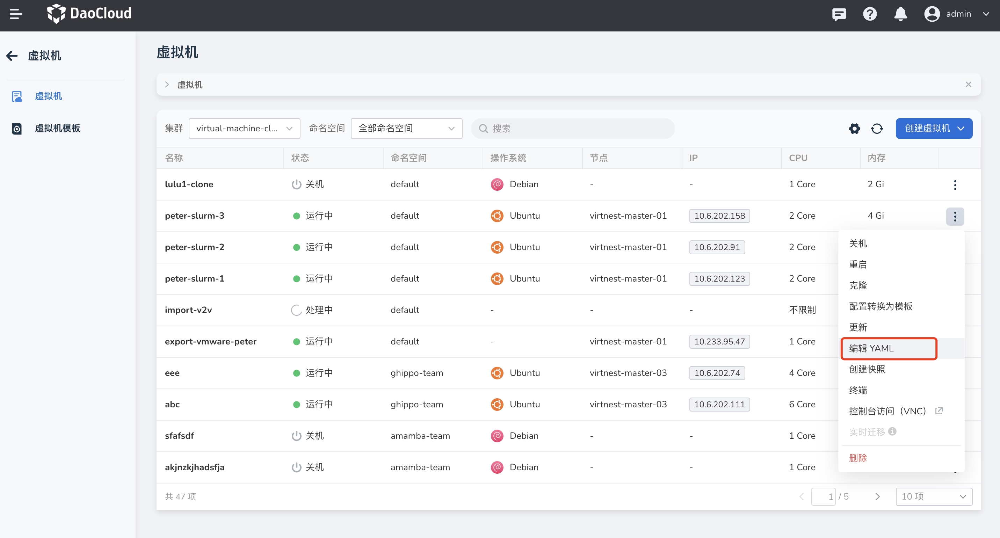
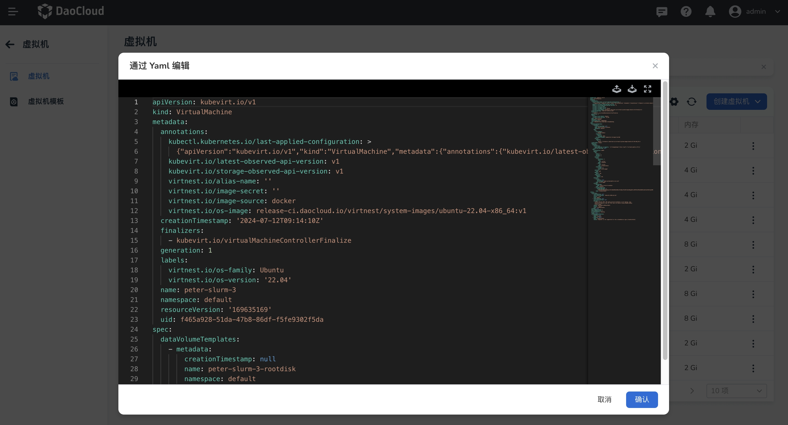

# 更新虚拟机

本文将介绍如何通过表单和 YAML 文件两种方式更新虚拟机。

## 表单更新虚拟机

1. 在虚拟机列表页面，点击 __更新__ 进入虚拟机更新页面。

### 基本信息

基本信息页面中， __别名__ 与 __标签注解__ 支持更新，其他信息无法更改。完成更新后点击 __下一步__ 进入镜像配置的界面。

### 镜像配置

在镜像配置页面中，镜像来源、操作系统、版本等参数一旦选择后无法更改，允许用户更新 __GPU 配置__ ，包括启用或禁用 GPU 支持，选择 GPU 的类型，指定所需的型号，以及配置 GPU 卡的数量，更新后需要重启才能生效。完成更新后点击 __下一步__ 进入存储与网络的界面。

### 存储与网络

在存储与网络页面中，系统盘的存储池和 PVC 访问模式一旦选择后无法更改，支持增加磁盘容量，不可减少。此外，用户可以自由添加或者移除数据盘。不支持更新网络配置。完成更新后点击 __下一步__ 进入登陆设置的界面。

### 登录设置

在登录设置页面中，用户名、密码以及 SSH 密钥配置一旦设置，不允许更改。确认您的登录信息无误后，点击确定按钮以完成更新流程。

## 编辑 YAML

除了通过表单方式更新虚拟机外，还可以通过 YAML 文件更快速地更新虚拟机。

进入虚拟机列表页，点击 __编辑 YAML__ 按钮。

