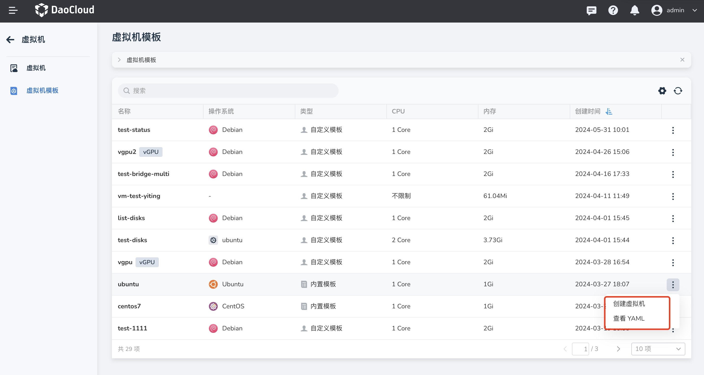
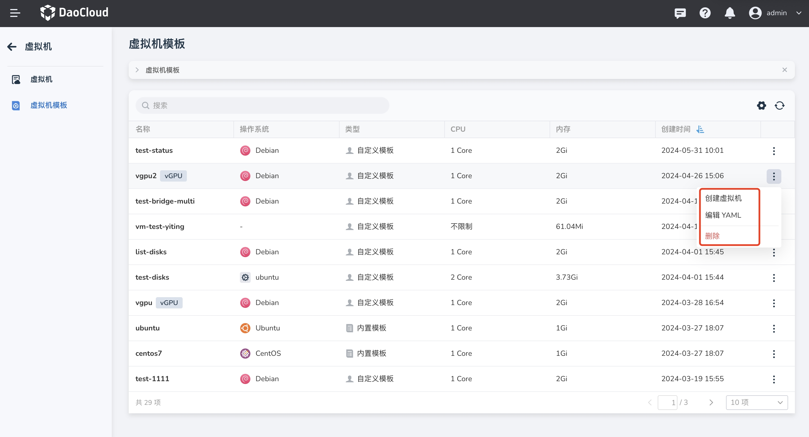

# 虚拟机模板

本文将介绍内置虚拟机模板和自定义虚拟机模板。

通过内置模板和自定义模板，用户可以轻松创建新的虚拟机。此外，我们还提供将现有虚拟机转换为虚拟机模板的功能，让用户能够更加灵活地管理和使用资源。

## 虚拟机模板

1. 点击左侧导航栏上的`容器管理`，然后点击`虚拟机模板`，进入`虚拟机模板`页面。

    

2. 点击列表右侧的 `︙`，可以对内置模板执行创建虚拟机操作；对自定义模板支持创建虚拟机和删除操作。

    

    

### 内置模板

- 平台内内置两种模板，分别是 CentOS 和 Ubuntu。

    

### 自定义模板

自定义模板是由虚拟机配置转化而来的模板。以下介绍如何从虚拟机配置转换为模板。

1. 点击左侧导航栏上的`容器管理`，然后点击`虚拟机`，进入列表页面，点击列表右侧的 `︙`支持将配置转换为模板。只有运行中/关闭状态下的虚拟机支持转化。

    

2. 填写新模板的名称，提示原始虚拟机将会保留并且可用。转换成功后，将会在模板列表新增一条数据。

    
