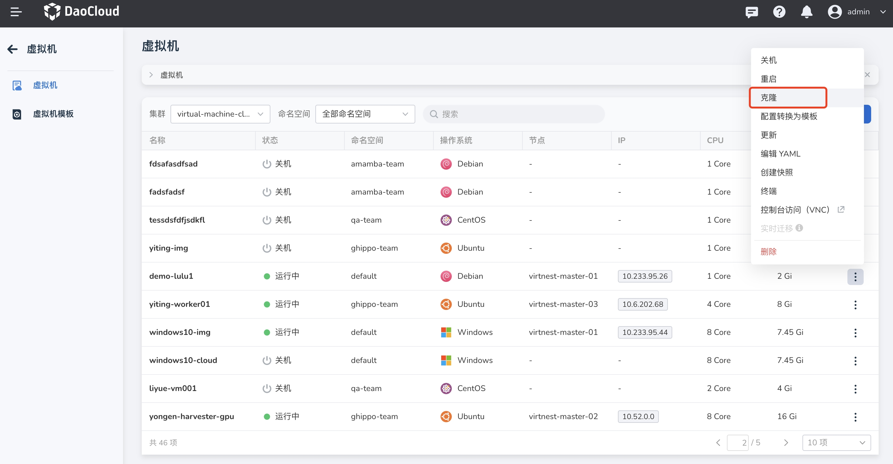
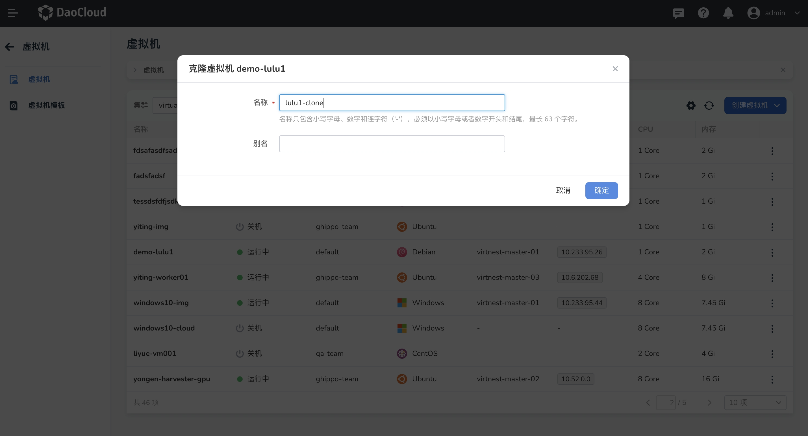
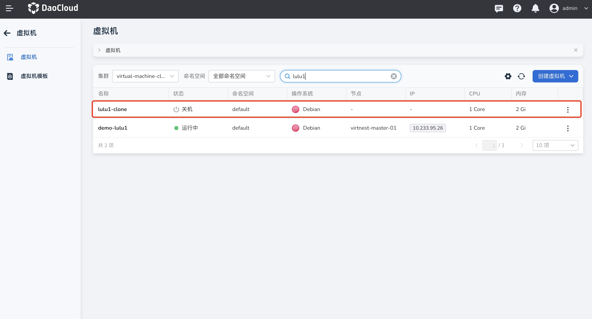

# 克隆虚拟机

本文将介绍如何克隆一台新的虚拟机。

用户可以克隆一台新的虚拟机，克隆后的虚拟机将具有与原始虚拟机相同的操作系统和系统配置，能够实现快速部署和扩展，快速创建相似配置的新虚拟机，而无需从头开始安装。

## 前提条件

使用克隆功能之前，需要满足以下前提条件（和快照功能的前提条件一致）：

- 只有非错误状态下的虚拟机才能使用克隆功能。
- 安装 Snapshot CRDs、Snapshot Controller、CSI Driver。
  具体安装步骤可参考 [CSI Snapshotter](https://github.com/kubernetes-csi/external-snapshotter?tab=readme-ov-file#usage)。
- 等待 snapshot-controller 组件准备就绪, 该组件会监控 VolumeSnapshot 和 VolumeSnapshotContent 相关事件，并触发相关操作。
- 等待 CSI Driver 准备就绪, 确保 csi-snapshotter sidecar 跑在 CSI Driver 里，csi-snapshotter sidecar 会监控 VolumeSnapshotContent 相关事件，并触发相关操作。
    - 如存储是 Rook-Ceph，可参考 [ceph-csi-snapshot](https://rook.io/docs/rook/latest-release/Storage-Configuration/Ceph-CSI/ceph-csi-snapshot/)
    - 如存储是 HwameiStor，可参考 [huameistor-snapshot](https://hwameistor.io/cn/docs/volumes/volume_snapshot)

## 克隆虚拟机

1. 点击左侧导航栏上的 __容器管理__ ，然后点击 __虚拟机__ ，进入列表页面，点击列表右侧的 __┇__ ，可以对非错误状态下的虚拟机执行快照操作。

    

2. 弹出弹框，需要填写克隆新的虚拟机的名称和描述，克隆操作可能需要一些时间，具体取决于虚拟机的大小和存储性能。

    

3. 克隆成功后可以在虚拟机列表内查看到新的虚拟机，新创建出来的虚拟机处于关机状态，若需要开机需要手动操作。

    

4. 克隆前建议对原有虚拟机进行快照，如果克隆过程中遇到问题，请检查先决条件是否满足，并尝试重新执行克隆操作。