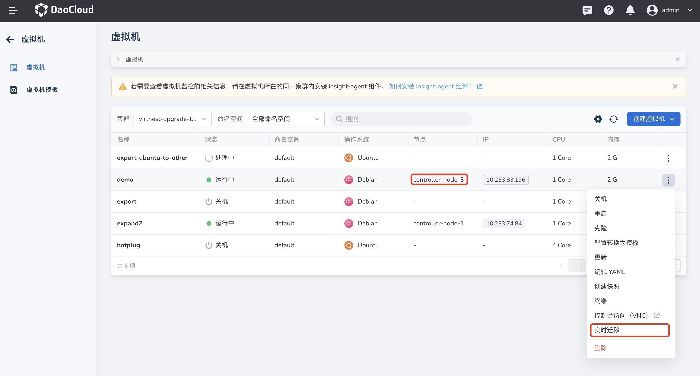
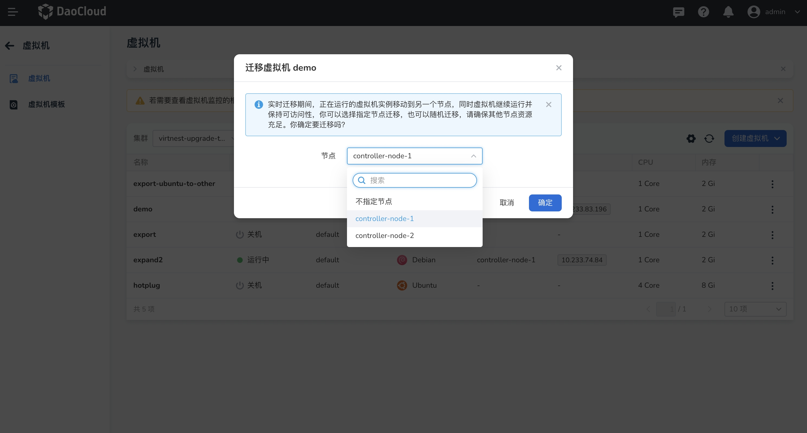

# 实时迁移

本文将介绍如何将虚拟机从一个节点移动到另一个节点。

当节点维护或者升级时，用户可以将正在运行的虚拟机无缝迁移到其他的节点上，同时可以保证业务的连续性和数据的安全性。

## 前提条件

使用实时迁移之前，需要满足以下前提条件：

- 虚拟机必须处于运行状态才能进行实时迁移。
- 确保您的 PVC 访问模式为 ReadWriteMany，以便使用实时迁移功能。
- 确保集群内至少有两个节点可供使用。

## 实时迁移

1. 点击左侧导航栏上的 __容器管理__ ，然后点击 __虚拟机__ ，进入列表页面，点击列表右侧的 __┇__ ，可以对运行状态下的虚拟机进行迁移动作。目前虚拟机所在节点为 __controller-node-3__ 。

    

2. 弹出弹框，提示在实时迁移期间，正在运行的虚拟机实例会移动到另一个节点，可以选择指定节点迁移，也可以随机迁移，请确保其他节点资源充足。

    

3. 迁移需要一段时间，请耐心等待，成功后可以在虚拟机列表内查看节点信息，此时节点迁移到 __controller-node-1__ 。

    
