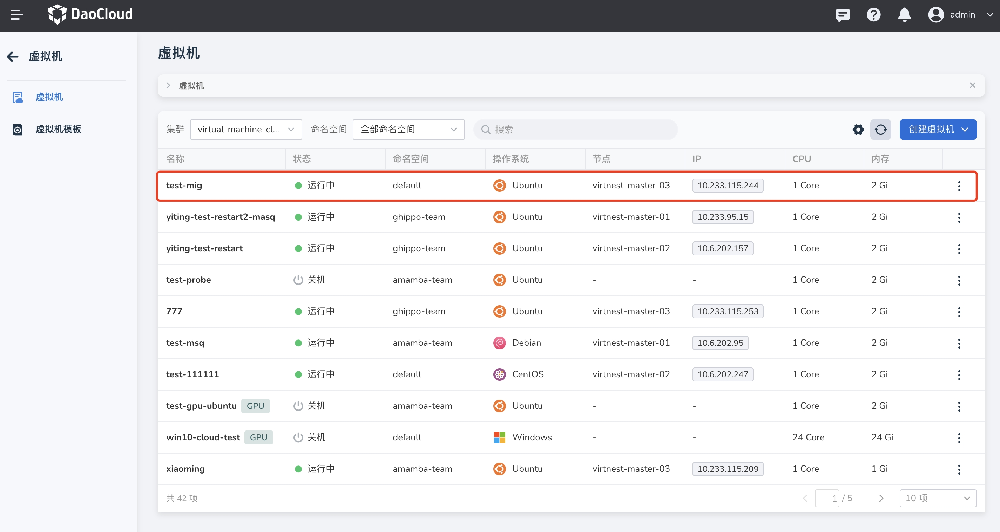
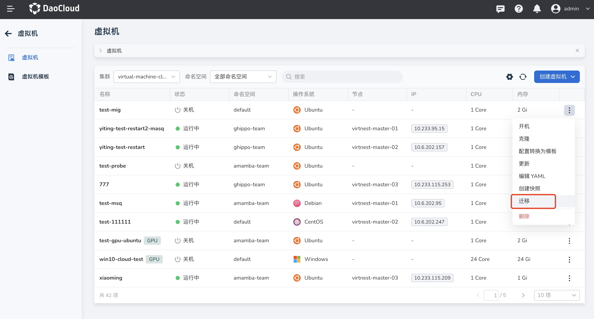
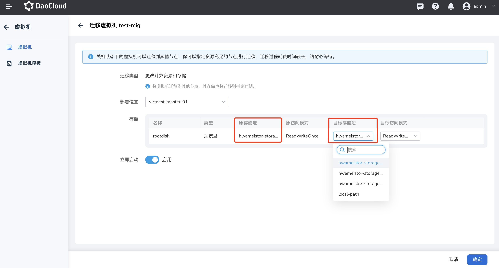
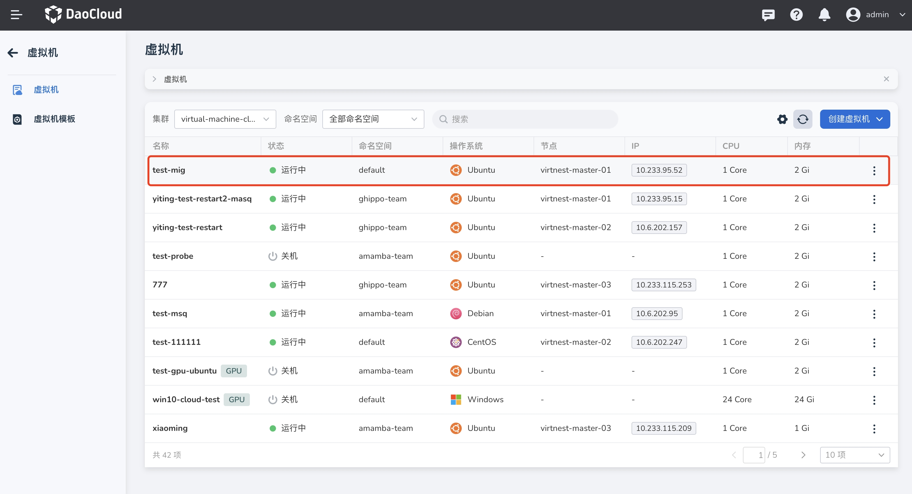

# 集群内冷迁移

本文将介绍在关机状态下如何将虚拟机在同一集群内从一个节点移动到另一个节点。

冷迁移的主要特点是，虚拟机在迁移过程中会处于离线状态，这可能会对业务连续性产生影响。因此，
在实施冷迁移时需要仔细规划迁移时间窗口，并考虑业务需求和系统可用性。通常，冷迁移适用于对停机时间要求不是非常严格的场景。

## 前提条件

使用冷迁移之前，需要满足以下前提条件：

- 虚拟机必须处于关机状态才能进行冷迁移。

## 冷迁移

1. 点击左侧导航栏上的 __容器管理__ ，然后点击 __虚拟机__ ，进入列表页面，点击列表右侧的 __┇__ ，
   可以对关机状态下的虚拟机进行迁移动作。虚拟机在关机状态下时无法查看所在节点，需要提前规划或者开机查询。

    

    

    !!! note

        如果您在原始节点的存储池中使用了 local-path，跨节点迁移时可能出现问题，请谨慎选择。

1. 点击迁移后，提示在迁移期间，可以选择指定节点迁移，也可以随机迁移，若需要修改存储池，
   需要确保目标节点内有可用存储池。同时需要目标节点资源充足，迁移过程耗费时间较长，请耐心等待。

    

1. 迁移需要一段时间，请耐心等待，成功后需要重启查看是否迁移成功。本示例已经开机查看迁移效果。

    
