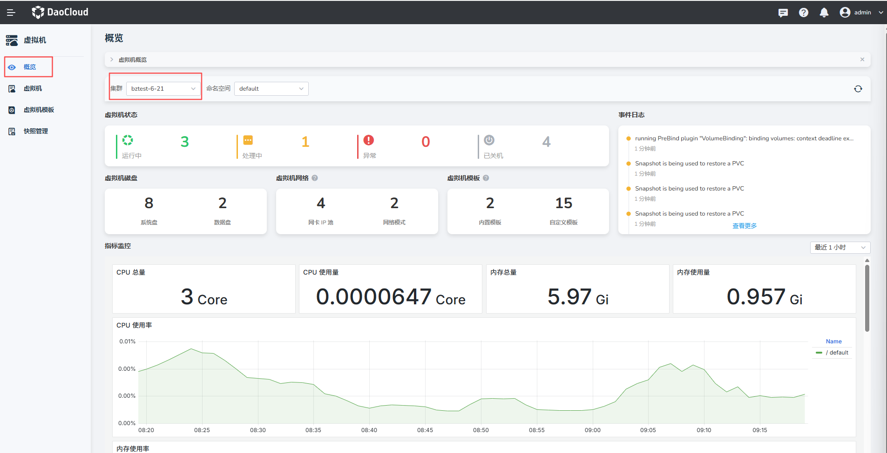
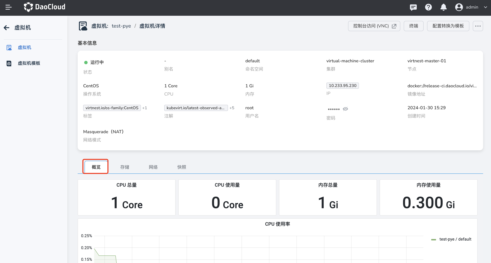
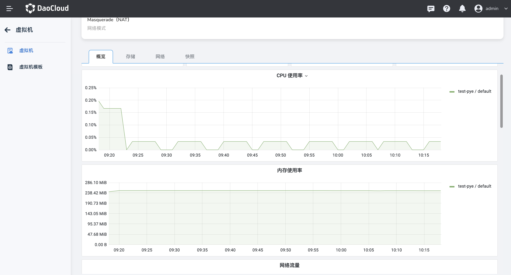
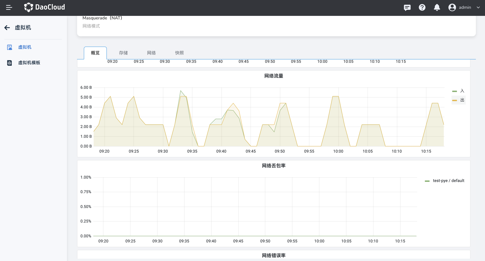
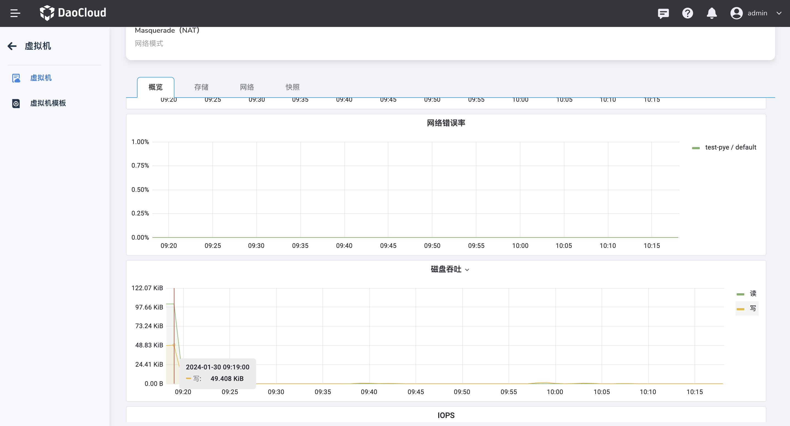
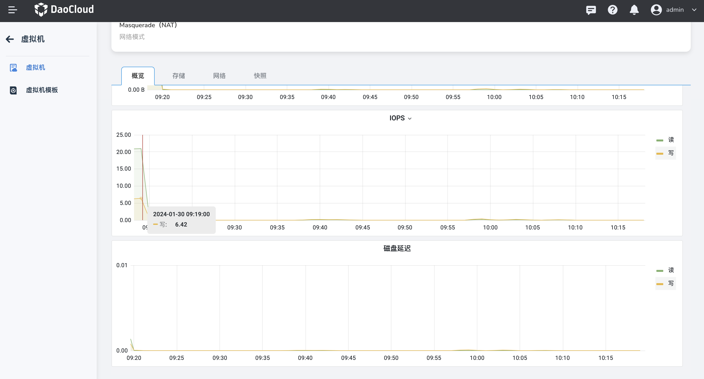

# 虚拟机监控

虚拟机基于 Kubevirt 开源的 Grafana Dashboard，为了每一个虚拟机生成了监控看板

虚拟机的监控信息可以更好的了解虚拟机的资源消耗情况，比如 CPU、内存、存储和网络等资源的使用情况，
从而进行资源的优化和规划，提升整体的资源利用效率。

## 前提条件

查看虚拟机监控的相关信息之前，需要满足以下前提条件：

- 在虚拟机所在的同一集群内安装 Insight-agent 组件，并且保证 Insight-agent 组件正常可用。

## 虚拟机概览

进入左侧导航栏的 __虚拟机__ -> __概览__，选择集群和命名空间后，可以查看虚拟机整体运行情况，包括：

- **虚拟机状态**：运行中、处理中、异常和已关机的虚拟机数量；
- **事件日志**：当前集群中的虚拟机相关事件；
- **虚拟机磁盘**：系统盘和数据盘数量；
- **虚拟机网络**：网卡 IP 池和网络模式数量；
- **虚拟机模板**：内置模板和自定义模板数量；
- **指标监控**：虚拟机的 CPU、内存、网络和磁盘等监控指标。

## 虚拟机监控

进入虚拟机的详细信息并点击 __概览__ ，即可查看虚拟机的监控内容。请注意，若未安装 Insight-agent 组件，则无法获取监控信息。以下是详细信息：

- CPU 总量、CPU 使用量、内存总量、内存使用量。

    

- CPU 使用率：指当前虚拟机正在使用的 CPU 资源的百分比；
- 内存使用率：指当前虚拟机正在使用的内存资源占总可用内存的百分比。

    

- 网络流量：指虚拟机在特定时间段内发送和接收的网络数据量；
- 网络丢包率：指在数据传输过程中丢失的数据包占总发送数据包数量的比例。

    

- 网络错误率：指在网络传输过程中发生的错误的比率；
- 磁盘吞吐：指虚拟机系统在一定时间内读取和写入磁盘的速度和能力。

    

- IOPS：指的是在一秒钟内虚拟机系统进行的输入/输出操作的次数。磁盘延迟：指虚拟机系统在进行磁盘读写操作时所经历的时间延迟。

    
