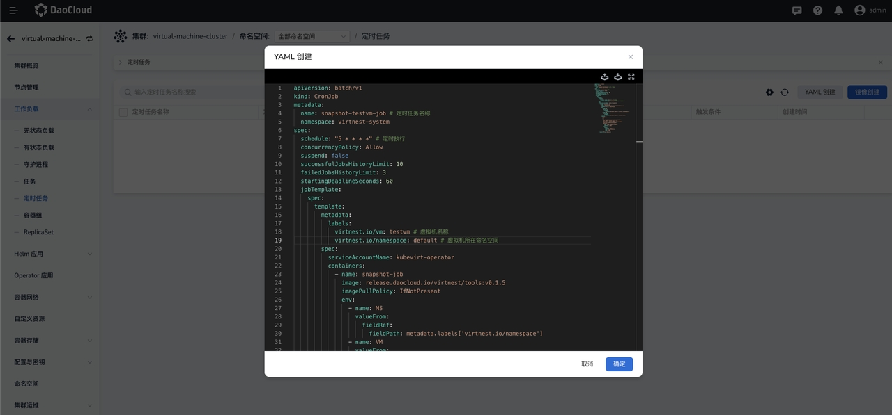
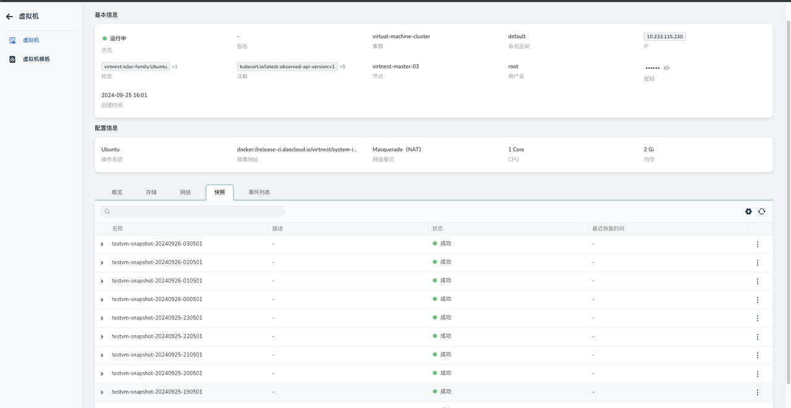

# 定时快照

本文将介绍如何为虚拟机定时创建快照。

用户可以为虚拟机定时创建快照，能够为数据提供持续的保护，确保在发生数据丢失、损坏或删除的情况下可以进行有效的数据恢复。

## 定时快照步骤

1. 点击左侧导航栏上的 __容器管理__ -> __集群列表__ ，在列表页面，选择目标虚拟机所在的集群。
   进入集群后，点击 __工作负载__ -> __定时任务__ ，选择 __YAML 创建__ 定时任务，参考以下 YAML 示例可为指定虚拟机定时创建快照。

    

    ??? note "点击查看创建定时任务的 YAML 示例"

        ```yaml
        apiVersion: batch/v1
        kind: CronJob
        metadata:
          name: xxxxx-xxxxx-cronjob # 定时任务名称, 可自定义
          namespace: virtnest-system # 请勿修改此namespace
        spec:
          schedule: "5 * * * *" # 按需修改定时任务执行间隔
          concurrencyPolicy: Allow
          suspend: false
          successfulJobsHistoryLimit: 10
          failedJobsHistoryLimit: 3
          startingDeadlineSeconds: 60
          jobTemplate:
            spec:
              template:
                metadata:
                  labels:
                    virtnest.io/vm: xxxx # 修改为需要快照的虚拟机名称
                    virtnest.io/namespace: xxxx # 修改为虚拟机所在的命名空间
                spec:
                  serviceAccountName: kubevirt-operator
                  containers:
                    - name: snapshot-job
                      image: release.daocloud.io/virtnest/tools:v0.1.5 # 离线环境下,仓库地址修改为对应火种集群仓库地址
                      imagePullPolicy: IfNotPresent
                      env:
                        - name: NS
                          valueFrom:
                            fieldRef:
                              fieldPath: metadata.labels['virtnest.io/namespace']
                        - name: VM
                          valueFrom:
                            fieldRef:
                              fieldPath: metadata.labels['virtnest.io/vm']
                      command:
                        - /bin/sh
                        - -c
                        - |
                          export SUFFIX=$(date +"%Y%m%d-%H%M%S")
                          export SNAPSHOT_NAME="${VM}-snapshot-${SUFFIX}

                          VM_UID=$(kubectl get vm ${VM} -n ${NS} -o jsonpath='{.metadata.uid}')
                          VM_API_VERSION=$(kubectl get vm ${VM} -n ${NS} -o jsonpath='{.apiVersion}')

                          cat <<EOF | kubectl apply -f -
                          apiVersion: snapshot.kubevirt.io/v1alpha1
                          kind: VirtualMachineSnapshot
                          metadata:
                            name: ${SNAPSHOT_NAME}
                            namespace: $(NS)
                            ownerReferences:
                            - apiVersion: ${VM_API_VERSION}
                              controller: true
                              kind: VirtualMachine
                              name: ${VM}
                              uid: ${VM_UID}
                          spec:
                            source:
                              apiGroup: kubevirt.io
                              kind: VirtualMachine
                              name: $(VM)
                          EOF
                  restartPolicy: OnFailure
        ```

1. 创建定时任务并成功运行后，可点击 __虚拟机__ 在列表页面选择目标虚拟机，进入详情后可查看快照列表。

    
