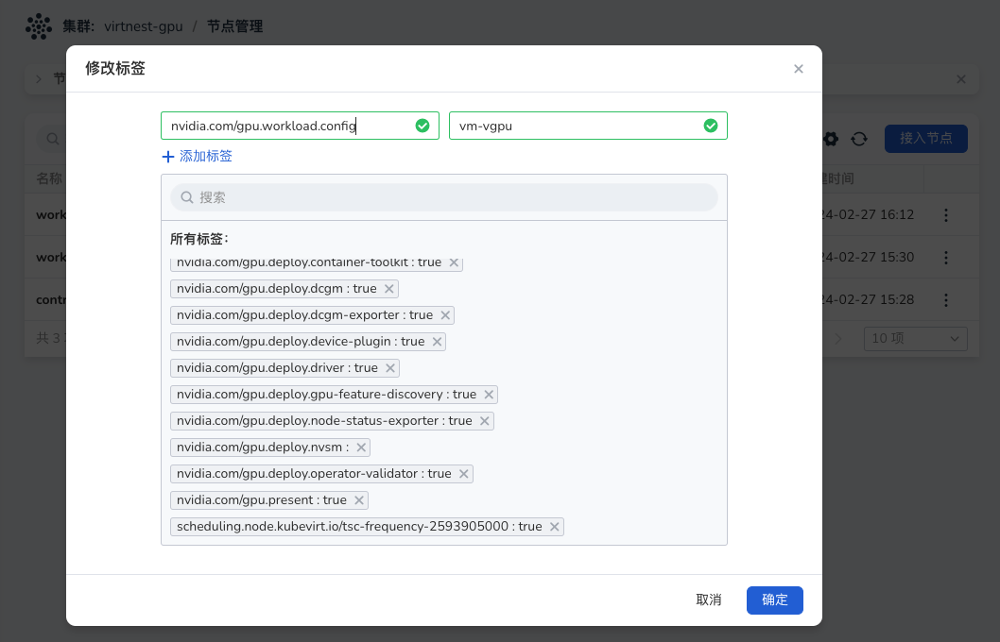

# 虚拟机配置 GPU（Nvidia）

本文将介绍如何在创建虚拟机时，配置 GPU 的前提条件。

配置虚拟机的 GPU 的重点是对 GPU Operator 进行配置，以便在工作节点上部署不同的软件组件，具体取决于这些节点上配置运行的 GPU 工作负载。以以下三个节点为例：

- controller-node-1节点配置为运行容器。
- work-node-1节点配置为运行具有直通 GPU 的虚拟机。
- work-node-2节点配置为运行具有虚拟 vGPU的虚拟机。

## 假设、限制和依赖性

工作节点可以运行 GPU 加速容器，也可以运行具有 GPU 直通的 GPU 加速 VM，或者具有 vGPU 的 GPU 加速 VM，但不能运行其中任何一个的组合。

1. 工作节点可以单独运行 GPU 加速容器、具有 GPU 直通的 GPU 加速 VM，或者具有 vGPU 的 GPU 加速 VM，不支持任何组合形式。
2. 集群管理员或开发人员需要提前了解集群情况，并正确标记节点以指示它们将运行的 GPU 工作负载类型。
3. 运行具有 GPU 直通或vGPU的 GPU 加速 VM的工作节点被假定为裸机，如果工作节点是虚拟机，则需要在虚拟机平台上启用GPU直通功能，请向虚拟机平台提供商咨询。
4. 不支持 Nvidia MIG 的 vGPU。
5. GPU Operator 不会自动在 VM 中安装 GPU 驱动程序。

## 启用 IOMMU

为了启用GPU直通功能，集群节点需要开启IOMMU。请参考以下链接了解如何开启IOMMU：[https://www.server-world.info/en/note?os=CentOS_7&p=kvm&f=10](https://www.server-world.info/en/note?os=CentOS_7&p=kvm&f=10)  如果您的集群是在虚拟机上运行，请咨询您的虚拟机平台提供商。

## 构建 vGPU Manager 镜像

注意：仅当使用 NVIDIA vGPU 时才需要构建 vGPU Manager 镜像。如果您计划仅使用 GPU 直通，请跳过此部分。

以下是构建 vGPU Manager 镜像并将其推送到镜像仓库中的步骤：

1. 从 NVIDIA Licensing Portal 下载 vGPU 软件。

   - 登录 NVIDIA Licensing Portal，转到“Software Downloads”页面。

   -  NVIDIA vGPU 软件位于“Software Downloads”页面的“Driver downloads”选项卡中。

   -  在筛选条件中选择“VGPU + Linux”，单击下载以获取 Linux KVM 的软件包。请解压下载的文件（NVIDIA-Linux-x86_64-<version>-vgpu-kvm.run）。

     

2. 打开终端克隆 container-images/driver 仓库

   ```yaml
   git clone https://gitlab.com/nvidia/container-images/driver cd driver
   ```

3. 切换到您的操作系统对应 vgpu-manager 目录

   ```yaml
   cd vgpu-manager/<your-os>
   ```

4. 将步骤1-c中提取的 .run 文件 copy 到当前目录

   ```yaml
   cp <local-driver-download-directory>/*-vgpu-kvm.run ./
   ```

5. 设置环境变量

   a. PRIVATE_REGISTRY - 专用注册表的名称，用于存储驱动程序映像。

   b. VERSION - NVIDIA vGPU管理器的版本，从NVIDIA软件门户下载。

   c. OS_TAG - 必须与集群节点操作系统版本匹配。

   d. CUDA_VERSION - 用于构建驱动程序映像的CUDA基本映像版本。

   ```yaml
   export PRIVATE_REGISTRY=my/private/registry VERSION=510.73.06 OS_TAG=ubuntu22.04 CUDA_VERSION=12.2.0
   ```

6. 构建 NVIDIA vGPU Manager Image

   ```yaml
   docker build \
     --build-arg DRIVER_VERSION=${VERSION} \
     --build-arg CUDA_VERSION=${CUDA_VERSION} \
     -t ${PRIVATE_REGISTRY}``/vgpu-manager``:${VERSION}-${OS_TAG} .
   ```

7. 将 NVIDIA vGPU Manager 映像推送到您的镜像仓库

   ```yaml
   docker push ${PRIVATE_REGISTRY}/vgpu-manager:${VERSION}-${OS_TAG}
   ```

## 标记集群节点

1. 进入_容器管理_，选取您的工作集群，点击_节点管理_的操作栏_修改标签_，为节点添加标签，每个节点只能有一种标签。

   您可以为标签分配以下值：container、vm-passthrough 和 vm-vgpu。

   

## 安装 Nvidia Operator 

1. 进入_容器管理_，选取您的工作集群，点击_Helm 应用_、_Helm 模板_，选择 gpu-operator安装。需要修改一些 yaml 中的相关字段。

??? note "点击查看完整 YAML"

    ```yaml
    gpu-operator.sandboxWorkloads.enabled=true
     
    // 如果你需要 vgpu 才设置下面字段
    gpu-operator.vgpuManager.enabled=true
    gpu-operator.vgpuManager.repository=<your-register-url>      // “构建 vGPU Manager 镜像” 步骤中的镜像仓库地址
    gpu-operator.vgpuManager.image=vgpu-manager
    gpu-operator.vgpuManager.version=<your-vgpu-manager-version> // “构建 vGPU Manager 镜像” 步骤中的 VERSION
     
    // GPU 直通相关
    gpu-operator.vgpuDeviceManager.enabled=true
    gpu-operator.vfioManager.enabled=true
    gpu-operator.sandboxDevicePlugin.enabled=true
    gpu-operator.sandboxDevicePlugin.version=v1.2.4
    gpu-operator.toolkit.version=v1.14.3-ubuntu20.04
    ```

2. 等待安装成功，如下图所示：

   

## 安装 virtnest-agent 并配置 CR

1. 安装 virtnest-agent，参考[安装 virtnest-agent](../install/virtnest-agent.md)。

2. 将vGPU和GPU直通加入Virtnest Kubevirt CR，以下示例是添加 vGPU 和 GPU 直通后的 部分关键 yaml：

    ```yaml
    spec:
        configuration:
        developerConfiguration:
        featureGates:
        - GPU
        - DisableMDEVConfiguration
        # 下面是需要填写的信息
        permittedHostDevices:
        mediatedDevices:            # vGPU
        - mdevNameSelector: GRID P4-1Q
            resourceName: nvidia.com /GRID_P4-1Q
        pciHostDevices:             # GPU 直通
        - externalResourceProvider:  true
            pciVendorSelector: 10DE:1BB3
            resourceName: nvidia.com /GP104GL_TESLA_P4
    ```

3. 在 kubevirt CR yaml 中，permittedHostDevices 用于导入 VM 设备，vGPU 需在其中添加 mediatedDevices，具体结构如下：

   ```yaml
   mediatedDevices:          
   - mdevNameSelector: GRID P4-1Q          # 设备名称
    resourceName: nvidia.com/GRID_P4-1Q    # GPU Operator 注册到节点的vGPU信息4. 
   ```

4. GPU 直通需要在 permittedHostDevices 下添加 pciHostDevices，具体结构如下：

   ```yaml
   pciHostDevices:           
   - externalResourceProvider: true           # 默认不要更改
    pciVendorSelector: 10DE:1BB3              # 当前 pci 设备的 vednor id
    resourceName: nvidia.com/GP104GL_TESLA_P4 # GPU Operator 注册到节点的GPU信息
   ```

5. 获取vGPU信息示例（仅适用于vGPU）：在标记为nvidia.com/gpu.workload.config=vm-gpu的节点（例如work-node-2）上查看节点信息，Capacity中的“nvidia.com/GRID_P4-1Q: 8”表示可用vGPU，如下所示：

```yaml
    # kubectl describe node work-node-2
   Capacity:
    cpu:                                 64
    devices.kubevirt.io/kvm:             1k
    devices.kubevirt.io/tun:             1k
    devices.kubevirt.io/vhost-net:       1k
    ephemeral-storage:                   102626232Ki
    hugepages-1Gi:                       0
    hugepages-2Mi:                       0
    memory:                              264010840Ki
    nvidia.com/GRID_P4-1Q :              8
    pods:                                110
   Allocatable:
    cpu:                               	64
    devices.kubevirt.io/kvm:           	1k
    devices.kubevirt.io/tun:           	1k
    devices.kubevirt.io/vhost-net:     	1k
    ephemeral-storage:                 	94580335255
    hugepages-1Gi:                     	0
    hugepages-2Mi:                     	0
    memory:                            	263908440Ki
    nvidia.com/GRID_P4-1Q:             	8
    pods:                              	110
```

​	那么 mdevNameSelector 应该是 “GRID P4-1Q”，resourceName 应该是“GRID_P4-1Q”

6. 获取 GPU 直通信息：在标记 nvidia.com/gpu.workload.config=vm-passthrough 的 node 上（本文档示例 node 为 work-node-1），查看 node 信息, Capacity 中 “nvidia.com/GP104GL_TESLA_P4: 2” 就是可用 vGPU ，如下所示：

```yaml
    # kubectl describe node work-node-1
    Capacity:
    cpu:                            64
    devices.kubevirt.io/kvm:        1k
    devices.kubevirt.io/tun:        1k
    devices.kubevirt.io/vhost-net:  1k
    ephemeral-storage:              102626232Ki
    hugepages-1Gi:                  0
    hugepages-2Mi:                  0
    memory:                         264010840Ki
    nvidia.com/GP104GL_TESLA_P4:    2
    pods:                           110
    Allocatable:
    cpu:                            64
    devices.kubevirt.io/kvm:        1k
    devices.kubevirt.io/tun:        1k
    devices.kubevirt.io/vhost-net:  1k
    ephemeral-storage:              94580335255
    hugepages-1Gi:                  0
    hugepages-2Mi:                  0
    memory:                         263908440Ki
    nvidia.com/GP104GL_TESLA_P4:    2
    pods:                           110
```

那么resourceName 应该是“GRID_P4-1Q”, 如何获取 pciVendorSelector 呢？通过 ssh 登录到 work-node-1 目标节点，通过 "lspci -nnk -d 10de:" 命令获取 Nvidia GPU PCI 信息，如下所示：红框所示即是 pciVendorSelector 信息。


1. 编辑 kubevirt CR 提示：如果同一型号GPU有多个，只需在CR中写入一个即可，无需列出每个GPU。

```yaml
   # kubectl -n virtnest-system edit kubevirt kubevirt
    spec:
    configuration:
        developerConfiguration:
        featureGates:
        - GPU
        - DisableMDEVConfiguration
        # 下面是需要填写的信息
        permittedHostDevices:
        mediatedDevices:                      # vGPU
        - mdevNameSelector: GRID P4-1Q
            resourceName: nvidia.com/GRID_P4-1Q
        pciHostDevices:                       # GPU 直通，上面的示例中 TEESLA P4 有两个GPU，这里只需要注册一个即可
        - externalResourceProvider: true
            pciVendorSelector: 10DE:1BB3
            resourceName: nvidia.com/GP104GL_TESLA_P4 
   ```
## yaml 创建 VM 并使用 GPU 加速

1. 与普通虚拟机唯一的区别是在 devices 中添加 gpu 相关信息。

??? note "点击查看完整 YAML"

    ```yaml
    apiVersion: kubevirt.io/v1
    kind: VirtualMachine
    metadata:
    name: testvm-gpu1
    namespace: default
    spec:
    dataVolumeTemplates:
    - metadata:
        creationTimestamp: null
        name: systemdisk-testvm-gpu1
        namespace: default
        spec:
        pvc:
            accessModes:
            - ReadWriteOnce
            resources:
            requests:
                storage: 10Gi
            storageClassName: www
        source:
            registry:
            url: docker://release-ci.daocloud.io/virtnest/system-images/debian-12-x86_64:v1
    runStrategy: Manual
    template:
        metadata:
        creationTimestamp: null
        spec:
        domain:
            cpu:
            cores: 1
            sockets: 1
            threads: 1
            devices:
            disks:
            - bootOrder: 1
                disk:
                bus: virtio
                name: systemdisk-testvm-gpu1
            - disk:
                bus: virtio
                name: cloudinitdisk
            gpus:
            - deviceName: nvidia.com/GP104GL_TESLA_P4
                name: gpu-0-0
            - deviceName: nvidia.com/GP104GL_TESLA_P4
                name: gpu-0-1
            interfaces:
            - masquerade: {}
                name: default
            machine:
            type: q35
            resources:
            requests:
                memory: 2Gi
        networks:
        - name: default
            pod: {}
        volumes:
        - dataVolume:
            name: systemdisk-testvm-gpu1
            name: systemdisk-testvm-gpu1
        - cloudInitNoCloud:
            userDataBase64: I2Nsb3VkLWNvbmZpZwpzc2hfcHdhdXRoOiB0cnVlCmRpc2FibGVfcm9vdDogZmFsc2UKY2hwYXNzd2Q6IHsibGlzdCI6ICJyb290OmRhbmdlcm91cyIsIGV4cGlyZTogRmFsc2V9CgoKcnVuY21kOgogIC0gc2VkIC1pICIvI1w/UGVybWl0Um9vdExvZ2luL3MvXi4qJC9QZXJtaXRSb290TG9naW4geWVzL2ciIC9ldGMvc3NoL3NzaGRfY29uZmlnCiAgLSBzeXN0ZW1jdGwgcmVzdGFydCBzc2guc2VydmljZQ==
            name: cloudinitdisk
    ```


