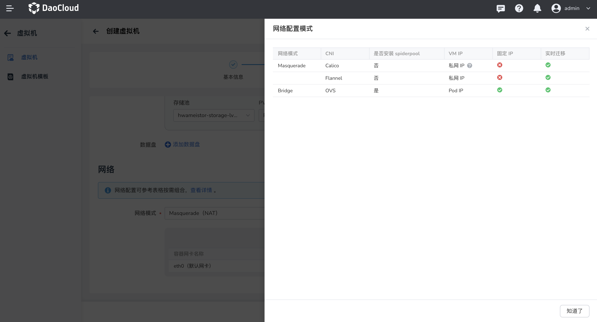

# 虚拟机网络

本文将介绍如何在创建虚拟机时，配置网络信息。

在虚拟机中，网络管理是一个关键的部分，它使得我们能够在 Kubernetes 环境中管理和配置虚拟机的网络连接，可以根据不同的需求和场景来进行配置，实现更灵活和多样化的网络架构。

1. 单网卡场景：对于一些简单的只需要基本网络连接的应用，或者存在资源限制的时候，使用单网卡可以节约网络资源，并避免资源的浪费。
2. 多网卡场景：当需要实现不同网络环境之间的安全隔离时，可以使用多网卡来划分不同的网络区域。同时也可以对控制和流量进行管理。

## 网络配置

1. 网络配置可以根据表格信息按需组合。
   
    | 网络模式          | CNI     | 是否安装 Spiderpool | 网卡模式    | 固定 IP         | 实时迁移     |
    | ----------------- | ------- | ------------------- | ------------ | --------------- | ------------ |
    | Masquerade（NAT） | Calico  | ❌                 | 单网卡       | ❌               | ✅            |
    |                   | Cilium  | ❌                 | 单网卡       | ❌               | ✅            |
    |                   | Flannel | ❌                 | 单网卡       | ❌               | ✅            |
    | Passt（直通）     | macvlan | ✅                 | 单网卡       | ✅               | ✅           |
    |                   | ipvlan  | ✅                 | 多网卡       | ✅               | ✅           |
    | Bridge（桥接）    | OVS     | ✅                 | 多网卡       | ✅               | ✅           |
    
    

2. 网络模式：分为 Masquerade（NAT）、Passt（直通）、Bridge（桥接）三种，后两种模式需要安装了 spiderpool 组件后方可使用。
   
    1. 默认选择 Masquerade（NAT）的网络模式，使用 eth0 默认网卡。
      
    2. 若集群内安装了 spiderpool 组件，则支持选择 Passt（直通）/Bridge（桥接）模式，Bridge（桥接）模式支持多网卡形式。

        
        
        -  选择 Passt 模式时，需要有一些前提条件。
           - 创建 macvlan 或 ipvlan 类型的 Multus CR。可参考[创建 macvlan 或 ipvlan 类型的 Multus CR](../../network/config/multus-cr.md)
           - 创建子网及 IP 池。可参考[创建子网及 IP 池](../../network/config/ippool/createpool.md)
        -  选择 Bridge 模式时，需要有一些前提条件。
           - 创建 ovs 类型的 Multus CR，目前页面上无法创建，可参考[创建 ovs 类型的 Multus CR](https://spidernet-io.github.io/spiderpool/v0.9/usage/install/underlay/get-started-ovs-zh_CN/)
           - 创建子网及 IP 池与 passt 模式步骤一致。

3. 添加网卡
   
    1. Passt（直通）/Bridge（桥接）模式下支持手动添加网卡。点击 __添加网卡__ ，进行网卡 IP 池的配置。选择和网络模式匹配的 Multus CR，若没有则需要自行创建。
    
    2. 若打开 __使用默认 IP 池__ 开关，则使用 multus CR 配置中的默认 IP 池。若关闭开关，则手动选择 IP 池。
       
        
