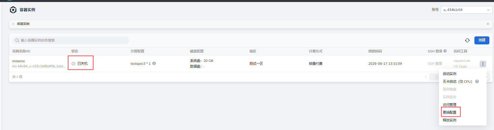
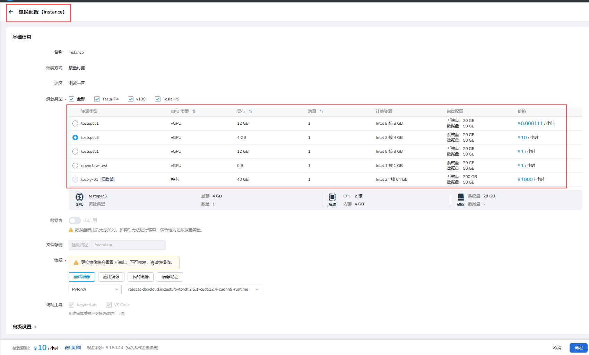

# 容器实例更换配置

容器实例关机后，可以通过 **更换配置** 选择新的 SKU，执行升配或降配操作。

## 前提条件

已创建容器实例，且容器实例处于 **已关机** 状态。

## 操作步骤

1. 进入 **算力云** -> **容器实例**，找到状态为 **已关机** 的实例，点击列表右侧的 **┇**，在下拉列表中选择 **更换配置**。

    

2. 在 **更换配置** 页面选择新的 SKU，确认 GPU 类型、显存、数量、计算资源、磁盘配置及价格等信息后，点击 **确定** 完成升降配。

    

!!! note

    - 更换配置仅支持处于关机状态的容器实例。
    - 升降配完成后，容器实例不会自动开机，需要手动选择 **启动实例**。
